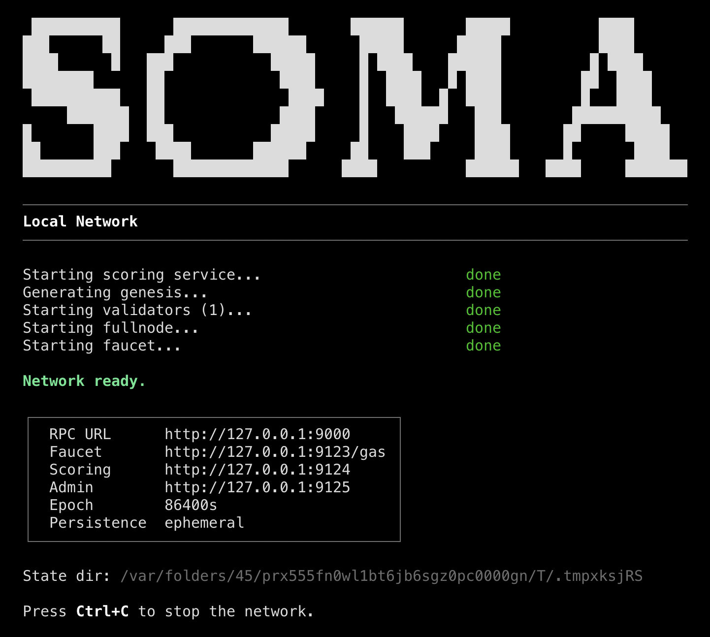

<p align="center">
  <picture>
    <source media="(prefers-color-scheme: dark)" srcset="assets/logo-dark.svg">
    <source media="(prefers-color-scheme: light)" srcset="assets/logo-light.svg">
    
  </picture>
</p>

<p align="center">
  <a href="https://github.com/soma-org/soma/actions/workflows/release.yml"></a>
  <a href="https://github.com/soma-org/soma/releases"></a>
  <a href="https://pypi.org/project/soma-sdk"></a>
  <a href="https://docs.soma.org"></a>
  <a href="LICENSE"></a>
  <!-- TODO: Replace INVITE_CODE with actual Discord invite -->
  <a href="https://discord.gg/INVITE_CODE"></a>
</p>

<p align="center"><b>Superintelligence for the Internet.</b></p>

<p align="center">
  <a href="https://docs.soma.org/getting-started/install">Getting Started</a> &middot;
  <a href="https://docs.soma.org/guides/model-development">Guides</a> &middot;
  <a href="https://docs.soma.org/concepts/targets">Concepts</a> &middot;
  <a href="https://docs.soma.org/reference/glossary">Reference</a> &middot;
  <!-- TODO: Replace INVITE_CODE with actual Discord invite -->
  <a href="https://discord.gg/INVITE_CODE">Discord</a>
</p>

---

## Overview

The Internet has more compute, more data, and more minds than any single organization. Soma coordinates these resources to train AI at scale. Instead of passing gradients, training is coordinated with competition: model weights are open, participants download and train them, and the best weights are rewarded. The bar keeps rising.

- **Competitive Training** — Participants submit improved weights and compete on a universal objective: given any data, predict what comes next
- **Moving Benchmark** — Participants mine data that continuously raises the bar for model evaluation. The result is a living benchmark that tracks the frontier, not a static leaderboard
- **Specialization via Routing** — Participants report embeddings that capture their specialization. A lightweight router selects which models compete, incentivizing deep expertise while maintaining global cohesion
- **BFT Consensus** — Coordination for rewards, training, and verification. [Mysticeti](https://arxiv.org/abs/2310.14821)-based DAG consensus with multi-leader support and sub-second finality
- **GPU Accelerated** — Deterministic scoring runtime in Rust with native CUDA, ROCm, and WebGPU support
- **Python SDK** — Async Python bindings via PyO3 for training models and submitting data

## Installation

### sup (recommended)

[sup](https://github.com/soma-org/sup) is the Soma toolchain installer. It manages binaries across networks, versions, and hardware backends.

```bash
curl -sSfL https://sup.soma.org | sh
```

```bash
sup install soma                    # latest testnet, default backend (WGPU)
sup install soma --backend cuda     # NVIDIA GPU (CUDA)
sup install soma --backend rocm     # AMD GPU (ROCm)
```

See `sup --help` or the [sup README](https://github.com/soma-org/sup) for version management, updates, and shell completions.

### Python SDK

```bash
pip install soma-sdk
```

Requires Python 3.10+. See the [Python SDK docs](python-sdk/README.md) for the full API reference.

## Release Process

Releases are built and published automatically via CI when a tag is pushed:

| Tag Pattern | Artifact |
|-------------|----------|
| `testnet-v*` | Node binaries (all platforms + CUDA + ROCm) |
| `sdk-v*` | Python SDK &rarr; [PyPI](https://pypi.org/project/soma-sdk) |
| `models-v*` | Model implementations &rarr; [PyPI](https://pypi.org/project/soma-models) |

## Getting Started

<p align="center">
  
</p>

### Start a Local Network

```bash
soma start localnet
```

This boots a local cluster with validators, a faucet, and a scoring service.

### Fund and Check Balance

```bash
soma faucet         # request test tokens
soma balance        # check SOMA balance
```

### Start a Validator

```bash
soma start validator --config validator.yaml
```

### Stake with a Validator

```bash
soma stake --validator <ADDRESS> --amount 10
soma status         # view network and validator info
```

### Start a Scoring Service

```bash
soma start scoring
```

The scoring service uses the GPU backend matching your binary — CUDA for `soma-cuda-*`, ROCm for `soma-rocm-*`, and WGPU for the default binary.

### Python SDK

The Python SDK is the primary interface for training models and submitting data.

```bash
pip install soma-sdk
```

```python
from soma_sdk import SomaClient, Keypair

client = await SomaClient("http://localhost:9000", scoring_url="http://localhost:9124")
keypair = Keypair.generate()

# Find an open target and fetch its models
targets = await client.get_targets(status="open")
target = targets[0]
manifests = await client.get_model_manifests(target)

# Score data against the target's models — the scoring service picks a winner
data = open("data.bin", "rb").read()
score = await client.score(data=data, models=manifests, target_embedding=target.embedding)

# Submit the winning result
await client.submit_data(
    signer=keypair,
    target_id=target.id,
    data=data,
    model_id=target.model_ids[score.winner],
    embedding=score.embedding,
    distance_score=score.distance[score.winner],
)
```

See the [Python SDK reference](python-sdk/README.md) for the full API and [python-examples/](python-examples/) for runnable scripts.

## Documentation

| Resource | Link |
|----------|------|
| Getting Started | [Installation](https://docs.soma.org/getting-started/install), [Local Network](https://docs.soma.org/getting-started/local-network), [First Transaction](https://docs.soma.org/getting-started/first-transaction) |
| Guides | [Model Development](https://docs.soma.org/guides/model-development), [Data Submission](https://docs.soma.org/guides/submitting-data), [Running a Validator](https://docs.soma.org/guides/running-validator) |
| Concepts | [Targets](https://docs.soma.org/concepts/targets), [Model Competition](https://docs.soma.org/concepts/models), [Data Mining](https://docs.soma.org/concepts/data-mining), [Economics](https://docs.soma.org/concepts/economics) |
| Reference | [Glossary](https://docs.soma.org/reference/glossary), [Further Reading](https://docs.soma.org/reference/reading), [Community](https://docs.soma.org/reference/community) |
| Python SDK | [python-sdk/README.md](python-sdk/README.md) |
| Model Architecture | [models/README.md](models/README.md) |
| Soma Improvement Proposals | [soma-org/sips](https://github.com/soma-org/sips) |

## Contributing

We welcome contributions! Please read [CONTRIBUTING.md](CONTRIBUTING.md) before getting started.

If you want to propose a new feature, start with a [Soma Improvement Proposal](https://github.com/soma-org/sips).

## Community

<!-- TODO: Replace placeholder URLs -->
- [Discord](https://discord.gg/INVITE_CODE)
- [GitHub Discussions](https://github.com/soma-org/soma/discussions)
- [Twitter / X](https://x.com/soma)

## Acknowledgements

Soma builds on the work of many open source projects, including:

- [Sui](https://github.com/MystenLabs/sui) and [Mysticeti](https://github.com/MystenLabs/mysticeti) consensus (Mysten Labs)
- [fastcrypto](https://github.com/MystenLabs/fastcrypto) cryptographic primitives (Mysten Labs)
- [mysten-sim](https://github.com/MystenLabs/mysten-sim) deterministic simulator (Mysten Labs)
- [Burn](https://burn.dev) deep learning framework
- [Tokio](https://tokio.rs) async runtime
- [PyO3](https://pyo3.rs) / [Maturin](https://www.maturin.rs) Python bindings

## License

Licensed under [Apache 2.0](LICENSE).
