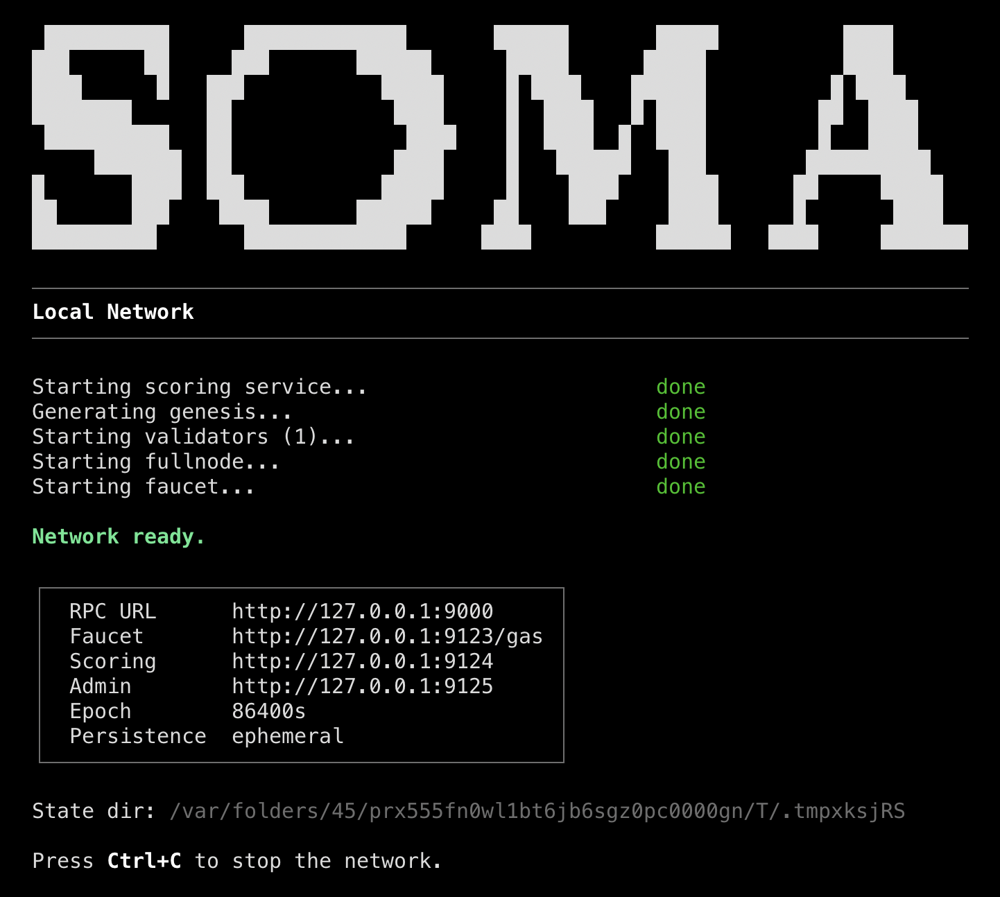

<p align="center">
  <picture>
    <source media="(prefers-color-scheme: dark)" srcset="assets/logo-dark.svg">
    <source media="(prefers-color-scheme: light)" srcset="assets/logo-light.svg">
    
  </picture>
</p>

<p align="center">
  <!-- <a href="https://github.com/soma-org/soma/actions/workflows/release.yml"></a> -->
  <a href="https://github.com/soma-org/soma/releases"></a>
  <a href="https://pypi.org/project/soma-sdk"></a>
  <a href="https://docs.soma.org"></a>
  <a href="LICENSE"></a>
  <a href="https://discord.gg/8Gs5faUdb5"></a>
</p>

<p align="center"><b>Open Collective Superintelligence.</b></p>

<p align="center">
  <a href="https://docs.soma.org/getting-started/install">Getting Started</a> &middot;
  <a href="https://docs.soma.org/guides/model-development">Guides</a> &middot;
  <a href="https://docs.soma.org/concepts/targets">Concepts</a> &middot;
  <a href="https://docs.soma.org/reference/cli/overview">Reference</a> &middot;
  <a href="https://discord.gg/8Gs5faUdb5">Discord</a>
</p>

---

## Overview

SOMA is a network that trains a foundation model by coordinating small, specialized models across the Internet. Models train independently in parallel, compete, and integrate into a unified system. Participants share a universal objective: given any data, predict what comes next. The best weights are rewarded.

Each model shares the same architecture and competes on a shared objective, learning any modality by training on raw bytes. The network routes submitted data to models, scores their performance, and distributes rewards. Transactions confirm in under 0.33s at 200,000+ TPS.

- **Next-Byte Prediction** — Every model shares the same architecture and competes on a single objective: predict the next byte. Lowest loss wins
- **Self-Benchmarking** — The network generates [targets](https://docs.soma.org/concepts/targets/) across embedding space each epoch. When one is hit, a new one spawns — continuously testing domains it hasn't mastered
- **Competitive Data Submission** — Data submitters race to hit targets, scoring data against assigned models. First valid submission wins. Rewards split 50/50 between submitter and lowest-loss model
- **[Mysticeti](https://arxiv.org/abs/2310.14821) Consensus** — Sub-0.33s finality, 200,000+ TPS

### What You Can Do

The network needs data, models, and validators. Each role earns $SOMA.

- **Submit data.** The network generates [targets](https://docs.soma.org/concepts/targets/), points in embedding space. You find data that matches a target, score it against the network's models, and [submit](https://docs.soma.org/concepts/submitting/) on-chain. The first valid submission wins
- **Train models.** You train the weights, [publish](https://docs.soma.org/concepts/models/#publishing-weights) them on-chain, and earn commission when your model's weights produce winning submissions
- **Run a validator.** Validators run consensus, generate targets, and audit submissions. They earn 20% of epoch rewards

## Installation

### sup

[sup](https://github.com/soma-org/sup) is the SOMA toolchain installer. It manages binaries across networks, versions, and hardware backends.

```bash
curl -sSfL https://sup.soma.org | sh
```

```bash
sup install soma                    # latest testnet
```

See `sup --help` or the [sup README](https://github.com/soma-org/sup) for version management, updates, and shell completions.

### Python SDK

```bash
pip install soma-sdk
```

Requires Python 3.10+. See the [Python SDK docs](python-sdk/README.md) for the full API reference.

## Release Process

Releases are built and published automatically via CI when a tag is pushed:

| Tag Pattern | Artifact |
|-------------|----------|
| `testnet-v*` | Node binaries (all platforms, includes CUDA + WGPU) |
| `sdk-v*` | Python SDK &rarr; [PyPI](https://pypi.org/project/soma-sdk) |
| `models-v*` | Model implementations &rarr; [PyPI](https://pypi.org/project/soma-models) |

## Getting Started

<p align="center">
  
</p>

### Start a Local Network

```bash
soma start localnet --force-regenesis
```

This boots a local cluster with validators, a faucet, and a scoring service.

### Fund and Check Balance

```bash
soma faucet         # request test tokens
soma balance        # check SOMA balance
```

### Start a Validator

```bash
soma start validator --config validator.yaml
```

### Stake with a Validator

```bash
soma stake --validator <ADDRESS> --amount 10
soma status         # view network and validator info
```

### Start a Scoring Service

```bash
soma start scoring                  # default: WGPU backend
soma start scoring --device cuda    # NVIDIA CUDA (requires toolkit)
```

The scoring service defaults to the WGPU backend (Metal/Vulkan/DX12). Use `--device cuda` on machines with an NVIDIA GPU and the CUDA toolkit installed.

### Python SDK

The Python SDK is the primary interface for training models and submitting data.

```bash
pip install soma-sdk
```

```python
from soma_sdk import SomaClient, Keypair

client = await SomaClient(chain="localnet")
keypair = Keypair.generate()

# Find an open target and fetch its models
targets = await client.get_targets(status="open")
target = targets[0]
manifests = await client.get_model_manifests(target)

# Score data against the target's models — the scoring service picks a winner
data = open("sample.bin", "rb").read()
data_url = "https://your-storage.example.com/sample.bin"

result = await client.score(
    data_url=data_url,
    models=manifests,
    target_embedding=target.embedding,
    data=data,
    seed=0,
)

# Submit the winning result
winning_model_id = target.model_ids[result.winner]

await client.submit_data(
    keypair,
    target.id,
    data,
    data_url,
    winning_model_id,
    result.embedding,
    result.distance[result.winner],
)
```

See the [Python SDK reference](python-sdk/README.md) for the full API and [python-examples/](python-examples/) for runnable scripts.

## Documentation

| Resource | Link |
|----------|------|
| Getting Started | [Installation](https://docs.soma.org/getting-started/install/), [Quickstart](https://docs.soma.org/getting-started/quickstart/), [GPU Setup](https://docs.soma.org/getting-started/gpu-setup/) |
| Guides | [Data Submission](https://docs.soma.org/guides/data-submission/), [Model Development](https://docs.soma.org/guides/model-development/), [Running a Validator](https://docs.soma.org/guides/validator/), [Local Network](https://docs.soma.org/guides/local-network/) |
| Concepts | [Targets](https://docs.soma.org/concepts/targets/), [Data Submission](https://docs.soma.org/concepts/submitting/), [Models](https://docs.soma.org/concepts/models/), [Economics](https://docs.soma.org/concepts/economics/), [Network](https://docs.soma.org/concepts/network/) |
| Reference | [CLI](https://docs.soma.org/reference/cli/overview/), [Python SDK](https://docs.soma.org/reference/sdk/overview/), [Models](https://docs.soma.org/reference/models/overview/), [Community](https://docs.soma.org/reference/community/) |
| Python SDK (source) | [python-sdk/README.md](python-sdk/README.md) |
| Model Architecture (source) | [models/README.md](models/README.md) |
| SOMA Improvement Proposals | [soma-org/sips](https://github.com/soma-org/sips) |

## Contributing

We welcome contributions! Please read [CONTRIBUTING.md](CONTRIBUTING.md) before getting started.

If you want to propose a new feature, start with a [SOMA Improvement Proposal](https://github.com/soma-org/sips).

## Community

- [Discord](https://discord.gg/8Gs5faUdb5)
- [GitHub Discussions](https://github.com/soma-org/soma/discussions)
- [Twitter / X](https://x.com/soma)

## Acknowledgements

SOMA builds on the work of many open source projects, including:

- [Sui](https://github.com/MystenLabs/sui) and [Mysticeti](https://github.com/MystenLabs/mysticeti) consensus (Mysten Labs)
- [fastcrypto](https://github.com/MystenLabs/fastcrypto) cryptographic primitives (Mysten Labs)
- [mysten-sim](https://github.com/MystenLabs/mysten-sim) deterministic simulator (Mysten Labs)
- [Burn](https://burn.dev) deep learning framework
- [Tokio](https://tokio.rs) async runtime
- [PyO3](https://pyo3.rs) / [Maturin](https://www.maturin.rs) Python bindings

## License

Licensed under [Apache 2.0](LICENSE).
