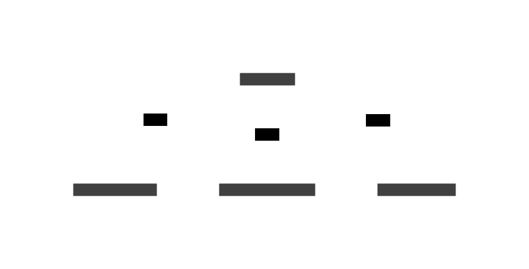
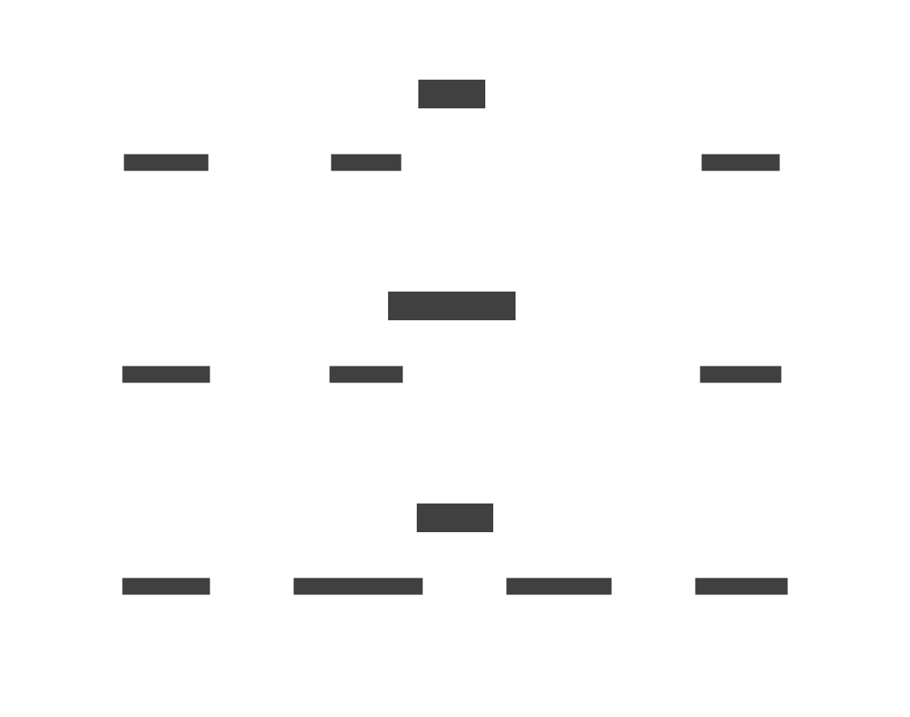

# Orchestrators

Careful consideration was given to effectively designing the pipeline for data processing. Initially, a channel-based architecture was considered, where output from one actor would flow to the next until all processing was complete. However, this approach had significant drawbacks: understanding the flow became more challenging due to the need to trace different actor communications, and accessing artifacts from previous stages was difficult since they needed to be explicitly passed through messages.

A central orchestrator pattern, especially when used with awaiting futures, provides several advantages: excellent performance, more comprehensible code, and straightforward access to artifacts from previous steps.

The orchestrator accepts input and calls various resource-bound controllers while awaiting their responses. While the orchestrator processes synchronously for a given input, multiple instances can run concurrently for different inputs. Even though concurrency occurs at the orchestrator level, resource-level actors maintain control over their own concurrency.

By creating multiple orchestrators for different flows that all use the same underlying resource-bounded controllers, backpressure is maintained from the initial caller through the entire system. This approach offers an additional advantage: specific resource backpressure only impacts the orchestrators that depend on that resource, rather than slowing down the entire system as a core threaded model would.

