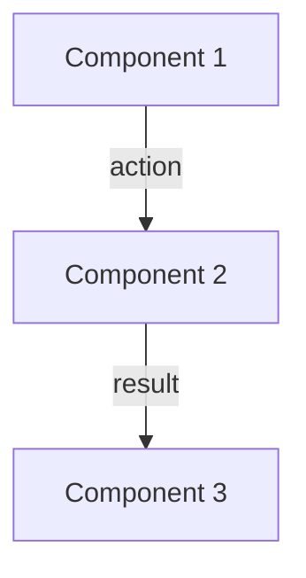
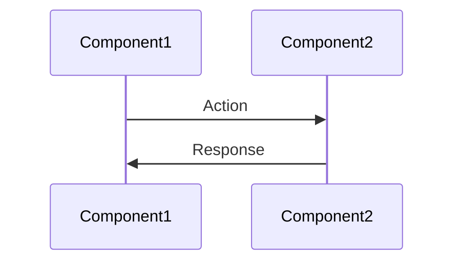
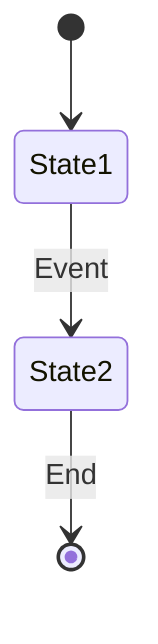
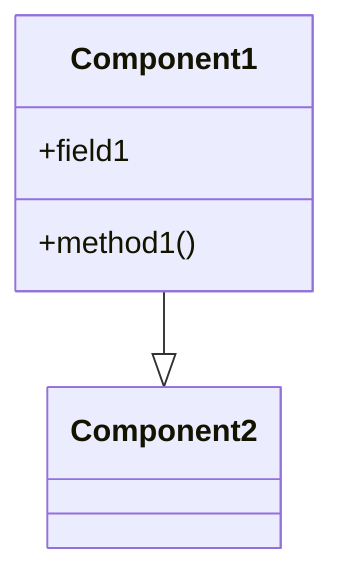

# Memory Bank Documentation Strategy

## Overview

The Memory Bank is Soma blockchain's comprehensive knowledge repository designed specifically for efficient agent collaboration. Rather than documenting every file exhaustively, we maintain a structured knowledge system that agents can efficiently consume before starting tasks. This approach reduces context window overhead, improves cross-component understanding, and facilitates smoother collaboration between multiple AI agents.

## Memory Bank Philosophy

### Core Principles

1. **Knowledge Over Completeness**: Focus on helping agents understand how things work, not documenting every line of code
2. **Workflow Documentation**: Explain processes that span multiple files to capture cross-component relationships
3. **Component Interaction**: Document how modules interact rather than isolating documentation by file
4. **Reduced Context Overhead**: Organize information efficiently to minimize token usage during agent context loading
5. **Practical Over Exhaustive**: Prioritize practical understanding that enables implementation work

### Three Pillars Knowledge Framework

Our documentation strategy focuses on three core knowledge pillars that provide maximum understanding with minimum overhead:

#### Pillar 1: Core Data Flow
- Combines transaction lifecycle, object model/ownership, and commit processing
- Focuses on the complete data path through the system
- Primary concern for developers implementing features or fixes

#### Pillar 2: System Coordination 
- Combines consensus workflow, validator committee, and epoch reconfiguration
- Explains how the system maintains agreement and evolves over time
- Critical for understanding BFT properties and system governance

#### Pillar 3: Deployment & Operations
- Combines node types (fullnode vs. validator), genesis/bootstrap, and node lifecycle
- Focuses on how the system is deployed and maintained
- Essential for operators and SREs managing the network

### Memory Bank Structure

```
memory-bank/
├── core/                         # Essential project context
│   ├── projectbrief.md           # High-level project overview
│   ├── productContext.md         # Why Soma exists and what problems it solves
│   ├── systemPatterns.md         # Key architectural patterns
│   ├── techContext.md            # Technology stack and constraints
│   ├── activeContext.md          # Current development focus
│   ├── progress.md               # Project status and milestones
│   └── documentation.md          # Documentation strategy and guidelines
│
├── knowledge/                    # Cross-component knowledge
│   ├── data_flow.md              # Transaction lifecycle, object model, processing
│   ├── data_flow/                # Transaction data flow subdocuments
│   ├── system_coordination.md    # Consensus, committee, epoch reconfiguration
│   ├── deployment.md             # Node types, genesis, lifecycle
│   ├── type_system.md            # Core types and their relationships
│   ├── error_handling.md         # Error propagation and recovery patterns
│   ├── cross_module_communication.md # Communication patterns between modules
│   ├── epoch_management.md       # Epoch boundaries and reconfiguration
│   ├── storage_model.md          # Storage architecture and implementation
│   ├── security_model.md         # Security mechanisms and threat models
│   └── thread_safety_patterns.md # Thread safety and concurrency mechanisms
│
├── modules/                      # Module-specific knowledge
│   ├── authority.md              # Authority module structure and concepts
│   ├── authority/                # Authority module subdocuments
│   ├── consensus.md              # Consensus module structure and concepts
│   ├── consensus/                # Consensus module subdocuments
│   ├── node.md                   # Node module structure and concepts
│   ├── node/                     # Node module subdocuments
│   ├── p2p.md                    # P2P module structure and concepts
│   └── p2p/                      # P2P module subdocuments
│
└── shared/                       # Supporting resources
    ├── glossary.md               # Terminology definitions
    ├── agent_workflows.md        # Agent collaboration guides
    └── confidence_log.md         # Historical confidence ratings
```

## Document Templates and Standards

### Core Document Template

```markdown
# [Document Title]

## Purpose and Scope
[Brief explanation of what this document covers and why it's important]

## Key Components
- **Component A**: [Brief description]
- **Component B**: [Brief description]
- **Component C**: [Brief description]

## Component Relationships Diagram
[Mermaid diagram showing relationships]

## Detailed Information
[Main content sections]

## Confidence: [1-10]
[Statement about the confidence level and any caveats or limitations]

## Last Updated: [Date]
```

### Knowledge Document Template

```markdown
# [Knowledge Area]

## Purpose and Scope
[Brief explanation of this knowledge area and why it matters]

## Key Components
[List of relevant components and brief descriptions]

## Component Relationships
[Mermaid diagram showing relationships]

## Detailed Explanations
[Multiple sections explaining concepts, workflows, etc.]

## Usage Examples
[Example code or scenarios showing concepts in action]

## Relationship to Other Components
[How this knowledge area connects to other parts of the system]

## Key Insights for Developers
[Bullet points with critical insights]

## Confidence: [1-10]
[Statement about confidence level]

## Last Updated: [Date]
```

### Module Document Template

```markdown
# [Module Name]

## Purpose and Scope
[Brief explanation of what this module does]

## Key Components
[List major components and their roles]

## Architecture Diagram
[Mermaid diagram showing module structure]

## Primary Workflows
[Explain main processes implemented by this module]

## Key Interfaces
[Document important interfaces with other modules]

## Design Patterns
[Explain patterns used in this module]

## Confidence: [1-10]
[Statement about confidence level]

## Last Updated: [Date]
```

## Effective Diagram Creation

### Mermaid Diagram Types

The Memory Bank uses Mermaid diagrams to visualize relationships. Choose the appropriate diagram type:

#### 1. Flowcharts for Component Relationships


**When to use**: For showing high-level component relationships and data flow.

#### 2. Sequence Diagrams for Workflows


**When to use**: For showing detailed step-by-step interactions between components.

#### 3. State Diagrams for State Transitions


**When to use**: For showing state machines, lifecycle stages, or status transitions.

#### 4. Class Diagrams for Structural Relationships


**When to use**: For showing inheritance, composition, or detailed type relationships.

### Diagram Best Practices

1. **Keep it focused**: Limit diagrams to 5-10 components for readability
2. **Use consistent naming**: Match component names in diagrams to code
3. **Add meaningful labels**: Label arrows with actions or transformations
4. **Organize logically**: Arrange components to minimize crossing lines
5. **Add legend if needed**: Explain symbols or color-coding
6. **High contrast colors**: Ensure text is readable when using colors

## Memory Bank Maintenance Guidelines

### When to Update Memory Bank Documents

Documents should be updated when:
1. Implementing significant new features
2. Making architectural changes
3. Refactoring core components
4. Discovering better ways to explain concepts
5. Updating module interfaces
6. Changing workflow processes
7. Before transitioning between AI agents (Cursor to Cline)

### Document Update Process

1. Review existing document for accuracy
2. Update technical content as needed
3. Update component relationship diagrams 
4. Update confidence rating (1-10 scale)
5. Update "Last Updated" timestamp
6. Add note to relevant milestone documentation

### Best Practices for Memory Bank Documents

1. **Focus on Knowledge Transfer**: Prioritize information that helps agents understand critical concepts
2. **Explain Why, Not Just How**: Include rationale for design decisions
3. **Use Visual Diagrams**: Mermaid diagrams help clarify complex relationships
4. **Include Examples**: Concrete examples make abstract concepts clearer
5. **Cross-Reference**: Link to related documents to help navigate the knowledge base
6. **Confidence Rating**: Always include a 1-10 confidence rating that honestly assesses completeness
7. **Agent Handoff Ready**: Ensure documents support smooth transitions between agents
8. **Make atomic updates**: Update related documents together
9. **Check cross-references**: Ensure cross-references remain valid
10. **Consider reader perspective**: Write for agents who lack your context

## Integration with Development Workflow

### Memory Bank Updates During Development

Integrate Memory Bank updates into your development workflow:

1. **Planning Phase**:
   - Review relevant Memory Bank documents
   - Identify documents that will need updating

2. **Implementation Phase**:
   - Make notes about cross-component changes
   - Capture new patterns or workflows

3. **Review Phase**:
   - Update affected Memory Bank documents
   - Create new documents if needed
   - Update confidence ratings and timestamps

4. **Transition Phase**:
   - When transitioning between agents, ensure Memory Bank is current
   - Document known issues or challenges

### Integration with Code Documentation

The Memory Bank complements, rather than replaces, inline code documentation:

1. **Memory Bank**: Cross-component knowledge, architectural patterns, workflows spanning multiple files
2. **Inline Documentation**: 
   - Module-level documentation (//! comments)
   - Function-level documentation (/// comments) 
   - Implementation details specific to a file

When adding inline documentation, reference relevant Memory Bank documents when discussing cross-component aspects.

## Verification and Confidence Assessment

### Verification Approaches

1. **Direct Code Inspection**: Trace actual execution paths in code
2. **Interface Analysis**: Examine function contracts and parameter usage
3. **Test Examination**: Review test cases for expected behavior
4. **Comment Analysis**: Extract knowledge from code documentation
5. **Cross-Reference Check**: Verify consistency across multiple files

### Verification Methodology

1. Start with data structures to understand state representation
2. Trace key methods like `handle_transaction` and `process_certificate`
3. Follow execution paths through method calls and async boundaries
4. Identify points of interaction between major components
5. Document thread safety mechanisms and lock hierarchies

### Confidence Rating System

Use confidence ratings to indicate document maturity:

- **1-3 (Low)**: Initial draft, may have gaps or inaccuracies
- **4-6 (Medium)**: Good coverage but may be missing details or examples
- **7-8 (High)**: Comprehensive coverage with examples and diagrams
- **9-10 (Very High)**: Complete, verified, and extensively reviewed

### Three-Level Verification System

1. **Level 1: Directly Verified** - Documentation traceable to specific code sections with high confidence
2. **Level 2: Indirectly Verified** - Documentation based on system behavior observed through multiple components
3. **Level 3: Reasonable Inference** - Documentation based on code patterns and comments but not directly traced

### Confidence Scoring Criteria

- 9-10: Directly verified against code with multiple confirming sources
- 7-8: Directly verified against code with at least one confirming source
- 5-6: Indirectly verified through system behavior
- 3-4: Reasonable inference with supporting evidence
- 1-2: Speculative or unverified information

## Quality Metrics and Review Process

### Quality Metrics

All work is evaluated based on these metrics:

1. **Accuracy**: Verified against code implementation (>95% accuracy target)
2. **Completeness**: Covers all major components and workflows (>90% coverage target)
3. **Clarity**: Clear, concise explanations with appropriate diagrams
4. **Performance**: Implementation meets performance targets
5. **Resilience**: Implementation handles Byzantine behavior and network partitions
6. **Verifiability**: All major claims have explicit verification status

### Review Process

All work goes through the following review process:

1. **Self-Review**: Initial verification by the implementer
2. **Code Review**: Review by another team member
3. **Implementation Verification**: Testing against specification
4. **Documentation Update**: Ensuring documentation reflects implementation
5. **Final Approval**: Sign-off by team lead

## Current Documentation Status

As of the last update, the Memory Bank documentation has achieved the following progress:

### Core Documentation
- All core documents complete with high confidence (8/10 or higher)
- systemPatterns.md recently improved with enhanced practical guidance

### Knowledge Areas
- Comprehensive documentation of data flow, error handling, type system, and cross-module communication
- Recent completion of thread safety patterns and storage model documentation
- All knowledge documents maintained at 8/10 or higher confidence

### Module Documentation
- All module documentation complete with separate subdocuments for component details
- Authority, Consensus, P2P, and Node modules fully documented at 9/10 confidence
- Recent improvements to cross-module interaction documentation

## Implementation Best Practices

Based on successful documentation work to date, the following best practices are recommended:

- **Document Structure**: Split complex topics into hierarchical document structures
- **Cross-Module Documentation**: Document interfaces between modules with clear diagrams and interface definitions
- **Verification Status**: Include explicit verification status for all major claims
- **Confidence Ratings**: Include confidence ratings for each document section
- **Cross-References**: Maintain clear cross-references between related documents
- **Diagrams**: Include sequence and component diagrams for all major workflows
- **Code Examples**: Add concrete code examples from the implementation

## Conclusion

The Memory Bank documentation strategy is designed to provide comprehensive, accurate, and practical knowledge about the Soma blockchain system. By following the guidelines and practices in this document, we can maintain high-quality documentation that enables effective development and collaboration between AI agents.

## Confidence: 9/10

This documentation strategy has been verified against actual implementation practices and has proven effective for maintaining the Memory Bank. The structure, templates, and processes have been refined through multiple documentation cycles.

## Last Updated: 2025-03-10
