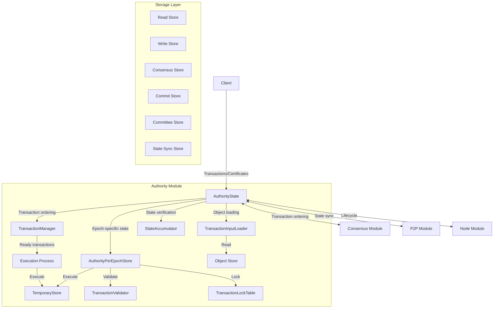
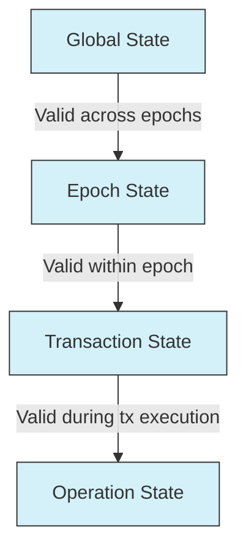
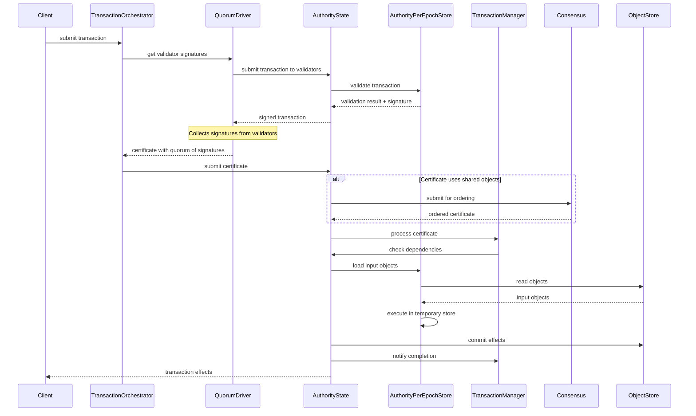
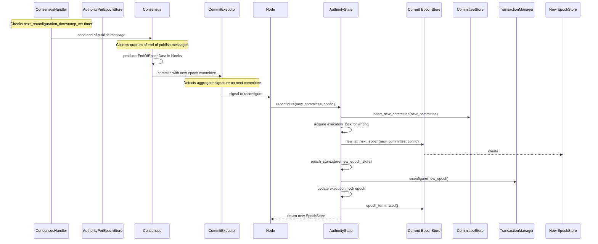
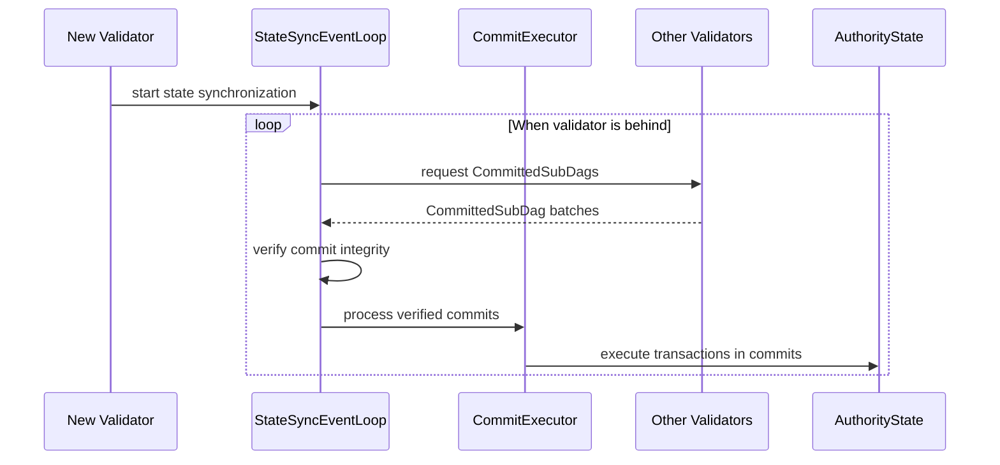
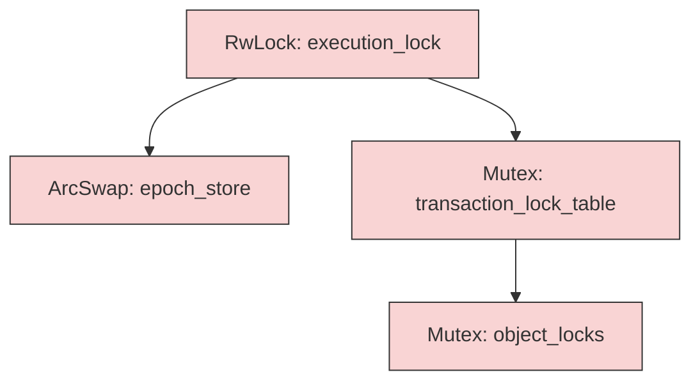

# Soma Blockchain: Read Me First!

## Welcome to Soma

Welcome to the Soma blockchain project! This document serves as your entry point to understanding the codebase and architecture. It highlights the most important concepts, files, and patterns that will help you quickly become productive in the project.

## Table of Contents
1. [What is Soma?](#what-is-soma)
2. [System Architecture Overview](#system-architecture-overview)
3. [Core Modules](#core-modules)
4. [Key Architectural Patterns](#key-architectural-patterns)
5. [Core Workflows](#core-workflows)
   - [Transaction Processing](#transaction-processing-workflow)
   - [Epoch Management](#epoch-management-workflow)
   - [State Synchronization](#state-synchronization-workflow)
6. [Thread Safety and Concurrency](#thread-safety-and-concurrency)
7. [Essential Files to Understand First](#essential-files-to-understand-first)
8. [Getting Started](#getting-started)
9. [Common Development Scenarios](#common-development-scenarios)
10. [Key Technical Concepts](#key-technical-concepts)
11. [Contribution Guidelines](#contribution-guidelines)

## What is Soma?

Soma is a Rust-based blockchain node software that provides a Byzantine Fault Tolerant consensus mechanism with validator-based authority. The system:

- Processes transactions and maintains state across a distributed network
- Enables data contributors to submit valuable information
- Uses encoder shards to evaluate and embed contributed data
- Distributes rewards based on assessed data value
- Manages validator committees through epoch-based reconfiguration
- Provides a self-improving knowledge ecosystem without central control

Soma's mission is to transform the growth of knowledge into a natural process by creating an incentive system for valuable knowledge contributions, objectively evaluating them through probe models, and rewarding the most valuable additions to our collective understanding.

## System Architecture Overview

Soma follows a modular architecture with clear component boundaries and well-defined interfaces:



### Project Structure

```
soma/
├── authority/         # State management and transaction processing
├── consensus/         # Byzantine fault-tolerant agreement implementation
├── node/              # Component lifecycle and orchestration
├── p2p/               # Network discovery and state synchronization
├── types/             # Core data structures and type definitions
├── utils/             # Shared utilities and helper functions
└── memory-bank/       # Project documentation and knowledge base
```

## Core Modules

The system is organized into four primary modules with clear responsibilities:

### 1. Authority Module (Most important to understand first)
- **State Management**: Maintains validator state through `AuthorityState` and epoch-specific `AuthorityPerEpochStore`
- **Transaction Processing**: Validates, executes, and commits transactions
- **Epoch Management**: Handles epoch transitions and reconfiguration
- **Key Components**:
  - `AuthorityState`: Central state management component
  - `AuthorityPerEpochStore`: Epoch-specific state and configuration
  - `TransactionManager`: Manages transaction dependencies
  - `StateAccumulator`: Cryptographic state verification
  - `MysticetiManager`: Interface with consensus engine
  - `CommitExecutor`: Transaction finalization and state-sync interface
  - `TransactionOrchestrator`: Orchestration of transaction processing
  - `QuorumDriver`: Certificate collection across validators
  - `AuthorityAggregator`: Validator communication coordination

### 2. Consensus Module
- **Agreement Protocol**: Byzantine fault-tolerant DAG-based protocol (Mysticeti) designed for high throughput
- **Leader Management**: Leader scheduling and round management
- **Commit Production**: Ordered transaction commits derived from local DAG structure
- **Key Components**:
  - `ConsensusAuthority`: Main consensus authority implementation
  - `Core`: Core consensus algorithm for DAG construction
  - `DAGState`: Local directed acyclic graph state management
  - `UniversalCommitter`: Commit production from the DAG
  - `tonic_network`: Network communication layer for consensus
  - `ThresholdClock`: Round management and leader selection

### 3. Node Module
- **Lifecycle Management**: Component startup, shutdown, and coordination
- **Service Orchestration**: Integration of core services
- **Configuration**: System-wide configuration management
- **Key Components** (primary components to understand):
  - `SomaNode`: Main node implementation and lifecycle management
  - `NodeConfig`: Configuration management for all node components

### 4. P2P Module
- **Network Discovery**: Peer finding and connection management
- **State Synchronization**: Synchronization of blockchain state
- **Key Components**:
  - `DiscoveryEventLoop`: Peer discovery and management
  - `StateSyncEventLoop`: State synchronization
  - `Server`: Network server implementation

## Key Architectural Patterns

### Module-Based Architecture
Components are organized into modules with clear responsibilities and interfaces. Look for trait definitions that establish cross-module contracts.

```rust
// Example of trait-based interface between modules
#[async_trait]
pub trait TransactionClient {
    async fn handle_transaction(&self, transaction: SignedTransaction) -> SomaResult<TransactionResponse>;
    async fn handle_certificate(&self, certificate: VerifiedCertificate) -> SomaResult<TransactionEffects>;
}
```

### Actor Model Adaptation
Many components follow actor model principles:
- Maintain private internal state
- Communicate through message passing (channels)
- Process messages asynchronously in event loops

```rust
// Event loop pattern example
pub async fn start(mut self) {
    info!("Service started");
    
    loop {
        tokio::select! {
            now = self.interval.tick() => {
                self.handle_tick(now.into_std()).await;
            },
            maybe_message = self.mailbox.recv() => {
                if let Some(message) = maybe_message {
                    self.handle_message(message).await;
                } else {
                    break;
                }
            },
            // Additional message sources
        }
    }
    
    info!("Service stopped");
}
```

### Epoch-Based State Isolation
State is organized hierarchically with epoch boundaries:



### ArcSwap for Epoch Transitions
Soma uses `ArcSwap` for atomic epoch transitions:

```rust
pub struct AuthorityState {
    // Hot-swappable epoch store
    epoch_store: ArcSwap<AuthorityPerEpochStore>
}

// Usage pattern
// Atomically replace the epoch store
self.epoch_store.store(Arc::new(new_epoch_store));

// Access current epoch store
let epoch_store = self.epoch_store.load();
```

## Core Workflows

### Transaction Processing Workflow



Key steps in transaction processing:
1. **Validation**: Verify transaction inputs and signatures through TransactionOrchestrator
2. **Certificate Creation**: QuorumDriver gathers validator signatures to form a certificate
3. **Input Resolution**: Load required objects
4. **Execution**: Process transaction in AuthorityPerEpochStore's isolated temporary store
5. **Commitment**: Persist state changes and effects
6. **Client Notification**: Return final transaction effects to client

### Epoch Management Workflow



Key steps in epoch management:
1. **Timer Trigger**: ConsensusHandler checks next_reconfiguration_timestamp_ms to trigger epoch end
2. **End of Epoch Signaling**: Consensus collects quorum of end of publish messages
3. **Committee Formation**: Consensus produces EndOfEpochData with new committee information
4. **Reconfiguration Signal**: CommitExecutor signals Node when committee aggregate signature is formed
5. **Prepare**: Update committee information in storage
6. **Create New Epoch**: Initialize new epoch-specific state
7. **Hot Swap**: Atomically replace epoch store reference
8. **Reconfigure Components**: Update all dependent components
9. **Resume Operation**: Continue in new epoch

### State Synchronization Workflow



Key steps in state synchronization:
1. **Commit Synchronization**: StateSyncEventLoop periodically fetches CommittedSubDags when behind
2. **Transaction Execution**: Transactions from verified commits are sent to CommitExecutor
3. **Integration**: Update local state with synchronized data

## Thread Safety and Concurrency

### Lock Hierarchy

Soma enforces a strict lock hierarchy to prevent deadlocks:



### Concurrency Patterns

#### RwLock Pattern
For shared state with multiple readers:

```rust
// In AuthorityState
execution_lock: RwLock<EpochId>

// Usage - read mode for normal operation
let guard = self.execution_lock.read().await;

// Usage - write mode for reconfiguration
let mut guard = self.execution_lock.write().await;
```

#### JoinSet for Task Management
For tracking and managing async tasks:

```rust
let mut tasks = JoinSet::new();

// Spawn tasks
tasks.spawn(async move { /* task logic */ });
tasks.spawn(async move { /* another task */ });

// Wait for completion with error handling
while let Some(result) = tasks.join_next().await {
    match result {
        Ok(value) => { /* handle success */ },
        Err(e) if e.is_cancelled() => { /* handle cancellation */ },
        Err(e) if e.is_panic() => { /* handle panic */ },
        Err(_) => { /* handle other errors */ }
    }
}
```

## Essential Files to Understand First

For a new developer, we recommend starting with these key files to build a foundational understanding:

### Core Type System
1. **`types/src/base.rs`** - Core type definitions and primitives
2. **`types/src/object.rs`** - Object model and state representation
3. **`types/src/transaction.rs`** - Transaction structure and validation

### State Management
4. **`authority/src/state.rs`** - Central AuthorityState implementation
5. **`authority/src/epoch_store.rs`** - Epoch-specific state management
6. **`authority/src/tx_manager.rs`** - Transaction dependency tracking

### Consensus
7. **`consensus/src/authority.rs`** - Consensus authority implementation
8. **`consensus/src/core.rs`** - Core consensus algorithm

### Node Structure
9. **`node/src/lib.rs`** - Node implementation and lifecycle

## Getting Started

1. Read this document thoroughly
2. Review the core memory bank files:
   - `projectbrief.md` - Overall project architecture
   - `systemPatterns.md` - Key design patterns
   - `techContext.md` - Technology stack details
   - `progress.md` - Current project status

3. Explore the module-specific documentation:
   - `memory-bank/modules/authority.md`
   - `memory-bank/modules/consensus.md`
   - `memory-bank/modules/node.md`
   - `memory-bank/modules/p2p.md`

4. Explore key knowledge files:
   - `memory-bank/knowledge/thread_safety_patterns.md`
   - `memory-bank/knowledge/data_flow.md`
   - `memory-bank/knowledge/epoch_management.md`
   - `memory-bank/knowledge/cross_module_communication.md`

5. Build and run a local test instance:
   ```bash
   cargo build --all
   cargo test --all
   ```

## Common Development Scenarios

### Adding a New Transaction Type
1. Define transaction type in `types/src/transaction.rs`:
   ```rust
   #[derive(Debug, Clone, Serialize, Deserialize)]
   pub enum TransactionKind {
       // Existing transaction kinds...
       Transfer(TransferTransaction),
       // Your new transaction kind
       MyNewTransaction(MyNewTransactionData),
   }
   ```

2. Implement validation in `authority/src/tx_validator.rs`:
   ```rust
   fn validate_transaction_data(
       &self,
       data: &TransactionData,
   ) -> SomaResult<()> {
       match &data.kind {
           // Existing validation...
           TransactionKind::MyNewTransaction(data) => {
               self.validate_my_new_transaction(data)
           }
       }
   }
   ```

3. Add execution logic in temporary store
4. Update effects handling for new transaction type

### Making Changes to State Management
1. Understand the lock hierarchy and concurrency model
2. Add new state fields to the appropriate store level:
   ```rust
   pub struct AuthorityPerEpochStore {
       // Existing fields...
       
       // New field with appropriate synchronization
       my_new_state: Arc<RwLock<MyNewState>>,
   }
   ```

3. Ensure thread-safe access with proper locking
4. Update epoch transition handling if needed

### Testing Your Changes
1. Add unit tests for component logic:
   ```rust
   #[tokio::test]
   async fn test_my_new_transaction() {
       // Setup test environment
       let state = setup_test_authority_state().await;
       
       // Create test transaction
       let transaction = create_test_transaction().await;
       
       // Execute and verify
       let effects = state.execute_transaction(transaction).await?;
       assert_eq!(effects.status, ExecutionStatus::Success);
       // Additional assertions...
   }
   ```

2. Add integration tests for cross-component behavior
3. Use property-based tests for critical algorithms:
   ```rust
   proptest! {
       #[test]
       fn test_transaction_execution_determinism(
           txs in vec(any::<SignedTransaction>(), 1..10),
           seed in any::<u64>(),
       ) {
           let mut store1 = TemporaryStore::new(seed);
           let mut store2 = TemporaryStore::new(seed);
           
           let result1 = execute_transactions(&mut store1, &txs);
           let result2 = execute_transactions(&mut store2, &txs);
           
           prop_assert_eq!(result1, result2);
           prop_assert_eq!(store1.objects(), store2.objects());
       }
   }
   ```

4. Use simulation testing for network and distributed components:
   ```rust
   #[madsim::test]
   async fn test_network_partition_recovery() {
       // Set up a simulated network with multiple validators
       let mut sim = TestSimulator::new();
       let validators = sim.spawn_validators(4).await;
       
       // Generate some transactions before partition
       sim.generate_and_execute_transactions(10).await;
       
       // Create a network partition
       sim.create_partition(vec![0, 1], vec![2, 3]).await;
       
       // Generate more transactions during partition
       sim.generate_and_execute_transactions_on_subset(vec![0, 1], 5).await;
       sim.generate_and_execute_transactions_on_subset(vec![2, 3], 5).await;
       
       // Heal the partition
       sim.heal_partition().await;
       
       // Allow time for state synchronization
       sim.advance_time(Duration::from_secs(10)).await;
       
       // Verify all validators are in sync
       sim.verify_consistent_state().await;
   }
   ```

   The simulation testing framework (madsim/msim) allows for:
   - Deterministic simulation of network conditions like delays, drops, and partitions
   - Precise control over timing to test race conditions
   - Controlled scheduling of async tasks to reveal concurrency bugs
   - Reproducible failures for easier debugging
   - Testing of distributed system properties like partition tolerance and consistency

## Key Technical Concepts

- **Epoch**: A period with a fixed validator set
- **Certificate**: A transaction with validator signatures
- **Shared Objects**: Objects that require consensus ordering
- **Accumulator**: Cryptographic representation of state
- **Reconfiguration**: Process of changing validator set
- **State Synchronization**: Process of aligning state across validators
- **Object Model**: Versioned objects with ownership semantics
- **TemporaryStore**: Isolated storage for transaction execution
- **Effects**: Cryptographically verifiable transaction results
- **Committee**: Set of validators with associated voting power

## Error Handling Patterns

Soma uses structured error types with thiserror:

```rust
#[derive(Debug, thiserror::Error)]
pub enum SomaError {
    #[error("epoch has ended: {0}")]
    EpochEnded(EpochId),
    
    #[error("wrong epoch, expected {expected_epoch}, actual {actual_epoch}")]
    WrongEpoch {
        expected_epoch: EpochId,
        actual_epoch: EpochId,
    },
    
    #[error("database error: {0}")]
    DatabaseError(#[from] std::io::Error),
    
    #[error("internal error: {0}")]
    InternalError(String),
}

type SomaResult<T> = Result<T, SomaError>;
```

## Contribution Guidelines

- Follow Rust's ownership and borrowing rules
- Use async/await with tokio for all I/O operations
- Implement proper error handling with thiserror
- Avoid `.unwrap()` and `.expect()` in production code
- Write comprehensive tests with tokio::test
- Document your changes in the memory bank
- Maintain lock hierarchies to prevent deadlocks
- Use trait-based interfaces for module boundaries
- Follow established concurrency patterns
- Add comprehensive logging for observability

## Conclusion

This document provides an entry point to the Soma blockchain codebase. The most important step is to understand the Authority module and its interaction with the Consensus module, as these form the core of the blockchain's operation. From there, you can explore other modules and specific features based on your areas of focus.

Remember to update the memory bank with new insights and patterns as you work with the codebase!

## Last Updated: 2025-03-10 by Cline
