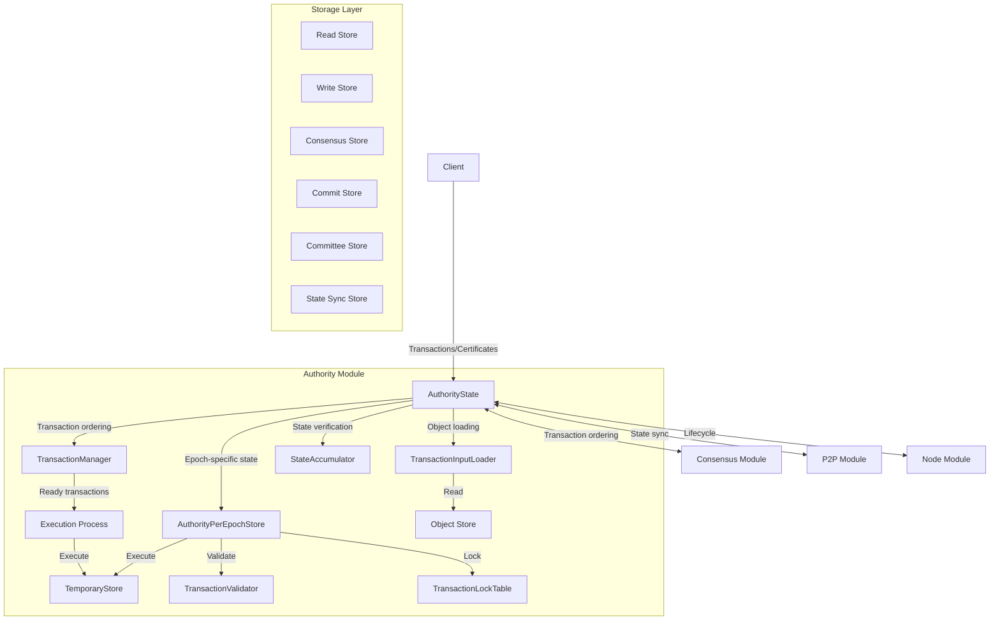
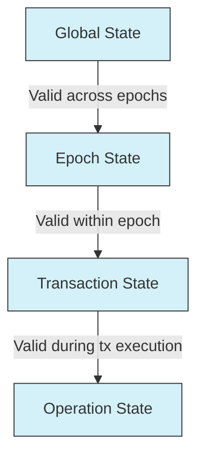
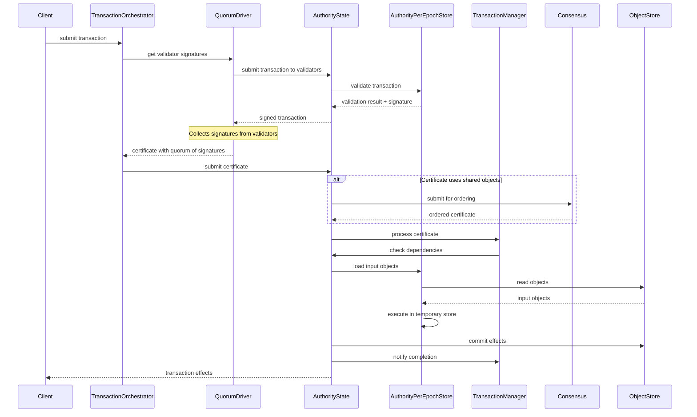
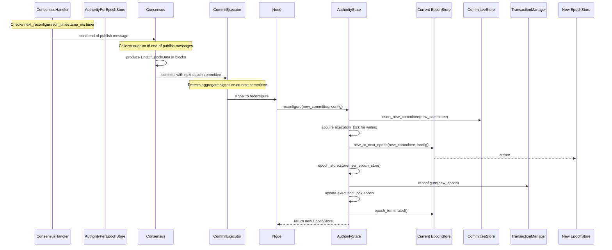
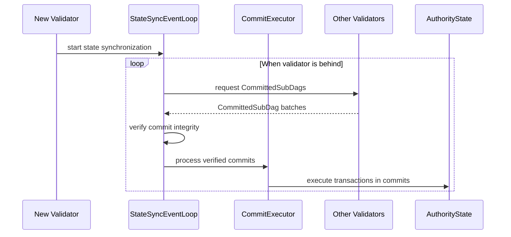
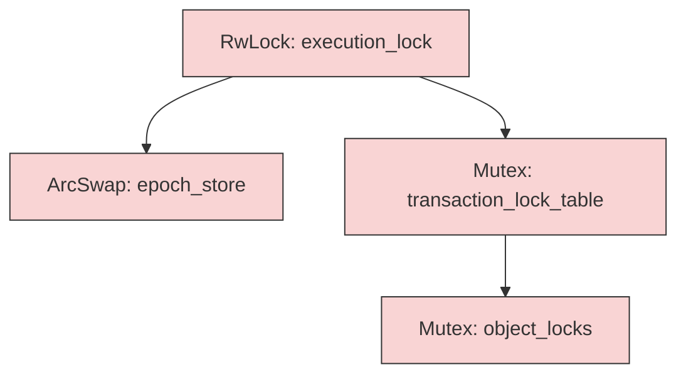

# Soma Blockchain System Patterns

## Purpose and Scope
This document provides a comprehensive and practical guide to the architectural patterns, design decisions, and implementation techniques used throughout the Soma blockchain. It serves as both a reference for understanding the existing system architecture and a guide for implementing new features in alignment with established patterns.

## 1. System Architecture

### 1.1 Module Organization

Soma follows a modular architecture with clear component boundaries and well-defined interfaces:



The system is organized into four primary modules with clear responsibilities:

#### Authority Module
- **Core Responsibility**: State management and transaction processing
- **Key Components**:
  - `AuthorityState`: Central state management component
  - `AuthorityPerEpochStore`: Epoch-specific state and configuration
  - `TransactionManager`: Manages transaction dependencies
  - `StateAccumulator`: Cryptographic state verification
  - `MysticetiManager`: Interface with consensus engine
  - `CommitExecutor`: Transaction finalization
  - `TransactionOrchestrator`: Transaction processing orchestration
  - `QuorumDriver`: Certificate collection across validators

**Example Implementation**:
```rust
pub struct AuthorityState {
    pub name: AuthorityName,
    pub secret: StableSyncAuthoritySigner,
    epoch_store: ArcSwap<AuthorityPerEpochStore>,
    execution_lock: RwLock<EpochId>,
    committee_store: Arc<CommitteeStore>,
    transaction_manager: Arc<TransactionManager>,
    // Additional fields...
}
```

#### Consensus Module
- **Core Responsibility**: Byzantine fault-tolerant agreement protocol
- **Key Components**:
  - `ConsensusAuthority`: Main consensus implementation
  - `Core`: Core consensus algorithm for DAG construction
  - `DAGState`: Directed acyclic graph state management
  - `UniversalCommitter`: Commit production from the DAG
  - `ThresholdClock`: Round management and leader selection

**Example Implementation**:
```rust
pub struct ConsensusAuthority {
    context: Arc<Context>,
    transaction_client: Arc<TransactionClient>,
    synchronizer: Arc<SynchronizerHandle>,
    commit_syncer: CommitSyncer<TonicClient>,
    core_thread_handle: CoreThreadHandle,
    // Additional fields...
}
```

#### Node Module
- **Core Responsibility**: Component lifecycle and service orchestration
- **Key Components**:
  - `SomaNode`: Main node implementation
  - `NodeConfig`: Configuration management

#### P2P Module
- **Core Responsibility**: Network discovery and state synchronization
- **Key Components**:
  - `DiscoveryEventLoop`: Peer discovery and management
  - `StateSyncEventLoop`: State synchronization
  - `Server`: Network server implementation

### 1.2 Component Interfaces

Modules interact through well-defined trait interfaces:

```rust
// Example of trait-based interface between modules
#[async_trait]
pub trait TransactionClient {
    async fn handle_transaction(&self, transaction: SignedTransaction) -> SomaResult<TransactionResponse>;
    async fn handle_certificate(&self, certificate: VerifiedCertificate) -> SomaResult<TransactionEffects>;
}
```

When implementing new components:
- Define clear trait interfaces for cross-module boundaries
- Use dependency injection to allow for testing with mock implementations
- Ensure consistent error handling across module boundaries

### 1.3 State Hierarchy Pattern

Soma organizes state in a hierarchical pattern with decreasing scope:



- **Global State**: System-wide state (Committee, Genesis configuration)
- **Epoch State**: State valid for current epoch (AuthorityPerEpochStore)
- **Transaction State**: State scoped to transaction execution (TemporaryStore)
- **Operation State**: State specific to an operation (single transaction processing)

**When to use**:
- For organizing state with different validity periods
- When different components need access to state at different levels
- To provide clear boundaries for state transitions and scope

## 2. Core Workflows

### 2.1 Transaction Processing Workflow



Key steps in transaction processing:
1. **Validation**: Verify transaction inputs and signatures
2. **Certificate Creation**: Gather validator signatures to form a certificate
3. **Input Resolution**: Load required objects
4. **Execution**: Process transaction in isolated temporary store
5. **Commitment**: Persist state changes and effects
6. **Client Notification**: Return final transaction effects to client

**Implementation Pattern**:
```rust
pub async fn try_execute_immediately(
    &self,
    certificate: &VerifiedExecutableTransaction,
    expected_effects_digest: Option<TransactionEffectsDigest>,
    commit: Option<CommitIndex>,
    epoch_store: &Arc<AuthorityPerEpochStore>,
) -> SomaResult<(TransactionEffects, Option<ExecutionError>)> {
    // Load input objects
    let input_objects = self.load_transaction_inputs(certificate).await?;
    
    // Execute in temporary store
    let (effects, execution_error) = epoch_store.execute_transaction(
        certificate, 
        input_objects,
    ).await?;
    
    // Verify effects match expected digest (if provided)
    if let Some(expected_digest) = expected_effects_digest {
        if effects.digest() != expected_digest {
            return Err(SomaError::EffectsDigestMismatch { ... });
        }
    }
    
    // Commit effects to permanent storage
    self.commit_effects(&effects, certificate).await?;
    
    // Notify transaction completion
    self.transaction_manager.notify_transaction_executed(certificate.digest()).await?;
    
    Ok((effects, execution_error))
}
```

### 2.2 Epoch Management Workflow



Key steps in epoch management:
1. **Timer Trigger**: ConsensusHandler detects epoch end time
2. **End of Epoch Signaling**: Consensus collects quorum of end of publish messages
3. **Committee Formation**: Consensus produces EndOfEpochData with new committee
4. **Reconfiguration Signal**: CommitExecutor signals when committee signature is formed
5. **Prepare**: Update committee information in storage
6. **Create New Epoch**: Initialize new epoch-specific state
7. **Hot Swap**: Atomically replace epoch store reference
8. **Reconfigure Components**: Update all dependent components
9. **Resume Operation**: Continue in new epoch

**Implementation Pattern**:
```rust
pub async fn reconfigure(
    &self,
    cur_epoch_store: &AuthorityPerEpochStore,
    new_committee: Committee,
    epoch_start_configuration: EpochStartConfiguration,
    epoch_last_commit: CommitIndex,
) -> SomaResult<Arc<AuthorityPerEpochStore>> {
    // Lock for reconfiguration
    let mut execution_lock = self.execution_lock.write().await;
    let cur_epoch = *execution_lock;
    
    // Insert new committee
    self.committee_store.insert_new_committee(new_committee.clone()).await?;
    
    // Create new epoch store
    let new_epoch_store = cur_epoch_store.new_at_next_epoch(
        new_committee,
        epoch_start_configuration,
        epoch_last_commit,
    ).await?;
    
    // Hot swap epoch store
    self.epoch_store.store(Arc::clone(&new_epoch_store));
    
    // Update execution lock epoch
    *execution_lock = cur_epoch + 1;
    
    // Reconfigure dependent components
    self.transaction_manager.reconfigure(new_epoch_store.epoch()).await?;
    
    // Signal old epoch termination
    cur_epoch_store.epoch_terminated()?;
    
    Ok(new_epoch_store)
}
```

### 2.3 State Synchronization Workflow



Key steps in state synchronization:
1. **Commit Synchronization**: StateSyncEventLoop fetches CommittedSubDags when behind
2. **Transaction Execution**: Transactions from verified commits are executed
3. **Integration**: Update local state with synchronized data

## 3. Concurrency and Thread Safety Patterns

### 3.1 Lock Hierarchy

Soma enforces a strict lock hierarchy to prevent deadlocks:



The established lock order is:
```
ExecutionLock -> EpochStoreLock -> TransactionLock -> ObjectLock
```

**When to use**:
- When implementing features that require multiple locks
- To maintain system safety with complex locking requirements
- For ensuring deterministic lock acquisition across the codebase

### 3.2 RwLock Pattern

For shared state that allows multiple concurrent readers with exclusive writer access:

```rust
// In AuthorityState
execution_lock: RwLock<EpochId>

// Usage - read mode for normal operation
let guard = self.execution_lock.read().await;

// Usage - write mode for reconfiguration
let mut guard = self.execution_lock.write().await;
```

**When to use**:
- For state that is frequently read but less frequently written
- When you need to ensure readers have a consistent view of the state
- For coordinating access across multiple async tasks

### 3.3 ArcSwap Pattern

For hot-swappable components like epoch stores, Soma uses `ArcSwap` to atomically replace entire data structures:

```rust
// In AuthorityState
epoch_store: ArcSwap<AuthorityPerEpochStore>

// Usage - replacing during reconfiguration
self.epoch_store.store(Arc::new(new_epoch_store));

// Usage - accessing current epoch store
let epoch_store = self.epoch_store.load();
```

**When to use**:
- For epoch transitions where an entire state component needs to be replaced
- When you need atomic replacement without disrupting ongoing operations
- For components where readers should always see a consistent version

### 3.4 JoinSet Pattern

For managing groups of related tasks, Soma uses `tokio::task::JoinSet`:

```rust
let mut tasks = JoinSet::new();

// Spawn tasks
tasks.spawn(async move {
    // Task logic here
});

// Wait for completion with error handling
while let Some(result) = tasks.join_next().await {
    match result {
        Ok(value) => {
            // Handle successful completion
        },
        Err(e) => {
            if e.is_cancelled() {
                // Handle cancellation
            } else if e.is_panic() {
                // Handle panic
                std::panic::resume_unwind(e.into_panic());
            }
        }
    }
}
```

**When to use**:
- For spawning and tracking multiple related background tasks
- When you need to gracefully handle task completion, cancellation, and panics
- For implementing proper task supervision patterns

## 4. Actor Model Adaptation

Soma adapts aspects of the actor model, with components that:
- Maintain private internal state
- Communicate through message passing via channels
- Handle requests asynchronously through mailboxes
- Manage their own lifecycle

### 4.1 Event Loop Pattern

The event loop pattern forms the backbone of the actor model adaptation in Soma:

```rust
pub async fn start(mut self) {
    info!("Service started");
    let mut interval = tokio::time::interval(Duration::from_millis(100));
    
    loop {
        tokio::select! {
            now = interval.tick() => {
                self.handle_tick(now.into_std()).await;
            },
            maybe_message = self.mailbox.recv() => {
                if let Some(message) = maybe_message {
                    self.handle_message(message).await;
                } else {
                    break;
                }
            },
            peer_event = self.peer_event_receiver.recv() => {
                self.handle_peer_event(peer_event).await;
            },
            Some(task_result) = self.tasks.join_next() => {
                self.handle_task_result(task_result).await;
            },
        }
    }
    
    info!("Service stopped");
}
```

**When to use**:
- For long-running components that need to process multiple message types
- When state isolation and message passing is preferred over shared mutable state
- For components that need to manage concurrent operations
- For implementing responsive services with multiple input sources

### 4.2 Channel-Based Communication

Components communicate using channels to decouple producers and consumers:

```rust
// Create bounded channel
let (tx, rx) = tokio::sync::mpsc::channel(32);

// Create unbounded channel (use with caution)
let (utx, urx) = tokio::sync::mpsc::unbounded_channel();

// Send message
tx.send(message).await?;

// Receive message
if let Some(message) = rx.recv().await {
    // Process message
}
```

**When to use**:
- For communicating between async tasks
- When you need to decouple components
- For implementing backpressure
- To avoid shared mutable state

## 5. State Management Patterns

### 5.1 Epoch-Based State Isolation

Soma isolates state by epoch, with dedicated storage for each epoch:

```rust
pub struct AuthorityState {
    epoch_store: ArcSwap<AuthorityPerEpochStore>
}

pub struct AuthorityPerEpochStore {
    // Epoch-specific fields
    committee: Committee,
    database: Arc<AuthorityStore>,
    // More epoch-specific fields
}
```

**When to use**:
- For data that has different validity periods
- When you need clean reconfiguration boundaries
- For isolating failures between epochs

### 5.2 Temporary Store Pattern

Soma uses temporary stores for transaction execution:

```rust
pub struct TemporaryStore {
    input_objects: BTreeMap<ObjectID, Object>,
    written_objects: BTreeMap<ObjectID, (Object, WriteKind)>,
    events: Vec<Event>,
    max_binary_format_version: u64,
}

// Usage
let mut temporary_store = TemporaryStore::new(input_objects, max_format_version);

// Execute transaction
let (effects, execution_error) = execute_transaction(&mut temporary_store, transaction)?;

// If successful, commit changes
if execution_error.is_none() {
    commit_temporary_store(temporary_store, effects)?;
}
```

**When to use**:
- For speculative execution before commitment
- When operations need to be validated before permanent state changes
- For transactional semantics with abort capability

### 5.3 Versioned Object Pattern

Soma uses versioned objects to track state changes:

```rust
pub struct Object {
    // Object fields
    previous_transaction: TransactionDigest,
    version: SequenceNumber,
    // More fields
}
```

**When to use**:
- For tracking object lineage and history
- When concurrency control requires versioning
- For enabling deterministic execution verification

## 6. Error Handling Patterns

### 6.1 Module-Specific Error Types

Each module defines its own error type with `thiserror::Error`:

```rust
#[derive(Debug, thiserror::Error)]
pub enum SomaError {
    #[error("epoch has ended: {0}")]
    EpochEnded(EpochId),
    
    #[error("wrong epoch, expected {expected_epoch}, actual {actual_epoch}")]
    WrongEpoch {
        expected_epoch: EpochId,
        actual_epoch: EpochId,
    },
    
    #[error("validator halted at epoch end")]
    ValidatorHaltedAtEpochEnd,
    
    #[error("database error: {0}")]
    DatabaseError(#[from] std::io::Error),
    
    #[error("internal error: {0}")]
    InternalError(String),
}

// Create module-specific Result type
pub type SomaResult<T> = Result<T, SomaError>;
```

**When to use**:
- For module-specific errors that need detailed context
- When errors need to be categorized by type (validation, internal, network, etc.)
- For providing clear error messages with structured data

### 6.2 Error Categorization Pattern

Soma categorizes errors to determine appropriate handling:

- **Permanent Errors**: Indicate a request that can never succeed (Invalid signature)
- **Transient Errors**: Temporary failures that might succeed with retry (Network timeout)
- **Recoverable Errors**: Errors that require explicit recovery action (Database corruption)
- **Fatal Errors**: Errors that require component restart (Unrecoverable state inconsistency)

**Implementation Example**:
```rust
impl SomaError {
    pub fn is_permanent(&self) -> bool {
        matches!(self,
            SomaError::InvalidSignature(_) |
            SomaError::InvalidFormat(_) |
            // Other permanent errors
        )
    }
    
    pub fn is_transient(&self) -> bool {
        matches!(self,
            SomaError::NetworkTimeout(_) |
            SomaError::TemporarilyUnavailable(_) |
            // Other transient errors
        )
    }
    
    pub fn is_fatal(&self) -> bool {
        matches!(self,
            SomaError::StateCorruption(_) |
            SomaError::UnrecoverableInconsistency(_) |
            // Other fatal errors
        )
    }
}
```

**When to use**:
- When designing error handling for operation reliability
- For implementing retry mechanisms with appropriate backoff
- To provide clear indicators for operational monitoring

### 6.3 Error Propagation with Context

Errors are propagated using the `?` operator with context addition:

```rust
fn process_operation() -> SomaResult<Output> {
    let data = fetch_data()
        .map_err(|e| SomaError::InternalError(format!("Failed to fetch data: {}", e)))?;
    
    let result = validate_data(data)?;
    
    Ok(process_result(result)?)
}
```

**When to use**:
- For propagating errors up the call stack
- When additional context needs to be added
- For converting between error types

## 7. Testing Patterns

### 7.1 Async Testing

Tests use `tokio::test` for asynchronous test cases:

```rust
#[tokio::test]
async fn test_consensus_authority_operation() {
    // Setup test environment with mock components
    let authority = setup_test_authority().await;
    
    // Execute test operations
    let result = authority.process_transaction(test_tx).await;
    
    // Verify results
    assert!(result.is_ok());
    // Additional assertions...
}
```

**When to use**:
- For testing async functions and flows
- When you need a runtime for async operations
- For integration tests that span multiple components

### 7.2 Mock Components

Critical interfaces have mock implementations for testing:

```rust
#[derive(Default)]
struct MockConsensusClient {
    transactions: Mutex<Vec<VerifiedTransaction>>,
    handle_certificate_calls: AtomicUsize,
}

impl ConsensusClient for MockConsensusClient {
    async fn handle_certificate(&self, certificate: VerifiedCertificate) -> SomaResult<()> {
        self.handle_certificate_calls.fetch_add(1, Ordering::SeqCst);
        let tx = self.transactions.lock().unwrap();
        tx.push(certificate.into_inner());
        Ok(())
    }
    
    // Other method implementations
}
```

**When to use**:
- For isolating components during testing
- When external dependencies need to be controlled
- For simulating error conditions
- To verify correct interaction between components

### 7.3 Property-Based Testing

For critical algorithms, Soma uses property-based testing to verify invariants:

```rust
proptest! {
    #[test]
    fn test_transaction_execution_determinism(
        txs in vec(any::<SignedTransaction>(), 1..10),
        seed in any::<u64>(),
    ) {
        let mut store1 = TemporaryStore::new(seed);
        let mut store2 = TemporaryStore::new(seed);
        
        let result1 = execute_transactions(&mut store1, &txs);
        let result2 = execute_transactions(&mut store2, &txs);
        
        prop_assert_eq!(result1, result2);
        prop_assert_eq!(store1.objects(), store2.objects());
    }
}
```

**When to use**:
- For testing algorithm correctness with randomized inputs
- When verifying invariants across many possible states
- For discovering edge cases in complex logic
- To test determinism and reproducibility

### 7.4 Randomized Integration Testing

Soma uses randomized integration tests for Byzantine behavior:

```rust
#[tokio::test]
async fn test_consensus_with_byzantine_nodes() {
    // Create a test network with some Byzantine nodes
    let mut network = TestNetwork::new(7, 2); // 7 nodes, 2 Byzantine
    
    // Generate test transactions
    let txs = generate_test_transactions(100);
    
    // Submit transactions and verify consensus
    let results = network.process_transactions(txs).await;
    
    // Verify safety properties
    assert!(network.verify_safety_properties());
    
    // Verify liveness properties
    assert!(network.verify_liveness_properties());
}
```

**When to use**:
- For testing consensus safety and liveness
- When simulating Byzantine behavior
- For verifying system properties under stress
- To test recovery from adverse conditions

## 8. Cross-Module Integration Patterns

### 8.1 Dependency Injection Pattern

Soma uses dependency injection for module integration:

```rust
pub struct ConsensusAuthority {
    context: Arc<Context>,
    transaction_client: Arc<dyn TransactionClient>,
    synchronizer: Arc<SynchronizerHandle>,
    // More dependencies
}

impl ConsensusAuthority {
    pub fn new(
        context: Arc<Context>,
        transaction_client: Arc<dyn TransactionClient>,
        synchronizer: Arc<SynchronizerHandle>,
        // More parameters
    ) -> Self {
        Self {
            context,
            transaction_client,
            synchronizer,
            // Initialize other fields
        }
    }
}
```

**When to use**:
- For creating testable components
- When components need configurable dependencies
- For flexible module composition
- To enable mock implementations in tests

### 8.2 Service Interface Pattern

Soma defines clear service interfaces between modules:

```rust
#[async_trait]
pub trait AuthorityService {
    async fn handle_transaction(&self, transaction: SignedTransaction) 
        -> SomaResult<TransactionResponse>;
        
    async fn handle_certificate(&self, certificate: VerifiedCertificate)
        -> SomaResult<TransactionEffects>;
    
    // More methods
}
```

**When to use**:
- For defining clear module boundaries
- When implementing RPC or service endpoints
- For enabling alternative implementations
- To document cross-module contracts

## 9. Common Implementation Scenarios

This section provides practical guidance for common development tasks in the Soma blockchain.

### 9.1 Adding a New Transaction Type

1. Define transaction type in `types/src/transaction.rs`:
   ```rust
   #[derive(Debug, Clone, Serialize, Deserialize)]
   pub enum TransactionKind {
       // Existing transaction kinds...
       Transfer(TransferTransaction),
       // Your new transaction kind
       MyNewTransaction(MyNewTransactionData),
   }
   ```

2. Implement validation in `authority/src/tx_validator.rs`:
   ```rust
   fn validate_transaction_data(
       &self,
       data: &TransactionData,
   ) -> SomaResult<()> {
       match &data.kind {
           // Existing validation...
           TransactionKind::MyNewTransaction(data) => {
               self.validate_my_new_transaction(data)
           }
           // Other transaction kinds...
           _ => Ok(()),
       }
   }
   ```

3. Add execution logic in temporary store:
   ```rust
   fn execute_transaction(
       &self,
       tx: &VerifiedExecutableTransaction,
       temporary_store: &mut TemporaryStore,
   ) -> SomaResult<TransactionEffects> {
       match &tx.data().kind {
           // Existing transaction types...
           TransactionKind::MyNewTransaction(data) => {
               self.execute_my_new_transaction(data, temporary_store)
           }
           // Other transaction kinds...
           _ => Err(SomaError::UnsupportedTransactionKind),
       }
   }
   ```

4. Update effects handling for new transaction type:
   ```rust
   fn calculate_effects(
       &self,
       temporary_store: &TemporaryStore,
       tx: &VerifiedExecutableTransaction,
   ) -> SomaResult<TransactionEffects> {
       // Extract transaction-specific effects
       let mut effects_builder = TransactionEffectsBuilder::new();
       
       // Add newly created/modified objects
       for (obj_id, (obj, kind)) in temporary_store.written_objects() {
           effects_builder.add_object_output(ObjectOutput::new(obj.clone(), *kind));
       }
       
       // Add transaction-specific metadata
       if let TransactionKind::MyNewTransaction(data) = &tx.data().kind {
           effects_builder.add_transaction_metadata(data.get_metadata());
       }
       
       effects_builder.build(tx.digest())
   }
   ```

### 9.2 Making Changes to State Management

1. Understand the lock hierarchy and concurrency model:
   ```
   ExecutionLock -> EpochStoreLock -> TransactionLock -> ObjectLock
   ```

2. Add new state fields to the appropriate store level:
   ```rust
   pub struct AuthorityPerEpochStore {
       // Existing fields...
       
       // New field with appropriate synchronization
       my_new_state: Arc<RwLock<MyNewState>>,
   }
   ```

3. Ensure proper initialization in constructors:
   ```rust
   impl AuthorityPerEpochStore {
       pub fn new(
           committee: Committee,
           epoch: EpochId,
           database: Arc<AuthorityStore>,
           // Other parameters...
       ) -> Self {
           // Initialize other fields...
           
           // Initialize new state
           let my_new_state = Arc::new(RwLock::new(MyNewState::new()));
           
           Self {
               committee,
               epoch,
               database,
               // Other fields...
               my_new_state,
           }
       }
   }
   ```

4. Update epoch transition handling if needed:
   ```rust
   pub async fn new_at_next_epoch(
       &self,
       next_committee: Committee,
       epoch_start_configuration: EpochStartConfiguration,
       epoch_last_commit: CommitIndex,
   ) -> SomaResult<AuthorityPerEpochStore> {
       // Handle existing state transition...
       
       // Migrate your new state between epochs
       let next_my_new_state = {
           let current_state = self.my_new_state.read().await;
           current_state.migrate_to_next_epoch()?
       };
       
       // Construct new epoch store
       Ok(AuthorityPerEpochStore {
           committee: next_committee,
           epoch: self.epoch + 1,
           // Other migrated fields...
           my_new_state: Arc::new(RwLock::new(next_my_new_state)),
       })
   }
   ```

### 9.3 Implementing a New Consensus Feature

1. Understand the consensus structure:
   ```rust
   // Main consensus authority
   pub struct ConsensusAuthority {
       context: Arc<Context>,
       transaction_client: Arc<TransactionClient>,
       // Other fields...
   }
   
   // Core consensus algorithm
   pub struct Core {
       context: Arc<Context>,
       dag_state: Arc<DAGState>,
       threshold_clock: Arc<ThresholdClock>,
       // Other fields...
   }
   ```

2. Implement new functionality in the appropriate component:
   ```rust
   impl Core {
       // New method for consensus feature
       pub async fn process_new_feature(&self, feature_data: FeatureData) -> SomaResult<()> {
           // Implementation of new feature
           self.dag_state.update_with_feature(feature_data).await?;
           
           // Trigger appropriate follow-up actions
           self.process_dag_updates().await?;
           
           Ok(())
       }
   }
   ```

3. Add interface methods to expose the feature:
   ```rust
   impl ConsensusAuthority {
       // Public interface for the feature
       pub async fn handle_new_feature(&self, feature_data: FeatureData) -> SomaResult<()> {
           // Validation and pre-processing
           self.validate_feature_data(&feature_data)?;
           
           // Forward to core
           self.core_thread_handle.send_command(CoreCommand::ProcessNewFeature(feature_data)).await?;
           
           Ok(())
       }
   }
   ```

## 10. Confidence Ratings

This section provides confidence ratings for each major section of this document, indicating the level of stability and completeness of the patterns described.

### 10.1 System Architecture (9/10)
The system architecture is well-established and stable. The module boundaries and component relationships have been refined through extensive development and testing. Recent improvements have focused on enhancing the clarity of module interfaces.

### 10.2 Core Workflows (9/10)
Transaction processing, epoch management, and state synchronization workflows are well-documented and stable. The patterns described have been battle-tested through extensive simulation and unit testing.

### 10.3 Concurrency and Thread Safety Patterns (9/10)
Lock hierarchies, RwLock patterns, and ArcSwap mechanisms are core to the system and thoroughly tested. The JoinSet pattern for task management has proven effective in production environments.

### 10.4 Actor Model Adaptation (8/10)
The actor model adaptation has stabilized with clear event loop patterns. Some refinements may still occur as we optimize specific usage patterns, particularly around error handling in event loops.

### 10.5 State Management Patterns (9/10)
State hierarchy, epoch-based isolation, and temporary store patterns are well-established. Versioned object patterns have proven effective for maintaining transaction history and enabling state verification.

### 10.6 Error Handling Patterns (8/10)
Error types and propagation patterns are well-documented. The error categorization system may see further refinements as we expand error recovery mechanisms.

### 10.7 Testing Patterns (9/10)
Testing approaches for async code, mock components, and property-based testing are mature. Randomized integration testing continues to be enhanced to cover more Byzantine behavior scenarios.

### 10.8 Cross-Module Integration Patterns (8/10)
Dependency injection and service interface patterns are stable, but may evolve as we add new module interactions, particularly around shared object ordering.

### 10.9 Common Implementation Scenarios (7/10)
Documentation of implementation scenarios is recent and may benefit from additional examples as the system evolves, particularly for new transaction types and reconfiguration scenarios.

## Last Updated: 2025-03-10 by Cline
