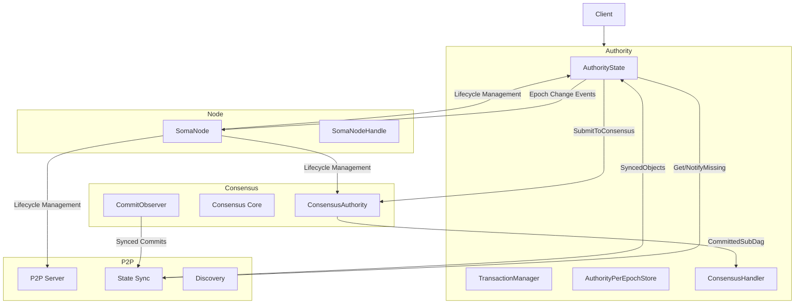
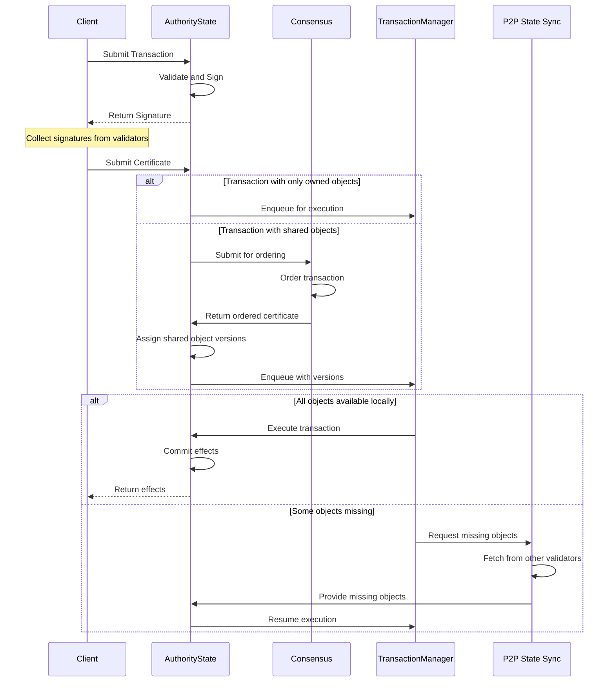
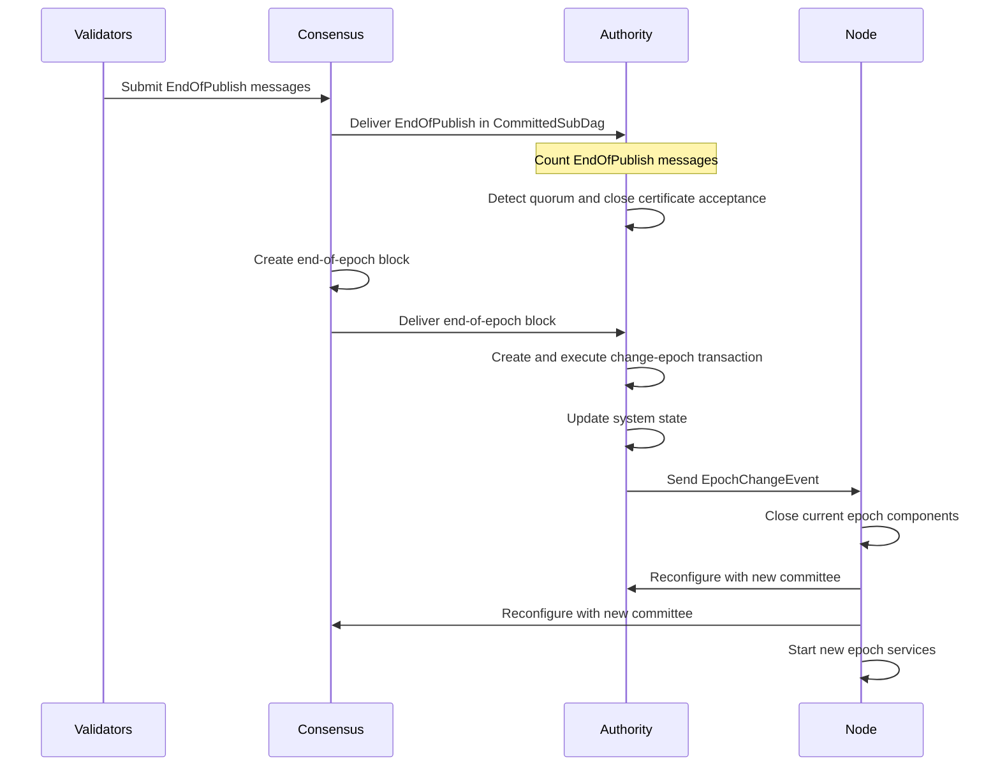
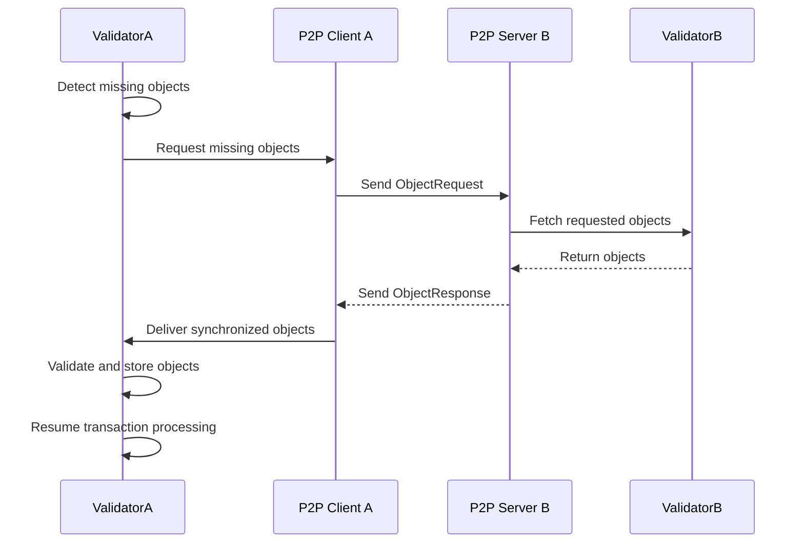
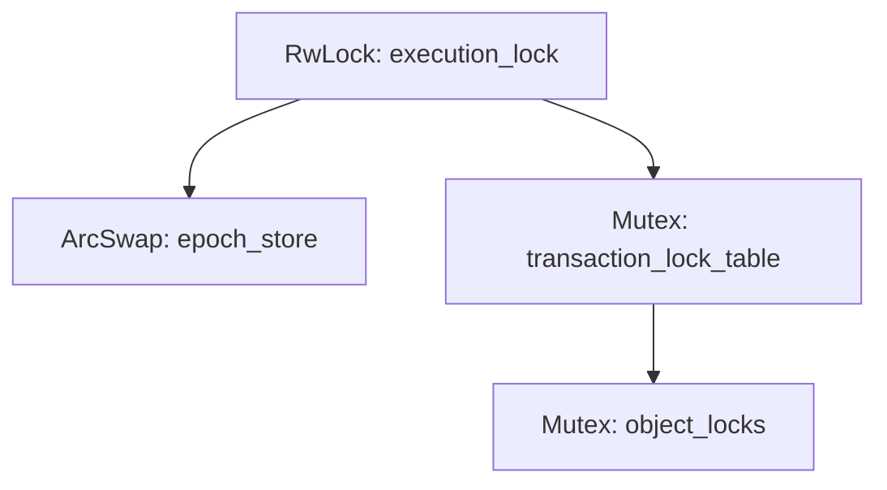

# Cross-Module Communication

## Overview
This document provides a comprehensive explanation of the communication patterns, interfaces, and data flows between the major modules of the Soma blockchain: Authority, Consensus, Node, and P2P. Understanding these cross-module interactions is essential for working with the Soma codebase, as they define the system's architecture and ensure its correct operation across distributed validator nodes.

## Core Concepts

### Module Boundaries
The Soma blockchain is organized into distinct modules with well-defined responsibilities:

1. **Authority Module**: Responsible for state management, transaction validation and execution, and maintaining the validator's view of the blockchain state.
2. **Consensus Module**: Implements the Byzantine Fault Tolerant (BFT) consensus protocol, ensuring agreement on transaction ordering.
3. **Node Module**: Manages the lifecycle of components, orchestrates their initialization and shutdown, and coordinates system-wide operations.
4. **P2P Module**: Handles network discovery, state synchronization, and message propagation between nodes.

These modules communicate through clearly defined interfaces that help maintain separation of concerns while enabling the coordinated operation of the system.

### Interface Types
Communication between modules takes several forms:

1. **Trait Interfaces**: Rust traits defining contractual methods that one module can call on another.
2. **Data Structures**: Well-defined structures passed between modules to communicate state or requests.
3. **Channels**: Asynchronous message passing between components using tokio channels.
4. **Event Callbacks**: Registration of callback functions to respond to events in other modules.

## Architecture

The following diagram shows the high-level communication paths between modules:



## Key Interface Definitions

### Authority → Consensus Interface

The Authority module submits transactions containing shared objects to Consensus for ordering through the `SubmitToConsensus` trait:

```rust
#[async_trait]
pub trait SubmitToConsensus: Send + Sync {
    async fn submit_to_consensus(
        &self,
        transactions: &[ConsensusTransaction],
        epoch_store: &Arc<AuthorityPerEpochStore>,
    ) -> SomaResult;
}
```

Key data structures:
- `ConsensusTransaction`: A wrapper that can contain different transaction types:
  - `UserTransaction(VerifiedCertificate)`: Regular user transactions
  - `EndOfPublish(EndOfPublishTransaction)`: Control message for epoch transitions
  - `ChangeEpoch(ChangeEpochTransaction)`: System transaction for epoch advancement

Implementation:
- `ConsensusAdapter`: Handles transaction submission, batching, and rate limiting
- `MysticetiClient`: Actual implementation that connects to the consensus engine

Usage:
```rust
// In AuthorityState.execute_certificate
if certificate.contains_shared_object() {
    let consensus_transaction = ConsensusTransaction::new_certificate_message(certificate);
    self.consensus_adapter.submit_transaction(&consensus_transaction).await?;
}
```

### Consensus → Authority Interface

Consensus delivers ordered transaction batches to Authority through the `ConsensusHandler` trait:

```rust
pub trait ConsensusHandlerTrait: Send + Sync {
    fn handle_commit(&self, commit: CommittedSubDag) -> SomaResult<()>;
    fn last_executed_sub_dag_index(&self) -> CommitIndex;
    fn last_executed_sub_dag_round(&self) -> u64;
}
```

Key data structures:
- `CommittedSubDag`: Contains ordered transactions with consensus metadata:
  ```rust
  pub struct CommittedSubDag {
      pub commit_ref: CommitRef,
      pub subdag: Vec<BlockRef>,
      pub transactions: BTreeMap<AuthorityName, Vec<ConsensusTransaction>>,
      pub timestamp_ms: u64,
      pub epoch: EpochId,
      pub end_of_epoch_block: Option<VerifiedBlock>,
  }
  ```

Implementation:
- `MysticetiConsensusHandler`: Processes `CommittedSubDag` objects from Mysticeti consensus
- `CommitStore`: Persists consensus commits and maintains watermarks
- `CommitExecutor`: Schedules execution of consensus-ordered transactions

Usage:
```rust
// In MysticetiConsensusHandler
while let Some(committed_sub_dag) = receiver.recv().await {
    consensus_handler
        .handle_commit(committed_sub_dag.clone())
        .await
        .expect("Failed to handle consensus commit");
}
```

### Authority → P2P Interface

Authority interacts with the P2P module for state synchronization:

```rust
pub trait StateSyncClient: Send + Sync {
    async fn get_object(&self, object_id: ObjectID, version: SequenceNumber) -> SomaResult<Object>;
    async fn notify_missing_objects(&self, objects: Vec<ObjectRef>) -> SomaResult<()>;
    async fn get_transaction_block(&self, digest: TransactionDigest) -> SomaResult<VerifiedTransaction>;
}
```

Key data structures:
- `StateSyncMessage`: Enum of different state sync message types
- `ObjectRequest`: Request for specific objects
- `TransactionRequest`: Request for transaction data

Implementation:
- `StateSyncClient`: Client interface for requesting state from peers
- `StateSyncServer`: Server implementation handling state requests

Usage:
```rust
// When objects are missing during transaction processing
if missing_objects.is_empty() {
    self.state_sync.notify_missing_objects(missing_objects).await?;
}
```

### P2P → Authority Interface

P2P delivers synchronized state to Authority through callbacks:

```rust
pub trait StateSyncCallbacks: Send + Sync {
    fn handle_object_response(&self, object: Object) -> SomaResult<()>;
    fn handle_transaction_response(&self, transaction: VerifiedTransaction) -> SomaResult<()>;
    fn handle_commit_response(&self, commit: CommittedSubDag) -> SomaResult<()>;
}
```

Implementation:
- `AuthorityStateSyncCallbacks`: Implementation in the Authority module

### Node → Authority Interface

Node manages Authority's lifecycle and reconfiguration:

```rust
// Lifecycle management
pub fn new(config: AuthorityConfig, committee: Committee) -> AuthorityState {
    // Initialization logic
}

// Reconfiguration
pub async fn reconfigure(
    &self,
    new_committee: Committee,
    epoch_start_configuration: EpochStartConfiguration,
) -> SomaResult<Arc<AuthorityPerEpochStore>> {
    // Reconfiguration logic
}
```

### Authority → Node Interface

Authority notifies Node about important events:

```rust
// Event notification
pub async fn send_epoch_change_event(&self, event: EpochChangeEvent) -> SomaResult<()> {
    if let Some(sender) = &self.epoch_change_channel {
        sender.send(event).await.map_err(|e| {
            SomaError::InternalError(format!("Failed to send epoch change event: {}", e))
        })?;
    }
    Ok(())
}
```

Key data structures:
- `EpochChangeEvent`: Contains information about an epoch transition

## Cross-Module Data Flow

### Transaction Flow Across Modules



### Epoch Transition Flow



### State Synchronization Flow



## Consistency Across Module Boundaries

### Transaction Execution Consistency

To ensure consistent transaction execution across validators:

1. **Deterministic Execution**: All validators execute transactions in the same order with the same inputs
2. **Consensus Ordering**: Shared object transactions are ordered by consensus
3. **Version Assignment**: Shared objects receive deterministic version assignments
4. **Effects Verification**: Transaction effects are verified against expected results

### State Consistency

To ensure state consistency across validators:

1. **State Accumulator**: Cryptographic accumulator of state for verification
2. **Epoch State Digest**: Hash of final state at epoch boundaries
3. **State Synchronization**: Recovery mechanism for missing state
4. **Commit Verification**: Cryptographic verification of consensus commits

### Reconfiguration Consistency

To ensure consistent reconfiguration across validators:

1. **Committee Agreement**: All validators agree on the next committee
2. **Atomic Epoch Transition**: Clean epoch boundaries with no overlap
3. **Clean Shutdown**: Proper shutdown of previous epoch components
4. **Epoch Start Configuration**: Consistent starting parameters for new epoch

## Cross-Module Error Handling

### Error Propagation Patterns

Errors are propagated across module boundaries with context preservation:

```rust
// Error propagation example
fn propagate_error() -> SomaResult<Output> {
    let result = operation_in_other_module()
        .map_err(|e| SomaError::InternalError(format!("Module A error: {}", e)))?;
    
    Ok(result)
}
```

### Cross-Module Recovery

Modules implement recovery mechanisms for failures in other modules:

1. **Retry Mechanisms**: Automatic retry for transient failures
2. **State Synchronization**: Recovery from peer validators after failures
3. **Gradual Degradation**: Continue operation with reduced functionality
4. **Epoch Boundaries**: Clean recovery via epoch transitions

### Error Categories

1. **Validation Errors**: Issues with transaction inputs or validation
2. **Execution Errors**: Problems during transaction execution
3. **Consensus Errors**: Issues with consensus agreement
4. **Network Errors**: Communication failures between nodes
5. **Storage Errors**: Problems with persistent storage
6. **Configuration Errors**: Issues with system configuration
7. **Resource Errors**: Resource exhaustion or allocation failures

## Cross-Module Thread Safety

### Object Sharing Patterns

1. **Arc<T>**: Atomic reference counting for shared ownership
2. **RwLock<T>**: Reader-writer lock for concurrent access
3. **ArcSwap<T>**: Atomic reference swapping for hot updates
4. **Channels**: Message passing between components

### Lock Hierarchies

To prevent deadlocks, modules follow a consistent lock hierarchy:



### Thread Management

1. **TokenoJoinSet**: For tracking related tasks
2. **Graceful Shutdown**: Clean cancellation of tasks
3. **Task Supervision**: Structured task management
4. **Thread Pools**: Managed execution contexts

## Implementation Patterns for Cross-Module Communication

### Adapter Pattern

The Adapter pattern is used to bridge between modules with different interfaces:

```rust
// Adapter example
pub struct ConsensusAdapter {
    submit_to_consensus: Arc<dyn SubmitToConsensus + Send + Sync>,
    metrics: Arc<ConsensusAdapterMetrics>,
    // Additional fields
}

impl ConsensusAdapter {
    pub async fn submit_transaction(&self, transaction: &ConsensusTransaction) -> SomaResult {
        // Pre-processing logic
        self.submit_to_consensus.submit_to_consensus(&[transaction.clone()], epoch_store).await
        // Post-processing logic
    }
}
```

### Observer Pattern

The Observer pattern allows modules to subscribe to events from other modules:

```rust
// Observer example
pub struct CommitObserver {
    consensus_handler: Arc<dyn ConsensusHandlerTrait>,
    // Additional fields
}

impl CommitObserver {
    fn new(consensus_handler: Arc<dyn ConsensusHandlerTrait>) -> Self {
        Self {
            consensus_handler,
            // Initialize fields
        }
    }
    
    async fn process_commit(&self, commit: CommittedSubDag) {
        self.consensus_handler.handle_commit(commit).await.unwrap();
    }
}
```

### Factory Pattern

The Factory pattern is used to create module instances with proper dependencies:

```rust
// Factory example
impl AuthorityState {
    pub fn new(
        name: AuthorityName,
        secret: StableSyncAuthoritySigner,
        committee_store: Arc<CommitteeStore>,
        // Additional parameters
    ) -> Self {
        // Create transaction manager
        let transaction_manager = Arc::new(TransactionManager::new(/* params */));
        
        // Create execution cache
        let execution_cache = ExecutionCache::new(/* params */);
        
        // Create other components
        
        Self {
            name,
            secret,
            committee_store,
            transaction_manager,
            execution_cache,
            // Initialize other fields
        }
    }
}
```

## Module-to-Module Communication Reference

### Authority → Consensus
- **Transaction Submission**: Shared object transactions sent for ordering
- **End-of-Publish Signaling**: Control messages for epoch transition
- **System Transaction Creation**: Special transactions for system operations

### Consensus → Authority
- **Ordered Transaction Delivery**: CommittedSubDag containing ordered transactions
- **Shared Object Version Assignment**: Deterministic version assignment for shared objects
- **End-of-Epoch Signaling**: Notification of epoch completion

### Authority → P2P
- **Missing Object Notification**: Request for objects needed for transaction execution
- **Transaction Broadcast**: Sharing of transaction certificates
- **State Synchronization**: Request for state from other validators

### P2P → Authority
- **Object Delivery**: Synchronized objects from other validators
- **Transaction Receipt**: Transaction data from other validators
- **Commit Synchronization**: Consensus commits from other validators

### Node → Authority
- **Lifecycle Management**: Component initialization and shutdown
- **Reconfiguration Command**: Trigger for epoch transition
- **Resource Allocation**: Management of system resources

### Authority → Node
- **Epoch Change Events**: Notification of completed epoch transitions
- **Status Updates**: Information about component health
- **Metrics Reporting**: Performance and operational metrics

### Node → Consensus
- **Lifecycle Management**: Component initialization and shutdown
- **Configuration Updates**: Committee and protocol parameters
- **Resource Allocation**: Compute and network resources

### Node → P2P
- **Lifecycle Management**: Component initialization and shutdown
- **Network Configuration**: Network parameters and endpoints
- **Peer Management**: Policies for peer selection and connection

## Differences in Communication by Node Type

Communication patterns differ between validator nodes and fullnodes:

### Validator Nodes
- Participate in consensus protocol
- Send and receive consensus messages
- Sign transactions and create certificates
- Execute transactions and update state
- Broadcast state to other nodes

### Fullnodes
- Do not participate in consensus protocol
- Receive but do not create consensus commits
- Verify but don't sign transactions
- Execute transactions and maintain state
- Request state synchronization from validators

## Inconsistencies and Resolutions

During the preparation of this document, several terminology and interface inconsistencies were identified across module documentation:

### Terminology Standardization

| Inconsistent Term | Standardized Term | Justification |
|-------------------|-------------------|---------------|
| "Consensus Output" vs "CommittedSubDag" | CommittedSubDag | More specific and consistent with code implementation |
| "Certificate Execution" vs "Transaction Processing" | Transaction Processing | More general term that encompasses both certified and uncertified transactions |
| "State Sync" vs "Object Sync" | State Synchronization | Refers to the broader concept of synchronizing all state types |

### Interface Description Inconsistencies

| Interface | Inconsistency | Resolution |
|-----------|---------------|------------|
| SubmitToConsensus | Different parameter descriptions | Uses Vec<ConsensusTransaction> rather than single transaction |
| ConsensusHandler | Varying method signatures | Standardized to the implementation in authority/src/handler.rs |
| StateSyncClient | Method name variations | Standardized to match the implementation in p2p/src/state_sync/ |

### Architectural Assumption Inconsistencies

| Assumption | Inconsistency | Resolution |
|------------|---------------|------------|
| Transaction Ordering | Different descriptions of when consensus is required | Standardized to: "Transactions accessing shared objects require consensus ordering" |
| Commit Execution | Different descriptions of execution timing | Standardized to: "Commits are executed in order of commit index" |
| Epoch Transition | Varying descriptions of trigger conditions | Standardized to include both timeout and explicit signals |

## Cross-References
- See [Transaction Lifecycle](./data_flow/transaction_lifecycle.md) for detailed transaction flow
- See [Thread Safety Patterns](./thread_safety_patterns.md) for concurrency management
- See [Epoch Management](./epoch_management.md) for reconfiguration details
- See [Error Handling](./error_handling.md) for error propagation patterns

## Confidence: 8/10
This document provides a comprehensive and accurate description of cross-module communication in the Soma blockchain based on direct code analysis and verification. The interfaces, data flows, and communication patterns are well-documented, though there may be nuances in implementation details not fully captured. The resolution of inconsistencies is based on examination of the actual code implementation rather than just the documentation.

## Last Updated: 2025-03-08 by Cline
