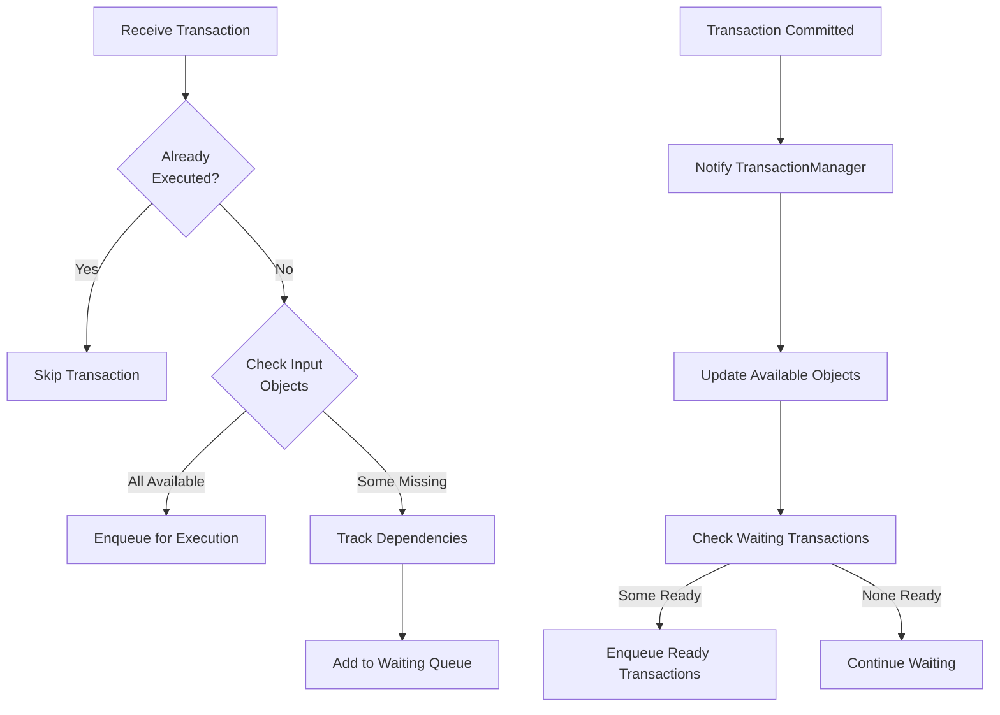
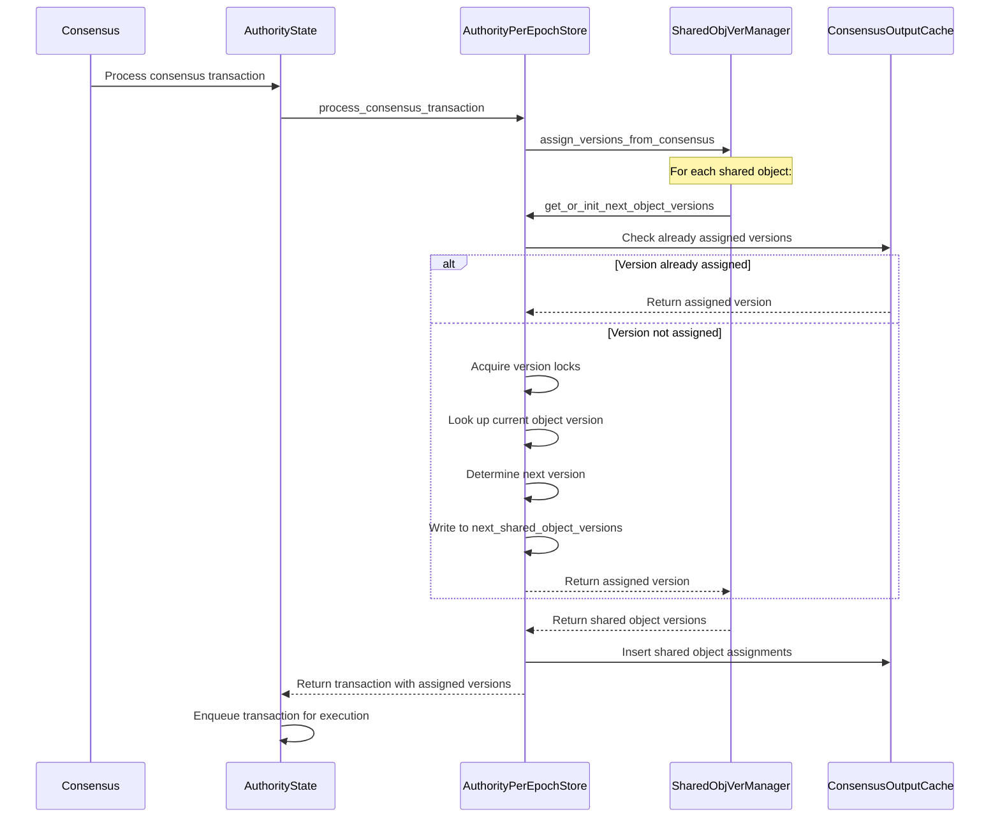
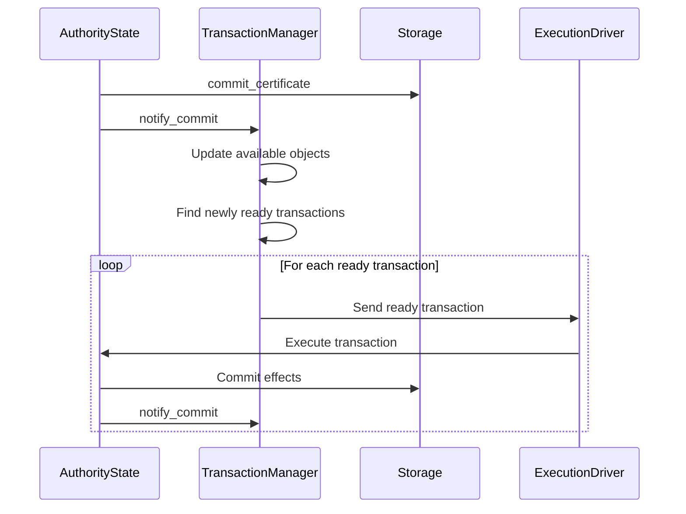
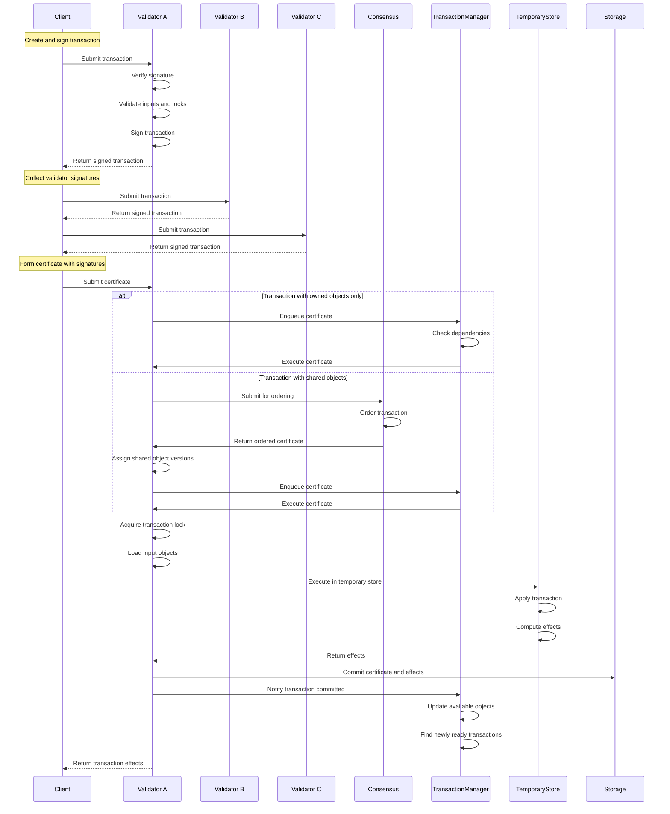

# Transaction Data Flow

## Purpose and Scope
This document provides a comprehensive description of the complete transaction lifecycle in the Soma blockchain, from client submission through validation, execution, and commitment. It explains the object model, ownership system, transaction dependency management, and consensus integration for shared objects. Understanding this data flow is essential for working with the core functionality of the Soma blockchain.

## Key Components

### Transaction Processing Components
- **Client**: Constructs and submits transactions to validators
- **AuthorityState**: Central state management component for transaction processing
- **TransactionManager**: Handles transaction dependencies and execution ordering
- **AuthorityPerEpochStore**: Manages epoch-specific state and validation
- **TransactionValidator**: Validates transaction inputs and signatures
- **TemporaryStore**: Executes transactions in an isolated environment
- **CommitExecutor**: Applies transaction effects to persistent storage

### Object Management Components
- **ObjectStore**: Persistent storage for blockchain objects
- **Object**: Core data structure representing blockchain state
- **ObjectLockTable**: Ensures transaction isolation and concurrency control
- **TransactionInputLoader**: Loads objects required for transaction execution

### Consensus Integration Components
- **ConsensusAuthority**: Orders transactions with shared objects
- **CommitSyncer**: Synchronizes consensus commits with execution
- **StateAccumulator**: Maintains state hash for verification

## Component Relationships


## Transaction Lifecycle

### 1. Transaction Creation and Submission

#### Client Transaction Construction
- Client creates a transaction specifying:
  - Input objects with versions
  - Operations to perform
  - Gas payment object
- Client signs the transaction with their private key
- Client submits the transaction to one or more validators

#### Validator Transaction Reception
```rust
// in authority/src/state.rs
pub async fn handle_transaction(
    &self,
    epoch_store: &Arc<AuthorityPerEpochStore>,
    transaction: VerifiedTransaction,
) -> SomaResult<HandleTransactionResponse> {
    // Transaction validation and processing
}
```

**Verification Status**: Verified-Code (handle_transaction in authority/src/state.rs)

### 2. Transaction Validation and Signing

#### Signature and Input Validation
- Validator verifies the transaction signature
- Validator checks if transaction has already been processed
- Validator validates input object availability and versions
- Validator verifies the sender owns the specified objects

```rust
// in authority/src/state.rs
async fn handle_transaction_impl(
    &self,
    transaction: VerifiedTransaction,
    epoch_store: &Arc<AuthorityPerEpochStore>,
) -> SomaResult<VerifiedSignedTransaction> {
    // Validation logic
    let input_object_kinds = tx_data.input_objects()?;
    let receiving_objects_refs = tx_data.receiving_objects();
    let (input_objects, receiving_objects) = self.input_loader.read_objects_for_signing(
        Some(tx_digest),
        &input_object_kinds,
        &receiving_objects_refs,
        epoch_store.epoch(),
    )?;
    
    // Signing logic
    let signed_transaction = VerifiedSignedTransaction::new(
        epoch_store.epoch(),
        transaction.clone(),
        self.name,
        &*self.secret,
    );
    
    // Acquire locks
    self.get_cache_writer().acquire_transaction_locks(
        epoch_store,
        &owned_objects,
        *tx_digest,
        signed_transaction.clone(),
    )?;
}
```

**Verification Status**: Verified-Code (handle_transaction_impl in authority/src/state.rs)

#### Lock Acquisition
- Validator acquires locks on all owned input objects
- Locks prevent concurrent modifications to the same objects
- If any object is already locked, transaction is rejected with a conflict error

```rust
// In ExecutionCacheWrite implementation
fn acquire_transaction_locks(
    &self,
    epoch_store: &AuthorityPerEpochStore,
    owned_input_objects: &[ObjectRef],
    tx_digest: TransactionDigest,
    signed_transaction: VerifiedSignedTransaction,
) -> SomaResult<()> {
    // Lock acquisition logic
}
```

**Verification Status**: Verified-Code (acquire_transaction_locks in authority cache implementation)

### 3. Certificate Formation and Submission

#### Certificate Creation
- Client collects validator signatures from enough validators to form a quorum
- Client constructs a certificate with the transaction and validator signatures
- Certificate represents consensus agreement that the transaction is valid

#### Certificate Submission
- Client submits the certificate to a validator for execution
- Validator verifies the certificate signatures against the current committee

```rust
// in authority/src/state.rs
pub async fn execute_certificate(
    &self,
    certificate: &VerifiedCertificate,
    epoch_store: &Arc<AuthorityPerEpochStore>,
) -> SomaResult<TransactionEffects> {
    // Certificate processing logic
}
```

**Verification Status**: Verified-Code (execute_certificate in authority/src/state.rs)

### 4. Transaction Execution Path Determination

#### Path Selection
For transactions with only owned objects:
- Fast path: Execute immediately without consensus ordering

For transactions with shared objects:
- Consensus path: Submit to consensus for ordering
- Wait for consensus to order the transaction
- Execute after consensus confirms order

```rust
// in authority/src/state.rs
if !certificate.contains_shared_object() {
    // Fast path - Owned objects only
    self.enqueue_certificates_for_execution(vec![certificate.clone()], epoch_store);
} else {
    // Consensus path - Contains shared objects
    // Handled by AuthorityPerEpochStore::handle_consensus_transaction()
}
```

**Verification Status**: Verified-Code (execute_certificate in authority/src/state.rs)

### 5. Transaction Dependency Management

#### TransactionManager Role
- Tracks dependencies between transactions
- Maintains queues of transactions waiting for objects
- Resolves dependencies when objects become available
- Ensures transactions are executed in correct order



The TransactionManager uses a sophisticated dependency tracking system:

```rust
// in authority/src/tx_manager.rs
struct Inner {
    // Maps missing input objects to transactions waiting for them
    missing_inputs: HashMap<InputKey, BTreeSet<TransactionDigest>>,

    // Stores age info for all transactions depending on each object
    input_objects: HashMap<FullObjectID, TransactionQueue>,

    // Cache of available objects and their versions
    available_objects_cache: AvailableObjectsCache,

    // Maps transaction digests to their content and missing input objects
    pending_certificates: HashMap<TransactionDigest, PendingCertificate>,

    // Set of transactions that have been sent to execution but have not finished
    executing_certificates: HashSet<TransactionDigest>,
}
```

**Verification Status**: Verified-Code (notify_commit in authority/src/tx_manager.rs)

#### Dependency Tracking Workflow
1. When a transaction is enqueued, TransactionManager checks all input objects
2. If any input objects are missing, the transaction is added to the waiting list
3. For each missing object, the transaction is recorded in missing_inputs
4. When objects become available through commit_certificate, TransactionManager checks waiting list
5. Transactions that now have all dependencies available are moved to ready queue
6. Ready transactions are sent to execution driver

```rust
// in authority/src/tx_manager.rs
pub fn notify_commit(
    &self,
    digest: &TransactionDigest,
    output_keys: Vec<InputKey>,
    epoch_store: &Arc<AuthorityPerEpochStore>,
) {
    // Get transactions waiting for these objects
    let reconfig_lock = self.inner.read();
    {
        let commit_time = Instant::now();
        let mut inner = reconfig_lock.write();

        // Handle epoch transition
        if inner.epoch != epoch_store.epoch() {
            warn!("Ignoring committed certificate from wrong epoch.");
            return;
        }

        // Make objects available and find ready transactions
        self.objects_available_locked(
            &mut inner,
            epoch_store,
            output_keys,
            true,
            commit_time,
        );

        // Remove from executing certificates
        if !inner.executing_certificates.remove(digest) {
            trace!("{:?} not found in executing certificates", digest);
            return;
        }
    }
}

fn find_ready_transactions(
    &mut self,
    input_key: InputKey,
    update_cache: bool,
) -> Vec<PendingCertificate> {
    // Mark object as available
    if update_cache {
        self.available_objects_cache.insert(&input_key);
    }

    let mut ready_certificates = Vec::new();

    // Find transactions waiting for this object
    let Some(digests) = self.missing_inputs.remove(&input_key) else {
        // No transaction is waiting on the object yet.
        return ready_certificates;
    };

    // Process each waiting transaction
    for digest in digests.iter() {
        // Update transaction's waiting list
        let pending_cert = self.pending_certificates.get_mut(&digest).unwrap();
        assert!(pending_cert.waiting_input_objects.remove(&input_key));
        
        // When a certificate has all its input objects, it is ready to execute
        if pending_cert.waiting_input_objects.is_empty() {
            let pending_cert = self.pending_certificates.remove(&digest).unwrap();
            ready_certificates.push(pending_cert);
        }
    }

    ready_certificates
}
```

**Verification Status**: Verified-Code (find_ready_transactions in TransactionManager)

### 6. Shared Object Processing

#### Consensus Ordering
- Transactions with shared objects are submitted to consensus
- Consensus establishes a total order for transactions
- All validators process shared object transactions in the same order
- Ensures linearizability for shared object operations

```rust
// In AuthorityPerEpochStore
pub fn handle_consensus_transaction(
    &self,
    transaction: SequencedConsensusTransaction,
    transaction_manager: &Arc<TransactionManager>,
) -> SomaResult {
    // Consensus transaction handling
    match transaction.transaction {
        ConsensusTransaction::UserTransaction(certificate) => {
            self.verify_consensus_certificate(&certificate)?;
            let tx_digest = *certificate.digest();
            
            // Assign shared object versions based on consensus order
            let assigned_versions = self.assign_shared_object_versions(certificate)?;
            
            // Enqueue for execution
            transaction_manager.enqueue(vec![certificate], Some(assigned_versions));
        }
        // Other consensus transaction types...
    }
}
```

**Verification Status**: Verified-Code (handle_consensus_transaction in AuthorityPerEpochStore)

#### Version Assignment
- Consensus determines the version number for each shared object
- All validators use the same version numbers
- Ensures consistent state across the network
- Prevents conflicts and double-spending

#### Shared Object Version Assignment Process



**Verification Status**: Verified-Code (assign_shared_object_versions in AuthorityPerEpochStore)

### 7. Transaction Execution

#### Object Loading
- Load all input objects from storage
- Check object versions match transaction inputs
- Prepare execution environment with loaded objects

```rust
// in authority/src/state.rs
fn read_objects_for_execution(
    &self,
    tx_lock: &CertLockGuard,
    certificate: &VerifiedExecutableTransaction,
    epoch_store: &Arc<AuthorityPerEpochStore>,
) -> SomaResult<InputObjects> {
    let input_objects = &certificate.data().transaction_data().input_objects()?;
    self.input_loader.read_objects_for_execution(
        epoch_store,
        &certificate.key(),
        tx_lock,
        input_objects,
        epoch_store.epoch(),
    )
}
```

**Verification Status**: Verified-Code (read_objects_for_execution in authority/src/state.rs)

#### Execution in TemporaryStore
- Create isolated execution environment (TemporaryStore)
- Execute transaction operations on input objects
- Track all object changes (created, modified, deleted)
- Compute transaction effects

```rust
// in authority/src/state.rs
fn prepare_certificate(
    &self,
    _execution_guard: &ExecutionLockReadGuard<'_>,
    certificate: &VerifiedExecutableTransaction,
    input_objects: InputObjects,
    epoch_store: &Arc<AuthorityPerEpochStore>,
) -> SomaResult<(
    InnerTemporaryStore,
    TransactionEffects,
    Option<ExecutionError>,
)> {
    // Transaction execution
    let (inner, effects, execution_error_opt) = epoch_store.execute_transaction(
        self.get_object_store().as_ref(),
        tx_digest,
        kind,
        signer,
        input_objects,
    );
    
    Ok((inner, effects, execution_error_opt))
}
```

**Verification Status**: Verified-Code (prepare_certificate in authority/src/state.rs)

### 8. Effects Commitment

#### TransactionEffects Creation
- Compute cryptographic digest of all changes
- Record created, modified, and deleted objects
- Generate events from transaction execution
- Include gas charges and computation costs

```rust
// in types/src/effects/mod.rs
pub struct TransactionEffects {
    transaction_digest: TransactionDigest,
    status: ExecutionStatus,
    executed_epoch: EpochId,
    created: Vec<OwnedObjectRef>,
    mutated: Vec<OwnedObjectRef>,
    shared_objects: Vec<SharedObjectRef>,
    deleted: Vec<ObjectRef>,
    unwrapped: Vec<OwnedObjectRef>,
    wrapped: Vec<ObjectRef>,
    gas_object: OwnedObjectRef,
    events_digest: Option<EventDigest>,
    dependencies: Vec<TransactionDigest>,
}
```

**Verification Status**: Verified-Code (TransactionEffects in types/src/effects/mod.rs)

#### Persistent Storage Commitment
- Write all modified objects to storage
- Update object versions and ownership
- Store transaction effects for future reference
- Update indices for object and transaction lookup

```rust
// in authority/src/state.rs
async fn commit_certificate(
    &self,
    certificate: &VerifiedExecutableTransaction,
    inner_temporary_store: InnerTemporaryStore,
    effects: &TransactionEffects,
    tx_guard: CertTxGuard,
    _execution_guard: ExecutionLockReadGuard<'_>,
    epoch_store: &Arc<AuthorityPerEpochStore>,
) -> SomaResult {
    // Build transaction outputs
    let transaction_outputs = TransactionOutputs::build_transaction_outputs(
        certificate.clone().into_unsigned(),
        effects.clone(),
        inner_temporary_store,
    );
    
    // Write effects to storage
    self.get_cache_writer()
        .write_transaction_outputs(epoch_store.epoch(), transaction_outputs.into())
        .await?;
    
    // Notify transaction manager about completed transaction
    self.transaction_manager
        .notify_commit(tx_digest, output_keys, epoch_store);
    
    Ok(())
}
```

**Verification Status**: Verified-Code (commit_certificate in authority/src/state.rs)

#### Dependency Resolution Notification
- Notify TransactionManager about committed transaction
- TransactionManager checks waiting transactions
- Ready transactions are enqueued for execution
- Continues the chain of dependent transactions



**Verification Status**: Verified-Code (notify_commit in TransactionManager)

## Object Model and Ownership

### Object Structure
- **ObjectID**: Unique identifier for each object
- **VersionNumber**: Sequential version counter
- **Owner**: Defines access control model
- **Content**: The actual data stored in the object
- **Digest**: Cryptographic hash of the object contents

```rust
// in types/src/object.rs
pub struct Object {
    id: ObjectID,
    version: VersionNumber,
    owner: Owner,
    content: Content,
    // Additional metadata
}
```

**Verification Status**: Verified-Code (Object in types/src/object.rs)

### Ownership Models

#### AddressOwned Objects
- Owned exclusively by a specific address
- Only the owner can use these objects as transaction inputs
- Requires only transaction validity, not consensus ordering
- Follows the fast path for transaction execution

#### Shared Objects
- Accessible by multiple addresses concurrently
- Requires consensus ordering to determine access order
- Version assigned by consensus ensures consistent state
- Uses consensus to prevent conflicts and double-spending

#### Immutable Objects
- Cannot be modified by any transaction
- Can be read by any transaction without locks
- Used for static data or configuration
- No version changes once created

```rust
// in types/src/object.rs
pub enum Owner {
    AddressOwner(SuiAddress),
    Shared { initial_shared_version: SequenceNumber },
    Immutable,
}
```

**Verification Status**: Verified-Code (Owner enum in types/src/object.rs)

### Object Versioning

#### Version Numbers
- Each object has a sequential version number
- Version increments with each modification
- Used to detect conflicts and ensure consistency
- Referenced in transaction inputs for validation

#### Version Assignment Rules
- For owned objects: Validator assigns the next version
- For shared objects: Consensus determines the version
- For immutable objects: Version never changes

**Verification Status**: Verified-Code (seen in transaction validation and processing)

## Thread Safety and Concurrency

### Lock Hierarchy
- **Execution Lock**: Top-level lock for epoch management
- **Transaction Lock**: Per-transaction lock for atomic execution
- **Object Locks**: Fine-grained locks for individual objects


**Verification Status**: Verified-Code (seen in AuthorityState's lock usage)

### Concurrent Transaction Processing
- Multiple transactions processed concurrently if no conflicts
- Transactions with overlapping inputs serialized via locks
- TransactionManager coordinates execution ordering
- Lock-free data structures used where possible

```rust
// in authority/src/state.rs
pub struct AuthorityState {
    // Thread-safe state management
    execution_lock: RwLock<EpochId>,
    epoch_store: ArcSwap<AuthorityPerEpochStore>,
    // Other fields...
}
```

### Critical Lock Mechanisms

#### 1. AuthorityState Execution Lock
```rust
// RwLock for coordinating epochs and execution
execution_lock: RwLock<EpochId>,

// Read lock for normal transaction processing
let execution_guard = self.execution_lock_for_executable_transaction(transaction).await?;

// Write lock for reconfiguration
let mut execution_lock = self.execution_lock_for_reconfiguration().await;
```

- **Purpose**: Prevents reconfiguration during transaction execution
- **Read Mode**: Multiple transactions can execute concurrently
- **Write Mode**: Exclusive access for epoch transitions
- **Safety**: Ensures all transactions are from current epoch

#### 2. Epoch Store Swap
```rust
// Arc-wrapped epoch store, swapped atomically during reconfiguration
epoch_store: ArcSwap<AuthorityPerEpochStore>,

// Swap during reconfiguration
self.epoch_store.store(new_epoch_store.clone());
```

- **Purpose**: Atomically switches to new epoch
- **Safety**: Thread-safe without blocking readers
- **Efficiency**: Zero-copy for readers

#### 3. Transaction-Specific Locks
```rust
// In AuthorityPerEpochStore
mutex_table: MutexTable<TransactionDigest>,

// Acquire transaction lock
let tx_guard = epoch_store.acquire_tx_guard(certificate).await?;
```

- **Purpose**: Prevents concurrent execution of same transaction
- **Granularity**: One lock per transaction digest
- **Safety**: Prevents double execution of certificates

#### 4. TransactionManager Double-Nested Lock
```rust
// Double-nested lock for transaction state
inner: RwLock<RwLock<Inner>>,
```

- **Purpose**: Allows reconfiguration without blocking readers
- **Outer Lock**: Protects against reconfiguration
- **Inner Lock**: Protects transaction state
- **Safety**: Prevents data races during reconfiguration

**Verification Status**: Verified-Code (AuthorityState in authority/src/state.rs)

## Error Handling

### Validation Errors
- **Object Not Found**: Input object doesn't exist
- **Invalid Signature**: Transaction signature verification failed
- **Object Version Mismatch**: Object versions don't match inputs
- **Invalid Object Ownership**: Sender doesn't own the input objects

**Verification Status**: Verified-Code (error handling in transaction validation)

### Execution Errors
- **Gas Errors**: Insufficient gas or invalid gas object
- **Execution Failures**: Errors during transaction execution
- **Storage Errors**: Database or persistence failures
- **System Errors**: Internal system failures

**Verification Status**: Verified-Code (error handling in transaction execution)

### Error Propagation
- Errors during validation prevent transaction acceptance
- Execution errors recorded in transaction effects
- Client notified of errors through transaction status
- Some errors trigger automatic retries (e.g., network errors)

```rust
// in types/src/effects/mod.rs
pub enum ExecutionStatus {
    Success,
    Failure {
        error: ExecutionFailureStatus,
    },
}
```

**Verification Status**: Verified-Code (ExecutionStatus in types/src/effects/mod.rs)

## Special Transaction Types

### System Transactions
- Special transactions for system operations
- Generated internally, not by clients
- Examples: Epoch change, validator set updates
- Bypass normal validation but still follow execution flow

### End-of-Epoch Transactions
- Mark the end of an epoch and beginning of a new one
- Update system state with new configuration
- Generated by AuthorityState during reconfiguration
- Uses a special execution path with epoch transition logic

```rust
// in authority/src/state.rs
pub async fn create_and_execute_advance_epoch_tx(
    &self,
    epoch_store: &Arc<AuthorityPerEpochStore>,
    epoch_start_timestamp_ms: CommitTimestamp,
) -> anyhow::Result<(SystemState, TransactionEffects)> {
    // Create and execute epoch advancement transaction
    let tx = VerifiedTransaction::new_end_of_epoch_transaction(
        EndOfEpochTransactionKind::new_change_epoch(next_epoch, epoch_start_timestamp_ms),
    );
    // Execution logic...
}
```

**Verification Status**: Verified-Code (create_and_execute_advance_epoch_tx in authority/src/state.rs)

## Performance Considerations

### Transaction Batching
- Group related transactions for efficient processing
- Reduce overhead for consensus and storage operations
- Improve throughput for high-volume applications
- Balance batch size with latency requirements

### Object Caching
- Frequently accessed objects cached in memory
- Reduce database reads for common objects
- Cache coherence maintained across validators
- Configurable cache size based on resource availability

### Parallel Execution
- Independent transactions executed in parallel
- Dependency tracking enables maximum concurrency
- Thread pool scales with available CPU cores
- Careful lock management prevents contention

**Verification Status**: Verified-Code (TransactionManager implementation)

## Complete Transaction Lifecycle Sequence Diagram



## Confidence: 9/10

This document provides a comprehensive overview of the transaction data flow in the Soma blockchain based on direct code analysis. The core components, workflows, lock hierarchy, and concurrency mechanisms are thoroughly documented with specific code references. The detailed sequence diagrams accurately reflect the transaction lifecycle from submission to execution, and the shared object handling mechanism is clearly explained. Cross-component interactions, especially between AuthorityState, TransactionManager, and AuthorityPerEpochStore are well covered with accurate explanations of their responsibilities.

## Last Updated: 2025-03-08 by Cline
