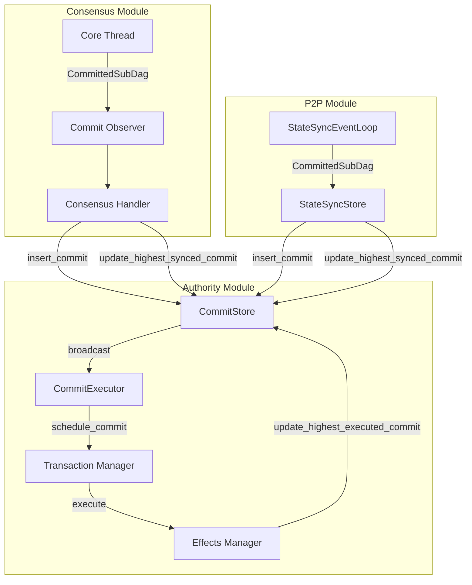
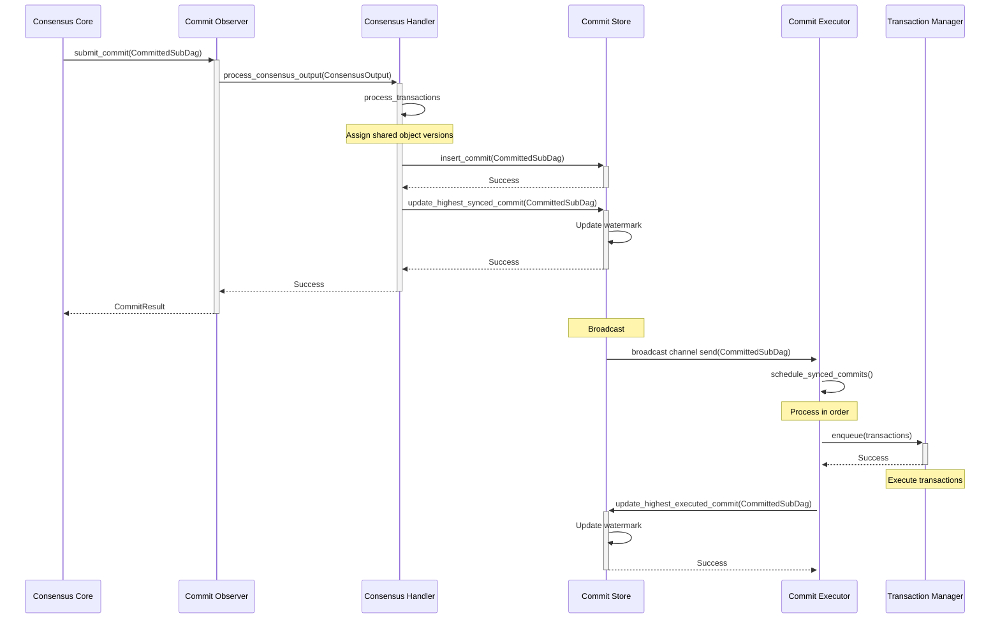
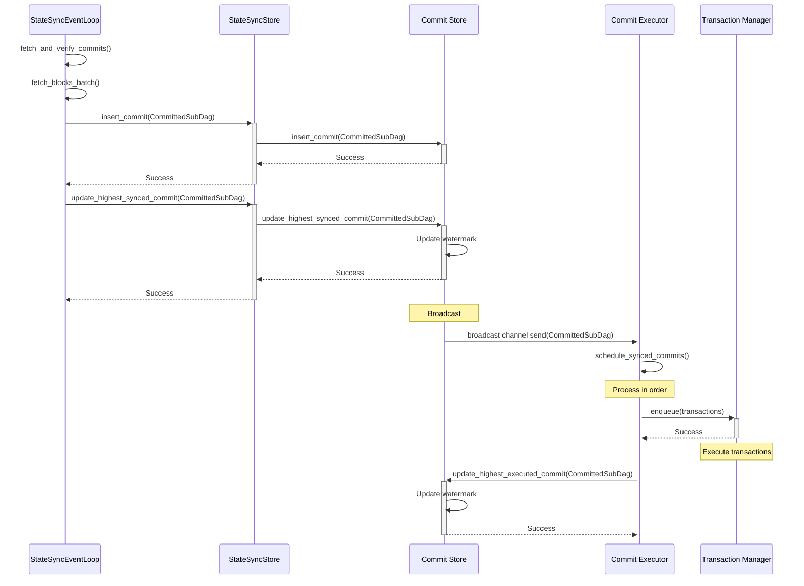
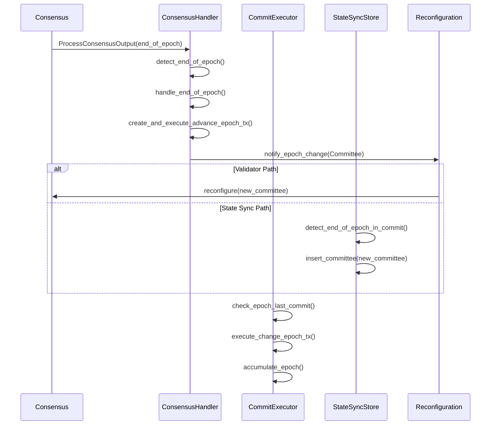

# Checkpoint Processing

## Purpose and Scope
This document provides a comprehensive overview of the checkpoint processing flow across the Soma blockchain. It explains how consensus-ordered transactions flow from their origin in the consensus module or state sync component through to their execution and storage across both validator and non-validator nodes. This is a cross-cutting concern spanning multiple modules, making it an important knowledge document for understanding the system's data flow.

## Core Concepts

### Checkpoint Definition
In the Soma blockchain:
- A **checkpoint** refers to a consensus-ordered batch of transactions, represented as a `CommittedSubDag`
- Each checkpoint has a unique sequential index and a cryptographic digest
- Checkpoints contain transaction certificates and metadata about the consensus decision
- Checkpoints establish a common ordering of transactions across all validators
- Checkpoints provide the foundation for consistent state determinism

### CommittedSubDag Structure
The core data structure for checkpoints:

```rust
pub struct CommittedSubDag {
    pub blocks: Vec<VerifiedBlock>,
    pub certificates: HashMap<TransactionDigest, VerifiedCertificate>,
    pub commit_ref: CommitRef,
    pub epoch: EpochId,
}

pub struct CommitRef {
    pub index: CommitIndex,  // Sequential index of the commit
    pub digest: CommitDigest, // Cryptographic digest of the commit
}
```

### Watermark System
The checkpoint processing system uses watermarks to track progress:

```rust
pub enum CommitWatermark {
    HighestSynced,    // Highest checkpoint received and stored
    HighestExecuted,  // Highest checkpoint fully executed
}
```

These watermarks enable tracking of checkpoint processing progress across components.

## Cross-Module Data Flow



### Checkpoint Origin
Checkpoints originate from two sources:
1. **Validator Path**: Consensus module produces commits through BFT agreement
2. **State Sync Path**: P2P module synchronizes commits from other nodes

### Data Transfer Interfaces
Checkpoints flow through three primary interfaces:
1. **CommitObserver → ConsensusHandler**: For validator-produced checkpoints
2. **StateSyncEventLoop → StateSyncStore**: For synchronized checkpoints
3. **CommitStore → CommitExecutor**: Common execution path for both sources

### Key Cross-Module Integration Points

| Integration Point | Source Module | Target Module | Data Type | Purpose |
|-------------------|--------------|--------------|-----------|---------|
| CommitObserver → ConsensusHandler | Consensus | Authority | CommittedSubDag | Transfer validator-produced commits |
| StateSyncEventLoop → StateSyncStore | P2P | Authority | CommittedSubDag | Transfer synchronized commits |
| CommitStore → CommitExecutor | Authority | Authority | broadcast::channel | Trigger commit execution |
| CommitExecutor → TransactionManager | Authority | Authority | VerifiedExecutableTransaction | Schedule transaction execution |

## End-to-End Checkpoint Processing Flows

### Validator Flow (Consensus → Execution)



**Flow Steps**:
1. **Consensus Core** produces a CommittedSubDag via BFT agreement
2. **Commit Observer** forwards the commit to ConsensusHandler
3. **Consensus Handler** processes transactions, assigns shared object versions
4. **Consensus Handler** inserts the commit into CommitStore
5. **Consensus Handler** updates the highest_synced_commit watermark
6. **CommitStore** broadcasts the commit to CommitExecutor via channel
7. **CommitExecutor** schedules commits in sequential order
8. **CommitExecutor** extracts and enqueues transactions to TransactionManager
9. **CommitExecutor** updates highest_executed_commit watermark after execution

### Non-Validator Flow (State Sync → Execution)



**Flow Steps**:
1. **StateSyncEventLoop** fetches and verifies commits from peers
2. **StateSyncEventLoop** fetches and verifies blocks referenced by commits
3. **StateSyncEventLoop** processes commits via StateSyncStore
4. **StateSyncStore** inserts the commit into CommitStore
5. **StateSyncStore** updates the highest_synced_commit watermark
6. **CommitStore** broadcasts the commit to CommitExecutor via channel
7. **CommitExecutor** schedules commits in sequential order
8. **CommitExecutor** extracts and enqueues transactions to TransactionManager
9. **CommitExecutor** updates highest_executed_commit watermark after execution

### Common Execution Path

Both validator and non-validator paths converge at the CommitStore to CommitExecutor interface:

```rust
// in authority/src/commit/executor.rs:223-257
fn schedule_synced_commits(
    &self,
    pending: &mut CommitExecutionBuffer,
    next_to_schedule: &mut CommitIndex,
    epoch_store: Arc<AuthorityPerEpochStore>,
) {
    let Some(latest_synced_commit) = self
        .commit_store
        .get_highest_synced_commit()
        .expect("Failed to read highest synced commit")
    else {
        debug!("No commits to schedule, highest synced commit is None",);
        return;
    };

    while *next_to_schedule <= latest_synced_commit.commit_ref.index
    {
        let commit = self
            .commit_store
            .get_commit_by_index(*next_to_schedule)
            .unwrap()
            .unwrap_or_else(|| {
                panic!(
                    "Commit index {:?} does not exist in commit store",
                    *next_to_schedule
                )
            });
        // Check if this commit belongs to current epoch
        if commit.epoch() > epoch_store.epoch() {
            return;
        }

        self.schedule_commit(commit, pending, epoch_store.clone());
        *next_to_schedule += 1;
    }
}
```

The common execution path ensures:
1. Checkpoints are processed in strict index order
2. Transactions within checkpoints are causal-sorted based on dependencies
3. Execution is deterministic across all nodes regardless of checkpoint source
4. Epoch transitions are handled correctly
5. State accumulation occurs for cryptographic verification

## Watermark System In Detail

The watermark system is the foundation of checkpoint processing coordination:

### Watermark Types and Purposes

1. **HighestSynced**: Tracks the highest checkpoint that has been synchronized to storage
   - Updated by: ConsensusHandler (validator path) or StateSyncStore (sync path)
   - Consumed by: CommitExecutor, to determine which commits to schedule

2. **HighestExecuted**: Tracks the highest checkpoint that has been fully executed
   - Updated by: CommitExecutor after full execution
   - Consumed by: Various components to determine execution progress

### Watermark Update Flow

```rust
// in authority/src/commit/mod.rs:121-132
pub fn update_highest_synced_commit(
    &self,
    commit: &CommittedSubDag,
) -> Result<(), TypedStoreError> {
    self.watermarks.write().insert(
        CommitWatermark::HighestSynced,
        (commit.commit_ref.index, commit.commit_ref.digest),
    );
    Ok(())
}
```

```rust
// in authority/src/commit/mod.rs:134-149
pub fn update_highest_executed_commit(
    &self,
    commit: &CommittedSubDag,
) -> Result<(), TypedStoreError> {
    if let Some(index) = self.get_highest_executed_commit_index()? {
        if index >= commit.commit_ref.index {
            return Ok(());
        }
        assert_eq!(index + 1, commit.commit_ref.index,
        "Cannot update highest executed commit to {} when current highest executed commit is {}",
        commit.commit_ref.index,
        index);
    }
    
    self.watermarks.write().insert(
        CommitWatermark::HighestExecuted,
        (commit.commit_ref.index, commit.commit_ref.digest),
    );

    Ok(())
}
```

### Watermark-Driven Execution

The watermarks create a reactive execution model:
1. Component updates HighestSynced watermark
2. CommitExecutor observes the watermark change
3. CommitExecutor schedules commits up to the watermark
4. After execution, CommitExecutor updates HighestExecuted watermark
5. Other components can observe execution progress via HighestExecuted

## Epoch Transition Handling

Epoch transitions require special handling across modules:



Key epoch transition handling aspects:
1. End-of-epoch detection in commits via special markers
2. Validator path triggers reconfiguration via ConsensusHandler
3. State sync path handles committee updates via StateSyncStore
4. CommitExecutor executes special epoch change transactions
5. Both paths converge to the same state transition
6. Commit execution is truncated at epoch boundaries

## Checkpoint Verification

Checkpoint processing includes extensive verification mechanisms:

### Validator Path Verification

1. **Block Verification**: Block signatures and content validated by consensus
2. **Certificate Verification**: Transaction certificates verified in consensus 
3. **Commit Verification**: Commit structure and votes verified by consensus
4. **Chain Verification**: Commits form a strict sequence with no gaps

### State Sync Path Verification

1. **Commit Sequence Verification**: Commits form a continuous sequence
2. **Commit Certification Verification**: Validator votes reach quorum
3. **Block Verification**: Block signatures and content validated by TxVerifier
4. **Chain Verification**: Commits descend from known checkpoint history

### Common Verification

1. **Transaction Verification**: All transactions properly signed
2. **Shared Object Verification**: Correct sequential shared object versions
3. **Causal Ordering Verification**: Dependencies correctly resolved
4. **Effects Verification**: Transaction effects properly calculated

## Performance Considerations

Checkpoint processing is optimized for performance:

### Throughput Optimizations

1. **Batched Processing**: Multiple transactions processed in batches
2. **Parallel Execution**: Independent transactions executed concurrently
3. **Efficient State Reading**: Caching for repeated state access
4. **Write Coalescing**: Grouped storage writes for efficiency

### Latency Optimizations

1. **Pipelined Execution**: CommitExecutor begins execution as soon as commit arrives
2. **Proactive Scheduling**: Next commits scheduled while earlier ones execute
3. **Non-Blocking Broadcast**: Channel-based notification for low latency
4. **Optimistic Processing**: StateSyncEventLoop starts next fetch before current completes

### Resource Efficiency

1. **Incremental Sync**: Only missing data fetched from peers
2. **Response Size Limits**: Prevent memory pressure from large responses
3. **Task Management**: Controlled concurrency via task management
4. **Bounded Channels**: Prevent unbounded memory growth from channel backpressure

## Error Handling and Recovery

Checkpoint processing implements robust error handling:

### Validator Path Error Handling

1. **Consensus Errors**: Handled via commit quarantine and retry mechanisms
2. **Execution Errors**: Non-fatal errors isolated to specific transactions
3. **Storage Errors**: Fatal errors trigger node restart/recovery
4. **Epoch Transition Errors**: Special handling for clean shutdown and restart

### State Sync Path Error Handling

1. **Network Errors**: Retry with different peers
2. **Verification Failures**: Peer blacklisting and report mechanisms
3. **Resource Errors**: Backpressure and rate limiting
4. **Partial Progress**: Sync resume from last successful point

### Common Error Handling

1. **Concurrency Errors**: Proper locking and retry semantics
2. **Persistence Integrity**: Durability guarantees from storage layer
3. **Version Conflicts**: Resolution via deterministic causal ordering
4. **Recovery Mechanisms**: Watermark-based recovery of processing state

## Byzantine Fault Tolerance Considerations

Checkpoint processing maintains BFT properties:

1. **Validator Agreement**: All honest validators agree on checkpoint sequence
2. **State Determinism**: Same checkpoint sequence produces same state
3. **Execution Safety**: Byzantine transactions cannot corrupt state
4. **Data Availability**: All checkpoint data is persistent and recoverable
5. **Epoch Security**: Clean epoch boundaries maintain safety properties
6. **Non-validator Security**: State sync verifies data has validator consensus

## Cross-References
- See [Transaction Lifecycle](./transaction_lifecycle.md) for detailed transaction processing
- See [Authority Checkpoint Processing](../modules/authority/checkpoint_processing.md) for authority module implementation
- See [P2P Checkpoint Processing](../modules/p2p/checkpoint_processing.md) for P2P module implementation
- See [Commit Processing](../modules/authority/commit_processing.md) for commit execution details
- See [Consensus Workflow](../modules/consensus/consensus_workflow.md) for consensus commit production

## Confidence: 8/10
This document provides a comprehensive cross-module view of checkpoint processing in Soma, based on direct code analysis and module integration understanding. While most components and workflows are verified directly from code, some aspects of the integration between components are inferred from the overall system architecture.

## Last Updated: 2025-03-08 by Cline
