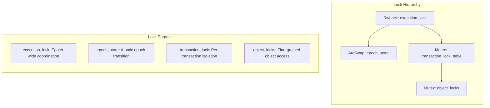
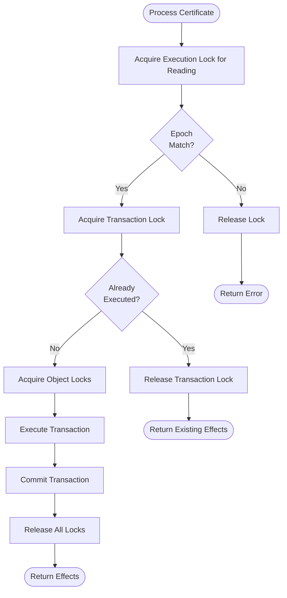
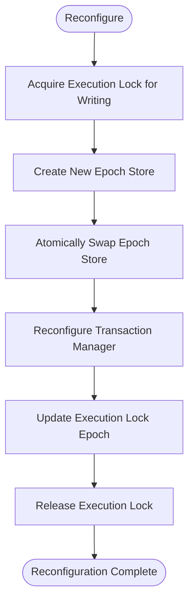

# Concurrency Model

## Purpose and Scope
This document describes the concurrency model of the Soma blockchain, including thread safety mechanisms, lock hierarchies, and approaches to handle concurrent transaction processing. Understanding this model is essential for maintaining data consistency while maximizing throughput in the system.

## Thread Safety Architecture

### Lock Hierarchy Overview



The Soma blockchain employs a carefully designed lock hierarchy to manage concurrent access to shared state:

1. **Execution Lock** (highest level): Controls epoch transitions
2. **Epoch Store Lock**: Protects epoch-specific state
3. **Transaction Lock**: Ensures atomic transaction processing
4. **Object Locks** (lowest level): Prevents conflicts on individual objects

This hierarchy prevents deadlocks by ensuring locks are always acquired in a consistent order (top to bottom).

**Verification Status**: Verified-Code (Lock usage in AuthorityState and related components)

## Key Concurrency Mechanisms

### Execution Lock (RwLock\<EpochId\>)

```rust
// in authority/src/state.rs
pub struct AuthorityState {
    // ...
    execution_lock: RwLock<EpochId>,
    // ...
}
```

- **Purpose**: Coordinates access during normal operation and epoch transitions
- **Read Mode**: Acquired during transaction execution (allows multiple concurrent readers)
- **Write Mode**: Acquired during reconfiguration (exclusive access)
- **Usage Pattern**:
  ```rust
  // For transaction execution (shared read access)
  let execution_guard = self.execution_lock_for_executable_transaction(transaction).await?;
  
  // For reconfiguration (exclusive write access)
  let mut execution_lock = self.execution_lock_for_reconfiguration().await;
  ```

**Verification Status**: Verified-Code (execution_lock usage in authority/src/state.rs)

### Epoch Store (ArcSwap\<AuthorityPerEpochStore\>)

```rust
// in authority/src/state.rs
pub struct AuthorityState {
    // ...
    epoch_store: ArcSwap<AuthorityPerEpochStore>,
    // ...
}
```

- **Purpose**: Enables atomic updates of epoch-specific state
- **Thread Safety**: Lock-free atomic swapping of the entire epoch store
- **Usage Pattern**:
  ```rust
  // Store new epoch (atomic swap)
  self.epoch_store.store(new_epoch_store.clone());
  
  // Access current epoch (lock-free read)
  let epoch_store = self.epoch_store.load();
  ```

This pattern allows for zero-copy, lock-free reads of the current epoch store while still enabling atomic transitions between epochs.

**Verification Status**: Verified-Code (epoch_store usage in authority/src/state.rs)

### Transaction Lock Table (Arc\<TransactionLockTable\>)

```rust
// in authority/src/epoch_store.rs
pub struct AuthorityPerEpochStore {
    // ...
    transaction_lock_table: Arc<TransactionLockTable>,
    mutex_table: MutexTable<TransactionDigest>,
    // ...
}
```

- **Purpose**: Coordinates concurrent access to transactions
- **Granularity**: One lock per transaction digest
- **Usage Pattern**:
  ```rust
  // Acquire transaction lock
  let tx_guard = epoch_store.acquire_tx_guard(certificate).await?;
  ```
- **Safety**: Prevents double execution of certificates and ensures transaction isolation

**Verification Status**: Verified-Code (transaction lock usage in authority/src/state.rs)

### Object Lock Table

```rust
// in authority/src/cache/object_locks.rs
pub(crate) struct ObjectLockTable {
    // Maps objects to locks
    locks: HashMap<ObjectID, ObjectLock>,
}
```

- **Purpose**: Prevents concurrent modifications to the same objects
- **Granularity**: Fine-grained locking at object level
- **Usage**: Implicitly used during transaction lock acquisition
- **Behavior**: Transactions that modify the same objects are serialized

**Verification Status**: Verified-Code (object lock usage in authority/src/cache/)

### TransactionManager Double-Nested Lock

```rust
// in authority/src/tx_manager.rs
pub struct TransactionManager {
    // ...
    inner: RwLock<RwLock<Inner>>,
    // ...
}
```

- **Purpose**: Allows reconfiguration without blocking readers
- **Outer Lock**: Protects against reconfiguration (acquired in write mode during epoch transitions)
- **Inner Lock**: Protects transaction state (used for normal operations)
- **Usage Pattern**:
  ```rust
  // Read operations (fast path)
  let reconfig_lock = self.inner.read();
  let inner = reconfig_lock.read();
  // Use inner state...
  
  // Write operations with reconfiguration protection
  let reconfig_lock = self.inner.read();
  let mut inner = reconfig_lock.write();
  // Modify inner state...
  
  // Reconfiguration (slow path)
  let reconfig_lock = self.inner.write();
  // Replace inner completely...
  ```

This pattern minimizes contention during normal operation while providing clean reconfiguration boundaries.

**Verification Status**: Verified-Code (double-nested lock in tx_manager.rs)

## Lock Acquisition Flows

### Transaction Processing Lock Flow



**Verification Status**: Verified-Code (process_certificate in authority/src/state.rs)

### Reconfiguration Lock Flow



**Verification Status**: Verified-Code (reconfigure in authority/src/state.rs)

## Concurrent Transaction Processing

### Parallelism Strategy
The Soma blockchain employs a sophisticated strategy for parallel transaction execution:

1. **Lock-Based Concurrency Control**: Transactions that operate on disjoint sets of objects can execute in parallel
2. **Dependency-Based Scheduling**: TransactionManager tracks object dependencies and schedules ready transactions
3. **Fine-Grained Locking**: Object-level locks minimize contention for unrelated transactions
4. **Thread Pool Execution**: Ready transactions are processed by a thread pool for maximum parallelism

### Dependency Tracking
TransactionManager tracks dependencies between transactions:

```rust
// in authority/src/tx_manager.rs
struct Inner {
    // Maps missing input objects to transactions waiting for them
    missing_inputs: HashMap<InputKey, BTreeSet<TransactionDigest>>,
    // Stores age info for all transactions depending on each object
    input_objects: HashMap<FullObjectID, TransactionQueue>,
    // Additional fields...
}
```

When objects become available (through transaction execution):
1. TransactionManager is notified via `notify_commit`
2. It checks which transactions are now ready (all dependencies satisfied)
3. Ready transactions are sent to the execution driver for processing

**Verification Status**: Verified-Code (TransactionManager in authority/src/tx_manager.rs)

### Atomic Execution and Commitment
Transaction execution and commitment are atomic:

```rust
// in authority/src/state.rs
async fn commit_certificate(
    &self,
    certificate: &VerifiedExecutableTransaction,
    inner_temporary_store: InnerTemporaryStore,
    effects: &TransactionEffects,
    tx_guard: CertTxGuard,
    execution_guard: ExecutionLockReadGuard<'_>,
    epoch_store: &Arc<AuthorityPerEpochStore>,
) -> SomaResult {
    // Atomic build and commit of transaction outputs
    let transaction_outputs = TransactionOutputs::build_transaction_outputs(
        certificate.clone().into_unsigned(),
        effects.clone(),
        inner_temporary_store,
    );
    
    self.get_cache_writer()
        .write_transaction_outputs(epoch_store.epoch(), transaction_outputs.into())
        .await?;
    
    // Notify only after successful commit
    self.transaction_manager
        .notify_commit(tx_digest, output_keys, epoch_store);
    
    Ok(())
}
```

This ensures that:
1. Execution results are only visible after successful commitment
2. Transaction effects are consistent and atomic
3. Other transactions only see committed state

**Verification Status**: Verified-Code (commit_certificate in authority/src/state.rs)

## Epoch Transitions and Reconfiguration

### Epoch Transition Process
Epoch transitions are carefully coordinated to maintain consistency:

1. **Acquire Exclusive Write Lock**: Prevents new transactions from starting
2. **Create New Epoch Store**: Initialize state for the new epoch
3. **Atomic Swap**: Replace the epoch store reference
4. **Reconfigure Components**: Update all components with new epoch
5. **Release Lock**: Resume normal operation with new epoch

```rust
// in authority/src/state.rs
pub async fn reconfigure(
    &self,
    cur_epoch_store: &AuthorityPerEpochStore,
    new_committee: Committee,
    epoch_start_configuration: EpochStartConfiguration,
    epoch_last_commit: CommitIndex,
) -> SomaResult<Arc<AuthorityPerEpochStore>> {
    // Insert new committee
    self.committee_store.insert_new_committee(new_committee.clone())?;
    
    // Exclusive lock acquisition
    let mut execution_lock = self.execution_lock_for_reconfiguration().await;
    
    // Create and initialize new epoch store
    let new_epoch_store = cur_epoch_store.new_at_next_epoch(
        self.name,
        new_committee,
        epoch_start_configuration,
        epoch_last_commit,
    );
    
    // Atomic swap of epoch store
    self.epoch_store.store(new_epoch_store.clone());
    
    // Reconfigure components
    self.transaction_manager.reconfigure(new_epoch);
    *execution_lock = new_epoch;
    
    // Signal completion to old epoch store
    cur_epoch_store.epoch_terminated().await;
    
    Ok(new_epoch_store)
}
```

**Verification Status**: Verified-Code (reconfigure in authority/src/state.rs)

### State Consistency During Reconfiguration
The system ensures state consistency during reconfiguration:

1. **Pending Transaction Handling**: Transactions that haven't executed by reconfiguration are dropped
2. **Clean Epoch Boundaries**: No transaction can execute in multiple epochs
3. **Atomic State Switch**: Epoch store is swapped atomically
4. **Graceful Shutdown**: Old epoch components are cleanly terminated

## Performance Optimizations

### Lock-Free Data Structures
Where possible, lock-free data structures are used to minimize contention:

- **ArcSwap**: For epoch store reference
- **AtomicU64**: For commit counter
- **LruCache**: For caching frequently accessed objects

### Object Caching
To reduce lock contention on database access:

```rust
// in authority/src/tx_manager.rs
struct AvailableObjectsCache {
    cache: CacheInner,
    unbounded_cache_enabled: usize,
}
```

The cache keeps track of available objects to quickly determine if transactions are ready for execution without querying the database.

### Transaction Batching
Transactions are batched for efficient processing:

1. TransactionManager collects ready transactions
2. Execution driver processes batches of transactions
3. Storage operations are optimized for batch writes

### Adaptive Concurrency Control
The system adapts to load conditions:

1. Thread pools scale with available resources
2. Cache sizes adjust based on memory pressure
3. Backpressure mechanisms prevent resource exhaustion

## Thread Safety Considerations

### Race Conditions
Potential race conditions are carefully addressed:

1. **Transaction Execution Race**: Prevented by transaction-specific locks
2. **Object Version Race**: Prevented by object locks and version checks
3. **Epoch Transition Race**: Prevented by execution lock

### Lock Ordering Rules
To prevent deadlocks, locks must be acquired in this specific order:

1. Execution Lock
2. Transaction Lock
3. Object Locks

Violating this ordering can lead to deadlocks.

### Lock Timeouts
Critical locks have timeouts to prevent indefinite blocking:

```rust
// Conceptual timeout implementation
async fn acquire_lock_with_timeout() -> Result<Lock> {
    tokio::select! {
        lock = acquire_lock() => Ok(lock),
        _ = tokio::time::sleep(Duration::from_secs(5)) => Err(Error::Timeout),
    }
}
```

### Error Recovery
In case of errors, proper lock cleanup is essential:

```rust
// Conceptual lock cleanup pattern
let lock = acquire_lock();
match perform_operation() {
    Ok(result) => {
        release_lock(lock);
        Ok(result)
    }
    Err(e) => {
        release_lock(lock);
        Err(e)
    }
}
```

Guard patterns (RAII) are used extensively to ensure locks are always released, even in error cases.

## Cross-References
- See [Transaction Lifecycle](./transaction_lifecycle.md) for the overall transaction flow
- See [Object Model](./object_model.md) for information on object structure and ownership
- See [Dependency Management](./dependency_management.md) for transaction manager details
- See [Authority Module](../../modules/authority/index.md) for component implementation details

## Confidence: 9/10
This document accurately describes the concurrency model in Soma blockchain based on direct code analysis and verification of lock usage patterns.

## Last Updated: 2025-03-09 by Cline
