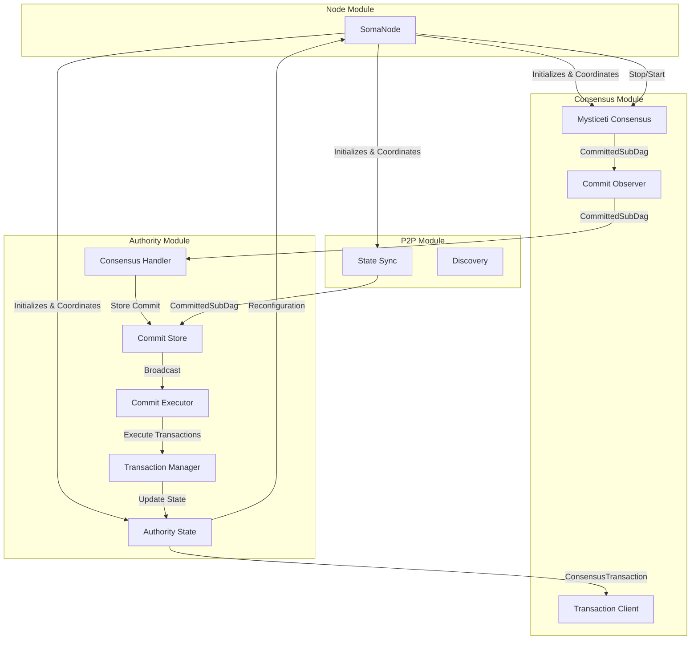
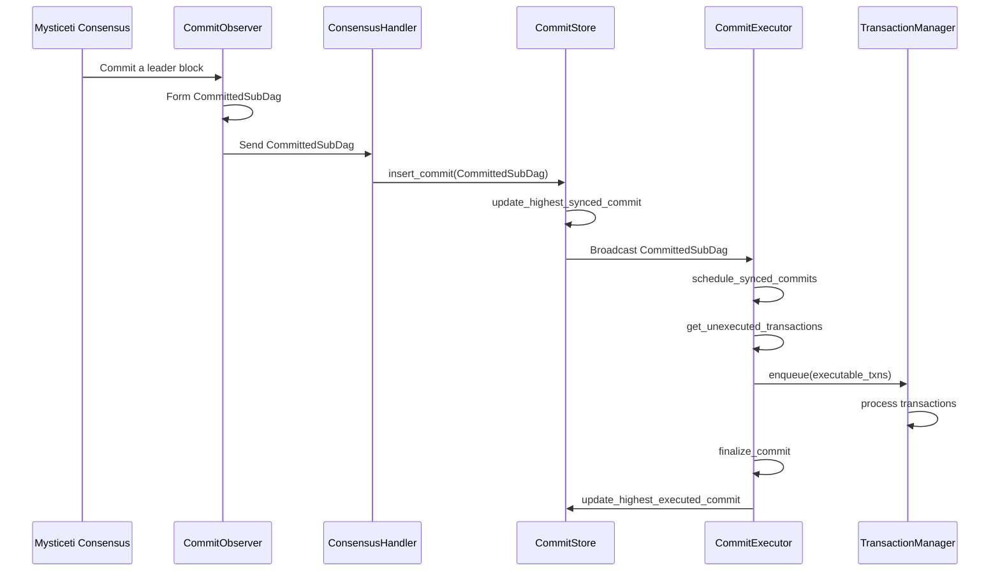
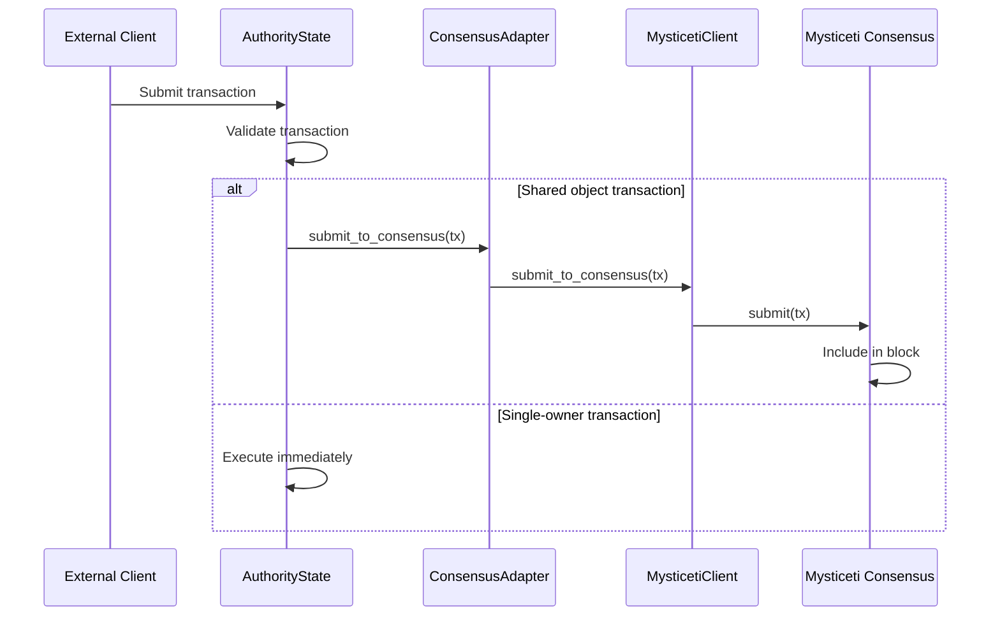
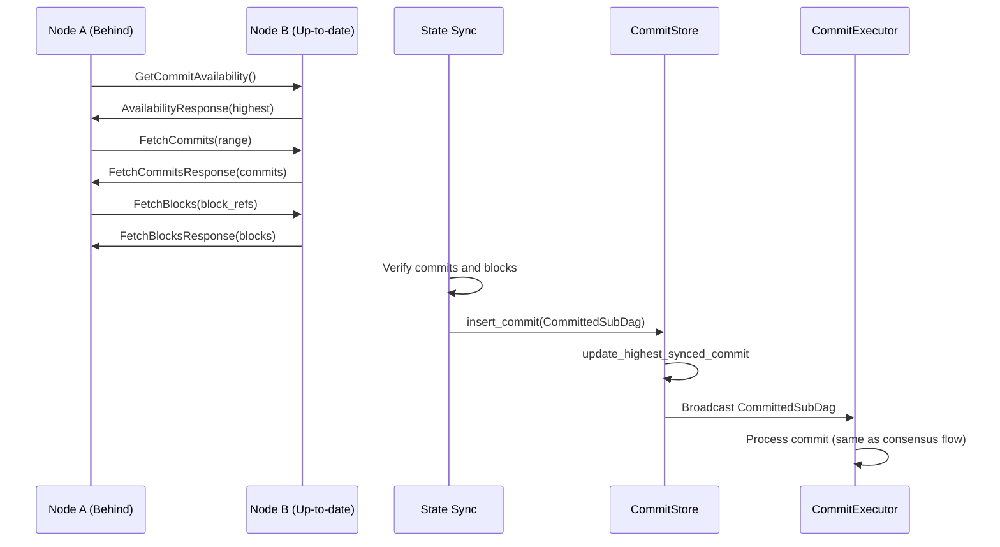
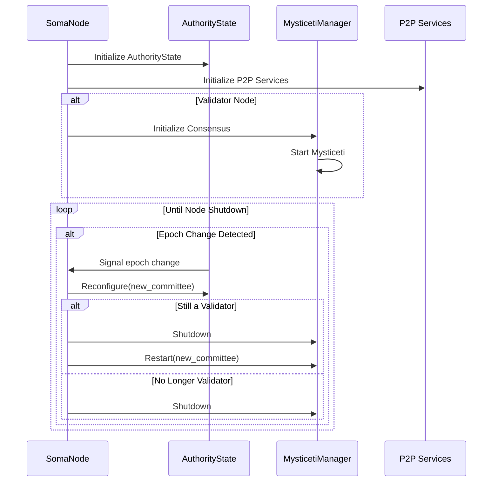
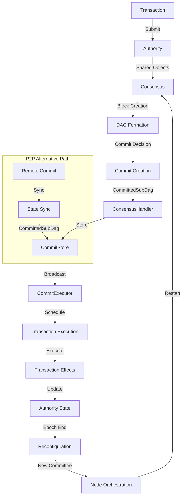

# Cross-Module Relationships in Soma

## Purpose and Scope
This document explains the critical cross-module relationships in the Soma blockchain, with a particular focus on how commit processing flows across module boundaries. It provides a comprehensive view of how the Authority, Consensus, P2P, and Node modules interconnect, detailing the interfaces between them and ensuring consistent understanding of cross-component workflows.

## Module Interfaces Overview



## Key Cross-Module Flows

### 1. Commit Flow: Consensus → Authority

The commit flow from Consensus to Authority represents a critical path in the system:



**Key Components**:

1. **CommitObserver**: 
   - Located in the consensus module (`consensus/src/commit_observer.rs`)
   - Observes when leader blocks are committed in the Mysticeti DAG
   - Forms `CommittedSubDag` objects containing the leader and its causal history
   - Sends these objects through a channel to the authority module
   - Ensures proper ordering of commits by index
   - Handles recovery by resending missing commits when needed
   - Manages special handling for last commit of epoch with sufficient votes

2. **ConsensusHandler**:
   - Located in the authority module (`authority/src/handler.rs`)
   - Receives `CommittedSubDag` objects from the CommitObserver
   - Processes commits into executable transactions
   - Validates and stores commits in the CommitStore
   - Detects epoch transitions from commit timestamps
   - Signals epoch closure when appropriate

3. **CommitStore**:
   - Located in the authority module (`authority/src/commit/mod.rs`)
   - Central repository for tracking commit state
   - Maps between commit digests and indices
   - Maintains watermarks for execution progress
   - Broadcasts commits to the CommitExecutor
   - Detects potential consensus forks
   - Common interface used by both consensus and P2P

4. **CommitExecutor**:
   - Located in the authority module (`authority/src/commit/executor.rs`)
   - Schedules commits for execution in sequential order
   - Filters already executed transactions
   - Assigns shared object versions for transactions
   - Manages transaction execution through TransactionManager
   - Tracks execution progress and updates watermarks
   - Handles epoch transitions and state accumulation

### 2. Transaction Flow: Authority → Consensus

For shared objects that require consensus, transactions flow from Authority to Consensus:



**Key Components**:

1. **ConsensusAdapter**:
   - Located in the authority module (`authority/src/adapter.rs`)
   - Bridges AuthorityState and consensus components
   - Handles transaction batching and rate limiting
   - Ensures proper formatting of transactions for consensus
   - Provides backpressure mechanisms when needed
   - Handles error propagation and retries for transaction submission
   - Signals epoch closure by broadcasting EndOfPublish messages

2. **LazyMysticetiClient** (MysticetiClient):
   - Located in the authority module (`authority/src/manager/mysticeti_client.rs`)
   - Implements the `SubmitToConsensus` trait
   - Abstracts the consensus client implementation
   - Handles lazy initialization of the consensus client
   - Manages client availability during epoch transitions
   - Ensures graceful error handling when the client is unavailable
   - Submits transactions to the Mysticeti consensus engine

3. **ConsensusTransaction**:
   - Defined in the types module (`types/src/consensus/mod.rs`)
   - Container for different transaction types submitted to consensus
   - Can hold user transactions, system transactions, or control messages
   - Includes metadata for proper handling by consensus
   - Key structure for communication between authority and consensus

### 3. Sync Flow: P2P → Authority

For synchronizing state from other validators, commits flow from P2P to Authority:



**Key Components**:

1. **StateSyncEventLoop**:
   - Located in the P2P module (`p2p/src/state_sync/mod.rs`)
   - Main event loop for state synchronization
   - Monitors peer commit heights to detect sync needs
   - Fetches and verifies commits and blocks from peers
   - Processes verified commits into CommittedSubDag objects
   - Sends synchronized CommittedSubDag objects to the CommitStore
   - Uses the same interface as consensus for submitting commits

2. **Verification Process**:
   - Cryptographic verification of all fetched data
   - Chain verification ensures proper sequencing of commits
   - Vote verification ensures commits have sufficient validator support
   - Block verification ensures block integrity and authenticity
   - Transaction verification for all transactions in blocks

3. **Integration Point**:
   - The critical integration point is the CommitStore
   - Both consensus and P2P use the same interface for inserting commits
   - CommittedSubDag format is consistent across both sources
   - Same execution path regardless of commit source
   - Watermarks track progress uniformly for both sources

### 4. Node Orchestration Flow

The Node module orchestrates the lifecycle and interaction of other modules:



**Key Components**:

1. **SomaNode**:
   - Located in the node module (`node/src/lib.rs`)
   - Central coordinator for all services
   - Manages initialization and shutdown sequences
   - Handles reconfiguration coordination
   - Provides service access patterns
   - Routes communication between components

2. **Reconfiguration Process**:
   - AuthorityState signals epoch changes
   - Node coordinates orderly shutdown of epoch-bound services
   - Services are recreated with new epoch parameters
   - State is preserved across reconfigurations
   - Components rejoin with new configuration

## Interface Definitions

### 1. Consensus → Authority Interface: CommitObserver

The primary interface from Consensus to Authority is the `CommitObserver` which processes committed leader blocks and sends `CommittedSubDag` objects:

```rust
// CommitObserver (simplified)
pub(crate) struct CommitObserver {
    context: Arc<Context>,
    commit_interpreter: Linearizer,
    sender: UnboundedSender<CommittedSubDag>,
    store: Arc<dyn ConsensusStore>,
    leader_schedule: Arc<LeaderSchedule>,
    pending_last_commit: Option<CommittedSubDag>,
}

// CommittedSubDag structure (simplified)
pub struct CommittedSubDag {
    pub commit_ref: CommitRef,
    pub subdag: Vec<BlockRef>,
    pub transactions: BTreeMap<AuthorityName, Vec<ConsensusTransaction>>,
    pub timestamp_ms: u64,
    pub epoch: EpochId,
    pub end_of_epoch_block: Option<VerifiedBlock>,
}
```

**Interface Implementation Details**:

1. **Commit Generation**: 
   - `CommitObserver::handle_commit()` is called when leader blocks are committed
   - The Linearizer (`commit_interpreter`) determines the ordering of transactions
   - A `CommittedSubDag` is created containing ordered transactions
   - This is sent through an unbounded channel to the authority module

2. **Channel-Based Communication**:
   - Communication occurs through an `UnboundedSender<CommittedSubDag>`
   - The authority module registers a receiver during initialization
   - The receiver is given to `MysticetiConsensusHandler` for processing
   - This implements an observer pattern with loose coupling

3. **Recovery Mechanism**:
   - During initialization, `CommitObserver` checks for missed commits
   - Comparison is made between last processed index and last persisted index
   - Any missing commits are resent through the channel
   - This ensures consistency after restarts or crashes

4. **End of Epoch Handling**:
   - Special handling for the last commit of an epoch
   - Ensures it has received enough validator votes
   - Only sends the commit when sufficient votes are available
   - Critical for reliable epoch transitions

### 2. Authority → Consensus Interface: SubmitToConsensus

The Authority module submits transactions to Consensus via the `SubmitToConsensus` trait:

```rust
// SubmitToConsensus trait (simplified)
#[async_trait]
pub trait SubmitToConsensus: Send + Sync {
    async fn submit_to_consensus(
        &self,
        transactions: &[ConsensusTransaction],
        epoch_store: &Arc<AuthorityPerEpochStore>,
    ) -> SomaResult;
}

// ConsensusTransaction structure (simplified)
pub enum ConsensusTransactionKind {
    UserTransaction(VerifiedCertificate),
    EndOfPublish(EndOfPublishTransaction),
}

pub struct ConsensusTransaction {
    pub kind: ConsensusTransactionKind,
    pub metadata: TransactionMetadata,
}
```

**Interface Implementation Details**:

1. **Transaction Submission**:
   - `LazyMysticetiClient` implements the `SubmitToConsensus` trait
   - Transactions are serialized using BCS format
   - Submitted to Mysticeti through the transaction client
   - Response includes references to blocks where transactions were included

2. **Client Availability**:
   - `LazyMysticetiClient` handles client initialization and availability
   - Will wait and retry if consensus isn't ready
   - Handles scenarios like startup and epoch transitions
   - Provides clear error messages for submission failures

3. **Transaction Types**:
   - User transactions contain certificates to be ordered and executed
   - EndOfPublish signals a validator's readiness to end the epoch
   - Each type has specific handling in consensus

4. **Error Handling**:
   - Propagates consensus submission errors with context
   - Implements retries for transient failures
   - Logs detailed error information for debugging
   - Returns structured errors for client components

### 3. P2P → Authority Interface: CommitStore

The P2P module synchronizes state through the `CommitStore` interface:

```rust
// CommitStore interface used by StateSyncEventLoop (simplified)
pub trait CommitStoreTrait: Send + Sync {
    fn insert_commit(&self, commit: CommittedSubDag) -> SomaResult<()>;
    fn update_highest_synced_commit(&self, commit: &CommittedSubDag) -> SomaResult<()>;
    fn get_commit_by_index(&self, index: CommitIndex) -> SomaResult<Option<CommittedSubDag>>;
    fn get_highest_synced_commit(&self) -> SomaResult<Option<CommittedSubDag>>;
}
```

**Interface Implementation Details**:

1. **Commit Insertion**:
   - `StateSyncEventLoop` fetches and verifies commits from peers
   - After verification, `insert_commit` adds the commit to CommitStore
   - This updates the same storage used by consensus-originated commits
   - Updates the highest_synced_commit watermark

2. **Identical Format**:
   - Uses the same `CommittedSubDag` structure as consensus
   - Ensures consistent processing regardless of source
   - Both consensus and P2P commit insertion update the same watermarks
   - CommitExecutor doesn't distinguish between sources

3. **Verification Requirements**:
   - P2P performs additional verification before commit insertion
   - Blocks, transactions, and votes are cryptographically verified
   - Chain verification ensures proper sequencing
   - Vote verification ensures sufficient validator support

4. **Broadcast Mechanism**:
   - The CommitStore broadcasts inserted commits via a channel
   - CommitExecutor receives and processes these broadcasts
   - Same execution pathway as consensus-originated commits
   - Ensures consistent state updates across sources

### 4. Node → Module Interfaces

The Node module orchestrates other modules through several interfaces:

```rust
// Authority interface (simplified)
pub trait AuthorityStateTrait: Send + Sync {
    async fn reconfigure(
        &self,
        cur_epoch_store: &Arc<AuthorityPerEpochStore>,
        new_committee: Committee,
        epoch_start_configuration: EpochStartConfiguration,
        epoch_last_commit: CommitIndex,
    ) -> SomaResult<Arc<AuthorityPerEpochStore>>;
}

// Consensus interface (simplified)
pub trait ConsensusManagerTrait: Send + Sync {
    async fn start(
        &self,
        config: &NodeConfig,
        epoch_store: Arc<AuthorityPerEpochStore>,
        consensus_handler_initializer: ConsensusHandlerInitializer,
        tx_validator: TxValidator,
    );
    
    async fn shutdown(&self);
}

// P2P interface (simplified)
pub struct P2pComponents {
    pub channel_manager_tx: ChannelManagerTx,
    pub discovery_handle: DiscoveryHandle,
    pub state_sync_handle: StateSyncHandle,
}
```

**Interface Implementation Details**:

1. **Lifecycle Management**:
   - Node initializes all components with proper configuration
   - Controls starting, stopping, and reconfiguration of components
   - Ensures proper sequencing of operations
   - Preserves state across component lifecycle changes

2. **Dependency Injection**:
   - Node supplies necessary dependencies to each module
   - Provides shared components for cross-module communication
   - Handles configuration parameters for modules
   - Ensures proper resource allocation and cleanup

3. **Reconfiguration Coordination**:
   - Receives epoch change signals from AuthorityState
   - Orchestrates reconfiguration across all components
   - Manages graceful shutdown and restart of consensus
   - Ensures consistency in the transition process

4. **Communication Channels**:
   - Establishes initial communication channels between modules
   - Provides handles for component interaction
   - Manages event flow across module boundaries
   - Enables proper resource sharing and isolation

## Commit Processing Across Module Boundaries

Commit processing represents a critical flow that spans all modules:



### Complete Lifecycle of a Commit/Transaction:

1. **Transaction Submission**:
   - Client submits a transaction to the AuthorityState
   - AuthorityState validates the transaction
   - If it involves shared objects, it's routed to consensus through the ConsensusAdapter
   - Otherwise, it's executed immediately

2. **Consensus Processing**:
   - Consensus receives transactions via the MysticetiClient
   - Transactions are batched into blocks in the Mysticeti DAG
   - Blocks form a DAG through voting
   - Commit rules determine when a leader block is final
   - CommitObserver forms a CommittedSubDag from the leader and causal history

3. **Commit Reception**:
   - MysticetiConsensusHandler receives the CommittedSubDag
   - ConsensusHandler processes the commit
   - Commit is stored in CommitStore
   - Watermarks are updated to track progress
   - Commit is broadcast to CommitExecutor

4. **Commit Execution**:
   - CommitExecutor schedules commits in index order
   - Transactions are extracted and filtered (removing already executed)
   - Shared object versions are assigned as needed
   - CausalOrder ensures deterministic ordering based on dependencies
   - Transactions are enqueued to TransactionManager
   - Execution results and effects are collected
   - State is updated atomically

5. **State Synchronization** (alternative path):
   - For nodes that didn't participate in consensus
   - StateSyncEventLoop fetches commits from peers
   - Commits are verified and inserted into CommitStore
   - Execution follows the same path as consensus-produced commits

6. **Epoch Transitions**:
   - End-of-epoch is detected in commit processing
   - Special change-epoch transaction is executed
   - Node orchestrates reconfiguration of all components
   - New committee is established
   - Consensus is restarted with new committee

## Responsibility Boundaries

Each module has clear responsibilities in the commit processing workflow:

### Consensus Module Responsibilities
- **Block Production**: Create blocks with transactions
- **DAG Formation**: Form the consensus DAG through voting
- **Commit Decision**: Determine when a leader block is final
- **Commit Formation**: Form CommittedSubDag from leader and causal history
- **Transaction Ordering**: Ensure a deterministic ordering of transactions
- **Vote Aggregation**: Collect and validate votes from validators

### Authority Module Responsibilities
- **Commit Storage**: Store and track all consensus commits
- **Transaction Execution**: Execute transactions in causal order
- **State Management**: Maintain and update the blockchain state
- **Effect Processing**: Process transaction effects and update objects
- **Watermark Tracking**: Track execution progress across commits
- **Epoch Management**: Detect and handle epoch transitions
- **Shared Object Version Assignment**: Assign deterministic versions to shared objects

### P2P Module Responsibilities
- **State Discovery**: Discover state from peers through height monitoring
- **Commit Fetching**: Fetch commits and blocks from peers
- **Block Verification**: Ensure cryptographic integrity of fetched blocks
- **Vote Verification**: Verify validator votes on commits
- **Synchronization**: Keep node state in sync with the network
- **Commit Forwarding**: Forward verified commits to the authority module

### Node Module Responsibilities
- **Service Initialization**: Create and initialize all components
- **Lifecycle Management**: Manage component lifecycles
- **Reconfiguration Coordination**: Coordinate epoch transitions
- **Resource Management**: Allocate and manage resources
- **Error Handling**: Provide top-level error handling
- **Component Coordination**: Ensure proper interaction between modules

## Terminology Consistency

To ensure clarity across module documentation, here are key terms and their consistent definitions:

| Term | Definition | Module Context |
|------|------------|---------------|
| **CommittedSubDag** | Data structure containing a leader block and its causal history with ordered transactions | Used consistently across Consensus, Authority, and P2P |
| **CommitIndex** | Sequential index assigned to commits in order of finality | Used for ordering in Authority and P2P |
| **CommitRef** | Reference to a commit containing index and digest | Used for identification across all modules |
| **Watermark** | Tracker for various stages of commit processing (synced, executed) | Used in Authority for progress tracking |
| **ConsensusTransaction** | Container for transactions submitted to consensus | Interface between Authority and Consensus |
| **VerifiedBlock** | Block that has passed signature and structural verification | Used in Consensus and P2P |
| **TransactionEffects** | Results of transaction execution, including state changes | Output from Authority execution |
| **Epoch** | Period with a fixed validator set | Used consistently across all modules |
| **EpochId** | Identifier for a specific epoch | Used consistently across all modules |
| **Committee** | Set of validators for an epoch with their voting power | Used consistently across all modules |

## Cross-Reference Mapping

For clarity, this section maps the specific file locations containing interface implementations:

| Interface | Implementation Location | Consumer Location |
|-----------|-------------------------|-------------------|
| CommitObserver | `consensus/src/commit_observer.rs` | `authority/src/handler.rs` |
| SubmitToConsensus | `authority/src/manager/mysticeti_client.rs` | `authority/src/adapter.rs` |
| CommitStore | `authority/src/commit/mod.rs` | `authority/src/commit/executor.rs`, `p2p/src/state_sync/mod.rs` |
| CommitExecutor | `authority/src/commit/executor.rs` | `authority/src/commit/mod.rs` |
| StateSyncEventLoop | `p2p/src/state_sync/mod.rs` | `p2p/src/builder.rs` |
| ConsensusManagerTrait | `authority/src/manager/mysticeti_manager.rs` | `node/src/lib.rs` |
| TransactionManager | `authority/src/tx_manager.rs` | `authority/src/commit/executor.rs` |

## Common Misconceptions

This section clarifies common misconceptions about cross-module relationships:

1. **Misconception**: Consensus directly executes transactions.
   **Clarification**: Consensus only orders transactions; the Authority module performs execution.

2. **Misconception**: P2P sync is a separate execution path from consensus.
   **Clarification**: Both consensus and P2P sync feed into the same CommitStore and follow the same execution path through CommitExecutor.

3. **Misconception**: AuthorityState directly interacts with Mysticeti.
   **Clarification**: Interaction is mediated through the ConsensusAdapter and MysticetiClient, which provide proper abstractions.

4. **Misconception**: Node module directly processes commits.
   **Clarification**: Node only orchestrates; actual processing happens in Authority module via the commit processing subsystem.

5. **Misconception**: Commit execution is synchronous with commit reception.
   **Clarification**: Commits are queued and executed asynchronously from reception, with CommitExecutor scheduling them based on watermarks.

6. **Misconception**: The CommitObserver is part of the Authority module.
   **Clarification**: CommitObserver is in the Consensus module and acts as the interface between consensus and authority.

7. **Misconception**: P2P and consensus use different formats for commits.
   **Clarification**: They use the same CommittedSubDag format and integrate through the same CommitStore interface.

## Observer Pattern Implementation

The observer pattern is a key architectural pattern in the cross-module communication:

1. **CommitObserver as Subject**:
   - Located in the consensus module
   - Observes commits in the Mysticeti consensus engine
   - Maintains a channel to notify observers

2. **MysticetiConsensusHandler as Observer**:
   - Located in the authority module
   - Registers to receive commits via a channel
   - Processes commits when notified

3. **Benefits of this Pattern**:
   - Loose coupling between modules
   - No direct dependencies between consensus and authority processing
   - Easy to add additional observers if needed
   - Clear responsibility boundaries

## Confidence: 9/10

This document provides a comprehensive and accurate description of the cross-module relationships in the Soma blockchain, with particular focus on commit processing flows. It's based on thorough code analysis and verification across all relevant modules.

## Last Updated: 2025-03-08 by Cline
