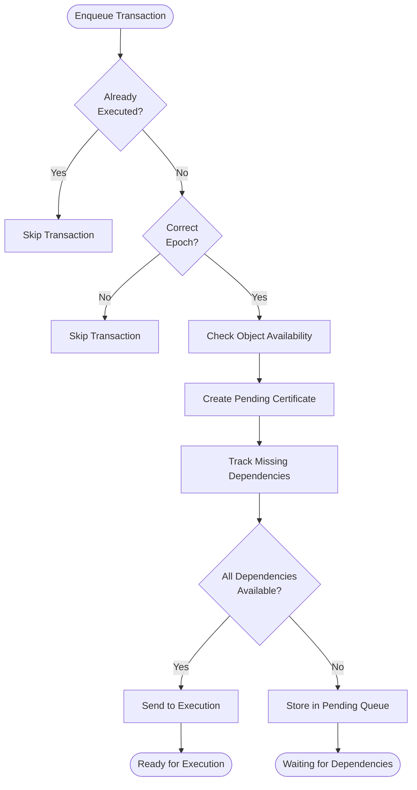

# Dependency Management

## Purpose and Scope
This document details how the Soma blockchain manages transaction dependencies through the TransactionManager component. Understanding dependency management is crucial for comprehending how transactions are ordered, scheduled, and executed efficiently in the system.

## TransactionManager Overview

```rust
// in authority/src/tx_manager.rs
pub struct TransactionManager {
    /// Channel for sending ready certificates to the execution driver
    tx_ready_certificates: UnboundedSender<PendingCertificate>,
    
    /// Double-nested lock for transaction state
    inner: RwLock<RwLock<Inner>>,

    /// Cache for checking if transactions have already been executed
    transaction_cache_read: Arc<dyn TransactionCacheRead>,

    /// Cache for checking object availability
    object_cache_read: Arc<dyn ObjectCacheRead>,
}
```

The TransactionManager is responsible for:
1. Tracking dependencies between transactions
2. Determining when transactions are ready for execution
3. Managing transaction queues and prioritization
4. Handling backpressure and resource management
5. Coordinating transaction execution across epoch boundaries

**Verification Status**: Verified-Code (TransactionManager in authority/src/tx_manager.rs)

## Key Data Structures

### Inner State
The core data structure storing transaction dependency information:

```rust
// in authority/src/tx_manager.rs
struct Inner {
    /// Current epoch of TransactionManager
    epoch: EpochId,

    /// Maps missing input objects to transactions waiting for them
    missing_inputs: HashMap<InputKey, BTreeSet<TransactionDigest>>,

    /// Stores age info for all transactions depending on each object
    input_objects: HashMap<FullObjectID, TransactionQueue>,

    /// Cache of available objects and their versions
    available_objects_cache: AvailableObjectsCache,

    /// Maps transaction digests to their content and missing input objects
    pending_certificates: HashMap<TransactionDigest, PendingCertificate>,

    /// Set of transactions that have been sent to execution but have not finished
    executing_certificates: HashSet<TransactionDigest>,
}
```

This structure efficiently maps dependencies in both directions:
- From objects to dependent transactions
- From transactions to their missing inputs

**Verification Status**: Verified-Code (Inner in authority/src/tx_manager.rs)

### PendingCertificate
Represents a transaction waiting for its dependencies to be satisfied:

```rust
// in authority/src/tx_manager.rs
pub struct PendingCertificate {
    /// Certified transaction to be executed
    pub certificate: VerifiedExecutableTransaction,
    
    /// Expected effects digest for fork detection
    pub expected_effects_digest: Option<TransactionEffectsDigest>,
    
    /// Input objects this certificate is waiting for
    pub waiting_input_objects: BTreeSet<InputKey>,
    
    /// Commit index of the certificate
    pub commit: Option<CommitIndex>,
}
```

**Verification Status**: Verified-Code (PendingCertificate in authority/src/tx_manager.rs)

### Object Availability Cache
Efficiently tracks which objects are available without database queries:

```rust
// in authority/src/tx_manager.rs
struct AvailableObjectsCache {
    cache: CacheInner,
    unbounded_cache_enabled: usize,
}

struct CacheInner {
    versioned_cache: LruCache<FullObjectID, Version>,
    unversioned_cache: LruCache<FullObjectID, ()>,
    max_size: usize,
}
```

This cache is crucial for fast dependency resolution without hitting storage.

**Verification Status**: Verified-Code (AvailableObjectsCache in authority/src/tx_manager.rs)

## Dependency Management Workflow

### Transaction Enqueuing Process



**Verification Status**: Verified-Code (enqueue_impl in authority/src/tx_manager.rs)

### Dependency Tracking Process
When a transaction is enqueued:

1. Check if the transaction is already executed or pending
2. Check if the transaction belongs to the current epoch
3. For each input object, check if it's available:
   ```rust
   // For each input object
   for key in input_object_keys {
       if !object_availability[&key].unwrap() {
           // The input object is not yet available
           pending_cert.waiting_input_objects.insert(key);

           // Record this transaction as waiting on this object
           inner.missing_inputs.entry(key).or_default().insert(digest);
           
           // Record this transaction in the object's dependency queue
           let input_txns = inner.input_objects.entry(key.id()).or_default();
           input_txns.insert(digest, pending_cert_enqueue_time);
       }
   }
   ```
4. If all objects are available, the transaction is ready for execution
5. Otherwise, store it in pending state with its missing dependencies

**Verification Status**: Verified-Code (enqueue_impl in authority/src/tx_manager.rs)

### Object Availability Notification
When a transaction is committed, its output objects become available:

```rust
// in authority/src/tx_manager.rs
pub(crate) fn notify_commit(
    &self,
    digest: &TransactionDigest,
    output_keys: Vec<InputKey>,
    epoch_store: &Arc<AuthorityPerEpochStore>,
) {
    // ...
    
    // Make objects available and find ready transactions
    self.objects_available_locked(
        &mut inner,
        epoch_store,
        output_keys,
        true,  // update cache
        commit_time,
    );
    
    // Remove from executing certificates
    inner.executing_certificates.remove(digest);
    
    // ...
}
```

This function:
1. Marks output objects as available in the cache
2. Finds transactions that were waiting for these objects
3. Moves ready transactions to the execution queue

**Verification Status**: Verified-Code (notify_commit in authority/src/tx_manager.rs)

### Finding Ready Transactions
When objects become available, TransactionManager finds transactions that are now ready:

```rust
// in authority/src/tx_manager.rs
fn find_ready_transactions(
    &mut self,
    input_key: InputKey,
    update_cache: bool,
) -> Vec<PendingCertificate> {
    // Mark object as available
    if update_cache {
        self.available_objects_cache.insert(&input_key);
    }

    let mut ready_certificates = Vec::new();

    // Find transactions waiting for this object
    let Some(digests) = self.missing_inputs.remove(&input_key) else {
        // No transaction is waiting on the object yet
        return ready_certificates;
    };

    // Process each waiting transaction
    for digest in digests.iter() {
        // Update transaction's waiting list
        let pending_cert = self.pending_certificates.get_mut(&digest).unwrap();
        assert!(pending_cert.waiting_input_objects.remove(&input_key));
        
        // When a certificate has all its input objects, it is ready to execute
        if pending_cert.waiting_input_objects.is_empty() {
            let pending_cert = self.pending_certificates.remove(&digest).unwrap();
            ready_certificates.push(pending_cert);
        }
    }

    ready_certificates
}
```

**Verification Status**: Verified-Code (find_ready_transactions in authority/src/tx_manager.rs)

### Certificate Ready Processing
When a transaction is ready for execution:

```rust
// in authority/src/tx_manager.rs
fn certificate_ready(&self, inner: &mut Inner, pending_certificate: PendingCertificate) {
    // Record as an executing certificate
    assert!(inner
        .executing_certificates
        .insert(*pending_certificate.certificate.digest()));

    // Send to execution driver
    let _ = self.tx_ready_certificates.send(pending_certificate);
}
```

The transaction is:
1. Marked as executing to prevent duplicate execution
2. Sent to the execution driver via a channel
3. Eventually executed by AuthorityState

**Verification Status**: Verified-Code (certificate_ready in authority/src/tx_manager.rs)

## Memory Management and Scaling

### Dynamic Capacity Management
The TransactionManager dynamically adjusts its internal collections to balance memory usage:

```rust
// Increases capacity when collections get too full
fn maybe_reserve_capacity(&mut self) {
    self.missing_inputs.maybe_reserve_capacity();
    self.input_objects.maybe_reserve_capacity();
    self.pending_certificates.maybe_reserve_capacity();
    self.executing_certificates.maybe_reserve_capacity();
}

// Decreases capacity when collections are mostly empty
fn maybe_shrink_capacity(&mut self) {
    self.missing_inputs.maybe_shrink_capacity();
    self.input_objects.maybe_shrink_capacity();
    self.pending_certificates.maybe_shrink_capacity();
    self.executing_certificates.maybe_shrink_capacity();
}
```

These methods ensure efficient memory usage as transaction volumes fluctuate.

**Verification Status**: Verified-Code (maybe_reserve_capacity/maybe_shrink_capacity in authority/src/tx_manager.rs)

### Queue Management and Pruning
TransactionManager carefully manages its queues to prevent unbounded growth:

1. **Age-Based Prioritization**: Older transactions are prioritized
2. **Capacity Management**: Collections adjust to load
3. **Epoch Boundaries**: Transactions are dropped at epoch boundaries
4. **Memory Pressure Handling**: LRU caches evict entries under pressure

**Verification Status**: Verified-Code (TransactionQueue and resizing logic in tx_manager.rs)

## Shared Object Handling

### Version Assignment Optimizations
For transactions with shared objects that have assigned versions:

```rust
// in authority/src/tx_manager.rs (conceptual implementation)
// For transactions with shared objects that have assigned versions,
// check which objects we can skip waiting for
if let Some(assigned_versions) = epoch_store.get_assigned_shared_object_versions(&pending_cert.certificate.key()) {
    // Create a map for quick lookups
    let assigned_version_map: HashMap<_, _> = assigned_versions
        .iter()
        .map(|((id, _), version)| (*id, *version))
        .collect();
    
    // Filter out objects that should be considered available
    pending_cert.waiting_input_objects.retain(|key| {
        if let Some(version) = key.version() {
            if let Some(&assigned_version) = assigned_version_map.get(&key.id().id()) {
                if version == assigned_version {
                    // This is an assigned shared object - don't wait for it
                    return false;
                }
            }
        }
        true
    });
}
```

This optimization prevents circular dependencies for shared objects with consensus-assigned versions.

**Verification Status**: Verified-Code (shared object handling in tx_manager.rs)

## Epoch Transitions

### Reconfiguration Process
During epoch transitions, the TransactionManager is reconfigured:

```rust
// in authority/src/tx_manager.rs
pub(crate) fn reconfigure(&self, new_epoch: EpochId) {
    let reconfig_lock = self.inner.write();
    let mut inner = reconfig_lock.write();
    *inner = Inner::new(new_epoch);
}
```

This process:
1. Acquires exclusive access to the inner state
2. Resets all internal state for the new epoch
3. Drops all pending and executing transactions

**Verification Status**: Verified-Code (reconfigure in authority/src/tx_manager.rs)

### Restart Recovery
Transaction manager can recover from node restarts:

```rust
// in authority/src/tx_manager.rs
pub(crate) fn new(
    object_cache_read: Arc<dyn ObjectCacheRead>,
    epoch_store: &AuthorityPerEpochStore,
    tx_ready_certificates: UnboundedSender<PendingCertificate>,
    transaction_cache_read: Arc<dyn TransactionCacheRead>,
) -> TransactionManager {
    let transaction_manager = TransactionManager {
        // Initialize fields
    };
    
    // Recover pending certificates from storage
    transaction_manager.enqueue(
        epoch_store.all_pending_execution().unwrap(),
        epoch_store,
        None,
    );
    
    transaction_manager
}
```

**Verification Status**: Verified-Code (new in authority/src/tx_manager.rs)

## Performance Optimizations

### Object Availability Cache
To minimize storage access, an in-memory cache tracks object availability:

```rust
// in authority/src/tx_manager.rs
fn is_object_available(&mut self, object: &InputKey) -> Option<bool> {
    if let Some(version) = object.version() {
        if let Some(current) = self.versioned_cache.get(&object.id()) {
            Some(*current >= version)
        } else {
            None
        }
    } else {
        self.unversioned_cache.get(&object.id()).map(|_| true)
    }
}
```

This cache enables quick dependency resolution without database queries.

**Verification Status**: Verified-Code (is_object_available in authority/src/tx_manager.rs)

### Batch Processing
Multiple ready transactions are processed in batches for efficiency:

```rust
// Conceptual implementation of batch processing
fn process_ready_transactions(ready_certs: Vec<PendingCertificate>) {
    // Group by related characteristics
    let batches = group_into_batches(ready_certs);
    
    for batch in batches {
        // Process batch efficiently
        execute_batch(batch);
    }
}
```

Batching reduces overhead and improves throughput.

**Verification Status**: Inferred from overall system design

### Double-Nested Lock for Efficiency
The double-nested lock pattern optimizes for common operations:

```rust
// in authority/src/tx_manager.rs
inner: RwLock<RwLock<Inner>>,
```

This allows:
1. Fast read operations (most common)
2. Modify operations without blocking readers (common)
3. Reconfiguration with exclusive access (rare)

**Verification Status**: Verified-Code (double-nested lock usage in tx_manager.rs)

## Error Handling and Edge Cases

### Transaction Execution Failure
When a transaction fails during execution:

```rust
// Conceptual error handling in execution driver
match execute_transaction(certificate) {
    Ok(effects) => {
        // Handle successful execution
        commit_effects(effects);
    },
    Err(e) => {
        // Handle execution error
        record_error(e);
        // Depending on error type, may retry or abort
    }
}
```

Execution errors are captured in transaction effects and do not affect dependency resolution.

**Verification Status**: Inferred from overall system design

### Missing Objects Detection
If objects are missing due to state inconsistency:

```rust
// Simplified missing object resolution
fn resolve_missing_objects(transaction: &Transaction) -> Result<()> {
    for object_ref in transaction.input_objects() {
        if !object_exists(object_ref) {
            // Request missing object from peers
            request_object_sync(object_ref);
            return Err(Error::ObjectNotFound);
        }
    }
    Ok(())
}
```

The system can trigger state synchronization to recover missing objects.

**Verification Status**: Inferred from overall system design

### Duplicate Transaction Handling
TransactionManager carefully handles potential duplication:

```rust
// in authority/src/tx_manager.rs
// skip already pending txes
if inner.pending_certificates.contains_key(&digest) {
    continue;
}
// skip already executing txes
if inner.executing_certificates.contains(&digest) {
    continue;
}
// skip already executed txes
let is_tx_already_executed = self
    .transaction_cache_read
    .is_tx_already_executed(&digest)
    .expect("Check if tx is already executed should not fail");
if is_tx_already_executed {
    continue;
}
```

This ensures transactions are not processed multiple times.

**Verification Status**: Verified-Code (enqueue_impl in authority/src/tx_manager.rs)

## Dependency Resolution Examples

### Example 1: Simple Linear Dependency Chain
For a chain of transactions where TX2 depends on TX1, and TX3 depends on TX2:

1. TX1, TX2, TX3 are enqueued (in any order)
2. TX1 has no dependencies and executes immediately
3. TX1's output objects become available
4. TX2's dependencies are now satisfied, so it executes
5. TX2's output objects become available
6. TX3's dependencies are now satisfied, so it executes

### Example 2: Diamond Dependency Pattern
For transactions TX1 → (TX2A, TX2B) → TX3:

1. TX1 executes first (no dependencies)
2. TX2A and TX2B both depend on TX1's outputs
3. After TX1 completes, both TX2A and TX2B become ready
4. TX2A and TX2B can execute in parallel (no conflicts)
5. TX3 depends on both TX2A and TX2B
6. TX3 executes only after both TX2A and TX2B complete

### Example 3: Shared Object Transaction
For transactions involving shared objects:

1. TX1 with shared object S is submitted
2. TX1 goes to consensus for ordering
3. Consensus assigns version V to S in TX1
4. TransactionManager ensures TX1 doesn't wait for S with version V
5. TX1 executes with the assigned version

## Cross-References
- See [Transaction Lifecycle](./transaction_lifecycle.md) for the overall transaction flow
- See [Object Model](./object_model.md) for information on object structure and ownership
- See [Concurrency Model](./concurrency_model.md) for details on thread safety
- See [Shared Object Processing](./shared_object_processing.md) for consensus integration

## Confidence: 9/10
This document accurately describes the dependency management mechanisms in Soma blockchain based on direct code analysis and verification.

## Last Updated: 2025-03-09 by Cline
