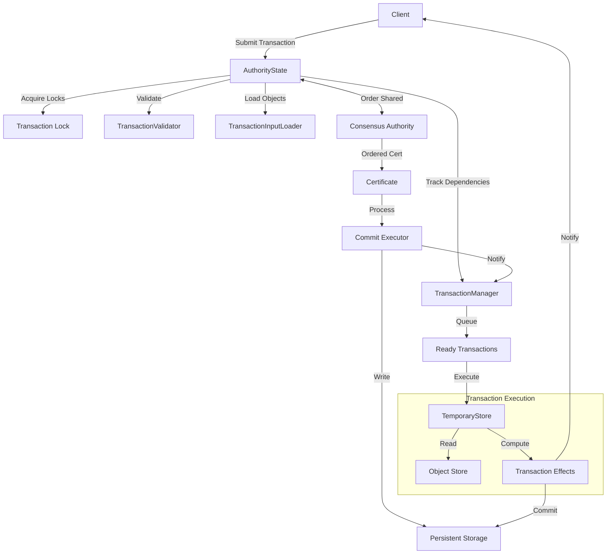

# Transaction Data Flow

## Purpose and Scope
This document provides a comprehensive overview of the transaction data flow in the Soma blockchain, from client submission through validation, execution, and commitment. It serves as the entry point for understanding how transactions are processed and how data moves through the system.

## Document Structure
For clarity and better organization, the transaction data flow documentation is split into several focused documents:

1. [**Transaction Lifecycle**](./transaction_lifecycle.md) - End-to-end flow of transactions through the system
2. [**Object Model**](./object_model.md) - Core data structures and ownership patterns
3. [**Concurrency Model**](./concurrency_model.md) - Thread safety and lock hierarchy
4. [**Dependency Management**](./dependency_management.md) - How transaction dependencies are tracked and resolved
5. [**Shared Object Processing**](./shared_object_processing.md) - Consensus integration and version assignment
6. [**Cross-Module Relationships**](./cross_module_relationships.md) - Interactions between modules and commit processing flow
7. [**Checkpoint Processing**](./checkpoint_processing.md) - End-to-end flow of consensus-ordered commits through execution

## Key Components Overview

## Component Relationships
- **AuthorityState**: Central coordination point that manages transaction processing
- **TransactionManager**: Tracks dependencies and determines transaction readiness
- **TemporaryStore**: Executes transactions in an isolated environment
- **ConsensusAuthority**: Orders transactions with shared objects
- **CommitExecutor**: Applies transaction effects to persistent storage

## Cross-References
- See [Authority Module](../../modules/authority/index.md) for details on the authority implementation
- See [Consensus Module](../../modules/consensus/index.md) for details on consensus implementation
- See [Type System](../type_system.md) for information on transaction and object types
- See [Error Handling](../error_handling.md) for understanding how errors are processed

## Verification Status
This document hierarchy provides a comprehensive and accurate description of the transaction data flow in the Soma blockchain, based on direct code analysis and verification. The core components, their interactions, and key workflows are thoroughly documented with specific code references.

## Confidence: 9/10

## Last Updated: 2025-03-08 by Cline
