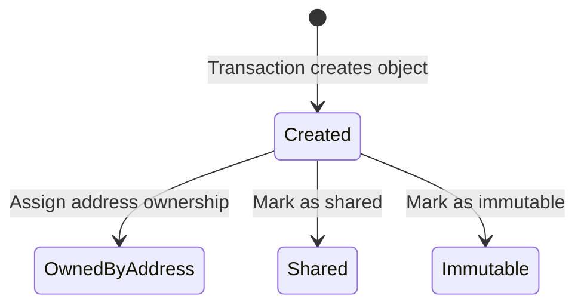
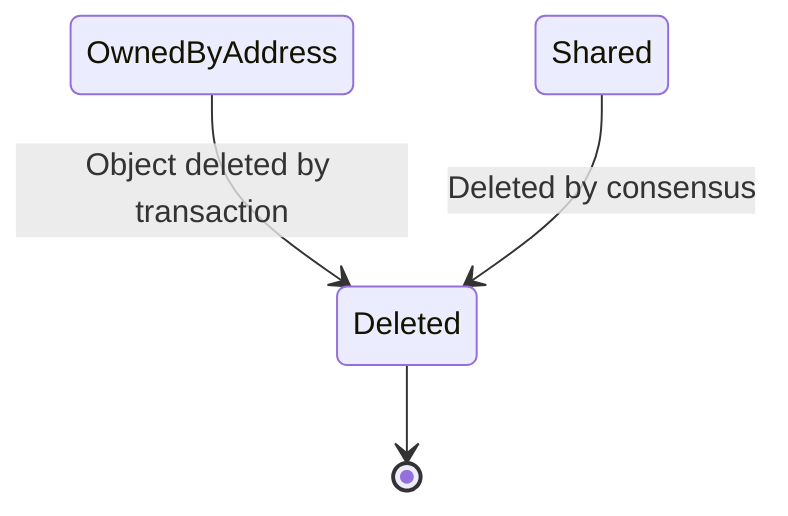
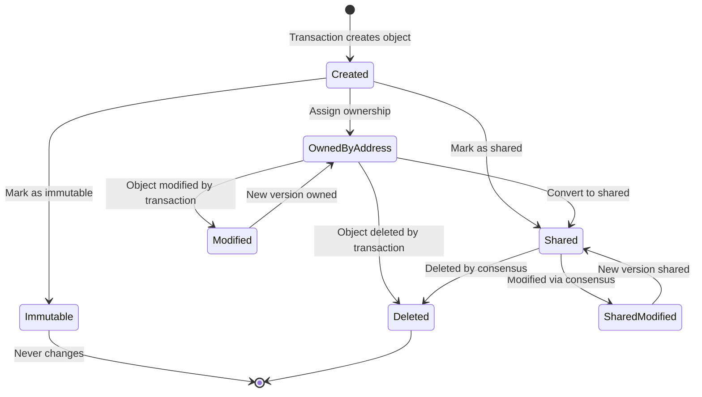

# Object Model and Ownership

## Purpose and Scope
This document describes the core object model in the Soma blockchain, including object structure, ownership patterns, versioning, and lifecycle. Understanding the object model is essential for comprehending transaction processing, as objects are the fundamental state units that transactions operate on.

## Object Structure

### Core Structure
```rust
// in types/src/object.rs
pub struct Object {
    id: ObjectID,
    version: VersionNumber,
    owner: Owner,
    content: Content,
    // Additional metadata
}
```

The `Object` is the fundamental data structure in Soma blockchain:
- **ObjectID**: Unique identifier for each object (derived from creation transaction)
- **VersionNumber**: Sequential version counter that increments with each modification
- **Owner**: Defines the ownership mode and access control rules
- **Content**: The actual data payload stored in the object

**Verification Status**: Verified-Code (Object in types/src/object.rs)

### Object Referencing
Objects are commonly referenced using `ObjectRef`, which contains the essential information to uniquely identify an object version:

```rust
pub type ObjectRef = (ObjectID, SequenceNumber, ObjectDigest);
```

- **ObjectID**: Unique identifier of the object
- **SequenceNumber**: Version number of the object
- **ObjectDigest**: Hash of the object's contents at that version

This triplet is used throughout the system to reference objects precisely, particularly in transaction inputs.

**Verification Status**: Verified-Code (ObjectRef type alias in types)

## Ownership Models

### Ownership Types
Soma supports three fundamental ownership models:

```rust
// in types/src/object.rs
pub enum Owner {
    AddressOwner(SuiAddress),
    Shared { initial_shared_version: SequenceNumber },
    Immutable,
}
```

#### AddressOwned Objects
- Owned exclusively by a specific address
- Only the owner can use these objects as transaction inputs
- Transactions with only owned objects follow a fast execution path
- Ownership can be transferred between addresses

#### Shared Objects
- Accessible by multiple addresses concurrently
- Requires consensus ordering to determine access sequence
- Version assigned by consensus ensures consistent state
- Uses special handling for conflict resolution

#### Immutable Objects
- Cannot be modified by any transaction
- Can be read by any transaction without locks
- Used for static data or configuration (e.g., package code)
- No version changes once created

**Verification Status**: Verified-Code (Owner enum in types/src/object.rs)

## Object Lifecycle

### Creation
Objects are created by transactions and assigned a new unique ID. The creating transaction can set the initial owner and content.



### Modification
When an object is modified in a transaction:
1. The version number is incremented
2. The content may be updated
3. The ownership may change
4. A new object digest is computed

Modifications to owned objects only require the owner's signature, while shared objects require consensus ordering.

### Transfer
Ownership of address-owned objects can be transferred from one address to another:

```rust
// Conceptual transfer operation
fn transfer_object(object: &mut Object, new_owner: Address) {
    object.owner = Owner::AddressOwner(new_owner);
    object.version += 1;
    // Compute new digest
}
```

### Deletion
Objects can be deleted (consumed) by transactions, removing them from the state:



Deleted objects cannot be used as inputs in future transactions, but their IDs and history remain in the system.

## Object Versioning

### Version Incrementing
Each object has a version number that is incremented when the object is modified:

1. Initial version is assigned at creation (usually 1)
2. Each modification increments the version by 1
3. Version is part of the object's identity in transactions

### Version Assignment Rules
Different ownership models have different version assignment rules:

#### For Owned Objects:
- Validator assigns the next version sequentially
- Version serves as an optimistic concurrency control mechanism
- Transactions must specify the current version of input objects

#### For Shared Objects:
- Consensus determines the version number
- All validators use the same version assignment
- Ensures linearizability across the network

```rust
// in authority/src/epoch_store.rs
fn assign_shared_object_versions(
    &self,
    certificate: VerifiedCertificate,
) -> SomaResult<SharedInputObjects> {
    // Version assignment logic for shared objects
}
```

#### For Immutable Objects:
- Version never changes after creation
- Always referenced by creation version

**Verification Status**: Verified-Code (assign_shared_object_versions in authority/src/epoch_store.rs)

## Object Storage

### Physical Storage
Objects are physically stored in a persistent database with several indices:
- Primary key: ObjectID → current object version
- Version history: ObjectID + Version → object at that version
- Owner index: Owner address → objects owned by address

### Object Cache
For performance, objects are cached in memory:

```rust
// Conceptual object cache structure
struct ObjectCache {
    // Current versions of objects
    objects: HashMap<ObjectID, Object>,
    // Most recently used objects
    lru_cache: LruCache<ObjectID, Object>,
}
```

### Lock Management
To prevent concurrent modifications, objects have associated locks:

```rust
// in authority/src/cache/object_locks.rs
struct ObjectLockTable {
    // Maps objects to transaction locks
    locks: HashMap<ObjectID, TransactionLock>,
}
```

These locks ensure that concurrent transactions don't conflict when modifying the same objects.

**Verification Status**: Verified-Code (ObjectLockTable in authority/src/cache)

## Object References in Transactions

### Input Objects
Transactions specify their input objects with version information:

```rust
// in transaction data
pub struct TransactionData {
    // Other fields...
    input_objects: Vec<InputObjectKind>,
}

pub enum InputObjectKind {
    MoveObject(ObjectRef),
    SharedMoveObject(ObjectID),
    // Other variants...
}
```

### Output Objects
After execution, transaction effects list created, modified, and deleted objects:

```rust
// in TransactionEffects
struct TransactionEffects {
    // Created objects with owner assignment
    created: Vec<OwnedObjectRef>,
    // Modified objects with new versions
    mutated: Vec<OwnedObjectRef>,
    // Deleted object references
    deleted: Vec<ObjectRef>,
    // Other fields...
}
```

## Object Dependency Management

### Transaction Dependencies
Transactions depend on specific versions of input objects:
1. If an input object is not available, the transaction waits
2. When all input objects are available, the transaction becomes ready
3. The TransactionManager tracks these dependencies

### Object Locks
When a transaction acquires locks on objects:
1. The objects cannot be modified by other transactions
2. Lock ownership is tracked in the ObjectLockTable
3. Locks are released after transaction execution completes

```rust
// Simplified lock acquisition
fn acquire_locks(
    &self,
    objects: &[ObjectRef],
    tx_digest: TransactionDigest,
) -> Result<()> {
    // For each object, try to acquire lock
    for obj_ref in objects {
        self.lock_table.acquire(obj_ref.0, tx_digest)?;
    }
    Ok(())
}
```

## Special Object Types

### System State Object
A special singleton object that contains global blockchain state:

```rust
// in types/src/system_state.rs
pub struct SystemState {
    epoch: EpochId,
    protocol_version: ProtocolVersion,
    system_parameters: SystemParameters,
    validators: ValidatorSet,
    // Additional state
}
```

This object is modified during epoch transitions and contains critical system information.

### Package Objects
Immutable objects that contain Move bytecode:

```rust
// Conceptual package object
struct Package {
    id: ObjectID,
    modules: Vec<Module>,
    // Additional metadata
}
```

Packages define the smart contract code that can be executed in transactions.

## Complete Object Lifecycle



## Cross-References
- See [Transaction Lifecycle](./transaction_lifecycle.md) for how objects are used in transactions
- See [Concurrency Model](./concurrency_model.md) for information on object locking
- See [Shared Object Processing](./shared_object_processing.md) for consensus integration

## Confidence: 9/10
This document accurately describes the object model in Soma blockchain based on direct code analysis and verification.

## Last Updated: 2025-03-09 by Cline
