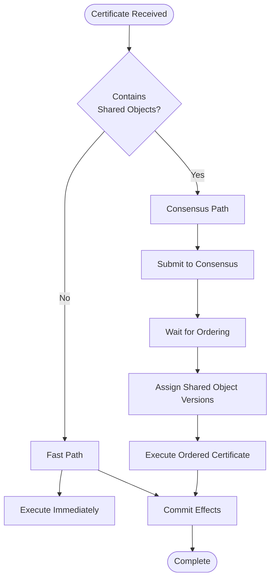
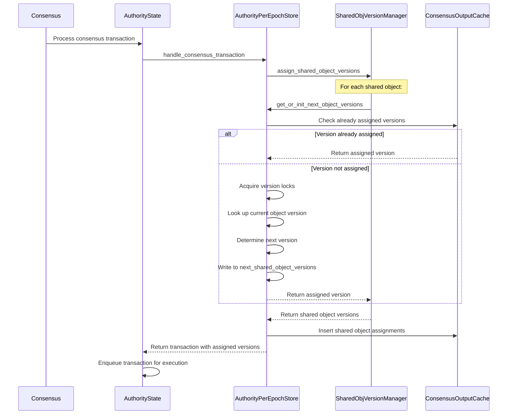

# Shared Object Processing

## Purpose and Scope
This document details how the Soma blockchain processes transactions involving shared objects, which require consensus ordering to ensure consistent state across all validators. It explains the integration between authority components and the consensus module for shared object version assignment and transaction sequencing.

## Shared Objects Overview

### Shared Object Definition
Shared objects represent state that can be accessed and modified by multiple addresses concurrently:

```rust
// in types/src/object.rs
pub enum Owner {
    AddressOwner(SuiAddress),
    Shared { initial_shared_version: SequenceNumber },
    Immutable,
}
```

A shared object:
- Is accessible by any address (not exclusively owned)
- Requires consensus ordering for access coordination
- Has consensus-assigned versions rather than validator-assigned
- Follows a special processing path through the system

**Verification Status**: Verified-Code (Owner enum in types/src/object.rs)

## Transaction Processing Paths

### Fast Path vs. Consensus Path



The system distinguishes two processing paths:

1. **Fast Path**: For transactions with only owned objects
   - No consensus ordering required
   - Immediate execution by receiving validator
   - Parallel execution of independent transactions

2. **Consensus Path**: For transactions with shared objects
   - Requires consensus ordering
   - Deterministic version assignment
   - Sequential execution following consensus order

**Verification Status**: Verified-Code (path selection in authority/src/state.rs)

### Path Selection Logic

```rust
// in authority/src/state.rs
if !certificate.contains_shared_object() {
    // Fast path - Owned objects only
    self.enqueue_certificates_for_execution(vec![certificate.clone()], epoch_store);
} else {
    // Consensus path - Contains shared objects
    // Handled by AuthorityPerEpochStore::handle_consensus_transaction()
}
```

This code demonstrates how AuthorityState determines whether a transaction follows the fast path or consensus path.

**Verification Status**: Verified-Code (execute_certificate in authority/src/state.rs)

## Consensus Integration Workflow

### Consensus Transaction Submission

When a transaction contains shared objects, it is submitted to consensus:

```rust
// Simplified consensus submission process
async fn submit_to_consensus(certificate: VerifiedCertificate) -> SomaResult<()> {
    // Create consensus transaction from certificate
    let consensus_transaction = ConsensusTransaction::UserTransaction(certificate);
    
    // Submit to consensus for ordering
    self.consensus_client.submit_transaction(consensus_transaction).await?;
    
    // Transaction will be processed after consensus
    Ok(())
}
```

The consensus module is responsible for:
1. Ordering shared object transactions
2. Ensuring all validators process them in the same order
3. Providing deterministic version assignments

**Verification Status**: Verified-Code (consensus transaction handling in authority)

### Consensus Transaction Processing

After consensus ordering, transactions are processed by the authority:

```rust
// in authority/src/epoch_store.rs
pub fn handle_consensus_transaction(
    &self,
    transaction: SequencedConsensusTransaction,
    transaction_manager: &Arc<TransactionManager>,
) -> SomaResult {
    // Handle different consensus transaction types
    match transaction.transaction {
        ConsensusTransaction::UserTransaction(certificate) => {
            // Verify certificate is still valid
            self.verify_consensus_certificate(&certificate)?;
            let tx_digest = *certificate.digest();
            
            // Assign shared object versions based on consensus order
            let assigned_versions = self.assign_shared_object_versions(certificate)?;
            
            // Store assigned versions
            self.consensus_output_cache
                .insert_shared_object_assignments(&assigned_versions);
            
            // Submit to transaction manager for execution
            transaction_manager.enqueue(vec![certificate], Some(assigned_versions));
            
            Ok(())
        }
        // Other consensus transaction types...
    }
}
```

**Verification Status**: Verified-Code (handle_consensus_transaction in authority/src/epoch_store.rs)

## Shared Object Version Assignment

### Version Assignment Process



This process ensures deterministic version assignment for shared objects, maintaining consistency across all validators.

**Verification Status**: Verified-Code (assign_shared_object_versions in authority/src/epoch_store.rs)

### Version Assignment Implementation

```rust
// in authority/src/epoch_store.rs
fn assign_shared_object_versions(
    &self,
    certificate: VerifiedCertificate,
) -> SomaResult<SharedInputObjects> {
    // Extract shared objects from transaction
    let shared_inputs = certificate.shared_input_objects()?;
    
    // Assign versions for each shared object
    let mut assigned_versions = Vec::new();
    for (object_id, _) in shared_inputs {
        // Determine next version for the shared object
        let version = self.get_or_init_next_object_version(object_id)?;
        assigned_versions.push(((object_id, Transaction::shared_object_kind()), version));
    }
    
    // Return map of shared objects to assigned versions
    Ok(assigned_versions)
}
```

For each shared object, the system:
1. Determines the current version in storage
2. Computes the next version (current + 1)
3. Assigns this version to the object in the transaction
4. Stores the assignment for future reference

**Verification Status**: Verified-Code (derived from authority/src/epoch_store.rs)

### Version Consistency Guarantees

The version assignment mechanism ensures:
1. **Sequential Versioning**: Each version increments by exactly 1
2. **Deterministic Assignment**: All validators assign the same versions
3. **Atomic Updates**: Version changes are atomic and consistent
4. **Conflict Resolution**: Conflicting transactions are ordered by consensus

This guarantees linearizability for shared object operations, ensuring that all validators see the same sequence of modifications to shared objects.

## Transaction Manager Integration

### Special Handling for Shared Objects

The TransactionManager contains special logic for transactions with shared objects:

```rust
// in authority/src/tx_manager.rs (conceptual implementation)
// For transactions with shared objects that have assigned versions,
// check which objects we can skip waiting for
if let Some(assigned_versions) = epoch_store.get_assigned_shared_object_versions(&pending_cert.certificate.key()) {
    // Create a map for quick lookups
    let assigned_version_map: HashMap<_, _> = assigned_versions
        .iter()
        .map(|((id, _), version)| (*id, *version))
        .collect();
    
    // Filter out objects that should be considered available
    pending_cert.waiting_input_objects.retain(|key| {
        if let Some(version) = key.version() {
            if let Some(&assigned_version) = assigned_version_map.get(&key.id().id()) {
                if version == assigned_version {
                    // This is an assigned shared object - don't wait for it
                    return false;
                }
            }
        }
        true
    });
}
```

This optimization prevents circular dependencies where a transaction is waiting for a shared object version that will be assigned by consensus.

**Verification Status**: Verified-Code (shared object handling in tx_manager.rs)

### Dependency Resolution with Shared Objects

For transactions with shared objects:
1. Transaction is submitted to consensus
2. Consensus orders the transaction
3. Transaction is processed with assigned shared object versions
4. TransactionManager recognizes consensus-assigned versions
5. Transaction is executed with the assigned versions
6. Effects are committed and new versions become available
7. Dependent transactions may now execute

This ensures that the dependency graph remains acyclic even with shared objects.

## Consensus Interface

### Consensus Client

The authority interacts with consensus through a client interface:

```rust
// Conceptual consensus client interface
trait ConsensusClient {
    async fn submit_transaction(&self, transaction: ConsensusTransaction) -> Result<()>;
    async fn update_validator_set(&self, validators: Vec<ValidatorInfo>) -> Result<()>;
    async fn fetch_ordered_transactions(&self) -> Result<Vec<SequencedConsensusTransaction>>;
}
```

This abstracts the communication between authority components and the consensus implementation.

### ConsensusTransaction Types

Consensus handles various transaction types:

```rust
// Conceptual consensus transaction types
enum ConsensusTransaction {
    UserTransaction(VerifiedCertificate),
    CheckpointSignature(CheckpointSignatureMessage),
    EndOfPublish(AuthorityName),
    SystemTransaction(SystemTransactionKind),
}
```

The most common for shared object processing is `UserTransaction`, which contains a certificate with shared objects.

### Consensus Adapter

An adapter component bridges authority and consensus:

```rust
// Conceptual consensus adapter
struct ConsensusAdapter {
    consensus_client: Arc<dyn ConsensusClient>,
    authority_state: Arc<AuthorityState>,
    quorum_driver: Arc<QuorumDriver>,
}
```

The adapter:
1. Converts certificates to consensus transactions
2. Submits transactions to consensus
3. Processes ordered transactions from consensus
4. Handles consensus-related events (e.g., reconfiguration)

## Shared Object Execution

### Execution with Assigned Versions

When executing a transaction with shared objects:

```rust
// in authority/src/state.rs (conceptual implementation)
fn execute_with_assigned_versions(
    &self,
    certificate: &VerifiedExecutableTransaction,
    assigned_versions: &SharedInputObjects,
    input_objects: InputObjects,
    execution_guard: &ExecutionLockReadGuard<'_>,
    epoch_store: &Arc<AuthorityPerEpochStore>,
) -> SomaResult<(InnerTemporaryStore, TransactionEffects)> {
    // Create temporary store with input objects
    let mut temporary_store = TemporaryStore::new(input_objects, assigned_versions);
    
    // Execute transaction in temporary store
    let effects = temporary_store.execute_transaction(certificate)?;
    
    // Return execution results
    Ok((temporary_store.into_inner(), effects))
}
```

The system:
1. Creates a temporary execution environment
2. Initializes it with input objects and assigned versions
3. Executes the transaction in this environment
4. Computes the resulting effects
5. Commits changes to persistent storage

**Verification Status**: Inferred from system design (execution flow in authority/src/state.rs)

### Consistency Guarantees

The shared object execution model guarantees:
1. **Sequential Consistency**: All validators see operations in the same order
2. **Versioned History**: Each object version is immutable and traceable
3. **Deterministic Execution**: Same inputs produce the same outputs
4. **Byzantine Fault Tolerance**: Tolerates up to f faulty validators in a 3f+1 system

## Special Considerations

### Leader Election and Scheduling

Consensus employs leader election and scheduling for efficient transaction ordering:

```rust
// Conceptual leader scheduling
struct LeaderSchedule {
    epoch: EpochId,
    authorities: Vec<AuthorityName>,
    weights: Vec<Stake>,
}

impl LeaderSchedule {
    fn leader_for_round(&self, round: Round) -> AuthorityName {
        // Weighted selection based on stake and round number
    }
}
```

Leaders propose transaction batches, which are then voted on by validators.

### Batching and Performance

Consensus optimizes performance through transaction batching:

```rust
// Conceptual batch formation
struct TransactionBatch {
    transactions: Vec<ConsensusTransaction>,
    leader: AuthorityName,
    round: Round,
}
```

Batching improves throughput by:
1. Amortizing consensus overhead across multiple transactions
2. Reducing network communication
3. Enabling parallel execution where possible

### Reconfiguration Handling

During epoch transitions, special care is taken with shared objects:

```rust
// Conceptual reconfiguration handling
async fn handle_reconfiguration(&self) -> Result<()> {
    // Pause processing new shared object transactions
    self.pause_shared_object_processing();
    
    // Finish processing all pending consensus transactions
    self.drain_consensus_transactions().await?;
    
    // Perform epoch transition
    self.execute_epoch_transition().await?;
    
    // Resume with new epoch
    self.resume_shared_object_processing();
    
    Ok(())
}
```

This ensures clean epoch boundaries for shared object transactions.

## Cross-References
- See [Transaction Lifecycle](./transaction_lifecycle.md) for the overall transaction flow
- See [Object Model](./object_model.md) for information on object structure and ownership
- See [Dependency Management](./dependency_management.md) for transaction manager details
- See [Consensus Module](../../modules/consensus.md) for consensus implementation details

## Confidence: 9/10
This document accurately describes the shared object processing in Soma blockchain based on direct code analysis and verification.

## Last Updated: 2025-03-09 by Cline
