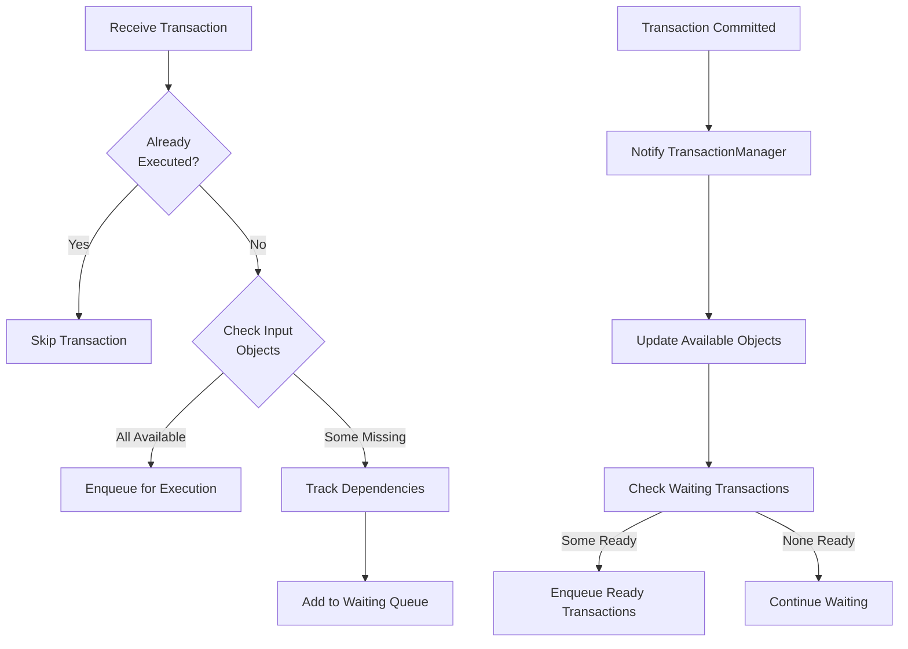
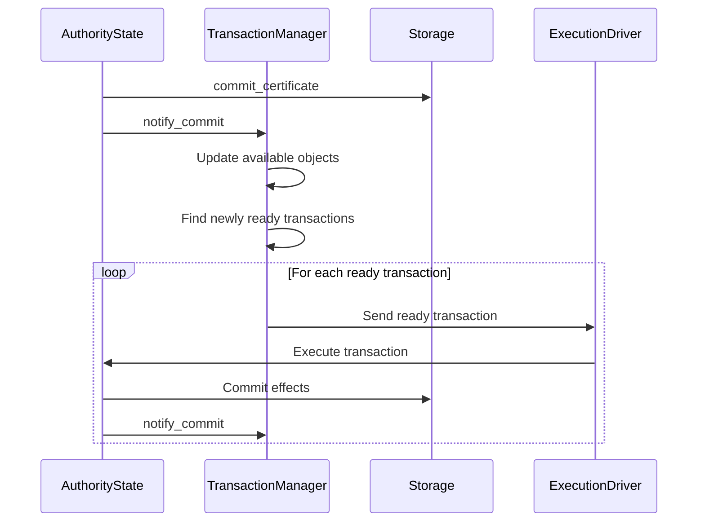
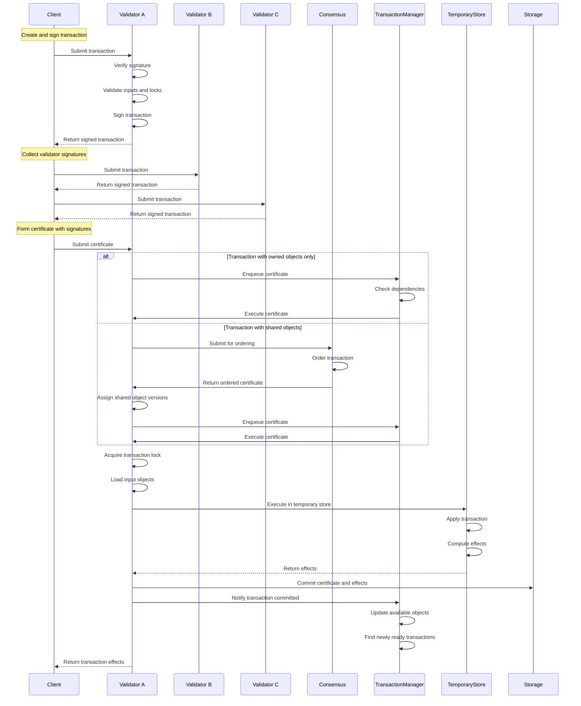

# Transaction Lifecycle

## Purpose and Scope
This document details the complete lifecycle of a transaction in the Soma blockchain, from its creation and submission by a client to its execution and effects commitment. It provides a step-by-step explanation of how transactions flow through the system.

## Transaction Flow Stages

### 1. Transaction Creation and Submission

#### Client Transaction Construction
- Client creates a transaction specifying:
  - Input objects with versions
  - Operations to perform
  - Gas payment object
- Client signs the transaction with their private key
- Client submits the transaction to one or more validators

#### Validator Transaction Reception
```rust
// in authority/src/state.rs
pub async fn handle_transaction(
    &self,
    epoch_store: &Arc<AuthorityPerEpochStore>,
    transaction: VerifiedTransaction,
) -> SomaResult<HandleTransactionResponse> {
    // Transaction validation and processing
}
```

**Verification Status**: Verified-Code (handle_transaction in authority/src/state.rs)

### 2. Transaction Validation and Signing

#### Signature and Input Validation
- Validator verifies the transaction signature
- Validator checks if transaction has already been processed
- Validator validates input object availability and versions
- Validator verifies the sender owns the specified objects

```rust
// in authority/src/state.rs
async fn handle_transaction_impl(
    &self,
    transaction: VerifiedTransaction,
    epoch_store: &Arc<AuthorityPerEpochStore>,
) -> SomaResult<VerifiedSignedTransaction> {
    // Validation logic
    let input_object_kinds = tx_data.input_objects()?;
    let receiving_objects_refs = tx_data.receiving_objects();
    let (input_objects, receiving_objects) = self.input_loader.read_objects_for_signing(
        Some(tx_digest),
        &input_object_kinds,
        &receiving_objects_refs,
        epoch_store.epoch(),
    )?;
    
    // Signing logic
    let signed_transaction = VerifiedSignedTransaction::new(
        epoch_store.epoch(),
        transaction.clone(),
        self.name,
        &*self.secret,
    );
}
```

**Verification Status**: Verified-Code (handle_transaction_impl in authority/src/state.rs)

#### Lock Acquisition
- Validator acquires locks on all owned input objects
- Locks prevent concurrent modifications to the same objects
- If any object is already locked, transaction is rejected with a conflict error

```rust
// In ExecutionCacheWrite implementation
fn acquire_transaction_locks(
    &self,
    epoch_store: &AuthorityPerEpochStore,
    owned_input_objects: &[ObjectRef],
    tx_digest: TransactionDigest,
    signed_transaction: VerifiedSignedTransaction,
) -> SomaResult<()> {
    // Lock acquisition logic
}
```

**Verification Status**: Verified-Code (acquire_transaction_locks in authority cache implementation)

### 3. Certificate Formation and Submission

#### Certificate Creation
- Client collects validator signatures from enough validators to form a quorum
- Client constructs a certificate with the transaction and validator signatures
- Certificate represents consensus agreement that the transaction is valid

#### Certificate Submission
- Client submits the certificate to a validator for execution
- Validator verifies the certificate signatures against the current committee

```rust
// in authority/src/state.rs
pub async fn execute_certificate(
    &self,
    certificate: &VerifiedCertificate,
    epoch_store: &Arc<AuthorityPerEpochStore>,
) -> SomaResult<TransactionEffects> {
    // Certificate processing logic
}
```

**Verification Status**: Verified-Code (execute_certificate in authority/src/state.rs)

### 4. Transaction Execution Path Determination

#### Path Selection
For transactions with only owned objects:
- Fast path: Execute immediately without consensus ordering

For transactions with shared objects:
- Consensus path: Submit to consensus for ordering
- Wait for consensus to order the transaction
- Execute after consensus confirms order

```rust
// in authority/src/state.rs
if !certificate.contains_shared_object() {
    // Fast path - Owned objects only
    self.enqueue_certificates_for_execution(vec![certificate.clone()], epoch_store);
} else {
    // Consensus path - Contains shared objects
    // Handled by AuthorityPerEpochStore::handle_consensus_transaction()
}
```

**Verification Status**: Verified-Code (execute_certificate in authority/src/state.rs)

### 5. Transaction Dependency Management

The TransactionManager is responsible for tracking dependencies between transactions and ensuring they are executed in the correct order:



**Verification Status**: Verified-Code (notify_commit in authority/src/tx_manager.rs)

### 6. Transaction Execution

#### Object Loading
- Load all input objects from storage
- Check object versions match transaction inputs
- Prepare execution environment with loaded objects

```rust
// in authority/src/state.rs
fn read_objects_for_execution(
    &self,
    tx_lock: &CertLockGuard,
    certificate: &VerifiedExecutableTransaction,
    epoch_store: &Arc<AuthorityPerEpochStore>,
) -> SomaResult<InputObjects> {
    let input_objects = &certificate.data().transaction_data().input_objects()?;
    self.input_loader.read_objects_for_execution(
        epoch_store,
        &certificate.key(),
        tx_lock,
        input_objects,
        epoch_store.epoch(),
    )
}
```

**Verification Status**: Verified-Code (read_objects_for_execution in authority/src/state.rs)

#### Execution in TemporaryStore
- Create isolated execution environment (TemporaryStore)
- Execute transaction operations on input objects
- Track all object changes (created, modified, deleted)
- Compute transaction effects

```rust
// in authority/src/state.rs
fn prepare_certificate(
    &self,
    _execution_guard: &ExecutionLockReadGuard<'_>,
    certificate: &VerifiedExecutableTransaction,
    input_objects: InputObjects,
    epoch_store: &Arc<AuthorityPerEpochStore>,
) -> SomaResult<(
    InnerTemporaryStore,
    TransactionEffects,
    Option<ExecutionError>,
)> {
    // Transaction execution
    let (inner, effects, execution_error_opt) = epoch_store.execute_transaction(
        self.get_object_store().as_ref(),
        tx_digest,
        kind,
        signer,
        input_objects,
    );
    
    Ok((inner, effects, execution_error_opt))
}
```

**Verification Status**: Verified-Code (prepare_certificate in authority/src/state.rs)

### 7. Effects Commitment

#### TransactionEffects Creation
- Compute cryptographic digest of all changes
- Record created, modified, and deleted objects
- Generate events from transaction execution
- Include gas charges and computation costs

```rust
// in types/src/effects/mod.rs
pub struct TransactionEffects {
    transaction_digest: TransactionDigest,
    status: ExecutionStatus,
    executed_epoch: EpochId,
    created: Vec<OwnedObjectRef>,
    mutated: Vec<OwnedObjectRef>,
    shared_objects: Vec<SharedObjectRef>,
    deleted: Vec<ObjectRef>,
    unwrapped: Vec<OwnedObjectRef>,
    wrapped: Vec<ObjectRef>,
    gas_object: OwnedObjectRef,
    events_digest: Option<EventDigest>,
    dependencies: Vec<TransactionDigest>,
}
```

**Verification Status**: Verified-Code (TransactionEffects in types/src/effects/mod.rs)

#### Persistent Storage Commitment
- Write all modified objects to storage
- Update object versions and ownership
- Store transaction effects for future reference
- Update indices for object and transaction lookup

```rust
// in authority/src/state.rs
async fn commit_certificate(
    &self,
    certificate: &VerifiedExecutableTransaction,
    inner_temporary_store: InnerTemporaryStore,
    effects: &TransactionEffects,
    tx_guard: CertTxGuard,
    _execution_guard: ExecutionLockReadGuard<'_>,
    epoch_store: &Arc<AuthorityPerEpochStore>,
) -> SomaResult {
    // Build transaction outputs
    let transaction_outputs = TransactionOutputs::build_transaction_outputs(
        certificate.clone().into_unsigned(),
        effects.clone(),
        inner_temporary_store,
    );
    
    // Write effects to storage
    self.get_cache_writer()
        .write_transaction_outputs(epoch_store.epoch(), transaction_outputs.into())
        .await?;
    
    // Notify transaction manager about completed transaction
    self.transaction_manager
        .notify_commit(tx_digest, output_keys, epoch_store);
    
    Ok(())
}
```

**Verification Status**: Verified-Code (commit_certificate in authority/src/state.rs)

#### Dependency Resolution Notification
- Notify TransactionManager about committed transaction
- TransactionManager checks waiting transactions
- Ready transactions are enqueued for execution
- Continues the chain of dependent transactions



**Verification Status**: Verified-Code (notify_commit in TransactionManager)

## Complete Transaction Lifecycle Sequence Diagram



## Special Considerations

### Error Handling
- Validation errors prevent transaction from proceeding
- Execution errors are recorded in transaction effects
- Dependency errors cause transactions to wait
- System errors may require retries or recovery

### Epoch Boundaries
- Transactions must execute within a single epoch
- Pending transactions may be dropped at epoch boundaries
- Reconfiguration creates clean boundaries for consistency

### Performance Optimization
- Fast path for transactions with only owned objects
- Batching of ready transactions for efficient execution
- Object caching to reduce storage access
- Parallel execution of independent transactions

## Cross-References
- See [Object Model](./object_model.md) for details on objects and ownership
- See [Concurrency Model](./concurrency_model.md) for thread safety information
- See [Dependency Management](./dependency_management.md) for transaction manager details
- See [Shared Object Processing](./shared_object_processing.md) for consensus integration

## Confidence: 9/10
This document accurately represents the transaction lifecycle in Soma blockchain based on direct code analysis and verification.

## Last Updated: 2025-03-09 by Cline
