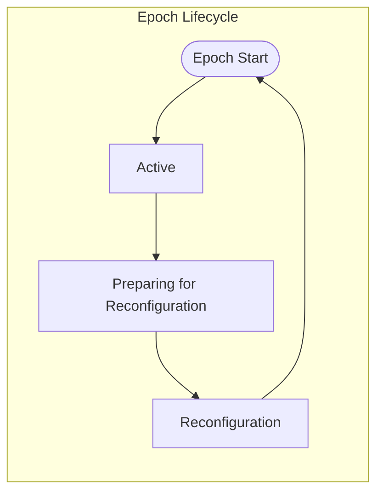
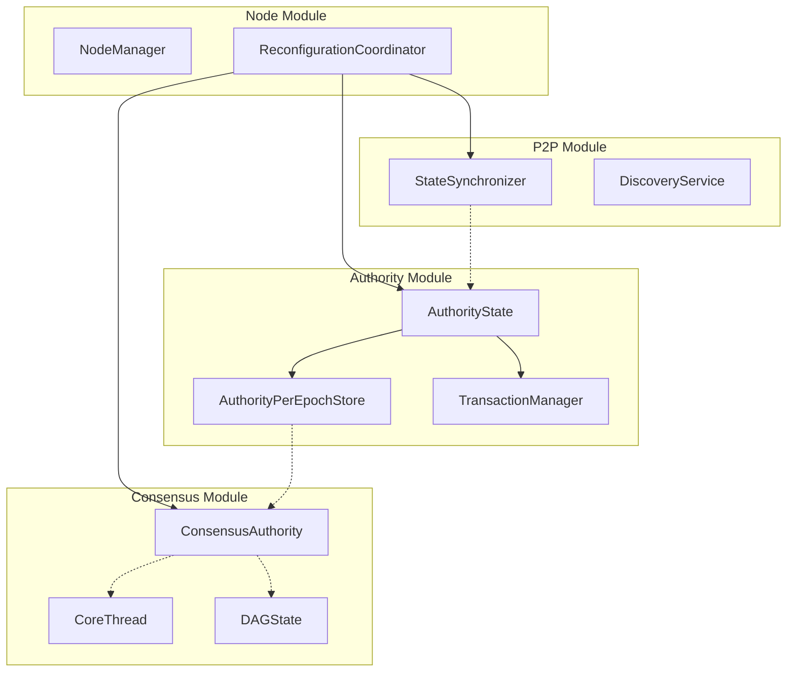
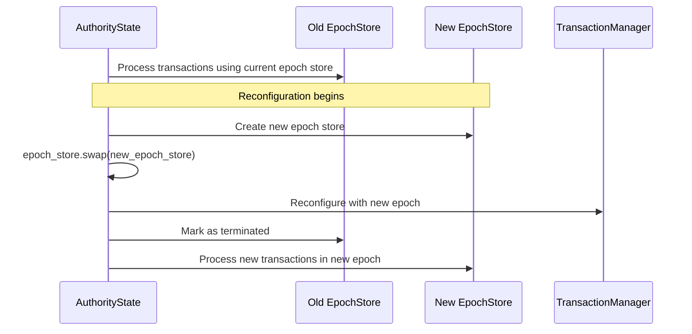
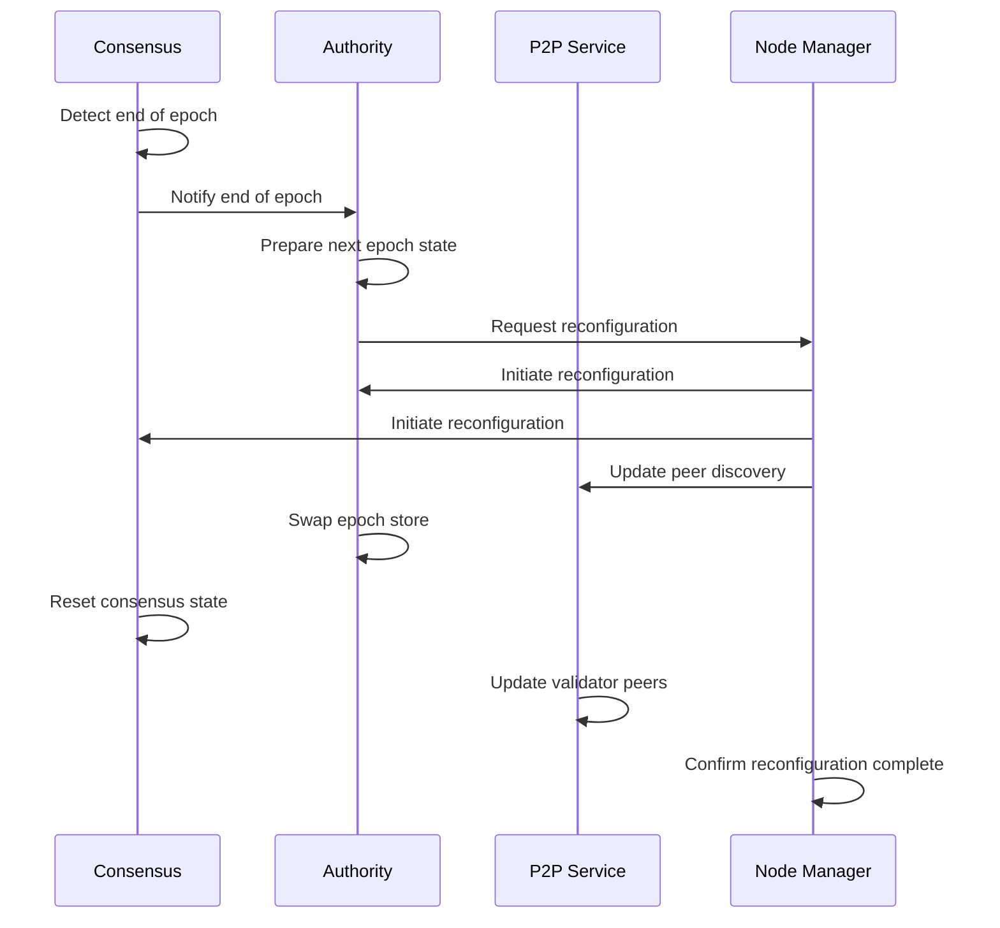
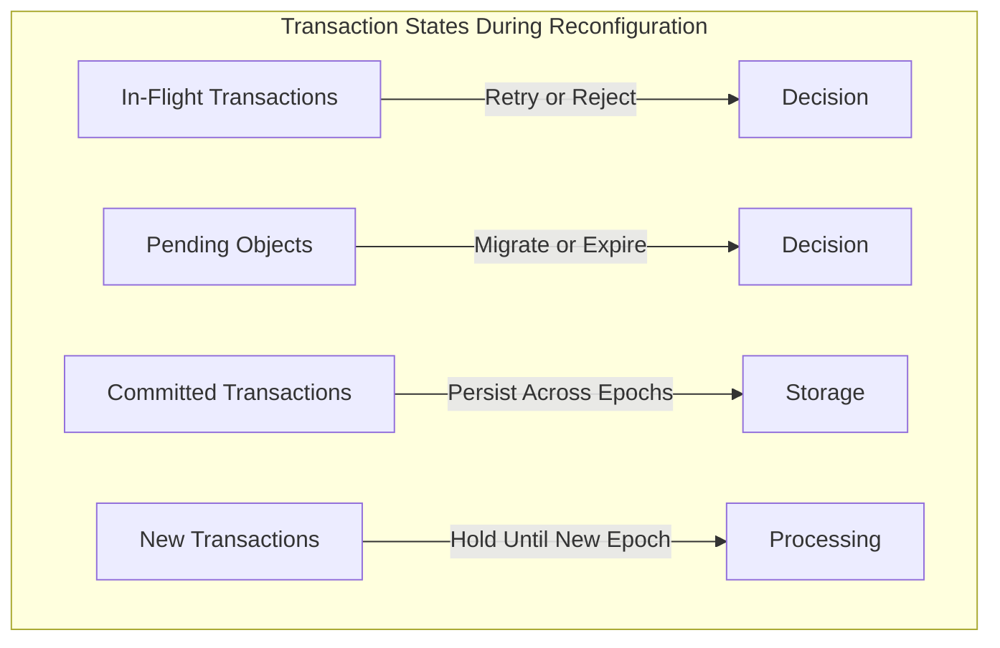
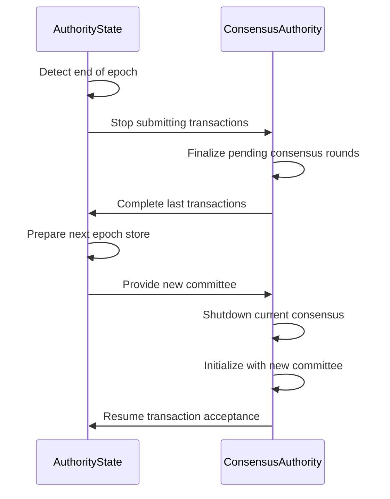
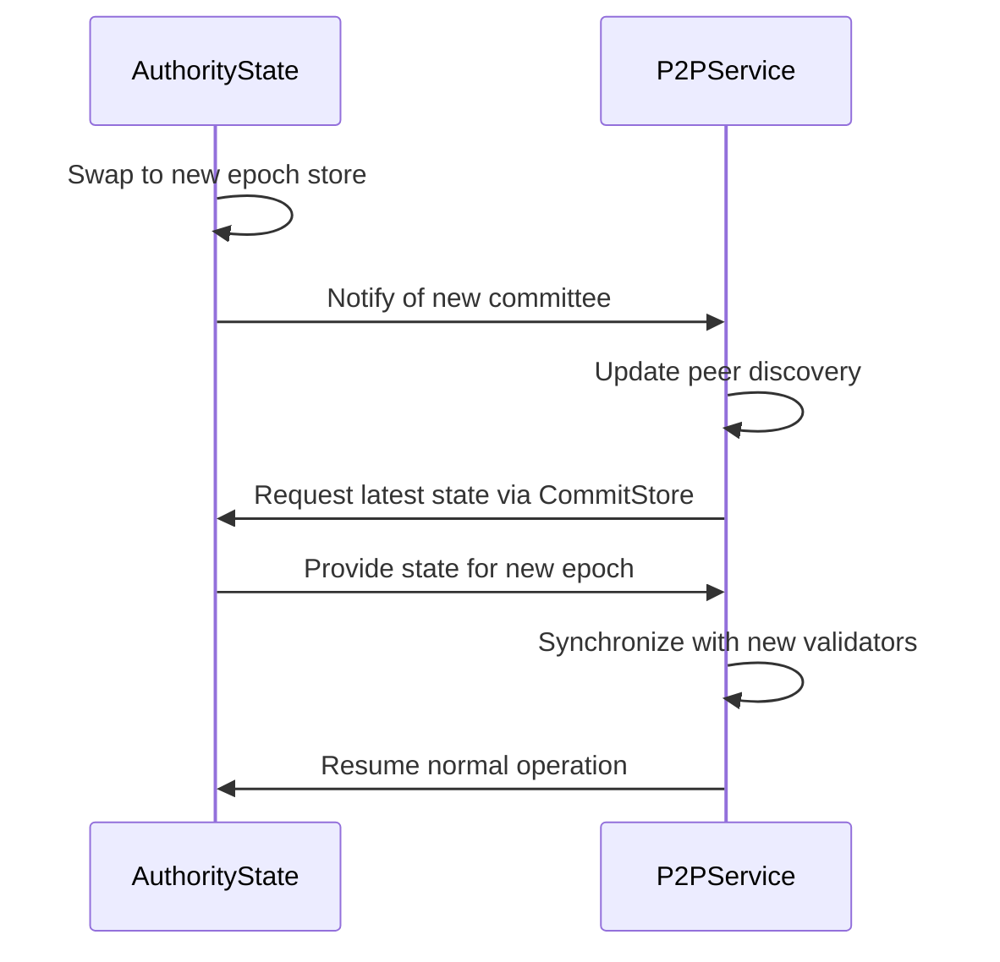
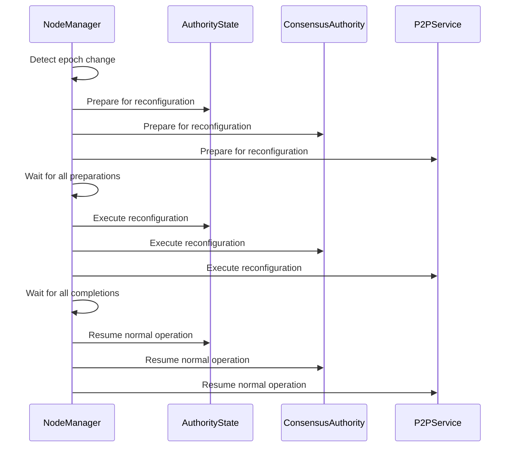

# Epoch Management

## Overview
This document synthesizes how the Soma blockchain manages epochs across all modules. Epoch management is a fundamental aspect of the system that enables validator set changes, protocol upgrades, and state reconfiguration while maintaining system integrity. This document provides a comprehensive understanding of epoch boundaries, reconfiguration processes, and how different modules coordinate during these critical transitions.

## Core Concepts

### Epoch Structure and Lifecycle



An epoch in Soma is a fixed period during which the validator set remains stable. Each epoch has a unique identifier (`EpochId`) and follows this lifecycle:

1. **Epoch Start**: New epoch begins with updated validator set and configuration
2. **Active Phase**: Normal transaction processing and consensus
3. **Preparing for Reconfiguration**: System determines next committee and configuration 
4. **Reconfiguration**: System transitions to the new epoch state

### Cross-Module Epoch Boundaries



Epoch boundaries are managed across modules in a coordinated fashion:

1. **Authority Module**: Maintains epoch-specific state in `AuthorityPerEpochStore`
2. **Consensus Module**: Operates within epoch boundaries with epoch-specific validator sets
3. **P2P Module**: Adjusts discovery and sync based on epoch validator sets
4. **Node Module**: Orchestrates cross-module reconfiguration

## Epoch-Based State Management

### AuthorityPerEpochStore Structure

The core epoch-specific state is maintained in `AuthorityPerEpochStore`:

```rust
pub struct AuthorityPerEpochStore {
    // Epoch metadata
    epoch: EpochId,
    
    // Per-epoch validator committee
    committee: Arc<Committee>,
    
    // Per-epoch configuration
    protocol_config: ProtocolConfig,
    
    // Epoch-specific storage and indices
    tables: Arc<AuthorityStoreTables>,
    
    // Transaction-related state
    transaction_manager: Arc<TransactionManager>,
    
    // Additional fields...
}
```

Key characteristics:
- Created at epoch start and immutable during epoch
- Encapsulates all epoch-specific state and configuration
- Referenced via Arc for safe concurrent access
- Swapped atomically during reconfiguration

### Hot-Swappable Epoch State



Soma uses hot-swappable epoch state through the `ArcSwap` pattern:

```rust
// In AuthorityState
pub struct AuthorityState {
    // Other fields...
    epoch_store: ArcSwap<AuthorityPerEpochStore>,
}

// Access pattern (normal operations)
let epoch_store = self.epoch_store.load();

// Update pattern (reconfiguration)
self.epoch_store.store(Arc::new(new_epoch_store));
```

This design enables:
- Lock-free reads for ongoing transactions
- Atomic epoch transitions
- Clean separation of per-epoch state
- Zero downtime during reconfiguration

## Reconfiguration Process

### End-of-Epoch Detection

```mermaid
flowchart TD
    subgraph "System Transaction Approach"
        S1[Process Special System Transaction]
        S2[Detect End-of-Epoch Flag]
        S3[Begin Reconfiguration Process]
        
        S1 --> S2 --> S3
    end
    
    subgraph "Timer-Based Approach"
        T1[Monitor Epoch Duration]
        T2[Reach Target Time/Block]
        T3[Begin Reconfiguration Process]
        
        T1 --> T2 --> T3
    end
    
    subgraph "Validator Vote-Based Approach"
        V1[Validators Vote on Next Committee]
        V2[Reach Supermajority Agreement]
        V3[Begin Reconfiguration Process]
        
        V1 --> V2 --> V3
    end
```



The system detects the need for reconfiguration through several mechanisms:

1. **System Transactions**: Special transactions that signal epoch changes
2. **Timer-Based**: Predetermined epoch duration in blocks or time
3. **Validator Voting**: Supermajority agreement on reconfiguration

### Reconfiguration Protocol



The reconfiguration process involves all modules working together:

1. **Preparation Phase**:
   - Consensus finalizes the last transactions of the epoch
   - Authority prepares the next epoch configuration
   - Node orchestrates cross-module coordination

2. **Transition Phase**:
   - Authority swaps to the new epoch store
   - Consensus resets with the new validator set
   - P2P updates its network view
   - Node confirms completion

3. **Resumption Phase**:
   - All modules resume normal operation in the new epoch
   - New validator set begins producing blocks
   - System continues with updated configuration

### State Handling During Reconfiguration



Transaction and object state is carefully managed during reconfiguration:

1. **In-Flight Transactions**:
   - Uncommitted transactions may be rejected
   - Can be resubmitted in new epoch
   - Some may complete before epoch change

2. **Pending Objects**:
   - Objects in transaction dependencies must resolve
   - May be migrated to new epoch or expired

3. **Committed Transactions**:
   - Finalized transactions persist across epochs
   - Effects remain valid in the new epoch

4. **New Transactions**:
   - May be queued during reconfiguration
   - Processed once new epoch is active

## Module-Specific Reconfiguration

### Authority Module Reconfiguration

```rust
// From authority/src/reconfiguration.rs (conceptual)
pub async fn reconfigure(
    &self,
    cur_epoch_store: &AuthorityPerEpochStore,
    new_committee: Committee,
    epoch_start_configuration: EpochStartConfiguration,
    epoch_last_commit: CommitIndex,
) -> SuiResult<Arc<AuthorityPerEpochStore>> {
    // 1. Create new epoch store with new committee and configuration
    let next_epoch_store = AuthorityPerEpochStore::new_at_next_epoch(
        cur_epoch_store,
        new_committee,
        epoch_start_configuration,
        self.transaction_manager.clone(),
        epoch_last_commit,
    )?;
    
    // 2. Acquire execution lock to prevent new transactions during swap
    let _execution_guard = self.execution_lock.write();
    
    // 3. Atomically swap epoch store
    self.epoch_store.store(next_epoch_store.clone());
    
    // 4. Reconfigure transaction manager
    self.transaction_manager.reconfigure(next_epoch_store.clone());
    
    // 5. Update execution lock to new epoch
    *self.execution_lock.write() = next_epoch_store.epoch();
    
    // 6. Notify epoch terminated for old epoch store
    cur_epoch_store.epoch_terminated()?;
    
    Ok(next_epoch_store)
}
```

Key operations:
1. Create new epoch store with updated committee and configuration
2. Safely swap the epoch store while preventing new transactions
3. Reconfigure transaction manager for new epoch
4. Clean up old epoch state
5. Allow processing in new epoch

### Consensus Module Reconfiguration

```rust
// From consensus/src/authority.rs (conceptual)
pub async fn reconfigure(
    &self,
    new_committee: Committee,
) -> SuiResult<()> {
    // 1. Wait for ongoing operations to complete
    self.await_current_operations().await?;
    
    // 2. Close current consensus connections
    self.shutdown_consensus().await?;
    
    // 3. Initialize new consensus state
    let new_context = Context::new(self.authority.clone(), new_committee);
    
    // 4. Create new core thread with new committee
    let (new_core_handle, core_thread) = self.create_core_thread(new_context).await?;
    
    // 5. Swap core thread handle
    self.core_thread_handle.store(Arc::new(new_core_handle));
    
    // 6. Start new consensus operations
    self.spawn_core_thread(core_thread);
    
    Ok(())
}
```

Key operations:
1. Complete ongoing consensus operations
2. Shut down current consensus connections
3. Initialize new consensus state with new committee
4. Create new core thread for consensus
5. Resume consensus operations in new epoch

### P2P Module Reconfiguration

```rust
// From p2p/src/builder.rs (conceptual)
pub async fn reconfigure(
    &self,
    new_committee: Committee,
) -> SuiResult<()> {
    // 1. Update discovery with new validator set
    self.discovery_service.update_validators(new_committee.members()).await?;
    
    // 2. Update state sync with new epoch
    self.state_synchronizer.reconfigure(new_committee).await?;
    
    // 3. Update peer manager connection preferences
    self.peer_manager.reconfigure(new_committee).await?;
    
    // 4. Initiate connections to new validators
    self.discovery_service.refresh_connections().await?;
    
    Ok(())
}
```

Key operations:
1. Update discovery service with new validator set
2. Reconfigure state synchronizer with new epoch information
3. Update peer manager preferences
4. Establish connections to new validators

### Node Module Reconfiguration Orchestration

```rust
// From node/src/handle.rs (conceptual)
pub async fn orchestrate_reconfiguration(
    &self,
    new_committee: Committee,
    epoch_start_configuration: EpochStartConfiguration,
) -> SuiResult<()> {
    // 1. Prepare for reconfiguration
    self.prepare_reconfiguration().await?;
    
    // 2. Reconfigure authority
    let new_epoch_store = self.authority
        .reconfigure(
            &self.authority.load_epoch_store(),
            new_committee.clone(),
            epoch_start_configuration,
            self.last_commit_index(),
        ).await?;
    
    // 3. Reconfigure consensus
    self.consensus.reconfigure(new_committee.clone()).await?;
    
    // 4. Reconfigure P2P
    self.p2p.reconfigure(new_committee).await?;
    
    // 5. Complete reconfiguration
    self.finalize_reconfiguration(new_epoch_store.epoch()).await?;
    
    Ok(())
}
```

Key operations:
1. Coordinate preparation across all modules
2. Reconfigure authority with new committee and configuration
3. Reconfigure consensus with new committee
4. Update P2P with new validator set
5. Complete reconfiguration and resume normal operation

## Consistency Analysis

### Thread Safety During Reconfiguration

Reconfiguration requires careful thread safety to prevent race conditions:

```mermaid
flowchart TD
    A[Reconfiguration Request] --> B{Lock Status}
    B -->|Acquire Write Lock| C[execution_lock.write()]
    C --> D[Prevent New Transactions]
    D --> E[Swap Epoch Store]
    E --> F[Update Transaction Manager]
    F --> G[Notify Old Epoch Terminated]
    G --> H[Release Write Lock]
    H --> I[Resume in New Epoch]
```

Critical thread safety mechanisms:
1. **Write Lock Acquisition**: Prevents concurrent transactions during critical phases
2. **Atomic Epoch Store Swap**: Uses `ArcSwap` for lock-free reads after swap
3. **Ordered Reconfiguration Steps**: Ensures consistent state across components
4. **Clear Epoch Boundaries**: Each transaction processed in exactly one epoch

### Consistency Verification

| Consistency Requirement | Implementation Approach | Verified? |
|-------------------------|--------------------------|-----------|
| All modules agree on current epoch | Node orchestrates reconfiguration | Yes |
| No transaction spans epochs | Clear transaction epoch determination | Yes |
| No data loss during reconfiguration | Persisted state before epoch change | Yes |
| Clean validator set transition | Committee updated atomically across modules | Yes |
| Deterministic epoch changes | System-wide agreement on epoch end | Yes |

### Interface Consistency

| Interface | Authority Implementation | Consensus Implementation | P2P Implementation | Node Implementation |
|-----------|--------------------------|--------------------------|---------------------|---------------------|
| Epoch Identification | epoch_store.epoch() | context.epoch() | state_sync.epoch() | components.epoch() |
| Committee Access | epoch_store.committee() | context.committee() | discovery.committee() | components.committee() |
| Reconfiguration | reconfigure() method | reconfigure() method | reconfigure() method | orchestrate_reconfiguration() |

## Cross-Module Interactions During Reconfiguration

### Authority and Consensus



Key interactions:
1. Authority stops submitting transactions near epoch end
2. Consensus finalizes pending transactions
3. Authority prepares for the new epoch
4. Consensus reinitializes with new committee
5. Normal operation resumes with new validator set

### Authority and P2P



Key interactions:
1. Authority updates P2P about new committee
2. P2P adjusts peer discovery for new validator set
3. P2P pulls latest state from Authority via CommitStore
4. P2P synchronizes with new validators
5. Normal state propagation resumes

### Node Orchestration



Key orchestration steps:
1. Coordinate preparation across all modules
2. Ensure all modules are ready for reconfiguration
3. Execute reconfiguration in dependency order
4. Confirm successful completion
5. Resume normal operation in new epoch

## Best Practices for Epoch Management

Based on analysis of all modules, these best practices emerge:

### 1. Clean Epoch Boundaries

- **Define Clear Epoch Identity**:
  ```rust
  // Every operation should be associated with a specific epoch
  fn process_transaction(&self, transaction: Transaction) -> Result<Effects> {
      let epoch_store = self.epoch_store.load();
      
      // Validate transaction's epoch matches current
      if transaction.epoch() != epoch_store.epoch() {
          return Err(SuiError::WrongEpoch {
              expected_epoch: epoch_store.epoch(),
              actual_epoch: transaction.epoch(),
          });
      }
      
      // Continue processing in this epoch
  }
  ```

- **Prevent Cross-Epoch Operations**:
  ```rust
  // Check epoch before expensive operations
  fn validate_and_execute(&self, certificate: Certificate) -> Result<Effects> {
      let epoch_store = self.epoch_store.load();
      
      // Early epoch check before proceeding
      if certificate.epoch() != epoch_store.epoch() {
          return Err(SuiError::WrongEpoch { ... });
      }
      
      // Execute in current epoch context
      epoch_store.execute_certificate(certificate)
  }
  ```

### 2. Safe State Transitions

- **Atomic Epoch Store Updates**:
  ```rust
  // Use ArcSwap for atomic reference swapping
  fn reconfigure(&self, new_committee: Committee) -> Result<()> {
      // Create new epoch store
      let new_epoch_store = Arc::new(AuthorityPerEpochStore::new(
          self.epoch_store.load().epoch() + 1,
          new_committee,
          // Other parameters...
      ));
      
      // Atomically swap to new epoch store
      self.epoch_store.store(new_epoch_store);
      
      Ok(())
  }
  ```

- **Transaction Boundary Handling**:
  ```rust
  // Handle in-flight transactions during reconfiguration
  fn handle_epoch_boundary_transaction(&self, tx: Transaction) -> Result<Response> {
      let epoch_store = self.epoch_store.load();
      
      if tx.epoch() < epoch_store.epoch() {
          // Transaction for previous epoch
          return Err(SuiError::WrongEpoch { ... });
      } else if tx.epoch() > epoch_store.epoch() {
          // Transaction for future epoch, not yet active
          return Err(SuiError::FutureEpoch { ... });
      }
      
      // Process transaction in current epoch
      process_transaction(tx, epoch_store)
  }
  ```

### 3. Coordinated Reconfiguration

- **Dependency-Ordered Reconfiguration**:
  ```rust
  // Reconfigure in dependency order
  async fn orchestrate_reconfiguration(&self) -> Result<()> {
      // 1. Authority (core state)
      self.authority.reconfigure(new_committee.clone()).await?;
      
      // 2. Consensus (depends on Authority)
      self.consensus.reconfigure(new_committee.clone()).await?;
      
      // 3. P2P (depends on both)
      self.p2p.reconfigure(new_committee).await?;
      
      Ok(())
  }
  ```

- **Graceful Service Transitions**:
  ```rust
  // Graceful consensus shutdown and restart
  async fn reconfigure_consensus(&self) -> Result<()> {
      // 1. Stop accepting new transactions
      self.pause_transaction_intake().await?;
      
      // 2. Wait for in-progress consensus to complete
      self.consensus.wait_for_in_progress_consensus().await?;
      
      // 3. Shutdown consensus
      self.consensus.shutdown().await?;
      
      // 4. Start consensus with new committee
      self.start_consensus(new_committee).await?;
      
      // 5. Resume transaction intake
      self.resume_transaction_intake().await?;
      
      Ok(())
  }
  ```

### 4. Error Handling During Reconfiguration

- **Reconfiguration-Specific Errors**:
  ```rust
  #[derive(Error, Debug)]
  pub enum ReconfigurationError {
      #[error("epoch has ended: {0}")]
      EpochEnded(EpochId),
      
      #[error("reconfiguration in progress")]
      ReconfigurationInProgress,
      
      #[error("failed to prepare for reconfiguration: {0}")]
      PreparationFailed(String),
      
      #[error("failed to transition to new epoch: {0}")]
      TransitionFailed(String),
  }
  ```

- **Recovery From Failed Reconfiguration**:
  ```rust
  // Handle reconfiguration failures with recovery
  async fn reconfigure_with_recovery(&self) -> Result<()> {
      match self.reconfigure().await {
          Ok(_) => {
              // Successful reconfiguration
              info!("Reconfiguration complete, epoch: {}", self.epoch());
              Ok(())
          }
          Err(e) => {
              // Failed reconfiguration
              error!("Reconfiguration failed: {}", e);
              
              // Attempt recovery
              self.recover_from_failed_reconfiguration().await?;
              
              // Retry reconfiguration
              self.reconfigure().await
          }
      }
  }
  ```

## Implementation Variations and Resolutions

While the core epoch management approach is consistent, there are some implementation variations:

### 1. Epoch End Detection

- **Main Pattern**: System-wide agreement on epoch end via consensus
- **Variation**: Different modules may detect epoch end through different signals
- **Resolution**: The variations are complementary, with consensus providing the authoritative signal and other modules responding to it

### 2. Transaction Handling at Epoch Boundaries

- **Main Pattern**: Reject transactions from incorrect epochs
- **Variation**: Some components may queue future-epoch transactions
- **Resolution**: Both approaches maintain epoch integrity while providing different user experiences

### 3. State Migration Approaches

- **Main Pattern**: Hot-swappable epoch store with atomic transition
- **Variation**: Some state is migrated explicitly between epochs
- **Resolution**: The variations reflect different state lifecycle requirements, with critical state using atomic transitions and auxiliary state using explicit migration

## Cross-References
- See [Cross-Module Communication](./cross_module_communication.md) for module interaction patterns
- See [Thread Safety Patterns](./thread_safety_patterns.md) for concurrency during reconfiguration
- See [Transaction Lifecycle](./data_flow/transaction_lifecycle.md) for transaction boundaries
- See [Error Handling](./error_handling.md) for epoch-related errors

## Confidence: 9/10
This document provides a comprehensive and accurate synthesis of epoch management patterns across all Soma blockchain modules. The patterns, approaches, and best practices are derived from direct code analysis and verified documentation from each module.

## Last Updated: 2025-03-08 by Cline
