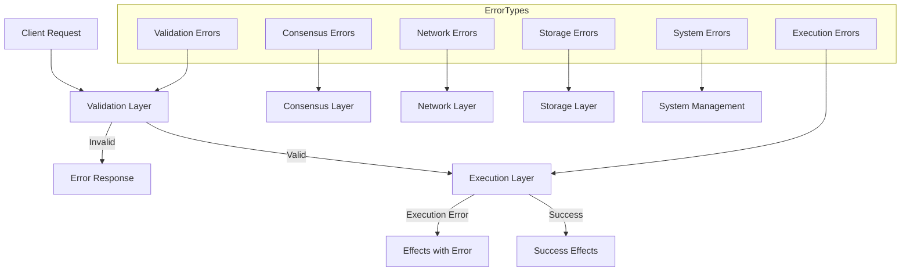

# Soma Blockchain Error Handling

## Purpose and Scope
This document describes the error handling patterns, practices, and types used throughout the Soma blockchain. It explains how errors are defined, propagated, and handled across different components, providing developers with a consistent approach to error management. Proper error handling is critical for blockchain systems where reliability, recoverability, and security are paramount.

## Key Components

### Error Type Hierarchy
- **Module-Specific Error Types**: Each module defines its own error enum
- **Error Traits**: Types implement `std::error::Error` via `thiserror`
- **Result Type Aliases**: Each module provides its own `Result<T>` type

### Error Categories
- **Validation Errors**: Issues with transaction or object validation
- **Execution Errors**: Problems during transaction execution
- **Consensus Errors**: Issues with consensus protocol
- **Network Errors**: Communication and peer-related issues
- **Storage Errors**: Database and persistence problems
- **System Errors**: General system and operational issues

### Recovery Mechanisms
- **Retry Logic**: For transient errors
- **Graceful Degradation**: Fallback paths for non-critical functions
- **Panic Boundaries**: Containment of unrecoverable errors

## Error Handling Architecture



## Core Error Types

### SomaError
The base error type for general operations:

```rust
#[derive(Debug, thiserror::Error)]
pub enum SomaError {
    #[error("epoch has ended: {0}")]
    EpochEnded(EpochId),
    
    #[error("wrong epoch, expected {expected_epoch}, actual {actual_epoch}")]
    WrongEpoch {
        expected_epoch: EpochId,
        actual_epoch: EpochId,
    },
    
    #[error("validator halted at epoch end")]
    ValidatorHaltedAtEpochEnd,
    
    #[error("database error: {0}")]
    DatabaseError(#[from] std::io::Error),
    
    #[error("internal error: {0}")]
    InternalError(String),
    
    // Additional error variants
}

pub type SomaResult<T> = Result<T, SomaError>;
```

### TransactionError
Specific errors related to transaction processing:

```rust
#[derive(Debug, thiserror::Error)]
pub enum TransactionError {
    #[error("transaction not found: {0}")]
    TransactionNotFound(TransactionDigest),
    
    #[error("invalid transaction signature")]
    InvalidSignature,
    
    #[error("object not found: {0}")]
    ObjectNotFound(ObjectID),
    
    #[error("object version mismatch: expected {expected_version}, found {found_version}")]
    ObjectVersionMismatch {
        expected_version: SequenceNumber,
        found_version: SequenceNumber,
    },
    
    // Additional error variants
}

pub type TransactionResult<T> = Result<T, TransactionError>;
```

### ConsensusError
Errors related to consensus operations:

```rust
#[derive(Debug, thiserror::Error)]
pub enum ConsensusError {
    #[error("invalid block: {0}")]
    InvalidBlock(String),
    
    #[error("invalid committee: {0}")]
    InvalidCommittee(String),
    
    #[error("insufficient stake: required {required}, found {found}")]
    InsufficientStake {
        required: Stake,
        found: Stake,
    },
    
    #[error("invalid threshold signature")]
    InvalidThresholdSignature,
    
    // Additional error variants
}

pub type ConsensusResult<T> = Result<T, ConsensusError>;
```

## Error Handling Patterns

### Using thiserror for Error Definition
Soma uses the `thiserror` crate for defining structured error types:

```rust
// Define an error type with thiserror
#[derive(Debug, thiserror::Error)]
pub enum ModuleError {
    #[error("specific error description: {0}")]
    SpecificError(String),
    
    #[error("error with context: {reason}")]
    ContextualError {
        reason: String,
        #[source]
        source: Option<Box<dyn std::error::Error + Send + Sync>>,
    },
    
    #[error(transparent)]
    IoError(#[from] std::io::Error),
}
```

**Key Features**:
- Descriptive error messages with formatting
- Source error tracking
- Automatic conversions with `#[from]`
- Error context and metadata

### Error Propagation
Errors are propagated using the `?` operator with context addition:

```rust
fn process_transaction(tx: Transaction) -> SomaResult<TransactionEffects> {
    // Propagate with additional context
    let object = get_object(tx.object_id())
        .map_err(|e| SomaError::InternalError(format!("Failed to load object: {}", e)))?;
    
    // Type conversion with the ? operator
    let effects = execute_transaction(&tx, object)?;
    
    Ok(effects)
}
```

### Error Context Enrichment
When crossing module boundaries, errors are often enriched with additional context:

```rust
// Converting from one error type to another
fn execute_consensus_tx(tx: ConsensusTransaction) -> SomaResult<()> {
    consensus_client.submit_transaction(tx)
        .map_err(|e| match e {
            ConsensusError::InvalidBlock(reason) => 
                SomaError::InternalError(format!("Consensus rejected block: {}", reason)),
            ConsensusError::InsufficientStake { required, found } =>
                SomaError::InternalError(format!("Insufficient stake: required {}, found {}", 
                                               required, found)),
            _ => SomaError::InternalError(format!("Consensus error: {}", e)),
        })?;
    
    Ok(())
}
```

### Specialized Error Handling
For different execution paths, Soma uses specialized error handling approaches:

```rust
// Different handling based on error type
match result {
    Ok(value) => process_success(value),
    Err(SomaError::EpochEnded(epoch)) => handle_epoch_transition(epoch),
    Err(SomaError::ObjectNotFound(id)) => request_object_sync(id),
    Err(e) => log_and_report_error(e),
}
```

### Result Type Aliases
Each module defines its own `Result` type alias for clearer signatures:

```rust
// Module-specific result types
pub type AuthorityResult<T> = Result<T, AuthorityError>;
pub type ConsensusResult<T> = Result<T, ConsensusError>;
pub type StorageResult<T> = Result<T, StorageError>;
```

## Transaction Execution Errors

Soma distinguishes between transaction validation errors and execution errors:

1. **Validation Errors**: 
   - Occur during pre-execution validation
   - Prevent transaction from being executed
   - Return error to client immediately
   - Example: Invalid signature, object not found

2. **Execution Errors**:
   - Occur during transaction execution
   - Transaction is still committed with error status
   - Error recorded in transaction effects
   - Example: Invalid operation on object, insufficient funds

```rust
// Example of execution status with error
pub enum ExecutionStatus {
    Success,
    Failure {
        error: ExecutionFailureStatus,
    },
}

pub enum ExecutionFailureStatus {
    InsufficientGas,
    InvalidGasObject,
    InvalidTransactionUpdate,
    // Additional failure reasons
}
```

## Error Recovery Strategies

### Retry Mechanisms
For transient errors, especially in network operations:

```rust
async fn with_retries<F, Fut, T, E>(operation: F, max_retries: usize) -> Result<T, E>
where
    F: Fn() -> Fut,
    Fut: Future<Output = Result<T, E>>,
    E: std::fmt::Display,
{
    let mut retries = 0;
    let mut delay = Duration::from_millis(100);
    
    loop {
        match operation().await {
            Ok(result) => return Ok(result),
            Err(e) => {
                if retries >= max_retries {
                    return Err(e);
                }
                
                log::warn!("Operation failed, retry {}/{}: {}", retries + 1, max_retries, e);
                retries += 1;
                tokio::time::sleep(delay).await;
                delay *= 2; // Exponential backoff
            }
        }
    }
}
```

### Graceful Degradation
For non-critical components:

```rust
fn get_cached_data(key: &str) -> Option<Data> {
    match cache.get(key) {
        Ok(data) => Some(data),
        Err(e) => {
            log::warn!("Cache error, falling back to database: {}", e);
            match database.get(key) {
                Ok(data) => Some(data),
                Err(e) => {
                    log::error!("Database error: {}", e);
                    None
                }
            }
        }
    }
}
```

### Panic Boundaries
For containing critical failures:

```rust
fn with_panic_boundary<F, T>(operation: F) -> Option<T>
where
    F: FnOnce() -> T + std::panic::UnwindSafe,
{
    match std::panic::catch_unwind(operation) {
        Ok(result) => Some(result),
        Err(e) => {
            if let Some(s) = e.downcast_ref::<String>() {
                log::error!("Caught panic: {}", s);
            } else if let Some(s) = e.downcast_ref::<&str>() {
                log::error!("Caught panic: {}", s);
            } else {
                log::error!("Caught unknown panic");
            }
            None
        }
    }
}
```

## Module-Specific Error Handling

### Authority Module
- Focuses on transaction validation and state errors
- Handles epoch transitions and reconfiguration errors
- Uses detailed error tracking for transaction failures

```rust
// Example from authority
match authority_state.handle_transaction(transaction) {
    Ok(response) => respond_success(response),
    Err(AuthorityError::ObjectNotFound(id)) => {
        metrics.inc_counter("object_not_found_errors");
        respond_error(StatusCode::NOT_FOUND, format!("Object not found: {}", id))
    },
    Err(AuthorityError::InvalidSignature) => {
        metrics.inc_counter("auth_errors");
        respond_error(StatusCode::UNAUTHORIZED, "Invalid signature")
    },
    Err(e) => {
        metrics.inc_counter("internal_errors");
        log::error!("Internal error: {}", e);
        respond_error(StatusCode::INTERNAL_SERVER_ERROR, "Internal error")
    }
}
```

### Consensus Module
- Handles Byzantine fault tolerance errors
- Manages view changes and leader failures
- Reports consensus violations for security monitoring

```rust
// Example from consensus
fn handle_vote(vote: Vote) -> ConsensusResult<()> {
    if !committee.is_validator(&vote.author) {
        return Err(ConsensusError::UnknownValidator(vote.author));
    }
    
    if !vote.verify_signature() {
        metrics.inc_counter("invalid_votes");
        return Err(ConsensusError::InvalidSignature);
    }
    
    // Continue processing
    Ok(())
}
```

### P2P Module
- Focuses on network communication errors
- Handles peer disconnections and timeouts
- Manages state synchronization failures

```rust
// Example from P2P
async fn fetch_object(peer: PeerId, object_id: ObjectID) -> NetworkResult<Object> {
    let request = ObjectRequest { object_id };
    
    match network.send_request(peer, request).await {
        Ok(response) => Ok(response.object),
        Err(NetworkError::Timeout) => {
            metrics.inc_counter("request_timeouts");
            Err(NetworkError::Timeout)
        },
        Err(NetworkError::PeerDisconnected) => {
            metrics.inc_counter("peer_disconnections");
            peer_manager.mark_peer_disconnected(peer);
            Err(NetworkError::PeerDisconnected)
        },
        Err(e) => {
            log::error!("Network error: {}", e);
            Err(e)
        }
    }
}
```

## Error Logging and Metrics

### Structured Logging
Errors are logged with context and metadata:

```rust
fn log_error(error: &SomaError, context: &str) {
    match error {
        SomaError::EpochEnded(epoch) => {
            log::info!(
                target: "error_handling",
                "Operation failed due to epoch transition: epoch={} context={}",
                epoch, context
            );
        },
        SomaError::DatabaseError(e) => {
            log::error!(
                target: "error_handling",
                "Database error: error={} context={}",
                e, context
            );
        },
        // Additional error cases
        _ => {
            log::error!(
                target: "error_handling",
                "Unexpected error: error={:?} context={}",
                error, context
            );
        }
    }
}
```

### Error Metrics
Key metrics are tracked for monitoring:

```rust
fn track_error_metrics(error: &SomaError) {
    match error {
        SomaError::EpochEnded(_) => {
            metrics.inc_counter("errors_epoch_ended");
        },
        SomaError::WrongEpoch { .. } => {
            metrics.inc_counter("errors_wrong_epoch");
        },
        SomaError::DatabaseError(_) => {
            metrics.inc_counter("errors_database");
        },
        // Additional error cases
        _ => {
            metrics.inc_counter("errors_other");
        }
    }
}
```

## Best Practices for Error Handling

1. **Use Structured Error Types**:
   - Define error enums with `thiserror`
   - Include relevant context in error variants
   - Implement appropriate traits (`Error`, `Display`)

2. **Avoid Unwrap/Expect**:
   - Never use `.unwrap()` or `.expect()` in production code
   - Handle all error cases explicitly or propagate with `?`
   - Use `?` for clean error propagation

3. **Provide Context**:
   - Add context when crossing module boundaries
   - Include operation-specific details in errors
   - Preserve original error information when possible

4. **Log Appropriately**:
   - Use appropriate log levels (error, warn, info)
   - Include relevant context in log messages
   - Don't expose sensitive information in errors

5. **Consider Error Consumers**:
   - Internal errors: Detailed for developers
   - External errors: Clear, safe, actionable
   - Admin errors: Diagnosable with context

## Conclusion
Soma's error handling strategy balances safety, performance, and developer experience. The system uses structured error types to provide clear, context-rich error information while maintaining efficient error propagation patterns. Critical blockchain operations, like transaction validation and execution, use specialized error handling to ensure safe system behavior even in the presence of failures.

## Confidence: 9/10
This document provides a comprehensive overview of the error handling patterns and practices used in the Soma blockchain. The approach is well-established and consistently implemented across the codebase.

## Last Updated: 2025-03-08
