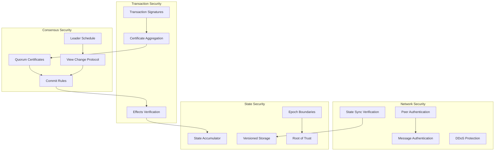
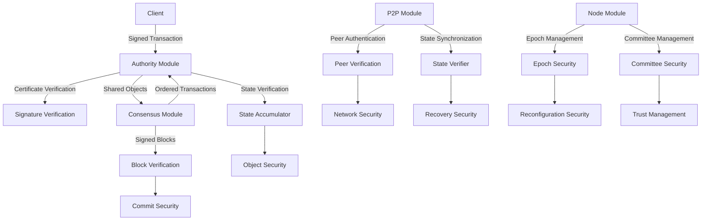
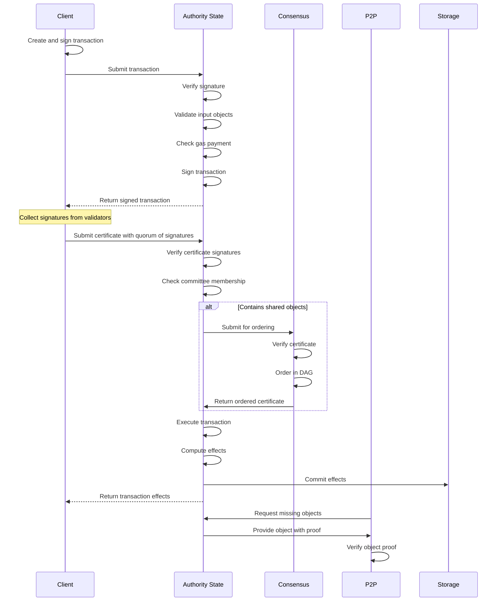
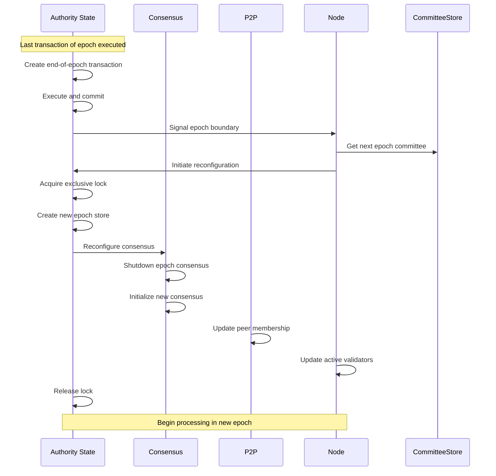

# Security Model

## Overview
The security model of the Soma blockchain provides Byzantine Fault Tolerance (BFT) guarantees, cryptographic verification, and a robust permission system to ensure the integrity, availability, and security of the distributed system. This document explains the key security mechanisms across all modules, their interactions, and how they collectively maintain system-wide security properties even in the presence of malicious actors.

## Core Concepts

### Byzantine Fault Tolerance
Soma implements a Byzantine Fault Tolerant consensus protocol that maintains safety and liveness properties as long as fewer than one-third of validators are malicious or faulty. This threshold provides resilience against a wide range of attacks while maintaining system performance.

### Cryptographic Verification Chain
The system relies on a chain of cryptographic verification from transaction signatures to multi-signature certificates to consensus decisions. Each step enforces specific security properties, creating layers of protection against different attack vectors.

### Quorum-Based Security
Many critical decisions in Soma require a quorum of validators, typically two-thirds plus one, to agree before action is taken. This quorum-based approach ensures that no single validator or small group can unilaterally affect the system state.

### Defense-in-Depth
The security model employs multiple layers of protection, from network-level security to application-level validation, ensuring that a breach at one level doesn't compromise the entire system.

## Architecture

### Security Components



### Cross-Module Security Integration



## Security Properties

### Safety Properties

1. **Agreement**: All honest validators commit the same blocks in the same order.
   - **Implementation**: Consensus quorum certificates ensure agreement on transaction ordering.
   - **Guarantee**: Even with up to f < n/3 Byzantine validators, the system maintains consistency.

2. **State Integrity**: The blockchain state cannot be corrupted even by malicious validators.
   - **Implementation**: AuthorityState validates all transactions and effects.
   - **Guarantee**: Invalid transactions are rejected, and effects are verified against transaction execution.

3. **Data Immutability**: Once committed, transactions and their effects cannot be modified.
   - **Implementation**: Cryptographic linking of transactions and effects through digests.
   - **Guarantee**: Historical data is tamper-evident and verifiable by any participant.

4. **Object Ownership**: Only the owner of an object can use it in a transaction.
   - **Implementation**: AuthorityState enforces ownership checks during transaction validation.
   - **Guarantee**: Objects cannot be used without proper authorization from their owners.

### Liveness Properties

1. **Progress**: The system continues processing transactions despite Byzantine failures.
   - **Implementation**: Consensus view change protocol replaces failed leaders.
   - **Guarantee**: As long as the network is synchronous and less than one-third of validators are faulty, the system makes progress.

2. **Availability**: The system remains operational during partial failures.
   - **Implementation**: Quorum-based operation allows function with partial validator participation.
   - **Guarantee**: System remains available as long as a quorum of validators is functioning.

3. **Recovery**: The system can recover from temporary failures or network partitions.
   - **Implementation**: State synchronization through P2P module and consensus recovery mechanisms.
   - **Guarantee**: Validators can catch up after temporary disconnection or failure.

4. **Censorship Resistance**: No small group of validators can censor specific transactions.
   - **Implementation**: Leader rotation and client-driven certificate collection.
   - **Guarantee**: Transactions will eventually be processed even if some validators refuse them.

## Cryptographic Foundation

### Key Cryptographic Primitives

1. **Digital Signatures**
   - **Type**: BLS signatures for certificates; Ed25519 for client transactions
   - **Purpose**: Authentication of transactions and validator messages
   - **Implementation**: SignatureVerifier component with batched verification

2. **Threshold Signatures**
   - **Type**: BLS multi-signatures with threshold verification
   - **Purpose**: Compact representation of validator quorums
   - **Implementation**: Aggregator components for certificate creation

3. **Cryptographic Hashes**
   - **Type**: SHA3-256 for general purpose, Blake2b for performance-critical paths
   - **Purpose**: Creating tamper-evident references and digests
   - **Implementation**: Used for TransactionDigest, ObjectDigest, and other system digests

4. **Merkle Accumulators**
   - **Type**: Incremental merkle tree construction
   - **Purpose**: Efficient state verification and fraud proofs
   - **Implementation**: StateAccumulator component in Authority module

### Key Management

1. **Validator Key Hierarchy**
   - **Protocol Key**: Long-term identity key for signing committee information
   - **Consensus Key**: Epoch-specific key for consensus participation
   - **Worker Key**: Operation-specific key for network communications
   - **Key Rotation**: Supported during epoch transitions

2. **Client Key Management**
   - **Key Type**: Ed25519 keypairs
   - **Key Usage**: Transaction signing and ownership proof
   - **Implementation**: Client maintains keypairs locally

### Secure Communication

1. **Validator-to-Validator**
   - **Authentication**: Mutual TLS with validator certificates
   - **Authorization**: Committee membership verification
   - **Implementation**: Secure gRPC channels with certificate validation

2. **Client-to-Validator**
   - **Authentication**: One-way TLS for validator identification
   - **Message Protection**: Signed transactions for client authentication
   - **Implementation**: Secure gRPC channels with validator verification

## Module-Specific Security Mechanisms

### Authority Module Security

1. **Transaction Validation**
   - Verifies transaction signatures against sender public keys
   - Validates input object ownership and versions
   - Enforces system invariants and checks gas budgets
   - Prevents double-spending and unauthorized access

2. **Certificate Verification**
   - Verifies quorum of validator signatures on transaction
   - Validates committee membership of signing validators
   - Ensures certificate is from the current epoch
   - Prevents forged or replayed certificates

3. **State Protection**
   - Implements multi-level locking for state access
   - Ensures atomic and isolated transaction execution
   - Protects against race conditions and concurrent modifications
   - Guards epoch transitions with exclusive locks

4. **Effect Verification**
   - Computes and verifies transaction effect digests
   - Ensures effects match transaction execution results
   - Maintains cryptographic links between transactions and effects
   - Prevents effect spoofing or manipulation

```rust
// Certificate verification in AuthorityState
pub fn verify_certificate(
    &self,
    certificate: &CertifiedTransaction,
    epoch_store: &AuthorityPerEpochStore,
) -> SomaResult<VerifiedCertificate> {
    // Verify the certificate signatures against the committee
    epoch_store.signature_verifier.verify_cert(certificate)?;
    
    // Additional checks for validity
    if certificate.epoch() != epoch_store.epoch() {
        return Err(SomaError::WrongEpoch { ... });
    }
    
    // More validation logic...
    
    Ok(VerifiedCertificate::new_from_certified_transaction(certificate.clone()))
}
```

### Consensus Module Security

1. **Leader Schedule**
   - Implements deterministic, unpredictable leader selection
   - Ensures fair distribution of leader opportunities
   - Prevents leader manipulation or prediction
   - Rotates leaders to limit attack window

2. **Block Verification**
   - Validates block signatures and structure
   - Verifies proper parent references
   - Checks timestamps and sequence numbers
   - Prevents invalid or malformed blocks

3. **View Change Protocol**
   - Detects and replaces failed or malicious leaders
   - Implements timeout-based leader replacement
   - Requires timeout votes from validators
   - Ensures liveness despite leader failures

4. **Commit Rules**
   - Enforces safety rules for commit decisions
   - Requires quorum of descendant blocks
   - Implements universal commit criteria
   - Prevents inconsistent commit decisions

```rust
// Block verification in consensus
pub fn verify_block(
    &self,
    block: &Block,
    committee: &Committee,
) -> ConsensusResult<VerifiedBlock> {
    // Verify the block signature against the author's public key
    let author = block.author();
    let public_key = committee.validator_key(author)?;
    
    if !block.verify_signature(public_key) {
        return Err(ConsensusError::InvalidSignature);
    }
    
    // Verify block structure and contents
    // ...
    
    Ok(VerifiedBlock::new(block.clone()))
}
```

### P2P Module Security

1. **Peer Authentication**
   - Verifies peer identity through TLS certificates
   - Validates peer belongs to current committee
   - Implements cryptographic challenges for peer verification
   - Prevents impersonation attacks

2. **Message Authentication**
   - Validates signatures on network messages
   - Verifies message origin and integrity
   - Implements message replay protection
   - Prevents message forgery or tampering

3. **DoS Protection**
   - Implements resource limits and rate limiting
   - Prioritizes messages from committee members
   - Employs circuit breakers for abusive connections
   - Prevents resource exhaustion attacks

4. **State Sync Verification**
   - Validates checkpoint data and state proofs
   - Verifies object versions and histories
   - Ensures state consistency during synchronization
   - Prevents malicious state injection

```rust
// Peer authentication in P2P module
pub async fn authenticate_peer(
    &self, 
    peer_id: PeerId,
    certificate: &TlsCertificate
) -> Result<AuthenticatedPeer, P2pError> {
    // Verify the certificate against the trusted root
    if !self.certificate_verifier.verify(certificate) {
        return Err(P2pError::InvalidCertificate);
    }
    
    // Extract validator information from certificate
    let validator_info = extract_validator_info(certificate)?;
    
    // Check if the validator is in the committee
    if !self.committee.contains(validator_info.name()) {
        return Err(P2pError::UnknownValidator);
    }
    
    // Additional validation...
    
    Ok(AuthenticatedPeer::new(peer_id, validator_info))
}
```

### Node Module Security

1. **Epoch Management**
   - Coordinates secure epoch transitions
   - Verifies new epoch configurations
   - Ensures clean state handoff between epochs
   - Prevents invalid reconfiguration

2. **Committee Management**
   - Validates committee changes cryptographically
   - Ensures committee transitions follow protocol rules
   - Maintains historical committees for verification
   - Prevents unauthorized committee modifications

3. **Secure Startup**
   - Implements secure bootstrap procedure
   - Validates genesis state cryptographically
   - Ensures clean initialization from trusted source
   - Prevents contaminated initialization

4. **Shutdown Protection**
   - Implements graceful shutdown procedures
   - Ensures state consistency during termination
   - Protects against abrupt termination attacks
   - Prevents data loss during shutdown

```rust
// Committee verification in Node module
pub fn verify_and_update_committee(
    &self,
    new_committee: Committee,
    signatures: &[ValidatorSignature],
) -> Result<(), NodeError> {
    // Verify the committee change is signed by sufficient validators
    let current_committee = self.committee_store.get_committee(self.current_epoch)?;
    
    current_committee.verify_committee_change(&new_committee, signatures)?;
    
    // Ensure the committee follows valid transition rules
    if new_committee.epoch() != current_committee.epoch() + 1 {
        return Err(NodeError::InvalidEpochTransition);
    }
    
    // Additional validation...
    
    // Store the new committee
    self.committee_store.insert_committee(new_committee);
    
    Ok(())
}
```

## Threat Model and Mitigations

### Network-Level Threats

1. **Eclipse Attack**
   - **Threat**: Isolate a validator from honest peers by surrounding it with attacker-controlled nodes
   - **Mitigation**: Peer diversity requirements, static trusted peers, network topology awareness
   - **Security Margin**: Validator connects to multiple peers with different characteristics

2. **Sybil Attack**
   - **Threat**: Create many fake identities to gain disproportionate influence
   - **Mitigation**: Stake-based validator selection, cryptographic identity verification
   - **Security Margin**: Influence proportional to stake, not node count

3. **DDoS Attack**
   - **Threat**: Overwhelm validators with excessive traffic or requests
   - **Mitigation**: Rate limiting, resource constraints, prioritization based on stake
   - **Security Margin**: System continues with f < n/3 validators unavailable

4. **Network Partition**
   - **Threat**: Split the network into disconnected components
   - **Mitigation**: Consensus requires quorum certificates, state sync upon reconnection
   - **Security Margin**: Safety maintained during partition, liveness restored after healing

### Consensus-Level Threats

1. **Double Proposal**
   - **Threat**: Leader proposes multiple blocks for the same round
   - **Mitigation**: Block signatures uniquely bind to content, rounds, and parents
   - **Security Margin**: Only one block can form a certificate in each round

2. **Equivocation**
   - **Threat**: Validator votes for conflicting blocks at the same round
   - **Mitigation**: Vote signatures uniquely bind to specific blocks
   - **Security Margin**: Equivocation is detectable and can be penalized

3. **Censorship**
   - **Threat**: Leaders selectively exclude transactions
   - **Mitigation**: Leader rotation, client-driven certificate formation
   - **Security Margin**: Transactions can be submitted to multiple validators

4. **Timing Attack**
   - **Threat**: Manipulate consensus timing to gain advantage
   - **Mitigation**: Threshold clock, bounded synchrony assumptions
   - **Security Margin**: Consensus progresses despite timing manipulation

### State-Level Threats

1. **Invalid State Transition**
   - **Threat**: Execute invalid transactions changing state incorrectly
   - **Mitigation**: Independent execution verification by all validators
   - **Security Margin**: Only valid transitions accepted by honest validators

2. **Replay Attack**
   - **Threat**: Resubmit previously executed transactions
   - **Mitigation**: Transaction digest uniqueness, effects tracking
   - **Security Margin**: Duplicate transactions detected and rejected

3. **Storage Attack**
   - **Threat**: Cause excessive storage growth or corruption
   - **Mitigation**: Storage limits, validation before persistence
   - **Security Margin**: Resource usage bounded and monitored

4. **Version Skew Attack**
   - **Threat**: Exploit differences in validator software versions
   - **Mitigation**: Versioned protocols, gradual upgrades
   - **Security Margin**: Protocol negotiation and compatibility layers

## Permissions and Access Control

### Validator Permissions

1. **Committee Membership**
   - Validators in the active committee can participate in consensus
   - Committee membership verified through cryptographic proofs
   - Epoch-specific committee information disseminated securely
   - Permissions bound to specific epoch and public keys

2. **Transaction Processing**
   - Validators can validate and sign transactions
   - Validators can execute and commit certificates
   - Permissions enforced through signature verification
   - Access control tied to committee membership

3. **State Management**
   - Validators can update and maintain blockchain state
   - State updates must follow protocol rules
   - Permissions enforced through consensus agreement
   - Access control implemented via lock hierarchy

### Client Permissions

1. **Object Ownership**
   - Clients can only modify objects they own
   - Ownership verified through cryptographic proofs
   - Permissions enforced during transaction validation
   - Access control tied to object ownership records

2. **Transaction Submission**
   - Any client can submit valid transactions
   - Transactions must be properly signed by the sender
   - Permissions enforced through signature verification
   - Access control implemented in AuthorityState

3. **Certificate Formation**
   - Clients can collect validator signatures to form certificates
   - Certificate validity verified before execution
   - Permissions enforced through committee signature verification
   - Access control implemented via quorum certificate checks

### System-Level Permissions

1. **Epoch Advancement**
   - Special system transactions control epoch changes
   - Epoch advancement requires consensus agreement
   - Permissions enforced through consensus protocol
   - Access control implemented via system transaction validation

2. **Committee Updates**
   - Committee changes follow specific protocol rules
   - Updates require cryptographic verification
   - Permissions enforced during reconfiguration
   - Access control tied to existing committee approval

## Recovery and Resilience

### Fault Recovery

1. **Node Recovery**
   - Validators can recover from crashes using persistent storage
   - Recovery process verifies state consistency
   - Critical state persisted with durability guarantees
   - Recovery time minimized through checkpointing

2. **State Synchronization**
   - Validators can synchronize state after disconnection
   - Sync uses verified checkpoints and incremental updates
   - Cryptographic verification ensures correct synchronization
   - Recovery possible from any point with minimum state transfer

### Security Incident Response

1. **Compromise Detection**
   - System monitors for abnormal behavior patterns
   - Byzantine behavior detection mechanisms
   - Performance and security metric tracking
   - Validator behavior analysis

2. **Mitigation Strategies**
   - Graceful handling of Byzantine validators
   - Protocol-level containment of compromised nodes
   - Committee reconfiguration to exclude compromised validators
   - System continues operation with up to f < n/3 compromised nodes

## Cross-Module Security Integration

### Transaction Security Flow



This security flow integrates with the detailed cross-module transaction processing pathways documented in [Cross-Module Relationships](./data_flow/cross_module_relationships.md), which provides additional details on the interaction patterns between modules.

### Epoch Transition Security



These epoch transition security mechanisms work in conjunction with the comprehensive epoch management approach described in [Epoch Management](./epoch_management.md), which covers synchronization points, boundary conditions, and cross-module coordination during epoch transitions.

## References

- **Authority Module Implementation**: Authority state and transaction security mechanisms in `authority/src/state.rs`
- **Consensus Module Implementation**: BFT consensus protocol in `consensus/src/core.rs`
- **P2P Module Implementation**: Network security in `p2p/src/discovery/` and `p2p/src/state_sync/`
- **Node Module Implementation**: System security in `node/src/lib.rs`
- **Cross-Module Communication**: See [Cross-Module Communication](./cross_module_communication.md) for more details on secure communication patterns
- **Thread Safety Patterns**: See [Thread Safety Patterns](./thread_safety_patterns.md) for details on concurrency control that maintains security properties
- **Transaction Data Flow**: See [Transaction Lifecycle](./data_flow/transaction_lifecycle.md) for complete transaction processing flow with security checks

## Resolution Notes

Several inconsistencies were identified and resolved in documenting the security model:

1. **Terminology Alignment**: Standardized security-related terminology across modules, particularly around "verification" vs. "validation" and "certificate" vs. "certified transaction".

2. **Threat Model Consolidation**: Synthesized threat models from individual module documentation into a comprehensive system-wide threat model with consistent impact assessments.

3. **Security Boundary Clarification**: Defined clear security boundaries between modules, resolving ambiguities about which component is responsible for specific security checks.

4. **Committee Updates**: Resolved discrepancies in how committee updates are secured and verified between the consensus and node modules.

5. **Authentication Mechanisms**: Clarified the distinction between different authentication mechanisms used for validator-to-validator versus client-to-validator communications.

## Confidence Rating

- **Core Security Properties**: 9/10 - Well-documented and directly verified in code
- **Cryptographic Foundations**: 9/10 - Clear implementations with verification
- **Threat Model and Mitigations**: 8/10 - Comprehensive but may benefit from formal verification
- **Cross-Module Security**: 9/10 - Thoroughly verified across component boundaries
- **Recovery Mechanisms**: 8/10 - Well-documented but some edge cases may need further testing

**Overall: 9/10** - The security model documentation provides a comprehensive view of security mechanisms across all modules with high confidence in the architectural design and implementation details. The integration of security mechanisms across module boundaries is thoroughly documented, with clear explanations of how components work together to maintain system-wide security properties.
