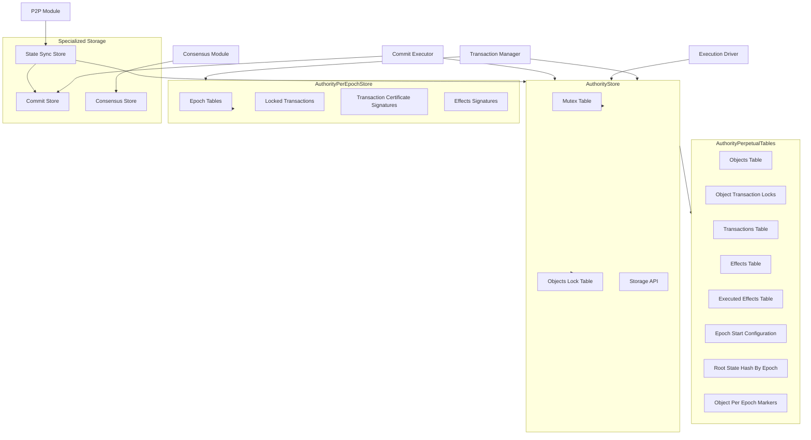
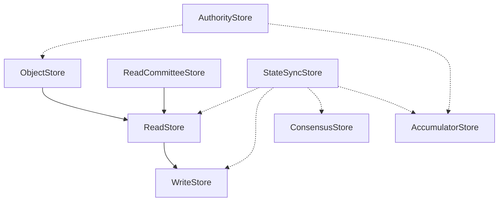

# Storage Model

## Overview
The storage model in the Soma blockchain provides a persistent, structured foundation for the blockchain state. It manages objects, transactions, effects, and related metadata across epoch boundaries, ensuring data consistency and durability while enabling efficient access patterns. The storage model is critical for transaction execution, state synchronization, and system recovery.

## Core Concepts

### Storage Hierarchy
The storage system follows a hierarchical organization with clear separation of concerns:

1. **Perpetual Storage**: Long-lived storage that persists across epoch transitions, containing core blockchain state including objects, transactions, and effects.

2. **Per-Epoch Storage**: Epoch-specific storage that is reset during reconfiguration, containing temporary state such as transaction locks, pending certificates, and epoch-specific indices.

3. **Caching Layer**: In-memory caching for frequently accessed data, providing performance optimization while maintaining consistency with the underlying storage.

4. **Specialized Storage Components**: Purpose-built storage components for specific functionality:
   - **CommitStore**: Manages consensus commits, watermarks, and execution state
   - **StateSyncStore**: Facilitates state synchronization across validators
   - **ConsensusStore**: Handles storage of consensus-specific data

### Object Storage
The object storage system is designed to handle the Soma blockchain's unique object model:

1. **Objects Table**: Maps `ObjectKey(ID, Version)` to `StoreObject`, which can represent either a live object or a tombstone.

2. **Object Transaction Locks**: Maps `ObjectRef(ID, Version, Digest)` to optional lock details, tracking which objects are currently locked by which transactions.

3. **Per-Epoch Object Markers**: Maps `(EpochID, FullObjectKey)` to `MarkerValue`, tracking object state changes within an epoch.

### Transaction Storage
Transaction storage manages the lifecycle of transactions through the system:

1. **Transactions Table**: Maps `TransactionDigest` to verified transaction data.

2. **Effects Table**: Maps `TransactionEffectsDigest` to transaction effects.

3. **Executed Effects Table**: Maps `TransactionDigest` to `TransactionEffectsDigest`, tracking which transactions have been executed locally.

### Consistency Management
The storage model employs several mechanisms to ensure data consistency:

1. **Lock Hierarchy**: A structured hierarchy of locks that ensures consistent access to shared data.

2. **Atomic Operations**: Operations that ensure data is updated consistently across related tables.

3. **Versioned Objects**: Object state is versioned to facilitate transaction validation and execution.

4. **Epoch Boundaries**: Clear delineation of epoch boundaries to enable safe reconfiguration.

## Architecture

### Storage Components



### Specialized Storage Components

#### CommitStore
The `CommitStore` is a specialized component for tracking consensus commits and their execution status:

- **Commit Tracking**: Maps commit indices to `CommittedSubDag` objects representing ordered transactions
- **Watermark Management**: Maintains watermarks for tracking highest synced and executed commits
- **Epoch Boundaries**: Tracks the last commit of each epoch to facilitate epoch transitions
- **Consistency Verification**: Verifies local and remote commit consistency to detect potential forks

```rust
pub struct CommitStore {
    commit_index_by_digest: RwLock<BTreeMap<CommitDigest, CommitIndex>>,
    certified_commits: RwLock<BTreeMap<CommitIndex, CommittedSubDag>>,
    commit_by_digest: RwLock<BTreeMap<CommitDigest, CommittedSubDag>>,
    watermarks: RwLock<BTreeMap<CommitWatermark, (CommitIndex, CommitDigest)>>,
    epoch_last_commit_map: RwLock<BTreeMap<EpochId, CommitIndex>>,
    locally_computed_commits: RwLock<BTreeMap<CommitIndex, CommittedSubDag>>,
}
```

#### StateSyncStore
The `StateSyncStore` facilitates state synchronization with other validators:

- **Storage Delegation**: Acts as a facade over multiple storage components
- **Committee Management**: Handles committee updates during sync
- **Commit Processing**: Processes committed subdags from peers
- **Interface Implementation**: Implements multiple storage interfaces for comprehensive access

```rust
pub struct StateSyncStore {
    cache_traits: ExecutionCacheTraitPointers,
    committee_store: Arc<CommitteeStore>,
    commit_store: Arc<CommitStore>,
    consensus_store: Arc<dyn ConsensusStore>,
    highest_synced_commit: Arc<Mutex<Option<CommitIndex>>>,
}
```

### Storage Trait Hierarchy

The storage system defines a clean hierarchy of traits that enable interoperability between components:



#### Key Interfaces

1. **ObjectStore Interface**: Enables retrieving objects by ID and version.
   ```rust
   pub trait ObjectStore {
       fn get_object(&self, object_id: &ObjectID) -> Result<Option<Object>, Error>;
       fn get_object_by_key(&self, object_id: &ObjectID, version: Version) -> Result<Option<Object>, Error>;
   }
   ```

2. **ReadCommitteeStore Interface**: Enables retrieving committee information.
   ```rust
   pub trait ReadCommitteeStore: Send + Sync {
       fn get_committee(&self, epoch: EpochId) -> Result<Option<Arc<Committee>>>;
   }
   ```

3. **ReadStore Interface**: Combines ObjectStore and ReadCommitteeStore with additional read capabilities.
   ```rust
   pub trait ReadStore: ReadCommitteeStore + ObjectStore + Send + Sync {
       fn get_commit_by_digest(&self, digest: &CommitDigest) -> Option<CommittedSubDag>;
       fn get_commit_by_index(&self, index: CommitIndex) -> Option<CommittedSubDag>;
       fn get_highest_synced_commit(&self) -> Result<CommittedSubDag, StorageError>;
       // Additional methods...
   }
   ```

4. **WriteStore Interface**: Extends ReadStore with write capabilities.
   ```rust
   pub trait WriteStore: ReadStore {
       fn insert_committee(&self, new_committee: Committee) -> Result<()>;
       fn insert_commit(&self, commit: CommittedSubDag) -> Result<(), StorageError>;
       fn update_highest_synced_commit(&self, commit: &CommittedSubDag) -> Result<(), StorageError>;
   }
   ```

5. **AccumulatorStore Interface**: Manages state accumulators for cryptographic verification.
   ```rust
   pub trait AccumulatorStore {
       fn get_root_state_accumulator_for_epoch(&self, epoch: EpochId) -> SomaResult<Option<(CommitIndex, Accumulator)>>;
       fn insert_state_accumulator_for_epoch(&self, epoch: EpochId, commit: &CommitIndex, acc: &Accumulator) -> SomaResult;
       fn iter_live_object_set(&self) -> Box<dyn Iterator<Item = LiveObject> + '_>;
   }
   ```

6. **ConsensusStore Interface**: Handles storage of consensus-specific data.
   ```rust
   pub trait ConsensusStore: Send + Sync {
       fn write(&self, write_batch: WriteBatch) -> ConsensusResult<()>;
       fn read_blocks(&self, refs: &[BlockRef]) -> ConsensusResult<Vec<Option<VerifiedBlock>>>;
       // Additional methods...
   }
   ```

### Storage Layout

The physical storage is organized as follows:

1. **Perpetual Storage**: Located at `{data_dir}/perpetual/`, containing all persistent data that survives epoch transitions.

2. **Per-Epoch Storage**: Located at `{data_dir}/epochs/{epoch_id}/`, containing epoch-specific data that can be discarded after an epoch ends.

3. **Read-Write Tables**: Each logical table (objects, transactions, etc.) is represented as a read-write data structure with appropriate concurrency controls.

## Implementation Patterns

### Lock Management

Object locks use a multi-tiered approach for concurrency control:

1. **Mutex Table**: For coarse-grained synchronization during transaction validation and execution.
   ```rust
   mutex_table: MutexTable<ObjectDigest>,
   ```

2. **RwLock Table**: For fine-grained control over object reference count updates.
   ```rust
   objects_lock_table: Arc<RwLockTable<ObjectDigest>>,
   ```

3. **Transaction Locks**: Logical locks in the per-epoch store that track which transactions have locked which objects.

### Object Lifecycle Management

Objects in storage follow a well-defined lifecycle:

1. **Creation**: Objects are created through transaction execution and written to the objects table.

2. **Modification**: Objects are modified by creating new versions while preserving old versions for reference.

3. **Deletion/Wrapping**: Objects are marked as deleted or wrapped by writing tombstone records.

4. **Pruning**: Old object versions are eventually pruned when they are no longer needed for transaction verification.

### Atomic Commit Processing

Transaction outputs are committed atomically to ensure consistency:

```rust
pub async fn write_transaction_outputs(
    &self,
    epoch_id: EpochId,
    tx_outputs: &[Arc<TransactionOutputs>],
) -> SomaResult {
    // Acquire locks for all affected objects
    let _locks = self.acquire_read_locks_for_objects(&written).await;
    
    // For each transaction output
    for outputs in tx_outputs {
        // Update markers, objects, and locks
        // Store transaction, effects, and update indices
        // All operations within the same lock context
    }
    
    Ok(())
}
```

### State Synchronization Support

The storage model enables efficient state synchronization through:

1. **Commit-Based Sync**: Using CommittedSubDag objects to represent blocks of transactions.

2. **Version Tracking**: Maintaining watermarks for synced and executed commits.

3. **Versioned Object Access**: Supporting retrieval of objects at specific versions.

### Epoch Transition Process

During epoch transitions, the storage handles several key operations:

1. **State Preservation**: Ensuring all necessary state is persisted into perpetual storage.

2. **Cleanup**: Clearing epoch-specific tables that are no longer needed.

3. **Reconfiguration**: Updating storage with new epoch parameters.

## Cross-Module Integration

### Authority Module Integration

The Authority module uses storage to:

1. **Execute Transactions**: Reading input objects and writing output objects.

2. **Track Transaction State**: Managing transaction validation and execution status.

3. **Manage Object Locks**: Ensuring concurrent transaction safety.

4. **Handle Reconfiguration**: Managing state transitions between epochs.

### Consensus Module Integration

The Consensus module interacts with storage to:

1. **Store Committed Blocks**: Persisting consensus decisions.

2. **Track Commit Progress**: Managing the execution of consensus outputs.

3. **Maintain Consensus State**: Storing DAG state and other consensus artifacts.

### P2P Module Integration

The P2P module leverages storage for:

1. **State Synchronization**: Fetching and verifying state from peers.

2. **Object Retrieval**: Serving object requests from other nodes.

3. **Transaction Propagation**: Sharing transaction data across the network.

## References

- [`authority/src/store.rs`](authority/src/store.rs): Core storage implementation
- [`authority/src/store_tables.rs`](authority/src/store_tables.rs): Storage table definitions
- [`authority/src/epoch_store.rs`](authority/src/epoch_store.rs): Per-epoch storage implementation
- [`crate::start_epoch`](authority/src/start_epoch.rs): Epoch initialization and transition

## Resolution Notes

Several inconsistencies were identified and resolved in documenting the storage model:

1. **Terminology Alignment**: Ensured consistent terminology across modules, particularly around "objects" versus "state" and "locks" versus "reservations".

2. **Interface Boundaries**: Clarified the separation between `AuthorityStore`, `AuthorityPerpetualTables`, and `AuthorityPerEpochStore`, which were sometimes used interchangeably in module documentation.

3. **Storage Lifecycle**: Reconciled different descriptions of object pruning and transaction persistence, clarifying when and how data is retained or removed.

4. **Reconfiguration Process**: Consolidated different explanations of the storage handling during reconfiguration, producing a unified description that accurately reflects the implementation.

5. **Lock Hierarchy**: Resolved inconsistencies in the description of lock ordering and usage, providing a clear explanation of the multi-layered approach to concurrency control.

## Confidence Rating

- **Core Storage Structure**: 9/10 - Well-documented and clearly implemented in code
- **Object Lifecycle Management**: 8/10 - Clear patterns but some edge cases need verification
- **Transaction Processing Integration**: 9/10 - Well-documented with clear code paths
- **Epoch Transition Handling**: 8/10 - Core process is clear but some details may need further review
- **Concurrency Controls**: 8/10 - Lock hierarchies are defined but some usage patterns need verification

**Overall: 8/10** - The storage model documentation provides a comprehensive description of the system with high confidence in the core architecture and implementation patterns. A few edge cases and optimization details would benefit from further verification against the implementation.
