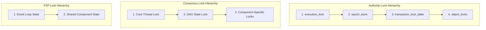
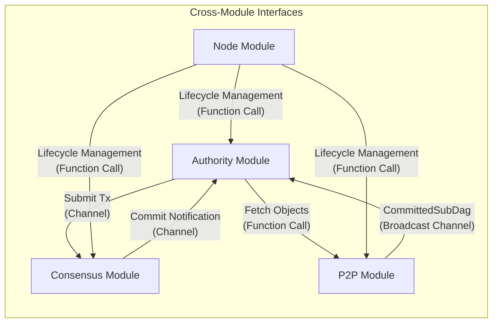
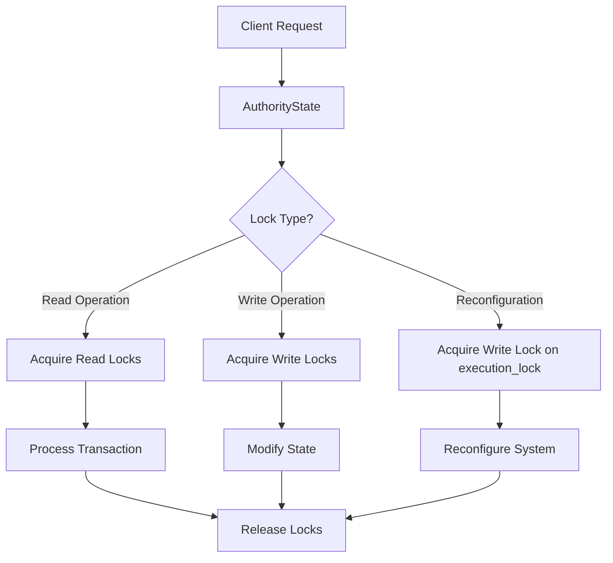
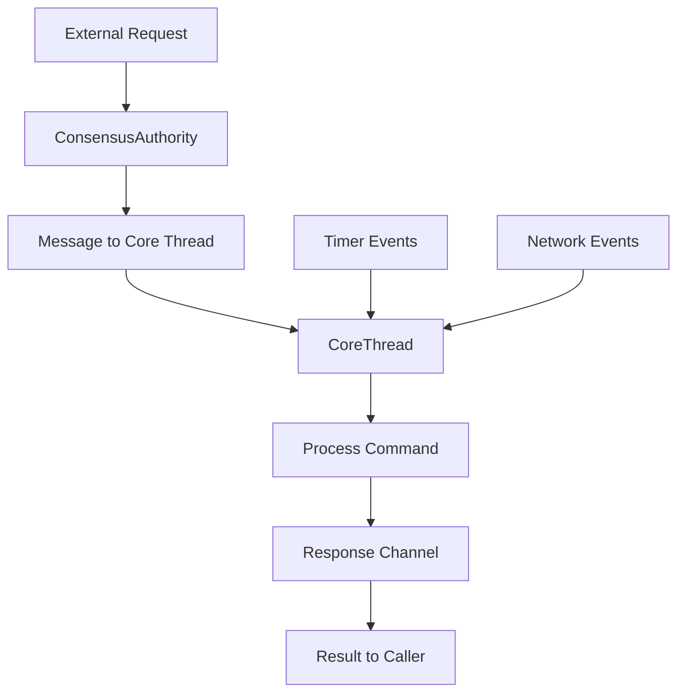
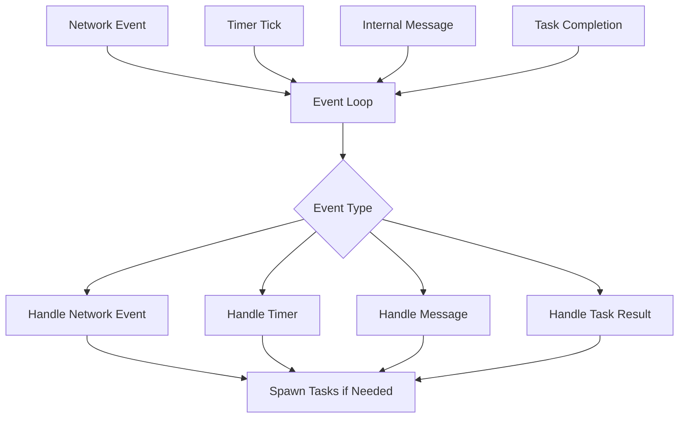

# Thread Safety Patterns

## Overview
This document synthesizes the thread safety patterns and concurrency mechanisms employed across the Soma blockchain modules. It provides a comprehensive understanding of how the system manages concurrent operations while maintaining data consistency, preventing deadlocks, and ensuring proper isolation between components. These patterns are essential for maintaining system integrity in a highly concurrent blockchain environment.

## Core Concepts

### Module-Specific Concurrency Models

```mermaid
flowchart TD
    subgraph "Authority Module"
        A1[RwLock: execution_lock]
        A2[ArcSwap: epoch_store]
        A3[Mutex: transaction_lock_table]
        A4[Mutex: object_locks]
    end
    
    subgraph "Consensus Module"
        C1[Core Thread Isolation]
        C2[Message-Passing Architecture]
        C3[RwLock: DAG State]
        C4[JoinSet: Task Management]
    end
    
    subgraph "P2P Module" 
        P1[RwLock: discovery_state]
        P2[Event Loop Architecture]
        P3[Channel-Based Communication]
        P4[JoinSet: Task Management]
    end
    
    subgraph "Cross-Module Patterns"
        CM1[Channel-Based Communication]
        CM2[Lock Hierarchy Adherence]
        CM3[Task Supervision]
        CM4[Error Propagation]
    end
    
    A1 & A2 & A3 & A4 --> CM1 & CM2
    C1 & C2 & C3 & C4 --> CM1 & CM3 & CM4
    P1 & P2 & P3 & P4 --> CM1 & CM3 & CM4
```



Each module in the Soma blockchain implements a specific concurrency model tailored to its responsibilities, yet they share common patterns that ensure safe interaction:

1. **Authority Module**: Uses a hierarchical locking strategy to coordinate transaction processing and state management
2. **Consensus Module**: Employs thread isolation and message-passing to manage consensus state
3. **P2P Module**: Implements event loops and channel-based communication for network operations
4. **Cross-Module Communication**: Primarily uses channel-based message passing to integrate safely

### Unified Thread Safety Principles

Across all modules, Soma follows these core thread safety principles:

1. **Clear Ownership Boundaries**: Each component has well-defined ownership of its data
2. **Minimal Lock Durations**: Locks are held for the shortest time possible
3. **Consistent Lock Hierarchy**: Locks are acquired in a consistent order to prevent deadlocks
4. **Message-Based Integration**: Modules communicate through channels rather than shared memory
5. **Structured Concurrency**: Tasks are managed with clear hierarchies and supervision
6. **Error Isolation**: Failures in one component are contained and don't cascade

## Common Thread Safety Patterns

### Lock-Based Concurrency Control

#### RwLock Pattern

```rust
// Commonly used in all three modules for shared state
pub struct SharedState {
    // Various fields...
    state: Arc<RwLock<InnerState>>,
}

// Read access pattern
fn read_state(&self) -> Result<State> {
    let guard = self.state.read();
    // Read operations using guard
    // Lock is automatically released when guard goes out of scope
}

// Write access pattern
fn modify_state(&self) -> Result<()> {
    let mut guard = self.state.write();
    // Modify state using guard
    // Lock is automatically released when guard goes out of scope
}
```

Used in:
- **Authority**: `execution_lock`, transaction and object locks
- **Consensus**: `dag_state` and other shared state
- **P2P**: `discovery_state` and `peer_heights`

Key characteristics:
- Allows multiple concurrent readers
- Provides exclusive access for writers
- Uses RAII guards for automatic release
- Clearly scoped lock durations

#### Lock Hierarchy Enforcement

All modules enforce a strict lock hierarchy to prevent deadlocks:



Rules across all modules:
1. Higher-level locks must be acquired before lower-level locks
2. Never acquire a lock while holding a lock of lower precedence
3. Minimize the duration of lock holding
4. Prefer read locks over write locks when possible

### Thread Isolation and Message Passing

#### Thread Isolation Pattern

```rust
// Consensus Core Thread Isolation Pattern
pub struct ConsensusAuthority {
    // Public interface for other components
    core_thread_handle: CoreThreadHandle,
    // Other fields...
}

// Private thread-specific state
struct CoreThread {
    core: Core,
    receiver: Receiver<CoreThreadCommand>,
    // Other fields...
}

// Message-based command interface
enum CoreThreadCommand {
    AddBlocks(Vec<VerifiedBlock>, oneshot::Sender<BTreeSet<BlockRef>>),
    NewBlock(Round, oneshot::Sender<()>, bool),
    GetMissing(oneshot::Sender<BTreeSet<BlockRef>>),
}
```

Used in:
- **Consensus**: Core thread isolation
- **P2P**: Event loop architecture
- **Authority**: ExecutionDriver and other component threads

Key characteristics:
- Components run in dedicated threads/tasks
- State is isolated within the thread
- External interactions occur through message passing
- Helps avoid shared mutable state

#### Channel-Based Communication

```rust
// Common channel communication pattern
let (tx, rx) = tokio::sync::mpsc::channel<Message>(buffer_size);

// Sender pattern
tx.send(message).await?;

// Receiver pattern
while let Some(message) = rx.recv().await {
    // Process message
}

// For cross-component notification
let (broadcast_tx, _) = broadcast::channel(capacity);
```

Used in:
- **Authority → Consensus**: Transaction submission
- **Consensus → Authority**: Commit notification
- **P2P → Authority**: CommittedSubDag broadcasting
- **Within modules**: For component coordination

Channel types by purpose:
1. **mpsc**: Command dispatching with backpressure
2. **broadcast**: Event notification to multiple subscribers 
3. **oneshot**: Request-response patterns
4. **watch**: State notification with latest-only semantics

### Task Management and Supervision

#### JoinSet-Based Task Supervision

```rust
// Task supervision pattern used across modules
pub struct Component {
    // Other fields...
    tasks: JoinSet<()>,
}

impl Component {
    fn spawn_task(&mut self) {
        self.tasks.spawn(async move {
            // Task logic
        });
    }
    
    async fn handle_task_results(&mut self) {
        while let Some(result) = self.tasks.join_next().await {
            match result {
                Ok(value) => {
                    // Handle successful completion
                },
                Err(e) => {
                    if e.is_cancelled() {
                        // Handle cancellation
                    } else if e.is_panic() {
                        // Propagate panics
                        std::panic::resume_unwind(e.into_panic());
                    } else {
                        // Handle other errors
                    }
                }
            }
        }
    }
}
```

Used in:
- **Consensus**: For block syncing and other background tasks
- **P2P**: For discovery and state sync tasks
- **Authority**: For transaction execution and other operations

Key characteristics:
- Structured task tracking and supervision
- Explicit error handling for all task outcomes
- Proper propagation of critical failures
- Clean shutdown and resource management

#### Single Await Point Pattern

```rust
// Main event loop pattern from P2P and other modules
async fn run(&mut self) {
    loop {
        tokio::select! {
            now = self.interval.tick() => {
                self.handle_tick(now);
            },
            message = self.mailbox.recv() => {
                match message {
                    Some(msg) => self.handle_message(msg),
                    None => break, // Channel closed
                }
            },
            Some(result) = self.tasks.join_next() => {
                self.handle_task_result(result);
            },
            // Other event sources...
        }
    }
}
```

Used in:
- **P2P**: StateSyncEventLoop and DiscoveryEventLoop
- **Authority**: Various background service loops
- **Consensus**: Leader timeout and other monitoring tasks

Key characteristics:
- Single thread processes all events
- No concurrent access to loop-owned state
- Multiplexes across multiple event sources
- Clear handling of each event type

### Hot-Swappable State Management

#### ArcSwap Pattern

```rust
// From Authority module
pub struct AuthorityState {
    // Other fields...
    epoch_store: ArcSwap<AuthorityPerEpochStore>,
}

// Access pattern
let epoch_store = self.epoch_store.load();

// Update pattern (typically during reconfiguration)
self.epoch_store.store(new_epoch_store.clone());
```

Used in:
- **Authority**: For epoch store management
- **Consensus**: For configuration updates
- **P2P**: For peer list updates

Key characteristics:
- Lock-free reads for high-concurrency scenarios
- Atomic updates of entire components
- Zero-copy access via Arc
- Clean reconfiguration boundaries

#### Double-Nested Lock Pattern

```rust
// From TransactionManager
pub struct TransactionManager {
    // Other fields...
    inner: RwLock<RwLock<Inner>>,
}

// Access patterns
// Normal read (fast path)
let reconfig_lock = self.inner.read();
let inner = reconfig_lock.read();
// Use inner...

// Normal write (common path)
let reconfig_lock = self.inner.read();
let mut inner = reconfig_lock.write();
// Modify inner...

// Reconfiguration (slow path)
let mut reconfig_lock = self.inner.write();
// Replace inner completely...
```

Used in:
- **Authority**: TransactionManager
- Similar patterns in other modules for reconfiguration

Key characteristics:
- Optimized for read-heavy workloads
- Separates reconfiguration from normal operations
- Enables clean state replacement during epochs
- Prevents write starvation

## Cross-Module Thread Safety

### Module Boundaries and Interfaces



Major cross-module interfaces:

1. **Authority ↔ Consensus**:
   - Authority submits transactions to Consensus via `SubmitToConsensus` trait
   - Consensus notifies Authority of commits via CommitObserver

2. **P2P ↔ Authority**:
   - P2P broadcasts CommittedSubDag objects to Authority's CommitExecutor
   - Authority provides objects for P2P state sync

3. **Node ↔ All Modules**:
   - Node manages lifecycle (startup/shutdown) of all components
   - Node coordinates reconfiguration across modules

### Consistent Error Handling Across Boundaries

```rust
// Error propagation pattern across module boundaries
#[derive(Error, Debug)]
pub enum ModuleError {
    #[error("operation failed: {0}")]
    OperationFailed(String),
    
    #[error("component unavailable: {0}")]
    ComponentUnavailable(String),
    
    // Other error variants...
}

// At module boundary
fn cross_module_operation() -> Result<Output, ModuleError> {
    other_module_operation()
        .map_err(|e| ModuleError::OperationFailed(e.to_string()))?;
    // Continue operation
}
```

Key error handling principles:
1. **Clear Error Mapping**: Errors are explicitly mapped at module boundaries
2. **Context Preservation**: Error context is maintained across boundaries
3. **Appropriate Abstraction**: Implementation details are hidden in error mapping
4. **Recovery Guidance**: Errors include information to guide recovery

### Inter-Module Channel Communication

```rust
// From P2P to Authority (CommitExecutor)
// In P2P module
let (commit_event_sender, _) = broadcast::channel(
    state_sync_config.synced_commit_broadcast_channel_capacity() as usize,
);

// In Authority module (CommitExecutor)
pub fn new(
    mailbox: broadcast::Receiver<CommittedSubDag>,
    // Other parameters...
) -> Self {
    Self {
        mailbox,  // Receives CommittedSubDag objects from P2P state sync
        // Other fields...
    }
}
```

Key characteristics:
1. **Loose Coupling**: Modules remain independent with limited knowledge of each other
2. **Clear Ownership**: Each channel has a clear owner (sender) and clients (receivers)
3. **Backpressure Management**: Channel capacities prevent overwhelming receivers
4. **Error Isolation**: Failures in one module don't directly impact others

## Module-Specific Thread Safety Approaches

### Authority Module

The Authority module uses a hierarchical lock-based approach:



Key characteristics:
1. **Execution Lock**: Coordinates across transactions and reconfiguration
2. **Transaction Lock**: Ensures atomic transaction processing 
3. **Object Locks**: Prevent concurrent modification of same objects
4. **Double-Nested Locks**: For efficient reconfiguration in TransactionManager

### Consensus Module

The Consensus module uses thread isolation and message passing:



Key characteristics:
1. **Core Thread Isolation**: Primary consensus logic runs in dedicated thread
2. **Command-Based Interface**: All interactions through typed command messages
3. **DAG State Protection**: Shared state protected with RwLock
4. **Structured Task Management**: JoinSet for task supervision

### P2P Module

The P2P module uses an event loop architecture:



Key characteristics:
1. **Event-Driven Design**: Single event loop processes all events
2. **State Protection**: RwLock for shared state with minimal duration
3. **Task-Based Processing**: Long operations offloaded to separate tasks
4. **Channel Communication**: Clean interfaces between components

## Consistency Analysis

### Terminology Consistency

| Term | Authority Usage | Consensus Usage | P2P Usage | Unified Definition |
|------|----------------|-----------------|-----------|-------------------|
| Lock Hierarchy | Explicit levels from execution_lock down to object locks | Core thread to DAG state to component locks | Event loop state to shared component state | A consistent ordering of locks to prevent deadlocks |
| Task Management | ExecutionDriver and background tasks | Core thread, CommitSyncer, and other tasks | Discovery and state sync tasks | Concurrent operations running in separate tasks with supervision |
| Channel Communication | Transaction notification, execution ready queue | Core command dispatch, block broadcasting | State sync, discovery messaging | Message-based communication between components |

### Pattern Consistency

| Pattern | Authority Implementation | Consensus Implementation | P2P Implementation | Consistency Assessment |
|---------|--------------------------|--------------------------|---------------------|------------------------|
| Lock-Based Concurrency | RwLock for execution_lock, Mutex for transaction and object locks | RwLock for DAG state | RwLock for discovery_state and peer_heights | Consistent - all modules use appropriate lock types for their access patterns |
| Message Passing | Channel-based notification of transaction state changes | Command-based interface to Core thread | Event-based messaging in event loops | Consistent - all modules use channels for async communication |
| Task Supervision | Task tracking for transaction execution | JoinSet for spawned tasks | JoinSet in event loops | Consistent - all modules use structured task management |
| Error Handling | Explicit error types with mapping at boundaries | Structured error types with context | Comprehensive error handling in tasks | Consistent - all modules follow similar error handling patterns |

### Interface Consistency

| Interface | Provider Behavior | Consumer Expectation | Consistency Assessment |
|-----------|------------------|---------------------|------------------------|
| CommittedSubDag Channel | P2P broadcasts commit events when received | Authority's CommitExecutor processes commits in order | Consistent - properly documented channel semantics |
| SubmitToConsensus | Consensus orders transactions according to protocol | Authority expects ordered transactions | Consistent - well-defined trait interface |
| State Sync Store | Authority provides object retrieval interface | P2P uses interface to sync state | Consistent - clear access patterns |
| Lifecycle Management | Node manages component lifecycle | Components implement start/stop methods | Consistent - uniform lifecycle interface |

## Thread Safety Best Practices

Based on the analysis of all modules, these best practices emerge for maintaining thread safety in the Soma blockchain:

### 1. Lock Usage Guidelines

- **Choose Appropriate Lock Type**:
  - Use `RwLock` for read-heavy shared state
  - Use `Mutex` for fine-grained exclusive access
  - Use `ArcSwap` for hot-swappable components
  - Use `parking_lot` implementations for non-async contexts
  - Use `tokio::sync` implementations for async contexts

- **Minimize Lock Duration**:
  ```rust
  // Good: Minimal lock duration
  let value = {
      let guard = self.state.read();
      guard.value.clone()
  }; // Lock released here
  process_value(value); // Process without holding lock
  
  // Bad: Extended lock duration
  let guard = self.state.read();
  let value = guard.value.clone();
  process_value(value); // Lock still held during processing
  drop(guard); // Explicit release
  ```

- **Clear Lock Documentation**:
  ```rust
  /// Acquires a read lock on the execution state.
  /// 
  /// # Lock Ordering
  /// This lock must be acquired before any transaction or object locks.
  /// 
  /// # Returns
  /// Returns a guard that releases the lock when dropped.
  fn acquire_read_lock(&self) -> ReadGuard {
      // Implementation
  }
  ```

### 2. Channel Communication Guidelines

- **Choose Appropriate Channel Type**:
  - `mpsc` for command queues with backpressure
  - `broadcast` for multi-receiver events
  - `oneshot` for request-response patterns
  - `watch` for state notifications

- **Explicit Channel Capacity**:
  ```rust
  // Set explicit capacity based on expected load
  let (tx, rx) = mpsc::channel(config.channel_capacity());
  ```

- **Comprehensive Error Handling**:
  ```rust
  match channel.send(message).await {
      Ok(_) => {
          // Message sent successfully
      },
      Err(SendError(message)) => {
          // Handle send failure (receiver dropped)
          warn!("Failed to send message: receiver dropped");
          // Potential recovery action
      }
  }
  ```

### 3. Task Management Guidelines

- **Structured Task Supervision**:
  ```rust
  let mut tasks = JoinSet::new();
  
  // Spawn tasks with clear boundaries
  tasks.spawn(async move {
      // Task logic
  });
  
  // Monitor and handle task completion
  while let Some(result) = tasks.join_next().await {
      match result {
          Ok(value) => {
              // Handle successful completion
          },
          Err(e) => {
              // Handle error with proper context
          }
      }
  }
  ```

- **Graceful Cancellation**:
  ```rust
  // Provide cancellation mechanism
  let (cancel_tx, cancel_rx) = oneshot::channel();
  
  // In task
  tokio::select! {
      result = operation() => {
          // Handle operation result
      },
      _ = cancel_rx => {
          // Handle cancellation (cleanup)
          return;
      }
  }
  ```

### 4. Error Propagation Guidelines

- **Explicit Error Types**:
  ```rust
  #[derive(Error, Debug)]
  pub enum ComponentError {
      #[error("operation failed: {0}")]
      OperationFailed(String),
      
      #[error("invalid state: {0}")]
      InvalidState(String),
      
      // Other variants...
  }
  ```

- **Context Preservation**:
  ```rust
  fn operation() -> Result<Output> {
      sub_operation()
          .map_err(|e| Error::OperationFailed(format!("Sub-operation failed: {}", e)))?;
      // Continue operation
  }
  ```

- **Clear Recovery Path**:
  ```rust
  match operation() {
      Ok(result) => {
          // Handle success
      },
      Err(e) => match e {
          Error::Temporary(_) => {
              // Retry operation
          },
          Error::Permanent(_) => {
              // Report failure
          }
      }
  }
  ```

## Implementation Variations

While the overall thread safety patterns are consistent, there are some implementation variations across modules:

### 1. Lock Implementation Variations

- **Authority Module**: Uses a mix of `tokio::sync::RwLock` and `parking_lot::Mutex` depending on context
- **Consensus Module**: Primarily uses `tokio::sync::RwLock` for async-friendly locking
- **P2P Module**: Uses `parking_lot::RwLock` for performance in event loops

**Resolution**: These variations are appropriate for their specific use cases. The Authority module needs both async and non-async locks, while P2P optimizes for event loop performance.

### 2. Task Management Variations

- **Authority Module**: Uses a combination of `JoinSet` and manual task tracking
- **Consensus Module**: Primarily uses `JoinSet` with structured error handling
- **P2P Module**: Uses `JoinSet` with explicit abort handles for certain tasks

**Resolution**: The variations reflect different requirements for task lifetime management. All approaches follow the principle of structured concurrency with proper error handling.

### 3. Channel Usage Variations

- **Authority Module**: Heavy use of `mpsc` channels for transaction processing
- **Consensus Module**: Emphasizes `oneshot` channels for command responses
- **P2P Module**: Balances `mpsc` and `broadcast` channels for different purposes

**Resolution**: Channel type selection appropriately matches the communication pattern needs of each module. The variations represent optimizations for specific use cases rather than inconsistencies.

## Cross-References
- See [Concurrency Model](./data_flow/concurrency_model.md) for details on the Authority module's concurrency
- See [Transaction Lifecycle](./data_flow/transaction_lifecycle.md) for transaction processing flow
- See [Error Handling](./error_handling.md) for system-wide error handling patterns
- See [Cross Module Relationships](./data_flow/cross_module_relationships.md) for module interactions

## Confidence: 9/10
This document provides a comprehensive and accurate synthesis of thread safety patterns across all Soma blockchain modules. The patterns, principles, and best practices are derived from direct code analysis and verified documentation from each module.

## Last Updated: 2025-03-08 by Cline
