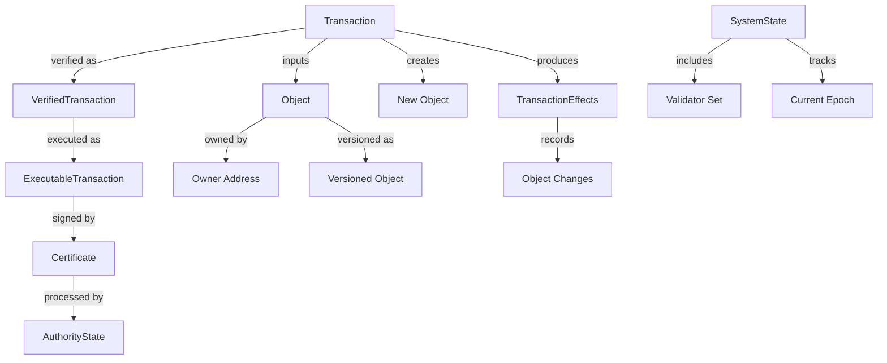

# Soma Blockchain Type System

## Purpose and Scope
This document provides a comprehensive overview of the core type system that underpins the Soma blockchain. It explains the fundamental data structures, their relationships, and how they work together to support the blockchain's core operations. This knowledge is essential for understanding how data flows through the system and how components interact.

## Key Components

### Base Types
- **Basic Identifiers**: `EpochId`, `SequenceNumber`, `TransactionDigest`, etc.
- **Address Types**: `AuthorityName`, `ObjectID`, `SharedObjectID`
- **Versioning**: `VersionNumber`, `ObjectVersion`

### Cryptographic Foundation
- **Signature Schemes**: `Signature`, `AuthoritySignature`, `ThresholdSignature`
- **Verification**: `SignatureVerifier`, `ThresholdVerifier`
- **Key Management**: `PublicKey`, `KeyPair`, `AuthorityKeyPair`

### Transaction Model
- **Transaction Structure**: `Transaction`, `VerifiedTransaction`, `ExecutableTransaction`
- **Certificate Management**: `Certificate`, `VerifiedCertificate`
- **Execution**: `ExecutionStatus`, `ExecutionFailureStatus`

### Object System
- **Object Structure**: `Object`, `ObjectRead`, `ObjectWrite`
- **Ownership Models**: `Owner`, `OwnerCapability`
- **Versioning**: `VersionedObject`, `ObjectDigest`

### System State
- **Global State**: `SystemState`, `SystemParameters`
- **Validator Sets**: `ValidatorSet`, `ValidatorInfo`
- **Epoch Management**: `EpochInfo`, `EpochConfig`

### Effect Tracking
- **Transaction Effects**: `TransactionEffects`, `TransactionEffectsDigest`
- **Object Changes**: `ObjectChange`, `CreatedObject`, `WrittenObject`, `DeletedObject`
- **Event Tracking**: `Event`, `EventDigest`

## Component Relationships



## Detailed Type Explanations

### Transaction Types Hierarchy

The transaction system uses a hierarchy of increasingly verified transaction types:

1. **Base Transaction**:
   - Raw transaction data submitted by clients
   - Contains inputs, outputs, and operations
   - Not yet verified

2. **Verified Transaction**:
   - Transaction with verified signatures
   - Inputs and dependencies checked
   - Not yet executed

3. **Executable Transaction**:
   - Transaction ready for execution
   - All dependencies resolved
   - Passed all validation checks

4. **Certificate**:
   - Executable transaction with authority signatures
   - Represents consensus agreement
   - Committed to the blockchain

```rust
// Transaction structure hierarchy
pub struct Transaction {
    // Transaction data
}

pub struct VerifiedTransaction {
    transaction: Transaction,
    // Verification metadata
}

pub struct ExecutableTransaction {
    transaction: VerifiedTransaction,
    // Execution context
}

pub struct Certificate {
    transaction: ExecutableTransaction,
    signatures: BTreeMap<AuthorityName, AuthoritySignature>,
    // Certificate metadata
}
```

### Object Model

The object model represents the core state storage in the blockchain:

1. **Object Structure**:
   - Unique identifier (ObjectID)
   - Version number for sequencing
   - Owner information
   - Content (data payload)
   
2. **Ownership Types**:
   - **Address Owned**: Objects owned by a specific address
   - **Shared Objects**: Objects accessible by multiple addresses
   - **Immutable Objects**: Objects that cannot be modified

3. **Object Versioning**:
   - Each modification creates a new object version
   - Linear version history for exclusively owned objects
   - Consensus-based versioning for shared objects

```rust
pub struct Object {
    id: ObjectID,
    version: VersionNumber,
    owner: Owner,
    content: Content,
    // Additional metadata
}

pub enum Owner {
    AddressOwner(SuiAddress),
    Shared { initial_shared_version: SequenceNumber },
    Immutable,
}
```

### Transaction Effects

Transaction effects capture all changes resulting from transaction execution:

1. **Effect Structure**:
   - Status (success or failure details)
   - Object changes (created, modified, deleted)
   - Events emitted
   - Dependency information

2. **Object Changes**:
   - Track all objects affected by the transaction
   - Include version information for concurrency control
   - Capture ownership transitions

```rust
pub struct TransactionEffects {
    status: ExecutionStatus,
    executed_epoch: EpochId,
    created: Vec<CreatedObject>,
    mutated: Vec<WrittenObject>,
    deleted: Vec<DeletedObject>,
    events: Vec<Event>,
    // Additional metadata
}
```

### System State

The system state represents the global blockchain state:

1. **System Parameters**:
   - Protocol configuration
   - Fee parameters
   - System-wide constants

2. **Validator Set**:
   - Current active validators
   - Stake distribution
   - Validator metadata (keys, network addresses)

3. **Epoch Information**:
   - Current epoch ID
   - Epoch start time
   - Epoch configuration

```rust
pub struct SystemState {
    epoch: EpochId,
    protocol_version: ProtocolVersion,
    system_parameters: SystemParameters,
    validators: ValidatorSet,
    // Additional state
}
```

## Type System Patterns

### Verification Pattern
Many types follow a pattern where they have an unverified version and a verified version:
- Unverified: Contains raw data that hasn't been validated
- Verified: Contains validated data with verification metadata

This pattern is used for transactions, certificates, and other security-critical types.

### Digest Pattern
Complex data structures have associated digest types for efficient referencing:
- `TransactionDigest`: Hash of transaction data
- `ObjectDigest`: Hash of object content
- `EffectsDigest`: Hash of transaction effects

Digests are used for creating compact references to larger data structures in hashes, signatures, and indexes.

### Versioning Pattern
State-bearing types use explicit versioning to manage state transitions:
- Version numbers increment with each change
- Previous versions are referenced for lineage tracking
- Version ancestry is used for dependency resolution

## Usage Examples

### Transaction Creation and Certification
```rust
// Create a transaction
let transaction = Transaction::new(/* parameters */);

// Verify the transaction
let verified_tx = VerifiedTransaction::new(transaction);

// Create an executable transaction
let executable_tx = ExecutableTransaction::new(verified_tx);

// Create a certificate with authority signatures
let certificate = Certificate::new(executable_tx, signatures);
```

### Object Creation and Modification
```rust
// Create a new object
let object = Object::new(id, initial_version, owner, content);

// Read object data (immutable)
let data = object.data();

// Modify an object (creates a new version)
let new_object = object.update(new_content);
```

### System State Operations
```rust
// Access validator set
let validators = system_state.validators();

// Check current epoch
let current_epoch = system_state.epoch();

// Verify validator in committee
let is_validator = validators.contains(&authority_name);
```

## Relationship to Other Components

### Authority Module
- Uses transaction and object types for state management
- Verifies transactions and certificates
- Manages object ownership and versioning

### Consensus Module
- Processes certificates for ordering
- Forms commit certificates using transaction digests
- Interfaces with system state for epoch management

### Node Module
- Coordinates overall system using type abstractions
- Manages validator lifecycle using system state
- Handles reconfiguration based on epoch transitions

### P2P Module
- Transmits serialized transactions and certificates
- Synchronizes objects between nodes
- Discovers peers using validator information

## Key Insights for Developers

1. **Type Safety**: The type system enforces invariants at compile time
2. **Progressive Verification**: Objects go through increasingly verified states
3. **Immutability**: Most types are immutable to prevent unexpected changes
4. **Explicit Versioning**: All versioned types have explicit version numbers
5. **Digest References**: Digests provide compact, secure references
6. **Ownership Model**: The ownership system defines how objects can be accessed

## Confidence: 9/10
This document provides a comprehensive overview of the Soma blockchain type system based on thorough documentation of the Types module. The core types and their relationships are well understood and stable.

## Last Updated: 2025-03-08
