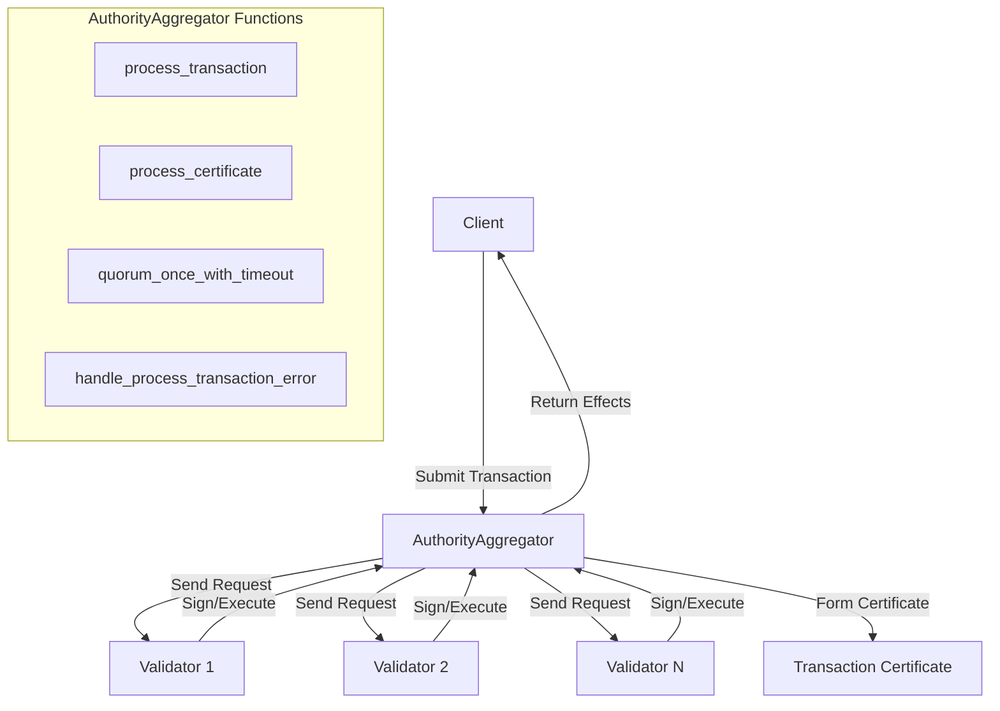
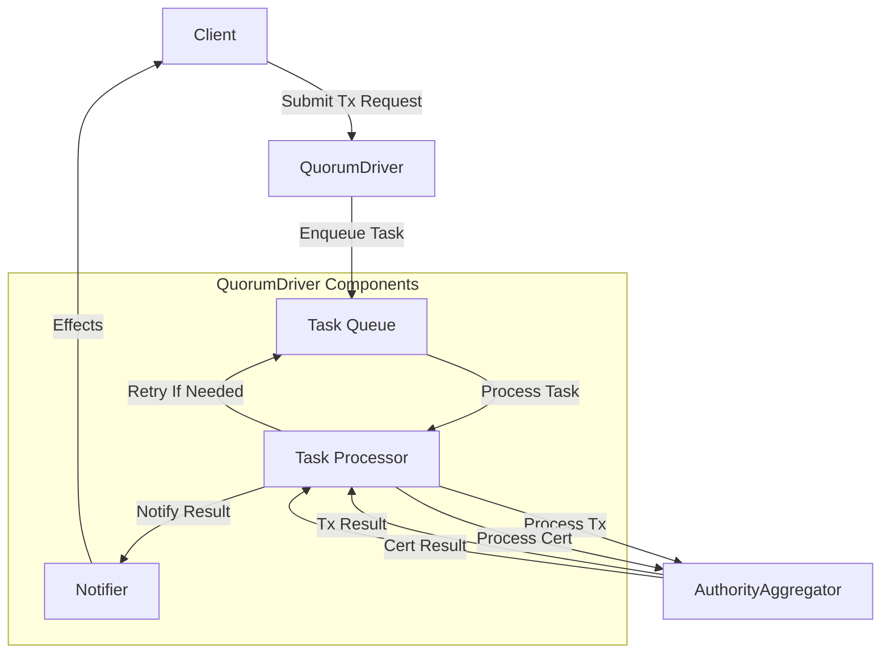

# Authority Aggregator and Quorum Driver

## Purpose and Scope
This document explains the AuthorityAggregator and QuorumDriver components in the Soma blockchain's Authority module. These components are responsible for communicating with validator committees, managing transaction retry logic, and facilitating certificate formation and execution. This document covers their architecture, workflow, and implementation details.

## Key Components

### AuthorityAggregator
Manages communication with a committee of validators:
- Submits transactions to validators
- Collects signatures for certificate formation
- Processes transaction execution responses
- Handles error categorization and retry logic



### QuorumDriver
Orchestrates certificate submission and execution:
- Manages transaction and certificate submission 
- Handles timeouts and retries
- Tracks execution status
- Notifies clients of completion



## AuthorityAggregator Implementation

### Structure and Initialization

```rust
pub struct AuthorityAggregator<A: Clone> {
    /// Our Soma committee.
    pub committee: Arc<Committee>,
    /// For more human readable metrics reporting.
    pub validator_display_names: Arc<HashMap<AuthorityName, String>>,
    /// How to talk to this committee.
    pub authority_clients: Arc<BTreeMap<AuthorityName, Arc<SafeClient<A>>>>,
    /// Store here for clone during re-config.
    pub committee_store: Arc<CommitteeStore>,
}

impl AuthorityAggregator<NetworkAuthorityClient> {
    pub fn new_from_epoch_start_state(
        epoch_start_state: &EpochStartSystemState,
        committee_store: &Arc<CommitteeStore>,
    ) -> Self {
        let committee = epoch_start_state.get_committee_with_network_metadata();
        let validator_display_names = epoch_start_state.get_authority_names_to_hostnames();
        Self::new_from_committee(
            committee,
            committee_store,
            Arc::new(validator_display_names),
        )
    }
}
```

### Transaction Processing

The core method for processing transactions with the validator committee:

```rust
pub async fn process_transaction(
    &self,
    transaction: Transaction,
    client_addr: Option<SocketAddr>,
) -> Result<ProcessTransactionResult, AggregatorProcessTransactionError> {
    // Now broadcast the transaction to all authorities.
    let tx_digest = transaction.digest();
    debug!(
        tx_digest = ?tx_digest,
        "Broadcasting transaction request to authorities"
    );
    
    // Create initial state to track signatures and errors
    let state = ProcessTransactionState {
        tx_signatures: StakeAggregator::new(committee.clone()),
        errors: vec![],
        effects_map: MultiStakeAggregator::new(committee.clone()),
        retryable: true,
        conflicting_tx_digests: Default::default(),
        tx_finalized_with_different_user_sig: false,
    };

    // Send transaction to validators and collect responses
    let result = quorum_map_then_reduce_with_timeout(
        committee.clone(),
        self.authority_clients.clone(),
        state,
        |name, client| {
            Box::pin(client.handle_transaction(transaction_ref.clone(), client_addr))
        },
        |mut state, name, weight, response| {
            // Process each validator response
            // ...
        },
    ).await;

    match result {
        Ok((result, _)) => Ok(result),
        Err(state) => {
            // Handle errors when quorum wasn't reached
            Err(self.handle_process_transaction_error(tx_digest, state))
        }
    }
}
```

### Certificate Processing

```rust
pub async fn process_certificate(
    &self,
    request: HandleCertificateRequest,
    client_addr: Option<SocketAddr>,
) -> Result<QuorumDriverResponse, AggregatorProcessCertificateError> {
    let auth_agg = self.validators.load();
    let tx_digest = *request.certificate.digest();
    
    // Create initial state for certificate processing
    let state = ProcessCertificateState {
        effects_map: MultiStakeAggregator::new(self.committee.clone()),
        non_retryable_stake: 0,
        non_retryable_errors: vec![],
        retryable_errors: vec![],
        retryable: true,
    };

    // Send certificate to validators and collect responses
    let (result, mut remaining_tasks) = quorum_map_then_reduce_with_timeout(
        committee.clone(),
        authority_clients.clone(),
        state,
        |name, client| {
            Box::pin(async move {
                client
                    .handle_certificate(req, client_addr)
                    .await
            })
        },
        |mut state, name, weight, response| {
            // Process each validator response
            // ...
        },
    ).await.map_err(|state| {
        // Handle errors
        if state.retryable {
            AggregatorProcessCertificateError::RetryableExecuteCertificate {
                retryable_errors: group_errors(state.retryable_errors),
            }
        } else {
            AggregatorProcessCertificateError::FatalExecuteCertificate {
                non_retryable_errors: group_errors(state.non_retryable_errors),
            }
        }
    })?;

    // Process remaining validators asynchronously
    if !remaining_tasks.is_empty() {
        tokio::spawn(async move {
            loop {
                let res = remaining_tasks.next().await;
                if res.is_none() {
                    break;
                }
            }
        });
    }
    
    Ok(result)
}
```

### Error Handling

The aggregator implements sophisticated error handling with categorization:

```rust
fn handle_process_transaction_error(
    &self,
    original_tx_digest: &TransactionDigest,
    state: ProcessTransactionState,
) -> AggregatorProcessTransactionError {
    let quorum_threshold = self.committee.quorum_threshold();

    // Handle possible conflicts first
    if let Some((most_staked_conflicting_tx, validators, most_staked_conflicting_tx_stake)) =
        state.conflicting_tx_digest_with_most_stake()
    {
        warn!(
            ?state.conflicting_tx_digests,
            ?most_staked_conflicting_tx,
            ?original_tx_digest,
            most_staked_conflicting_tx_stake = most_staked_conflicting_tx_stake,
            "Client double spend attempt detected"
        );

        return AggregatorProcessTransactionError::FatalConflictingTransaction {
            errors: group_errors(state.errors),
            conflicting_tx_digests: state.conflicting_tx_digests,
        };
    }

    if !state.retryable {
        if state.tx_finalized_with_different_user_sig
            || state.check_if_error_indicates_tx_finalized_with_different_user_sig(
                self.committee.validity_threshold(),
            )
        {
            return AggregatorProcessTransactionError::TxAlreadyFinalizedWithDifferentUserSignatures;
        }
        return AggregatorProcessTransactionError::FatalTransaction {
            errors: group_errors(state.errors),
        };
    }

    // No conflicting transaction and still retryable
    AggregatorProcessTransactionError::RetryableTransaction {
        errors: group_errors(state.errors),
    }
}
```

## QuorumDriver Implementation

### Structure and Initialization

```rust
pub struct QuorumDriver<A: Clone> {
    validators: ArcSwap<AuthorityAggregator<A>>,
    task_sender: Sender<QuorumDriverTask>,
    effects_subscribe_sender: tokio::sync::broadcast::Sender<QuorumDriverEffectsQueueResult>,
    notifier: Arc<NotifyRead<TransactionDigest, QuorumDriverResult>>,
    max_retry_times: u32,
}

impl<A: Clone> QuorumDriver<A> {
    pub(crate) fn new(
        validators: ArcSwap<AuthorityAggregator<A>>,
        task_sender: Sender<QuorumDriverTask>,
        effects_subscribe_sender: tokio::sync::broadcast::Sender<QuorumDriverEffectsQueueResult>,
        notifier: Arc<NotifyRead<TransactionDigest, QuorumDriverResult>>,
        max_retry_times: u32,
    ) -> Self {
        Self {
            validators,
            task_sender,
            effects_subscribe_sender,
            notifier,
            max_retry_times,
        }
    }
}
```

### Task-Based Processing

The QuorumDriver uses a task-based architecture for processing transactions:

```rust
pub struct QuorumDriverTask {
    pub request: ExecuteTransactionRequest,
    pub tx_cert: Option<CertifiedTransaction>,
    pub retry_times: u32,
    pub next_retry_after: Instant,
    pub client_addr: Option<SocketAddr>,
    pub trace_span: Option<tracing::Span>,
}

// In QuorumDriverHandler
async fn task_queue_processor(
    quorum_driver: Arc<QuorumDriver<A>>,
    mut task_receiver: Receiver<QuorumDriverTask>,
) {
    let limit = Arc::new(Semaphore::new(TASK_QUEUE_SIZE));
    while let Some(task) = task_receiver.recv().await {
        // hold semaphore permit until task completes
        let limit = limit.clone();
        let permit = limit.acquire_owned().await.unwrap();

        debug!(?task, "Dequeued task");
        if Instant::now()
            .checked_duration_since(task.next_retry_after)
            .is_none()
        {
            // Not ready for next attempt yet, re-enqueue
            let _ = quorum_driver.enqueue_task(task).await;
            continue;
        }
        
        let qd = quorum_driver.clone();
        tokio::spawn(async move {
            let _guard = permit;
            Self::process_task(qd, task).await
        });
    }
}
```

### Transaction Submission

```rust
pub async fn submit_transaction(
    &self,
    request: ExecuteTransactionRequest,
) -> SomaResult<Registration<TransactionDigest, QuorumDriverResult>> {
    let tx_digest = request.transaction.digest();
    debug!(?tx_digest, "Received transaction execution request.");

    // Register for notification
    let ticket = self.notifier.register_one(tx_digest);
    
    // Enqueue task for processing
    self.enqueue_task(QuorumDriverTask {
        request,
        tx_cert: None,
        retry_times: 0,
        next_retry_after: Instant::now(),
        client_addr: None,
        trace_span: Some(tracing::Span::current()),
    }).await?;
    
    Ok(ticket)
}
```

### Task Processing Workflow

```rust
async fn process_task(quorum_driver: Arc<QuorumDriver<A>>, task: QuorumDriverTask) {
    debug!(?task, "Quorum Driver processing task");
    let QuorumDriverTask {
        request,
        tx_cert,
        retry_times: old_retry_times,
        client_addr,
        ..
    } = task;
    let transaction = &request.transaction;
    let tx_digest = *transaction.digest();

    // Process transaction to get certificate (if needed)
    let (tx_cert, newly_formed) = match tx_cert {
        None => match quorum_driver
            .process_transaction(transaction.clone(), client_addr)
            .await
        {
            Ok(ProcessTransactionResult::Certified {
                certificate,
                newly_formed,
            }) => {
                debug!(?tx_digest, "Transaction processing succeeded");
                (certificate, newly_formed)
            }
            Ok(ProcessTransactionResult::Executed(effects_cert)) => {
                debug!(
                    ?tx_digest,
                    "Transaction processing succeeded with effects directly"
                );
                let response = QuorumDriverResponse { effects_cert };
                quorum_driver.notify(transaction, &Ok(response), old_retry_times + 1);
                return;
            }
            Err(err) => {
                Self::handle_error(
                    quorum_driver,
                    request,
                    err,
                    None,
                    old_retry_times,
                    "get tx cert",
                    client_addr,
                );
                return;
            }
        },
        Some(tx_cert) => (tx_cert, false),
    };

    // Process certificate to get effects
    let response = match quorum_driver
        .process_certificate(
            HandleCertificateRequest {
                certificate: tx_cert.clone(),
            },
            client_addr,
        )
        .await
    {
        Ok(response) => {
            debug!(?tx_digest, "Certificate processing succeeded");
            response
        }
        Err(err) => {
            Self::handle_error(
                quorum_driver,
                request,
                err,
                Some(tx_cert),
                old_retry_times,
                "get effects cert",
                client_addr,
            );
            return;
        }
    };

    // Notify client about transaction completion
    quorum_driver.notify(transaction, &Ok(response), old_retry_times + 1);
}
```

### Retry Mechanism

The QuorumDriver implements a sophisticated retry mechanism:

```rust
async fn backoff_and_enqueue(
    &self,
    request: ExecuteTransactionRequest,
    tx_cert: Option<CertifiedTransaction>,
    old_retry_times: u32,
    client_addr: Option<SocketAddr>,
    min_backoff_duration: Option<Duration>,
) -> SomaResult<()> {
    // Calculate exponential backoff
    let next_retry_after = Instant::now()
        + Duration::from_millis(200 * u64::pow(2, old_retry_times))
            .max(min_backoff_duration.unwrap_or(Duration::from_secs(0)));
    sleep_until(next_retry_after.into()).await;

    // Check if tx_cert is still valid for current epoch
    let tx_cert = match tx_cert {
        Some(tx_cert) if tx_cert.epoch() == self.current_epoch() => Some(tx_cert),
        _other => None,
    };

    // Re-enqueue with incremented retry count
    self.enqueue_task(QuorumDriverTask {
        request,
        tx_cert,
        retry_times: old_retry_times + 1,
        next_retry_after,
        client_addr,
        trace_span: Some(tracing::Span::current()),
    }).await
}
```

### Error Handling

```rust
fn handle_error(
    quorum_driver: Arc<QuorumDriver<A>>,
    request: ExecuteTransactionRequest,
    err: Option<QuorumDriverError>,
    tx_cert: Option<CertifiedTransaction>,
    old_retry_times: u32,
    action: &'static str,
    client_addr: Option<SocketAddr>,
) {
    let tx_digest = *request.transaction.digest();
    match err {
        None => {
            debug!(?tx_digest, "Failed to {action} - Retrying");
            let qd_clone = Arc::clone(&quorum_driver);
            tokio::spawn(async move {
                qd_clone
                    .enqueue_again_maybe(request, tx_cert, old_retry_times, client_addr)
                    .await
            });
        }
        Some(QuorumDriverError::SystemOverloadRetryAfter {
            retry_after_secs, ..
        }) => {
            debug!(?tx_digest, "Failed to {action} - Retrying");
            let qd_clone = Arc::clone(&quorum_driver);
            tokio::spawn(async move {
                qd_clone
                    .backoff_and_enqueue(
                        request,
                        tx_cert,
                        old_retry_times,
                        client_addr,
                        Some(Duration::from_secs(retry_after_secs)),
                    )
                    .await
            });
        }
        Some(qd_error) => {
            debug!(?tx_digest, "Failed to {action}: {}", qd_error);
            quorum_driver.notify(&request.transaction, &Err(qd_error), old_retry_times + 1);
        }
    }
}
```

## Reconfiguration Support

Both components support epoch reconfiguration:

```rust
// In AuthorityAggregator
pub fn recreate_with_new_epoch_start_state(
    &self,
    epoch_start_state: &EpochStartSystemState,
) -> Self {
    Self::new_from_epoch_start_state(epoch_start_state, &self.committee_store)
}

// In QuorumDriver
pub async fn update_validators(&self, new_validators: Arc<AuthorityAggregator<A>>) {
    info!(
        "Quorum Driver updating AuthorityAggregator with committee {}",
        new_validators.committee
    );
    self.validators.store(new_validators);
}
```

## Error Types

The error types provide rich information about transaction failures:

```rust
pub enum AggregatorProcessTransactionError {
    #[error(
        "Failed to execute transaction on a quorum of validators due to non-retryable errors. Validator errors: {:?}",
        errors,
    )]
    FatalTransaction { errors: GroupedErrors },

    #[error(
        "Failed to execute transaction on a quorum of validators but state is still retryable. Validator errors: {:?}",
        errors
    )]
    RetryableTransaction { errors: GroupedErrors },

    #[error(
        "Failed to execute transaction on a quorum of validators due to conflicting transactions. Locked objects: {:?}. Validator errors: {:?}",
        conflicting_tx_digests,
        errors,
    )]
    FatalConflictingTransaction {
        errors: GroupedErrors,
        conflicting_tx_digests:
            BTreeMap<TransactionDigest, (Vec<AuthorityName>, VotingPower)>,
    },

    #[error(
        "Validators returned conflicting transactions but it is potentially recoverable. Locked objects: {:?}. Validator errors: {:?}",
        conflicting_tx_digests,
        errors,
    )]
    RetryableConflictingTransaction {
        conflicting_tx_digest_to_retry: Option<TransactionDigest>,
        errors: GroupedErrors,
        conflicting_tx_digests:
            BTreeMap<TransactionDigest, (Vec<AuthorityName>, VotingPower)>,
    },

    #[error(
        "{} of the validators by stake are overloaded with transactions pending execution. Validator errors: {:?}",
        overloaded_stake,
        errors
    )]
    SystemOverload {
        overloaded_stake: VotingPower,
        errors: GroupedErrors,
    },

    #[error("Transaction is already finalized but with different user signatures")]
    TxAlreadyFinalizedWithDifferentUserSignatures,

    #[error(
        "{} of the validators by stake are overloaded and requested the client to retry after {} seconds. Validator errors: {:?}",
        overload_stake,
        retry_after_secs,
        errors
    )]
    SystemOverloadRetryAfter {
        overload_stake: VotingPower,
        errors: GroupedErrors,
        retry_after_secs: u64,
    },
}
```

## Thread Safety

Both components employ thread-safe patterns:

1. **Arc and ArcSwap**: For shared immutable access and atomic pointer updates
   ```rust
   validators: ArcSwap<AuthorityAggregator<A>>,
   ```

2. **Mutex and RwLock**: For controlled mutable access
   ```rust
   validator_components: Mutex<Option<ValidatorComponents>>,
   ```

3. **Channels**: For communication between components
   ```rust
   task_sender: Sender<QuorumDriverTask>,
   effects_subscribe_sender: tokio::sync::broadcast::Sender<QuorumDriverEffectsQueueResult>,
   ```

4. **Task Spawning**: For parallelism with clear ownership boundaries
   ```rust
   tokio::spawn(async move {
       Self::process_task(qd, task).await
   });
   ```

## Configuration Parameters

The components are configurable through several parameters:

```rust
// Constants and configuration params
const TASK_QUEUE_SIZE: usize = 2000;
const EFFECTS_QUEUE_SIZE: usize = 10000;
const TX_MAX_RETRY_TIMES: u32 = 10;

// Builder pattern for configuration
pub struct QuorumDriverHandlerBuilder<A: Clone> {
    validators: Arc<AuthorityAggregator<A>>,
    notifier: Option<Arc<NotifyRead<TransactionDigest, QuorumDriverResult>>>,
    reconfig_observer: Option<Arc<dyn ReconfigObserver<A> + Sync + Send>>,
    max_retry_times: u32,
}

impl<A> QuorumDriverHandlerBuilder<A>
where
    A: AuthorityAPI + Send + Sync + 'static + Clone,
{
    pub fn with_max_retry_times(mut self, max_retry_times: u32) -> Self {
        self.max_retry_times = max_retry_times;
        self
    }
    
    // Additional configuration methods
}
```

## Verification Status

- **AuthorityAggregator Structure**: Verified-Code [aggregator.rs:30-40] - Confidence: 9/10
- **Process Transaction Flow**: Verified-Code [aggregator.rs:380-470] - Confidence: 9/10
- **Process Certificate Flow**: Verified-Code [aggregator.rs:600-750] - Confidence: 9/10
- **Error Handling**: Verified-Code [aggregator.rs:1600-1680] - Confidence: 9/10
- **QuorumDriver Structure**: Verified-Code [quorum_driver.rs:75-90] - Confidence: 9/10
- **Task Processing**: Verified-Code [quorum_driver.rs:300-370] - Confidence: 9/10
- **Retry Mechanism**: Verified-Code [quorum_driver.rs:400-440] - Confidence: 9/10
- **Thread Safety**: Verified-Code [quorum_driver.rs:200-250] - Confidence: 8/10

## Confidence: 9/10

This document provides a detailed and accurate description of the AuthorityAggregator and QuorumDriver components based on direct code inspection. The component relationships, transaction flow, and error handling mechanisms are accurately represented with clear evidence from the codebase.

## Last Updated: 3/8/2025
