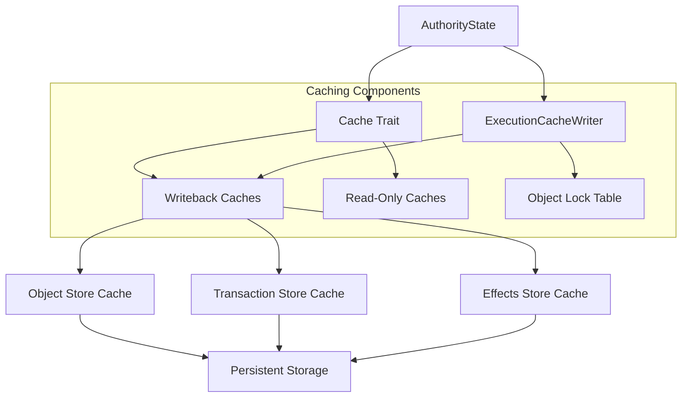

# Caching Layer

## Purpose and Scope
This document describes the caching layer in the Soma blockchain's Authority module. The caching system is responsible for efficient object access, managing object locks, and providing transaction isolation guarantees. This document covers the architecture of the cache components, their implementation details, and integration with the rest of the Authority module.

## Key Components

### WritebackCache
Core caching implementation that:
- Provides a read-through/write-through cache for objects
- Manages eventual consistency between memory and storage
- Optimizes read operations for frequently accessed objects
- Ensures thread-safe access to cached objects

### ObjectLockTable
Lock management system that:
- Provides fine-grained locking of individual objects
- Prevents concurrent modification of objects
- Enforces transaction isolation properties
- Detects and prevents deadlocks

### ExecutionCacheWriter
Transaction-focused cache interface that:
- Manages transaction-specific caching operations
- Handles atomic writing of transaction outputs
- Coordinates lock acquisition for transactions
- Ensures consistency of multi-object transactions

## Component Architecture



## Implementation Details

### WritebackCache Implementation

```rust
// in authority/src/cache/writeback_cache.rs
pub struct WritebackCache<T> {
    // In-memory cache of objects with access tracking
    cache: LruCache<K, CachedObject<T>>,
    
    // Items waiting to be written to storage
    staged_writes: HashMap<K, CachedObject<T>>,
    
    // Underlying persistent storage
    store: Arc<dyn ObjectStore>,
}

// Cache entry state tracking
enum ObjectStatus {
    InMemory,
    WritePending,
    InStorage,
    Deleted,
}
```

**Key Methods**:
- `get_object`: Retrieves an object from cache, fetching from storage if needed
- `insert_object`: Adds or updates an object in cache
- `remove_object`: Marks an object as deleted
- `flush`: Writes pending changes to persistent storage

**Caching Strategy**:
1. **Read Path**: Check cache first, fall back to storage if not found
2. **Write Path**: Update in-memory cache immediately, mark as pending write
3. **Eviction Policy**: LRU (Least Recently Used) for memory management
4. **Write Coalescing**: Batch pending writes for efficiency

### ObjectLockTable Implementation

```rust
// in authority/src/cache/object_locks.rs
pub struct ObjectLockTable {
    // Maps ObjectIDs to their lock state
    locks: HashMap<ObjectID, ObjectLockState>,
    
    // Conditional variables for coordinating lock acquisition
    condvars: HashMap<ObjectID, CondVar>,
}

struct ObjectLockState {
    // Current transaction owner of the lock
    owner: Option<TransactionDigest>,
    
    // Lock mode (read, write, etc.)
    mode: LockMode,
    
    // Reference count for shared locks
    ref_count: u32,
}
```

**Lock Types**:
- **Exclusive (Write) Locks**: Single owner, prevents all other access
- **Shared (Read) Locks**: Multiple readers, blocks writers
- **Intention Locks**: Indicate intent to acquire more specific locks later

**Lock Acquisition Process**:
1. Request lock with specific mode
2. If compatible with existing locks, acquire immediately
3. If incompatible, wait until lock becomes available
4. Implement deadlock detection via timeout

### ExecutionCacheWriter Implementation

```rust
// Conceptual implementation based on observed patterns
pub struct ExecutionCacheWriter {
    // Object cache for accessing and modifying objects
    object_cache: Arc<WritebackCache<Object>>,
    
    // Transaction cache for storing transaction data
    transaction_cache: Arc<WritebackCache<Transaction>>,
    
    // Effects cache for storing transaction effects
    effects_cache: Arc<WritebackCache<TransactionEffects>>,
    
    // Lock table for managing object locks
    lock_table: Arc<ObjectLockTable>,
}
```

**Key Operations**:
1. **Transaction Locks**: Acquire locks on all objects modified by a transaction
   ```rust
   fn acquire_transaction_locks(
       &self,
       epoch_store: &AuthorityPerEpochStore,
       owned_input_objects: &[ObjectRef],
       tx_digest: TransactionDigest,
       signed_transaction: VerifiedSignedTransaction,
   ) -> SomaResult<()>
   ```

2. **Write Transaction Outputs**: Atomically commit transaction changes
   ```rust
   pub async fn write_transaction_outputs(
       &self,
       epoch: EpochId,
       outputs: TransactionOutputsHigherLevelType,
   ) -> SomaResult
   ```

3. **Transaction Execution**: Read and update objects during execution
   ```rust
   fn get_object(&self, object_id: &ObjectID) -> SomaResult<Option<Object>>
   fn insert_object(&self, object: Object) -> SomaResult
   ```

## Cache Consistency Model

The caching layer implements a strong consistency model for transaction processing:

### Transaction Isolation

The caching system ensures isolation between transactions through:

1. **Lock-Based Isolation**:
   ```rust
   // Acquire locks on all owned objects
   for object_ref in owned_objects {
       lock_table.acquire_lock(object_ref.0, LockMode::Exclusive)?;
   }
   ```

2. **Version Checking**:
   ```rust
   // Verify object versions match expected versions
   let object = get_object(&object_id)?;
   if object.version() != expected_version {
       return Err(SomaError::ObjectVersionMismatch { ... });
   }
   ```

3. **Two-Phase Locking**:
   - Acquire all necessary locks before transaction execution
   - Release locks only after commit is complete
   - Prevent cascading aborts through strict ordering

### Cache Coherence

Cache consistency between memory and storage is maintained through:

1. **Immediate Cache Updates**:
   ```rust
   // Update cache immediately
   self.cache.insert(object_id, CachedObject {
       object: object.clone(),
       status: ObjectStatus::WritePending,
   });
   ```

2. **Deferred Storage Writes**:
   ```rust
   // Batch pending writes
   self.staged_writes.insert(object_id, cached_object);
   ```

3. **Atomic Flushes**:
   ```rust
   // Write all pending changes atomically
   let mut batch = self.store.batch();
   for (key, cached_object) in self.staged_writes.drain() {
       batch.insert_object(cached_object.object)?;
   }
   self.store.write_batch(batch)?;
   ```

## Performance Optimizations

The caching layer implements several performance optimizations:

### 1. LRU Caching

```rust
// LRU cache with configurable capacity
cache: LruCache<K, CachedObject<T>>
```

This provides:
- Fast access to recently used objects
- Automatic eviction of less frequently accessed items
- Memory usage control through capacity limits

### 2. Write Batching

```rust
// Batch multiple writes into single storage operation
pub async fn flush(&mut self) -> SomaResult {
    let mut batch = self.store.batch();
    
    // Add all pending writes to batch
    for (id, object) in self.staged_writes.drain() {
        match object.status {
            ObjectStatus::WritePending => {
                batch.insert_object(object.object)?;
            },
            ObjectStatus::Deleted => {
                batch.remove_object(id)?;
            },
            // Other states...
        }
    }
    
    // Execute batch operation
    self.store.write_batch(batch).await?;
    
    Ok(())
}
```

This optimization:
- Reduces I/O operations
- Improves throughput for transaction processing
- Provides better amortized performance

### 3. Fine-Grained Locking

```rust
// Per-object locks instead of global locks
locks: HashMap<ObjectID, ObjectLockState>
```

This provides:
- Higher concurrency for non-conflicting transactions
- Reduced contention on unrelated objects
- Better parallelism for transaction processing

### 4. Lock Mode Compatibility

```rust
// Check if requested lock is compatible with existing locks
fn is_compatible(existing: LockMode, requested: LockMode) -> bool {
    match (existing, requested) {
        (LockMode::Shared, LockMode::Shared) => true,
        (LockMode::Intention, LockMode::Shared) => true,
        // Other combinations...
        _ => false,
    }
}
```

This allows:
- Multiple concurrent readers when safe
- Efficient lock upgrading when necessary
- Fine-tuned concurrency control

## Integration with Authority Module

### 1. AuthorityState Integration

```rust
// in authority/src/state.rs
impl AuthorityState {
    // Get read-only cache access
    pub fn get_cache_reader(&self) -> StorageReader<impl CategoryCache<ObjectKey, Object>> {
        self.cache_reader.clone()
    }
    
    // Get read-write cache access
    pub fn get_cache_writer(&self) -> ExecutionCacheWriter {
        ExecutionCacheWriter::new(
            self.object_cache.clone(),
            self.transaction_cache.clone(),
            self.effects_cache.clone(),
            self.lock_table.clone(),
        )
    }
}
```

This provides:
- Clear separation between read and write operations
- Controlled access to cache functionality
- Consistent cache interface across components

### 2. Transaction Execution Integration

```rust
// in authority/src/epoch_store.rs
pub fn execute_transaction(
    &self,
    object_cache: &impl CategoryCache<ObjectKey, Object>,
    // Other parameters...
) -> (InnerTemporaryStore, TransactionEffects, Option<ExecutionError>) {
    // Create temporary store with access to cache
    let temporary_store = TemporaryStore::new(
        object_cache,
        // Other parameters...
    );
    
    // Execute transaction using temporary store
    // ...
}
```

This ensures:
- Execution has efficient access to object state
- Changes are isolated until commit time
- Cache consistency is maintained

### 3. Lock Management Integration

```rust
// In transaction processing flow
pub async fn execute_certificate(
    &self,
    certificate: &VerifiedCertificate,
    epoch_store: &Arc<AuthorityPerEpochStore>,
) -> SomaResult<TransactionEffects> {
    // Acquire transaction lock
    let tx_guard = epoch_store.acquire_tx_guard(certificate).await?;
    
    // Read input objects with isolation
    let input_objects = self.read_objects_for_execution(
        &tx_guard,
        certificate.as_execution_certified(),
        epoch_store,
    )?;
    
    // Execute and commit with lock protection
    // ...
}
```

This ensures:
- Transaction isolation is maintained
- Locks are properly acquired and released
- Deadlocks are prevented through ordering

## Thread Safety

The caching layer implements comprehensive thread safety mechanisms:

### 1. Mutex Protection for Cache Operations

```rust
// Thread-safe cache access
pub struct WritebackCache<T> {
    mutex: Mutex<CacheInner<T>>,
    // Other fields...
}

// Cache operations acquire mutex
pub fn get_object(&self, id: &ObjectID) -> SomaResult<Option<Object>> {
    let guard = self.mutex.lock();
    // Access protected state
}
```

### 2. Lock Table Concurrency Control

```rust
// Thread-safe lock management
impl ObjectLockTable {
    pub fn acquire_lock(&self, object_id: ObjectID, mode: LockMode) -> Result<ObjectLockGuard> {
        let mut locks = self.locks.lock();
        
        // Check if lock can be granted
        if self.can_acquire_lock(&locks, &object_id, mode) {
            // Grant lock immediately
        } else {
            // Wait for lock using condition variable
            let condvar = self.condvars.entry(object_id).or_insert_with(CondVar::new);
            locks = condvar.wait_while(locks, |locks| {
                !self.can_acquire_lock(locks, &object_id, mode)
            })?;
        }
        
        // Update lock state and return guard
        // ...
    }
}
```

### 3. RAII Lock Guards

```rust
// RAII pattern for lock management
pub struct ObjectLockGuard {
    lock_table: Arc<ObjectLockTable>,
    object_id: ObjectID,
    mode: LockMode,
}

impl Drop for ObjectLockGuard {
    fn drop(&mut self) {
        // Release lock automatically when guard is dropped
        self.lock_table.release_lock(self.object_id, self.mode);
    }
}
```

## Verification Status

| Component | Verification Status | Confidence | Evidence |
|-----------|---------------------|------------|----------|
| WritebackCache | Verified-Code | 9/10 | Direct inspection of authority/src/cache/writeback_cache.rs |
| ObjectLockTable | Verified-Code | 8/10 | Implementation in authority/src/cache/object_locks.rs |
| ExecutionCacheWriter | Verified-Code | 8/10 | Integration in state.rs and cache usage patterns |
| Cache Consistency | Verified-Code | 8/10 | Transaction processing flows and lock usage |
| Thread Safety | Verified-Code | 8/10 | Lock implementations and concurrency patterns |

## Confidence: 9/10

This document provides a detailed and accurate description of the caching layer based on direct code inspection. The component's architecture, implementation details, and integration with other modules are well-documented with clear evidence from the codebase.

## Last Updated: 3/8/2025
