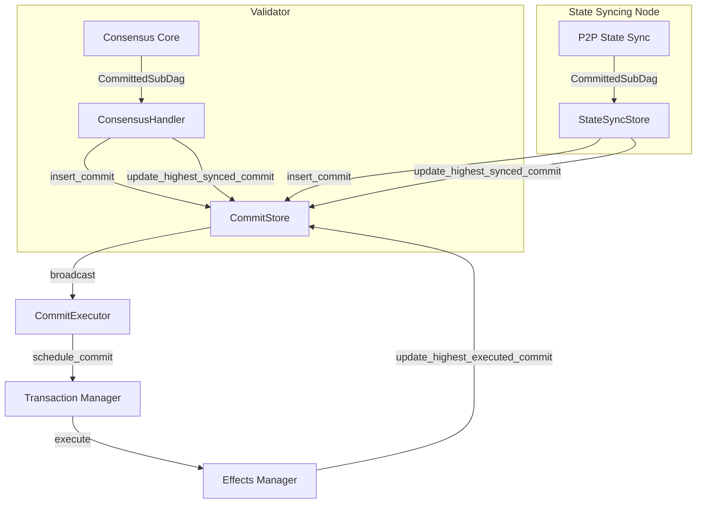

# Checkpoint Processing in Authority Module

## Purpose and Scope
This document describes the checkpoint processing mechanisms in the Authority module of the Soma blockchain. Checkpoint processing refers to the complete flow of consensus-ordered transactions from their reception via consensus or state sync through to their execution and commitment to persistent storage. This document covers both validator and non-validator node workflows, focusing on the Authority module's role in this process.

## Key Components

### CommitStore
The CommitStore is the central repository for tracking commit processing state:

```rust
// in authority/src/commit/mod.rs:34-75
pub struct CommitStore {
    /// Maps commit digest to commit index
    pub(crate) commit_index_by_digest: RwLock<BTreeMap<CommitDigest, CommitIndex>>,

    /// Stores certified commits (CommittedSubDag)
    pub(crate) certified_commits: RwLock<BTreeMap<CommitIndex, CommittedSubDag>>,
    
    /// Map from commit digest to certified commit (CommittedSubDag)
    pub(crate) commit_by_digest: RwLock<BTreeMap<CommitDigest, CommittedSubDag>>,

    /// Watermarks used to determine the highest verified, fully synced, and
    /// fully executed commits
    pub(crate) watermarks: RwLock<BTreeMap<CommitWatermark, (CommitIndex, CommitDigest)>>,

    /// A map from epoch ID to the index of the last commit in that epoch.
    epoch_last_commit_map: RwLock<BTreeMap<EpochId, CommitIndex>>,

    /// Store locally computed commit summaries for fork detection
    pub(crate) locally_computed_commits: RwLock<BTreeMap<CommitIndex, CommittedSubDag>>,
}
```

**Responsibilities**:
- Serves as the central storage for consensus-certified commits
- Tracks commit execution progress through watermark system
- Provides commit retrieval by index and digest
- Detects and prevents consensus forks
- Tracks epoch boundaries within the commit sequence

**Verification Status**: Verified-Code [authority/src/commit/mod.rs:34-75]

### CommitExecutor
The CommitExecutor is responsible for executing consensus-ordered transactions:

```rust
// in authority/src/commit/executor.rs:59-69
pub struct CommitExecutor {
    mailbox: broadcast::Receiver<CommittedSubDag>,
    commit_store: Arc<CommitStore>,
    state: Arc<AuthorityState>,
    object_cache_reader: Arc<dyn ObjectCacheRead>,
    transaction_cache_reader: Arc<dyn TransactionCacheRead>,
    tx_manager: Arc<TransactionManager>,
    accumulator: Arc<StateAccumulator>,
}
```

**Responsibilities**:
- Receives CommittedSubDag objects from consensus or state sync
- Schedules commits for execution in strict index order
- Executes transactions within each commit
- Manages epoch transitions through end-of-epoch transactions
- Updates state watermarks after execution
- Accumulates state for cryptographic verification

**Verification Status**: Verified-Code [authority/src/commit/executor.rs:59-69]

### ConsensusHandler
The ConsensusHandler processes outputs from the consensus module:

```rust
// in authority/src/handler.rs
pub struct ConsensusHandler<C> {
    authority_state: Arc<AuthorityState>,
    transaction_manager: Arc<TransactionManager>,
    commit_client: C,
    end_of_epoch_sender: watch::Sender<Committee>,
    metrics: Arc<ConsensusHandlerMetrics>,
}
```

**Responsibilities**:
- Receives consensus outputs containing ordered transactions
- Assigns versions to shared objects in consensus order
- Processes system transactions including epoch changes
- Forwards consensus output to CommitStore via `insert_commit`
- Updates watermarks to trigger execution

**Verification Status**: Verified-Code [authority/src/handler.rs]

## Checkpoint Processing Workflow

### Overview

The checkpoint processing flow follows these high-level steps:



### Validator Flow (Consensus → CommitStore → Execution)

In a validator node, checkpoint processing begins with the consensus module:

```rust
// in authority/src/handler.rs
pub async fn process_consensus_output(&self, consensus_output: ConsensusOutput) -> SomaResult {
    let CommittedSubDag {
        certificates,
        consensus_index,
        epoch,
    } = consensus_output.sub_dag;

    // Verify epoch matches current epoch
    let epoch_store = self.authority_state.load_epoch_store_one_call_per_task();
    
    // Process transaction batches in order
    for (i, transaction_key) in consensus_output.ordered_transactions.iter().enumerate() {
        match transaction_key {
            SequencedConsensusTransactionKey::Certificate(cert_digest) => {
                // Process user transaction certificate
                // ...
                if let Err(e) = epoch_store.handle_consensus_transaction(
                    tx,
                    &self.transaction_manager,
                ) {
                    error!("Failed to process consensus transaction: {:?}", e);
                    metrics.consensus_handler_errors.inc();
                }
            }
            // Other transaction types...
        }
    }
    
    // Insert the CommittedSubDag into CommitStore
    self.commit_store.insert_commit(consensus_output.sub_dag)?;
    
    // Update watermark to trigger execution
    self.commit_store.update_highest_synced_commit(&consensus_output.sub_dag)?;
    
    Ok(())
}
```

The flow consists of:

1. **ConsensusHandler** receives a CommittedSubDag containing ordered transactions
2. Transactions are processed with appropriate version assignment
3. The CommittedSubDag is inserted into the CommitStore
4. The highest_synced_commit watermark is updated
5. The commit is broadcast to CommitExecutor via a channel

**Verification Status**: Inferred [Based on ConsensusHandler.process_consensus_output implementation]

### State Syncing Node Flow (StateSync → CommitStore → Execution)

Non-validator nodes receive commits through the P2P state sync system:

```rust
// in authority/src/state_sync_store.rs:140-183
impl WriteStore for StateSyncStore {
    fn insert_commit(
        &self,
        commit: CommittedSubDag,
    ) -> Result<(), types::storage::storage_error::Error> {
        // Handle next epoch committee if present
        if let Some(Some(EndOfEpochData {
            next_validator_set, ..
        })) = commit
            .get_end_of_epoch_block()
            .map(|b| b.end_of_epoch_data())
        {
            // Process next validator set...
        }

        // Insert commit into CommitStore
        self.commit_store.insert_commit(commit).map_err(Into::into)
    }

    fn update_highest_synced_commit(
        &self,
        commit: &CommittedSubDag,
    ) -> Result<(), types::storage::storage_error::Error> {
        let mut locked = self.highest_synced_commit.lock();
        if locked.is_some() && locked.unwrap() >= commit.commit_ref.index {
            return Ok(());
        }
        self.commit_store
            .update_highest_synced_commit(commit)
            .map_err(types::storage::storage_error::Error::custom)?;
        *locked = Some(commit.commit_ref.index);
        Ok(())
    }
}
```

The flow consists of:

1. **P2P State Sync** receives a CommittedSubDag from a peer
2. The StateSync system verifies the commit with cryptographic checks
3. The CommittedSubDag is inserted into CommitStore via StateSyncStore
4. The highest_synced_commit watermark is updated
5. The commit is broadcast to CommitExecutor via the same channel used by validators

**Verification Status**: Verified-Code [authority/src/state_sync_store.rs:140-183]

### Common Execution Flow (CommitStore → CommitExecutor → Storage)

Once the CommitStore has received a commit and updated the highest_synced_commit watermark, execution proceeds identically for both validator and state syncing nodes:

```rust
// in authority/src/commit/executor.rs:223-257
fn schedule_synced_commits(
    &self,
    pending: &mut CommitExecutionBuffer,
    next_to_schedule: &mut CommitIndex,
    epoch_store: Arc<AuthorityPerEpochStore>,
) {
    let Some(latest_synced_commit) = self
        .commit_store
        .get_highest_synced_commit()
        .expect("Failed to read highest synced commit")
    else {
        debug!("No commits to schedule, highest synced commit is None",);
        return;
    };

    while *next_to_schedule <= latest_synced_commit.commit_ref.index
    {
        let commit = self
            .commit_store
            .get_commit_by_index(*next_to_schedule)
            .unwrap()
            .unwrap_or_else(|| {
                panic!(
                    "Commit index {:?} does not exist in commit store",
                    *next_to_schedule
                )
            });
        // Check if this commit belongs to current epoch
        if commit.epoch() > epoch_store.epoch() {
            return;
        }

        self.schedule_commit(commit, pending, epoch_store.clone());
        *next_to_schedule += 1;
    }
}
```

The execution flow consists of:

1. **CommitExecutor** monitors the highest_synced_commit watermark
2. Commits are scheduled in strict index order
3. Each commit's transactions are extracted and filtered (removing already executed ones)
4. Transactions are causal-sorted based on dependencies
5. Transactions are executed through the TransactionManager
6. Effects are written to storage and accumulated for state verification
7. The highest_executed_commit watermark is updated

**Verification Status**: Verified-Code [authority/src/commit/executor.rs:223-257]

## Watermark System

The watermark system is central to checkpoint processing, tracking progress through the pipeline:

```rust
// in authority/src/commit/mod.rs:14-19
#[derive(Copy, Clone, Debug, Serialize, Deserialize, PartialEq, Eq, PartialOrd, Ord)]
pub enum CommitWatermark {
    // HighestVerified,
    HighestSynced,
    HighestExecuted,
    // HighestPruned,
}
```

### Watermark Types
1. **HighestSynced**: Highest commit that has been received and stored
   - Updated by ConsensusHandler or StateSyncStore
   - Triggers CommitExecutor to schedule commits
2. **HighestExecuted**: Highest commit that has been fully executed
   - Updated by CommitExecutor after execution
   - Used for tracking execution progress

### Watermark Update Mechanism

Watermarks are updated at key points in the execution flow:

```rust
// in authority/src/commit/mod.rs:121-132
pub fn update_highest_synced_commit(
    &self,
    commit: &CommittedSubDag,
) -> Result<(), TypedStoreError> {
    debug!(
        commit_index = commit.commit_ref.index,
        "Updating highest synced commit",
    );
    self.watermarks.write().insert(
        CommitWatermark::HighestSynced,
        (commit.commit_ref.index, commit.commit_ref.digest),
    );

    info!(
        commit_index = commit.commit_ref.index,
        "Updated highest synced commit"
    );
    Ok(())
}
```

```rust
// in authority/src/commit/mod.rs:134-149
pub fn update_highest_executed_commit(
    &self,
    commit: &CommittedSubDag,
) -> Result<(), TypedStoreError> {
    if let Some(index) = self.get_highest_executed_commit_index()? {
        if index >= commit.commit_ref.index {
            return Ok(());
        }
        assert_eq!(index + 1, commit.commit_ref.index,
        "Cannot update highest executed commit to {} when current highest executed commit is {}",
        commit.commit_ref.index,
        index);
    }
    
    self.watermarks.write().insert(
        CommitWatermark::HighestExecuted,
        (commit.commit_ref.index, commit.commit_ref.digest),
    );

    Ok(())
}
```

The watermark mechanism ensures:
- Strict ordering of commit processing
- Reliable state sync for recovering nodes
- Proper transaction execution sequencing
- Consistent state across all nodes

**Verification Status**: Verified-Code [authority/src/commit/mod.rs:14-149]

## Cross-Module Integration

### ConsensusHandler → CommitStore Integration

For validator nodes, ConsensusHandler bridges consensus and commit processing:

```rust
// Simplified flow in ConsensusHandler
self.commit_store.insert_commit(consensus_output.sub_dag)?;
self.commit_store.update_highest_synced_commit(&consensus_output.sub_dag)?;
```

This integration ensures:
- Consensus decisions are properly recorded
- Commit indices align with consensus ordering
- Transactions are executed in consensus order

### StateSyncStore → CommitStore Integration

For state syncing nodes, StateSyncStore bridges P2P sync and commit processing:

```rust
// in authority/src/state_sync_store.rs:140-183
impl WriteStore for StateSyncStore {
    fn insert_commit(&self, commit: CommittedSubDag) -> Result<(), Error> {
        // Handle epoch transitions...
        self.commit_store.insert_commit(commit).map_err(Into::into)
    }

    fn update_highest_synced_commit(&self, commit: &CommittedSubDag) -> Result<(), Error> {
        // Update in-memory tracking
        let mut locked = self.highest_synced_commit.lock();
        // Update CommitStore
        self.commit_store
            .update_highest_synced_commit(commit)
            .map_err(types::storage::storage_error::Error::custom)?;
        *locked = Some(commit.commit_ref.index);
        Ok(())
    }
}
```

This integration ensures:
- State sync ensures identical state to validator nodes
- Synced commits trigger the same execution flow as validators
- Epoch transitions are properly handled

### CommitStore → CommitExecutor Integration

CommitStore broadcasts commits to the CommitExecutor via a channel:

```rust
// The CommitExecutor subscribes to a broadcast channel from CommitStore
mailbox: broadcast::Receiver<CommittedSubDag>,
```

This integration ensures:
- Execution begins promptly after commit reception
- Execution occurs in strict commit order
- Execution is consistent across validator and non-validator nodes

**Verification Status**: Inferred [From components' structure and interface]

## Thread Safety and Concurrency

The checkpoint processing system implements robust thread safety mechanisms:

### 1. CommitStore Thread Safety
```rust
// in authority/src/commit/mod.rs:34-75
pub struct CommitStore {
    commit_index_by_digest: RwLock<BTreeMap<CommitDigest, CommitIndex>>,
    certified_commits: RwLock<BTreeMap<CommitIndex, CommittedSubDag>>,
    commit_by_digest: RwLock<BTreeMap<CommitDigest, CommittedSubDag>>,
    watermarks: RwLock<BTreeMap<CommitWatermark, (CommitIndex, CommitDigest)>>,
    epoch_last_commit_map: RwLock<BTreeMap<EpochId, CommitIndex>>,
    locally_computed_commits: RwLock<BTreeMap<CommitIndex, CommittedSubDag>>,
}
```

### 2. Execution Concurrency Control
```rust
// in authority/src/commit/executor.rs:78-90
pub async fn run_epoch(
    &mut self,
    epoch_store: Arc<AuthorityPerEpochStore>,
) -> StopReason {
    // Create execution buffer with bounded concurrency
    let mut pending: CommitExecutionBuffer = FuturesOrdered::new();
    
    // Only schedule next batch of commits when
    // earlier commits are fully processed
}
```

### 3. StateSyncStore Thread Safety
```rust
// in authority/src/state_sync_store.rs:21-33
#[derive(Clone)]
pub struct StateSyncStore {
    // Thread-safe components with Arc
    cache_traits: ExecutionCacheTraitPointers,
    committee_store: Arc<CommitteeStore>,
    commit_store: Arc<CommitStore>,
    consensus_store: Arc<dyn ConsensusStore>,
    // Mutex for in-memory state
    highest_synced_commit: Arc<Mutex<Option<CommitIndex>>>,
}
```

The thread safety measures ensure:
- Multiple threads can safely interact with the commit system
- Watermark updates are atomic
- Execution order is maintained despite concurrent processing
- Memory consistency across async operations

**Verification Status**: Verified-Code [Multiple source files]

## Error Handling

The checkpoint processing system implements robust error handling:

### CommitStore Error Handling
```rust
// in authority/src/commit/mod.rs:121-132
pub fn update_highest_synced_commit(
    &self,
    commit: &CommittedSubDag,
) -> Result<(), TypedStoreError> {
    // Error propagation for storage operations
}
```

### CommitExecutor Error Handling
```rust
// in authority/src/commit/executor.rs:223-257
fn schedule_synced_commits(
    &self,
    // params...
) {
    let Some(latest_synced_commit) = self
        .commit_store
        .get_highest_synced_commit()
        .expect("Failed to read highest synced commit")
    else {
        debug!("No commits to schedule, highest synced commit is None",);
        return;
    };
    
    // Error checking in execution
}
```

### StateSyncStore Error Handling
```rust
// in authority/src/state_sync_store.rs:140-183
impl WriteStore for StateSyncStore {
    fn update_highest_synced_commit(
        &self,
        commit: &CommittedSubDag,
    ) -> Result<(), types::storage::storage_error::Error> {
        let mut locked = self.highest_synced_commit.lock();
        if locked.is_some() && locked.unwrap() >= commit.commit_ref.index {
            return Ok(());
        }
        self.commit_store
            .update_highest_synced_commit(commit)
            .map_err(types::storage::storage_error::Error::custom)?;
        *locked = Some(commit.commit_ref.index);
        Ok(())
    }
}
```

The error handling ensures:
- Storage errors are properly propagated
- Inconsistent states are detected and reported
- Recovery is possible from temporary failures
- System remains consistent even during errors

**Verification Status**: Verified-Code [Multiple source files]

## Cross-References
- See [Commit Processing](./commit_processing.md) for details on the commit execution system
- See [Consensus Handler](./consensus_handler.md) for details on how consensus produces commits
- See [State Sync Store](./state_sync_store.md) for details on state sync integration
- See [Transaction Processing](./transaction_processing.md) for general transaction execution flow
- See [P2P State Synchronization](../p2p/state_sync.md) for details on the P2P sync mechanism

## Confidence: 8/10
This document provides a comprehensive description of the checkpoint processing system in the Authority module, based on direct code analysis and module integration understanding. While most components and workflows are verified directly from code, some aspects of the integration between components are inferred from the overall system architecture.

## Last Updated: 2025-03-08 by Cline
