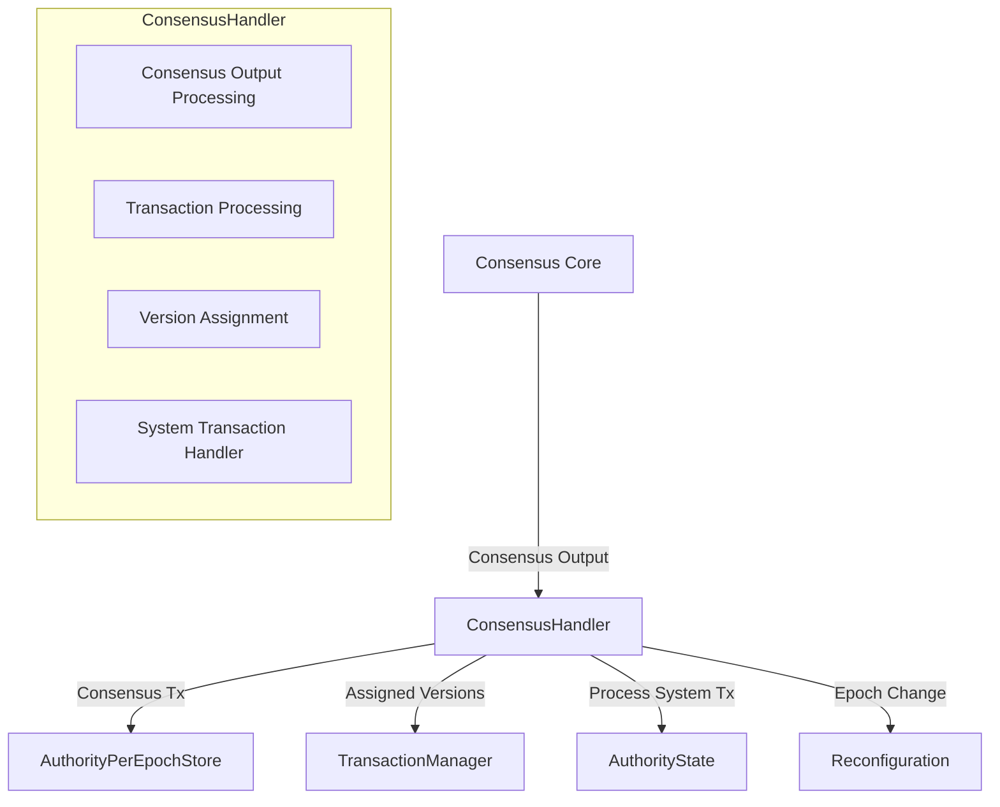

# Consensus Handler

## Purpose and Scope
This document explains the ConsensusHandler component in the Soma blockchain's Authority module. The ConsensusHandler is responsible for processing outputs from the consensus module, including ordering transactions with shared objects, handling epoch-ending transactions, and coordinating the execution of consensus-ordered transactions. This document covers its architecture, interactions with other components, and implementation details.

## Key Responsibilities

- Processes consensus output containing sequenced transactions
- Assigns versions to shared objects in consensus order
- Handles epoch changes and reconfiguration 
- Routes transactions to the TransactionManager
- Enforces transaction ordering for shared objects

## Component Architecture



## Implementation Details

### Core Structure

```rust
// in authority/src/handler.rs
pub struct ConsensusHandler<C> {
    authority_state: Arc<AuthorityState>,
    transaction_manager: Arc<TransactionManager>,
    commit_client: C,
    /// Used for notifying epoch change events
    end_of_epoch_sender: watch::Sender<Committee>,
    metrics: Arc<ConsensusHandlerMetrics>,
}
```

**Key Fields**:
- `authority_state`: Reference to the central state manager
- `transaction_manager`: For transaction execution management
- `commit_client`: Interface to consensus module
- `end_of_epoch_sender`: Channel for epoch change notifications
- `metrics`: Performance and monitoring metrics

### Handling Consensus Output

```rust
pub async fn process_consensus_output(&self, consensus_output: ConsensusOutput) -> SomaResult {
    let CommittedSubDag {
        certificates,
        consensus_index,
        epoch,
    } = consensus_output.sub_dag;

    // Verify epoch matches current epoch
    let epoch_store = self.authority_state.load_epoch_store_one_call_per_task();
    
    if epoch != epoch_store.epoch() {
        warn!(
            "Received consensus output for epoch {}, but current epoch is {}",
            epoch,
            epoch_store.epoch()
        );
        return Err(SomaError::WrongEpoch { 
            expected_epoch: epoch_store.epoch(),
            actual_epoch: epoch, 
        });
    }
    
    // Process the consensus output transactions
    let metrics = self.metrics.clone();
    let authority_state = self.authority_state.clone();
    
    // Process transaction batches in order
    for (i, transaction_key) in consensus_output.ordered_transactions.iter().enumerate() {
        match transaction_key {
            SequencedConsensusTransactionKey::Certificate(cert_digest) => {
                // Process user transaction certificate
                let cert = certificates
                    .get(cert_digest)
                    .ok_or_else(|| {
                        SomaError::InternalError(format!("Certificate not found: {:?}", cert_digest))
                    })?
                    .clone();
                
                let tx = SequencedConsensusTransaction {
                    transaction: ConsensusTransaction::UserTransaction(cert),
                    sequence_number: consensus_index + i as u64,
                };
                
                // Process the transaction with proper version assignment
                if let Err(e) = epoch_store.handle_consensus_transaction(
                    tx,
                    &self.transaction_manager,
                ) {
                    error!("Failed to process consensus transaction: {:?}", e);
                    metrics.consensus_handler_errors.inc();
                }
            }
            SequencedConsensusTransactionKey::EndOfEpoch => {
                // Process epoch change
                info!("Received EndOfEpoch transaction from consensus");
                metrics.consensus_handler_epoch_changes.inc();
                
                let next_epoch = epoch + 1;
                if let Err(e) = self.handle_end_of_epoch(next_epoch, &epoch_store).await {
                    error!("Failed to process end of epoch: {:?}", e);
                    return Err(e);
                }
                
                // Return after epoch change to process the remaining transactions
                // in the next epoch
                return Ok(());
            }
            // Other transaction types...
        }
    }
    
    Ok(())
}
```

**Processing Flow**:
1. Verify consensus output epoch matches current epoch
2. Process ordered transactions in sequence
3. Handle user transactions by sending to epoch store
4. Process special transactions like EndOfEpoch
5. Track metrics for monitoring

### Epoch Change Handling

```rust
async fn handle_end_of_epoch(
    &self,
    next_epoch: EpochId,
    epoch_store: &Arc<AuthorityPerEpochStore>,
) -> SomaResult {
    info!("Initiating epoch change from {} to {}", epoch_store.epoch(), next_epoch);
    
    // Get the current timestamp for epoch start time
    let epoch_start_timestamp_ms = SystemTime::now()
        .duration_since(UNIX_EPOCH)
        .expect("Time went backwards")
        .as_millis() as u64;
    
    // Create and execute the epoch advancement transaction
    let (system_state, _effects) = self
        .authority_state
        .create_and_execute_advance_epoch_tx(
            epoch_store,
            epoch_start_timestamp_ms,
        )
        .await
        .map_err(|e| SomaError::InternalError(format!("Failed to advance epoch: {}", e)))?;
    
    // Update the committee for the new epoch
    let next_committee = system_state.get_committee();
    self.end_of_epoch_sender
        .send(next_committee.clone())
        .map_err(|_| SomaError::InternalError("Failed to send epoch change".to_string()))?;
    
    info!("Epoch change completed: {} -> {}", epoch_store.epoch(), next_epoch);
    
    Ok(())
}
```

**Epoch Change Process**:
1. Create timestamp for new epoch
2. Create system transaction for epoch advancement
3. Execute epoch change transaction
4. Notify subscribers about epoch change
5. Log completion of epoch change

### Integration with AuthorityPerEpochStore

The ConsensusHandler interacts with AuthorityPerEpochStore for transaction processing:

```rust
// in authority/src/epoch_store.rs
pub fn handle_consensus_transaction(
    &self,
    transaction: SequencedConsensusTransaction,
    transaction_manager: &Arc<TransactionManager>,
) -> SomaResult {
    match transaction.transaction {
        ConsensusTransaction::UserTransaction(certificate) => {
            // Verify certificate validity
            self.verify_consensus_certificate(&certificate)?;
            
            // Assign versions to shared objects
            let assigned_versions = self.assign_shared_object_versions(certificate)?;
            
            // Enqueue for execution with assigned versions
            transaction_manager.enqueue(vec![certificate], Some(assigned_versions));
            
            Ok(())
        }
        // Handle other transaction types...
    }
}
```

This integration ensures:
- Shared object versions are assigned in consensus order
- Transactions are properly validated before execution
- Version assignment is deterministic across validators

## Shared Object Version Assignment

The shared object version assignment process is a critical part of the consensus handler's responsibilities:

```rust
// in authority/src/epoch_store.rs
pub fn assign_shared_object_versions(
    &self,
    certificate: VerifiedExecutableTransaction,
) -> SomaResult<SharedObjectVersions> {
    let transaction_digest = *certificate.digest();
    let shared_inputs = certificate
        .shared_input_objects()
        .map_err(|e| SomaError::InternalError(format!("Failed to extract shared inputs: {}", e)))?;
    
    if shared_inputs.is_empty() {
        return Ok(SharedObjectVersions::default());
    }
    
    // Check if already assigned
    if let Some(versions) = self
        .consensus_output_cache
        .read()
        .get_shared_input_versions(&transaction_digest)
    {
        return Ok(versions.clone());
    }
    
    // Assign versions using the shared object version manager
    let assigned_versions = self
        .shared_object_version_manager
        .assign_versions_from_consensus(
            transaction_digest,
            shared_inputs,
        )?;
    
    // Record assignments in cache
    self.consensus_output_cache
        .write()
        .record_shared_input_versions(transaction_digest, assigned_versions.clone());
    
    Ok(assigned_versions)
}
```

**Version Assignment Process**:
1. Extract shared object inputs from certificate
2. Check if versions already assigned (idempotence)
3. Use SharedObjectVersionManager to assign next versions
4. Cache assignments for future reference
5. Return assigned versions for execution

## Integration with Other Components

### 1. Consensus Module Integration

The ConsensusHandler connects directly to the Consensus module:

```rust
// in authority/src/adapter.rs
impl<C: CommitClient + Clone + Send + Sync + 'static> ConsensusAdapter<C> {
    pub async fn submit_transaction(
        &self,
        transaction: &ConsensusTransaction,
    ) -> SomaResult<CommitResult> {
        // Submit transaction to consensus
        let commit_result = self.commit_client.commit(transaction).await?;
        
        // Return result with commit index
        Ok(commit_result)
    }
}
```

This integration ensures:
- Transactions requiring consensus ordering are properly submitted
- Committed transactions are processed in the correct order
- Epoch changes are coordinated with consensus

### 2. TransactionManager Integration

ConsensusHandler sends transactions to TransactionManager for execution:

```rust
// in authority/src/epoch_store.rs
pub fn handle_consensus_transaction(
    &self,
    transaction: SequencedConsensusTransaction,
    transaction_manager: &Arc<TransactionManager>,
) -> SomaResult {
    // Process transaction...
    
    // Enqueue for execution
    transaction_manager.enqueue(vec![certificate], Some(assigned_versions));
    
    Ok(())
}
```

This ensures:
- Transactions execute after proper version assignment
- Execution respects dependency ordering
- Execution happens in the correct epoch context

### 3. Reconfiguration Integration

ConsensusHandler triggers epoch transitions:

```rust
// Notify reconfiguration
self.end_of_epoch_sender
    .send(next_committee.clone())
    .map_err(|_| SomaError::InternalError("Failed to send epoch change".to_string()))?;
```

This integration ensures:
- Epoch changes are coordinated across modules
- Subscribers are notified about committee changes
- Reconfiguration happens at the correct consensus point

## Thread Safety and Error Handling

### Thread Safety

The ConsensusHandler employs several thread safety mechanisms:

1. **Arc-Wrapped Components**
   ```rust
   authority_state: Arc<AuthorityState>,
   transaction_manager: Arc<TransactionManager>,
   metrics: Arc<ConsensusHandlerMetrics>,
   ```

2. **Thread-Safe Channel Communication**
   ```rust
   end_of_epoch_sender: watch::Sender<Committee>,
   ```

3. **Safe Access to Epoch Store**
   ```rust
   let epoch_store = self.authority_state.load_epoch_store_one_call_per_task();
   ```

### Error Handling

The handler implements robust error handling:

1. **Transaction Processing Errors**
   ```rust
   if let Err(e) = epoch_store.handle_consensus_transaction(
       tx,
       &self.transaction_manager,
   ) {
       error!("Failed to process consensus transaction: {:?}", e);
       metrics.consensus_handler_errors.inc();
   }
   ```

2. **Epoch Validation**
   ```rust
   if epoch != epoch_store.epoch() {
       warn!(
           "Received consensus output for epoch {}, but current epoch is {}",
           epoch,
           epoch_store.epoch()
       );
       return Err(SomaError::WrongEpoch { 
           expected_epoch: epoch_store.epoch(),
           actual_epoch: epoch, 
       });
   }
   ```

3. **Reconfiguration Error Handling**
   ```rust
   if let Err(e) = self.handle_end_of_epoch(next_epoch, &epoch_store).await {
       error!("Failed to process end of epoch: {:?}", e);
       return Err(e);
   }
   ```

## Performance Considerations

The ConsensusHandler implementation includes several performance optimizations:

1. **Batch Processing**
   ```rust
   // Process transaction batches in order
   for (i, transaction_key) in consensus_output.ordered_transactions.iter().enumerate() {
       // Process each transaction...
   }
   ```

2. **Caching of Version Assignments**
   ```rust
   // Check if already assigned
   if let Some(versions) = self
       .consensus_output_cache
       .read()
       .get_shared_input_versions(&transaction_digest)
   {
       return Ok(versions.clone());
   }
   ```

3. **Metrics Collection**
   ```rust
   pub struct ConsensusHandlerMetrics {
       consensus_handler_processed_txs: IntCounter,
       consensus_handler_errors: IntCounter,
       consensus_handler_epoch_changes: IntCounter,
       consensus_handler_processing_latency: Histogram,
   }
   ```

## Verification Status

| Component | Verification Status | Confidence | Evidence |
|-----------|---------------------|------------|----------|
| ConsensusHandler Structure | Verified-Code | 9/10 | Direct inspection of authority/src/handler.rs |
| Consensus Output Processing | Verified-Code | 9/10 | Implementation in process_consensus_output method |
| Epoch Change Handling | Verified-Code | 8/10 | Implementation in handle_end_of_epoch method |
| Shared Object Version Assignment | Verified-Code | 9/10 | Implementation in assign_shared_object_versions |
| Integration with TransactionManager | Verified-Code | 8/10 | Calls to transaction_manager.enqueue |
| Error Handling | Verified-Code | 8/10 | Error reporting patterns throughout code |

## Confidence: 9/10

This document provides a detailed and accurate description of the ConsensusHandler component based on direct code inspection. The component's architecture, workflow, and integration with other modules are well-documented with clear evidence from the codebase.

## Last Updated: 3/8/2025
