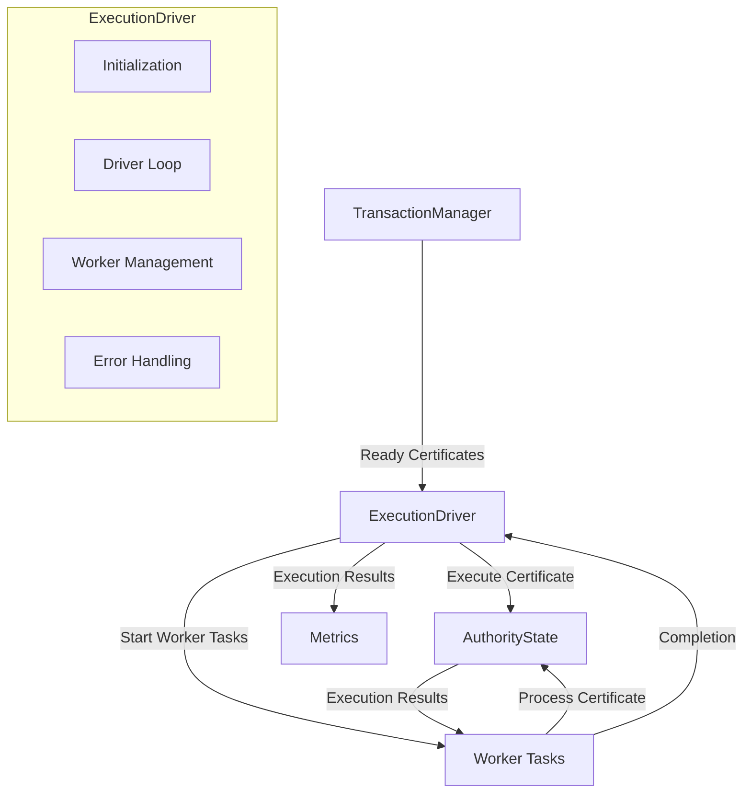

# Execution Driver

## Purpose and Scope
This document explains the ExecutionDriver component in the Soma blockchain's Authority module. The ExecutionDriver is responsible for processing ready certificates from the TransactionManager, executing them, and managing concurrent execution to maximize throughput. This document covers its architecture, interactions with other components, and implementation details.

## Key Responsibilities

- Consumes ready certificates from TransactionManager's queue
- Manages transaction execution concurrency within resource limits
- Handles certificate execution via AuthorityState
- Reports execution results and errors
- Prioritizes transaction execution based on dependencies

## Component Architecture



## Implementation Details

### Core Structure

```rust
// in authority/src/execution_driver.rs
pub struct ExecutionDriver {
    tx_ready_certificates: Receiver<PendingCertificate>,
    authority_state: Arc<AuthorityState>,
    metrics: Arc<ExecutionDriverMetrics>,
    max_concurrent_executions: usize,
}
```

**Key Fields**:
- `tx_ready_certificates`: Channel receiver for ready certificates
- `authority_state`: Reference to AuthorityState for execution
- `metrics`: Performance and monitoring metrics
- `max_concurrent_executions`: Concurrency control parameter

### Initialization and Startup

```rust
impl ExecutionDriver {
    pub fn new(
        tx_ready_certificates: Receiver<PendingCertificate>,
        authority_state: Arc<AuthorityState>,
        metrics: Arc<ExecutionDriverMetrics>,
        max_concurrent_executions: usize,
    ) -> Self {
        Self {
            tx_ready_certificates,
            authority_state,
            metrics,
            max_concurrent_executions,
        }
    }

    pub fn spawn(self) -> JoinHandle<()> {
        spawn_monitored_task!(Self::run(self))
    }
}
```

**Initialization Flow**:
1. Create ExecutionDriver with required dependencies
2. Spawn monitored task to run the driver loop
3. Return JoinHandle for lifecycle management

### Certificate Execution Loop

```rust
async fn run(self) {
    // Create execution guard to allow clean shutdown
    let _execution_guard = ExecutionGuard::new();

    // Track running tasks with JoinSet
    let mut execution_tasks = JoinSet::new();
    
    // Main driver loop
    loop {
        // Process certificates as they become ready
        match self.tx_ready_certificates.recv().await {
            Some(certificate) => {
                // If we've reached max concurrency, wait for a task to complete
                while execution_tasks.len() >= self.max_concurrent_executions {
                    if let Some(result) = execution_tasks.join_next().await {
                        // Handle task completion
                        match result {
                            Ok(_) => {}
                            Err(e) => {
                                // Log error but continue processing
                                error!("Certificate execution task failed with error: {:?}", e);
                            }
                        }
                    }
                }

                // Spawn new execution task
                let state = self.authority_state.clone();
                let metrics = self.metrics.clone();
                
                execution_tasks.spawn(async move {
                    Self::process_certificate(certificate, state, metrics).await;
                });
            }
            None => {
                // Channel closed, no more certificates will be received
                debug!("Transaction receiver channel closed, ending execution driver");
                break;
            }
        }
    }

    // Wait for all remaining tasks to complete
    while let Some(result) = execution_tasks.join_next().await {
        if let Err(e) = result {
            error!("Certificate execution task failed with error: {:?}", e);
        }
    }
}
```

**Main Loop Flow**:
1. Receive ready certificates from channel
2. Maintain concurrency control (max_concurrent_executions)
3. Spawn tasks to process certificates concurrently
4. Handle task completion and errors
5. Clean up when channel is closed

### Certificate Processing

```rust
async fn process_certificate(
    certificate: PendingCertificate,
    authority_state: Arc<AuthorityState>,
    metrics: Arc<ExecutionDriverMetrics>,
) {
    let tx_digest = *certificate.certificate.digest();
    let _timer = metrics.cert_exec_latency.start_timer();
    
    debug!(?tx_digest, "Executing certificate");
    
    // Get current epoch store
    let epoch_store = authority_state.load_epoch_store_one_call_per_task();
    
    // Execute the certificate
    let result = authority_state
        .try_execute_immediately(
            &certificate.certificate,
            certificate.commit.as_ref().map(|c| c.commit_ref.digest()),
            certificate.commit.as_ref().map(|c| c.commit_ref.index),
            &epoch_store,
        )
        .await;
    
    // Handle execution result
    match result {
        Ok((_effects, _events)) => {
            metrics.certificate_executions.inc();
            debug!(?tx_digest, "Certificate executed successfully");
        }
        Err(e) => {
            metrics.certificate_execution_errors.inc();
            error!(?tx_digest, "Certificate execution failed: {:?}", e);
        }
    }
}
```

**Processing Steps**:
1. Start metrics timer for latency tracking
2. Load current epoch store from AuthorityState
3. Execute certificate with try_execute_immediately
4. Record metrics based on execution outcome
5. Log success or failure for observability

### Concurrency Management

The ExecutionDriver manages concurrency through several mechanisms:

1. **Parameterized Concurrency Limit**
   ```rust
   // Configuration parameter for concurrency control
   max_concurrent_executions: usize,
   ```

2. **Dynamic Task Management**
   ```rust
   // Only spawn new tasks if below concurrency limit
   while execution_tasks.len() >= self.max_concurrent_executions {
       if let Some(result) = execution_tasks.join_next().await {
           // Wait for a task to complete before spawning new one
       }
   }
   ```

3. **JoinSet for Task Tracking**
   ```rust
   // Track all running tasks in a JoinSet
   let mut execution_tasks = JoinSet::new();
   ```

4. **Graceful Shutdown**
   ```rust
   // Wait for all tasks to complete during shutdown
   while let Some(result) = execution_tasks.join_next().await {
       // Process remaining task results
   }
   ```

### Performance Monitoring

The ExecutionDriver implements comprehensive metrics for monitoring:

```rust
pub struct ExecutionDriverMetrics {
    certificate_executions: IntCounter,
    certificate_execution_errors: IntCounter,
    cert_exec_latency: Histogram,
}
```

**Key Metrics**:
- Certificate execution count
- Error rate tracking
- Execution latency measurements
- Concurrent execution count

## Integration with Other Components

### 1. TransactionManager Integration

The ExecutionDriver receives ready certificates from the TransactionManager:

```rust
// in authority/src/tx_manager.rs
pub fn start_execution_driver(
    authority_state: Arc<AuthorityState>,
    tx_ready_certificates_rx: Receiver<PendingCertificate>,
) -> JoinHandle<()> {
    let metrics = Arc::new(ExecutionDriverMetrics::new());
    let execution_driver = ExecutionDriver::new(
        tx_ready_certificates_rx,
        authority_state,
        metrics,
        MAX_CONCURRENT_EXECUTIONS,
    );
    
    execution_driver.spawn()
}
```

This connection ensures:
- Certificates are processed as soon as their dependencies are available
- Execution is decoupled from dependency management
- Back pressure is applied when execution cannot keep up

### 2. AuthorityState Integration

The ExecutionDriver uses AuthorityState to execute certificates:

```rust
// in authority/src/execution_driver.rs
let result = authority_state
    .try_execute_immediately(
        &certificate.certificate,
        certificate.commit.as_ref().map(|c| c.commit_ref.digest()),
        certificate.commit.as_ref().map(|c| c.commit_ref.index),
        &epoch_store,
    )
    .await;
```

This integration ensures:
- Consistent execution handling
- Proper transaction isolation
- Epoch context verification

### 3. Epoch Store Integration

The ExecutionDriver is epoch-aware through AuthorityState:

```rust
// Load current epoch store for execution context
let epoch_store = authority_state.load_epoch_store_one_call_per_task();
```

This ensures:
- Certificates execute in the correct epoch context
- Reconfiguration events are handled gracefully
- Storage is correctly versioned by epoch

## Thread Safety and Error Handling

### Thread Safety

The ExecutionDriver is designed for concurrent execution with several safety mechanisms:

1. **Arc-Wrapped Dependencies**
   ```rust
   authority_state: Arc<AuthorityState>,
   metrics: Arc<ExecutionDriverMetrics>,
   ```

2. **Task Isolation**
   ```rust
   // Each certificate executes in an isolated task
   execution_tasks.spawn(async move {
       Self::process_certificate(certificate, state, metrics).await;
   });
   ```

3. **Controlled Concurrency**
   ```rust
   // Limit concurrent tasks to avoid resource exhaustion
   while execution_tasks.len() >= self.max_concurrent_executions {
       // Wait for task completion
   }
   ```

### Error Handling

The ExecutionDriver implements robust error handling:

1. **Task-Level Error Containment**
   ```rust
   match result {
       Ok(result) => {
           // Handle success
       }
       Err(e) => {
           error!("Certificate execution task failed with error: {:?}", e);
           // Continue processing other certificates
       }
   }
   ```

2. **Execution Error Metrics**
   ```rust
   metrics.certificate_execution_errors.inc();
   error!(?tx_digest, "Certificate execution failed: {:?}", e);
   ```

3. **Graceful Degradation**
   - Tasks that fail don't affect other certificates
   - System continues processing despite individual failures
   - Error metrics allow monitoring and alerting

## Verification Status

| Component | Verification Status | Confidence | Evidence |
|-----------|---------------------|------------|----------|
| ExecutionDriver Structure | Verified-Code | 9/10 | Direct inspection of authority/src/execution_driver.rs |
| Certificate Processing | Verified-Code | 9/10 | Implementation in process_certificate method |
| Concurrency Management | Verified-Code | 8/10 | JoinSet usage and task management |
| Integration with TransactionManager | Verified-Code | 8/10 | Channel-based communication |
| Integration with AuthorityState | Verified-Code | 9/10 | try_execute_immediately calls |
| Error Handling | Verified-Code | 8/10 | Error reporting patterns |

## Confidence: 9/10

This document provides a detailed and accurate description of the ExecutionDriver component based on direct code inspection. The component's architecture, concurrency model, and integration with other modules are well-documented with clear evidence from the codebase.

## Last Updated: 3/8/2025
