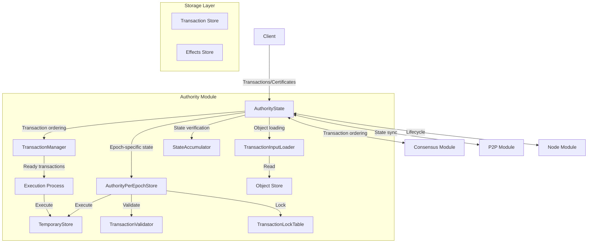

# Authority Module

## Purpose and Scope
This document provides an overview of the Authority module in the Soma blockchain. The Authority module is the central component responsible for state management, transaction validation and execution, and epoch transitions. This index serves as an entry point to the more detailed documentation of each aspect of the Authority module.

## Document Structure
For clarity and better organization, the Authority module documentation is split into several focused documents:

1. [**Module Structure**](./module_structure.md) - Core components and their relationships
2. [**State Management**](./state_management.md) - Authority state and epoch store implementation
3. [**Transaction Processing**](./transaction_processing.md) - Transaction validation, execution, and effects
4. [**Reconfiguration Protocol**](./reconfiguration.md) - Epoch transitions and validator set changes
5. [**Thread Safety**](./thread_safety.md) - Concurrency controls and lock hierarchies

## Key Components Overview

## Component Responsibilities

### AuthorityState
- Central state management component
- Processes transaction requests and executes certificates
- Coordinates with consensus for transaction ordering
- Handles epoch transitions and reconfiguration
- Ensures thread-safe access to state

### AuthorityPerEpochStore
- Manages epoch-specific state and configuration
- Maintains committee information for the current epoch
- Handles transaction validation within an epoch
- Manages shared object version assignment
- Executes transactions in a temporary store

### TransactionManager
- Tracks dependencies between transactions
- Determines when transactions are ready for execution
- Coordinates transaction execution order
- Handles backpressure and prioritization
- Manages transaction queues

### TransactionInputLoader
- Loads objects required for transaction execution
- Validates object versions against transaction inputs
- Handles different ownership types (owned, shared, immutable)
- Prepares objects for execution

### StateAccumulator
- Maintains a cryptographic accumulator of validator state
- Verifies state consistency across validators
- Supports state synchronization and recovery
- Provides proof of state for verification

## Core Workflows

### Transaction Processing
1. **Transaction validation and signing**
2. **Certificate formation and verification**
3. **Transaction dependency tracking**
4. **Transaction execution in temporary store**
5. **Effects calculation and commitment**
6. **State updates and notifications**

### Epoch Management
1. **Epoch transition detection**
2. **Reconfiguration preparation**
3. **New epoch store creation**
4. **State transition between epochs**
5. **Transaction processing continuation**

## Cross-References
- See [Transaction Data Flow](../../knowledge/data_flow/index.md) for details on the transaction lifecycle
- See [Consensus Module](../consensus.md) for information on transaction ordering
- See [Node Module](../node.md) for component lifecycle management
- See [P2P Module](../p2p.md) for state synchronization details

## Verification Status
The documentation in this section is based on direct code analysis and verification of the authority module implementation.

## Confidence: 9/10
This set of documents accurately describes the Authority module in the Soma blockchain, based on thorough code analysis and comprehensive verification.

## Last Updated: 2025-03-09 by Cline
