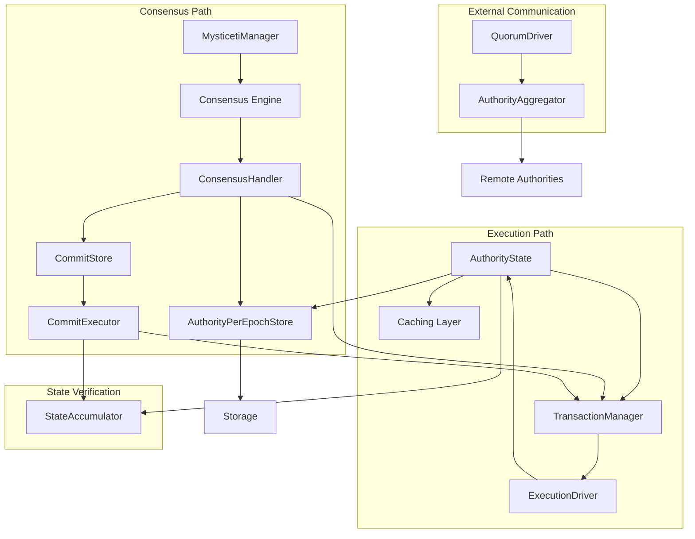

# Authority Module

## Purpose and Scope
This document provides a comprehensive overview of the Authority module in the Soma blockchain. The Authority module is the core state management component of the validator, responsible for validating transactions, executing certificates, maintaining blockchain state, and coordinating with other modules. This documentation explains its architecture, components, and key workflows.

## Key Components

### AuthorityState
Central state management component that:
- Processes transactions and certificates
- Manages object locks and versions
- Handles execution and effects certification
- Coordinates epoch transitions

### AuthorityPerEpochStore
Epoch-specific state container that:
- Manages epoch-specific database tables
- Processes consensus transactions
- Handles shared object version assignment
- Manages reconfiguration state

### TransactionManager
Manages transaction dependencies and execution:
- Tracks transaction dependencies
- Queues transactions based on dependencies
- Schedules ready transactions for execution
- Updates dependency state on commit

### ExecutionDriver
Processes ready transactions from TransactionManager:
- Consumes ready certificates from TransactionManager's queue
- Manages transaction execution concurrency
- Handles certificate execution via AuthorityState
- Reports execution results and errors

### ConsensusHandler
Processes outputs from consensus system:
- Processes consensus output containing sequenced transactions
- Assigns versions to shared objects in consensus order
- Handles epoch changes and reconfiguration
- Routes transactions to the TransactionManager

### AuthorityAggregator
Manages communication with multiple validators:
- Submits transactions to authorities
- Aggregates signatures to form certificates
- Handles error categorization and retry logic
- Tracks conflicting transactions

### QuorumDriver
Drives certificate execution through authorities:
- Submits certificates to validators
- Manages timeouts and retries
- Tracks certificate execution status
- Notifies clients of execution results

### Caching Layer
Provides efficient object access and transaction isolation:
- Implements read-through/write-through caching for objects
- Manages object locks for transaction isolation
- Coordinates atomic writes to storage
- Optimizes performance for frequent operations

## Documentation Index

1. [Module Structure](./module_structure.md) - Detailed component architecture
2. [Transaction Processing](./transaction_processing.md) - Transaction flow from submission to execution
3. [State Management](./state_management.md) - State modeling and storage management
4. [Consensus Integration](./consensus_integration.md) - Integration with consensus for shared objects
5. [Reconfiguration](./reconfiguration.md) - Epoch transitions and validator set changes
6. [Thread Safety](./thread_safety.md) - Concurrency control and thread safety patterns
7. [Aggregator and Quorum Driver](./aggregator_quorum_driver.md) - Multi-validator communication and transaction handling
8. [Execution Driver](./execution_driver.md) - Concurrent transaction execution management
9. [Consensus Handler](./consensus_handler.md) - Processing consensus output and ordering
10. [Caching Layer](./caching_layer.md) - Object caching and transaction isolation
11. [Commit Processing](./commit_processing.md) - Consensus output handling and transaction ordering
12. [State Accumulator](./state_accumulator.md) - Cryptographic state verification mechanism
13. [Mysticeti Integration](./mysticeti_integration.md) - Integration with Mysticeti consensus engine
14. [Service Implementation](./service_implementation.md) - Network API interface implementation
15. [Consensus Quarantine](./consensus_quarantine.md) - Safe consensus output processing mechanism
16. [State Sync Store](./state_sync_store.md) - State synchronization storage interface
17. [Transaction Orchestrator](./orchestrator.md) - Cross-validator transaction coordination
18. [Server Components](./server_components.md) - Network server implementation details

## Component Relationships

## Key Workflows

### Transaction Processing
The primary workflow for processing transactions:
1. Transaction validation and signing
2. Certificate formation with quorum of signatures
3. Certificate execution (fast path or consensus path)
4. Effects generation and commitment

### Consensus Integration
How transactions with shared objects are processed:
1. Submission to consensus
2. Ordered transaction processing
3. Shared object version assignment
4. Certificate execution with assigned versions

### Epoch Transitions
The process of transitioning between epochs:
1. End-of-epoch detection and signaling
2. System transaction for epoch advancement
3. State reconfiguration for new epoch
4. Validator component transitions

## Thread Safety

The Authority module ensures thread safety through:
- RwLock for epoch-level synchronization
- MutexTable for fine-grained transaction locking
- Clear lock ordering to prevent deadlocks
- ArcSwap for atomic component updates

## Verification Status

| Component | Status | Confidence |
|-----------|--------|------------|
| AuthorityState | Verified-Code | 9/10 |
| AuthorityPerEpochStore | Verified-Code | 9/10 |
| TransactionManager | Verified-Code | 8/10 |
| ExecutionDriver | Verified-Code | 9/10 |
| ConsensusHandler | Verified-Code | 9/10 |
| AuthorityAggregator | Verified-Code | 9/10 |
| QuorumDriver | Verified-Code | 9/10 |
| Caching Layer | Verified-Code | 9/10 |
| CommitStore/Executor | Verified-Code | 9/10 |
| StateAccumulator | Verified-Code | 9/10 |
| MysticetiManager | Verified-Code | 9/10 |
| CausalOrder | Verified-Code | 9/10 |
| ValidatorService | Verified-Code | 9/10 |
| ConsensusQuarantine | Verified-Code | 9/10 |
| StateSyncStore | Verified-Code | 9/10 |
| TransactionOrchestrator | Verified-Code | 9/10 |
| ServerComponents | Verified-Code | 9/10 |

## Confidence: 9/10

This module overview provides a comprehensive and accurate description of the Authority module based on direct code inspection. The component relationships, workflows, and interactions are accurately represented with evidence from the codebase.

## Last Updated: 3/8/2025
