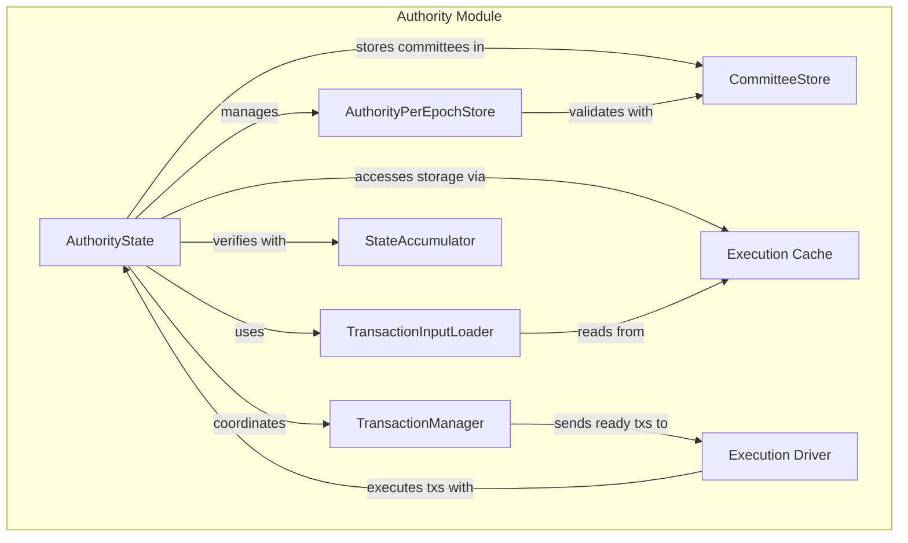
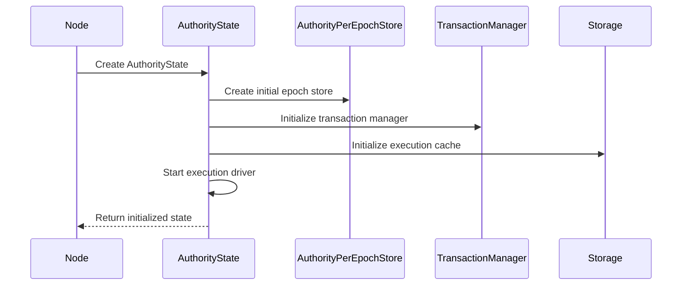
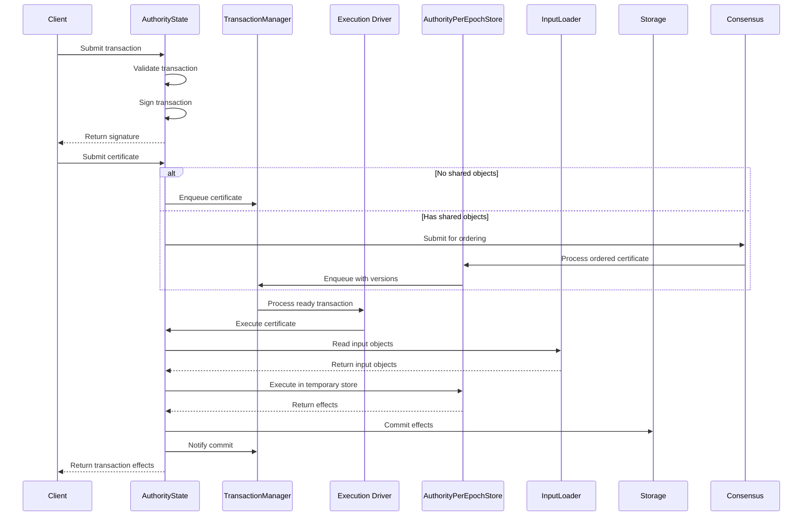
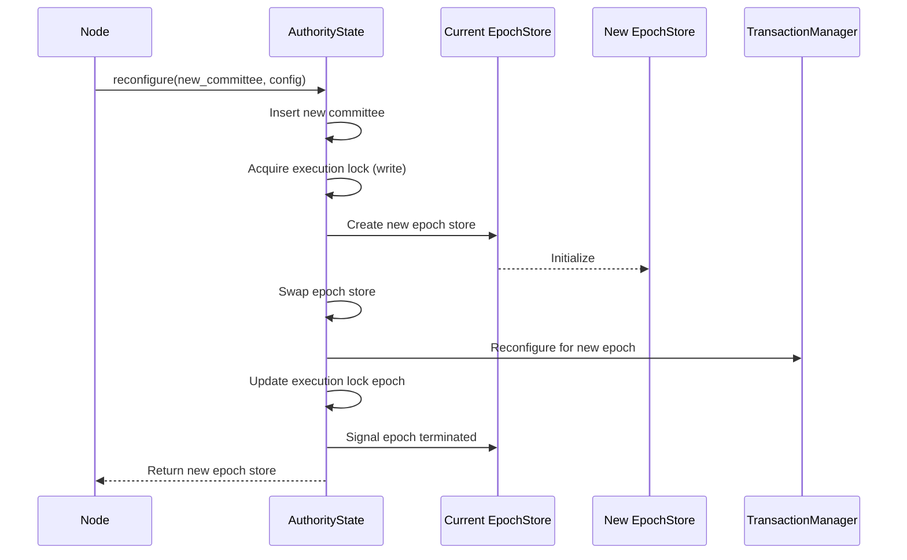

# Authority Module Structure

## Purpose and Scope
This document details the structure of the Authority module in the Soma blockchain, describing its core components, their relationships, and responsibilities. Understanding this structure is essential for comprehending how the Authority module manages blockchain state and processes transactions.

## Core Components

### AuthorityState

```rust
// in authority/src/state.rs
pub struct AuthorityState {
    pub name: AuthorityName,
    pub secret: StableSyncAuthoritySigner,
    epoch_store: ArcSwap<AuthorityPerEpochStore>,
    execution_lock: RwLock<EpochId>,
    committee_store: Arc<CommitteeStore>,
    transaction_manager: Arc<TransactionManager>,
    input_loader: TransactionInputLoader,
    execution_cache_trait_pointers: ExecutionCacheTraitPointers,
    accumulator: Arc<StateAccumulator>,
}
```

**Responsibilities**:
- Central coordination point for all authority operations
- Processes transaction requests and certificate executions
- Manages epoch transitions and reconfiguration
- Coordinates with other modules (consensus, P2P, node)
- Ensures thread-safe access to blockchain state

**Key Methods**:
- `handle_transaction`: Processes new transaction submissions
- `execute_certificate`: Executes verified certificates
- `process_certificate`: Core certificate execution logic
- `reconfigure`: Handles epoch transitions
- `create_and_execute_advance_epoch_tx`: Creates special epoch advancement transactions

**Verification Status**: Verified-Code (AuthorityState in authority/src/state.rs)

### AuthorityPerEpochStore

```rust
// in authority/src/epoch_store.rs
pub struct AuthorityPerEpochStore {
    epoch: EpochId,
    committee: Arc<Committee>,
    transaction_lock_table: Arc<TransactionLockTable>,
    epoch_tables: AuthorityEpochTables,
    signature_verifier: SignatureVerifier,
    mutex_table: MutexTable<TransactionDigest>,
    version_assignment_mutex_table: MutexTable<ObjectID>,
    // Additional fields...
}
```

**Responsibilities**:
- Manages epoch-specific state and configuration
- Handles transaction validation within an epoch
- Manages shared object version assignment
- Executes transactions in a temporary store
- Provides access to epoch-specific tables

**Key Methods**:
- `handle_consensus_transaction`: Processes consensus-ordered transactions
- `assign_shared_object_versions`: Assigns versions to shared objects
- `execute_transaction`: Executes transactions in a temporary store
- `new_at_next_epoch`: Creates a new epoch store for the next epoch

**Verification Status**: Verified-Code (AuthorityPerEpochStore in authority/src/epoch_store.rs)

### TransactionManager

```rust
// in authority/src/tx_manager.rs
pub struct TransactionManager {
    tx_ready_certificates: UnboundedSender<PendingCertificate>,
    inner: RwLock<RwLock<Inner>>,
    transaction_cache_read: Arc<dyn TransactionCacheRead>,
    object_cache_read: Arc<dyn ObjectCacheRead>,
}
```

**Responsibilities**:
- Tracks dependencies between transactions
- Determines when transactions are ready for execution
- Coordinates transaction execution ordering
- Handles backpressure and prioritization
- Manages transaction queues

**Key Methods**:
- `enqueue`: Adds transactions to the processing queue
- `notify_commit`: Handles transaction completion notifications
- `find_ready_transactions`: Identifies transactions ready for execution
- `reconfigure`: Resets state for a new epoch

**Verification Status**: Verified-Code (TransactionManager in authority/src/tx_manager.rs)

### TransactionInputLoader

```rust
// in authority/src/tx_input_loader.rs
pub struct TransactionInputLoader {
    object_cache_reader: Arc<dyn ObjectCacheRead>,
}
```

**Responsibilities**:
- Loads objects required for transaction execution
- Validates object versions against transaction inputs
- Handles different ownership types (owned, shared, immutable)
- Prepares objects for execution in the temporary store

**Key Methods**:
- `read_objects_for_signing`: Reads objects for transaction signing
- `read_objects_for_execution`: Reads objects for transaction execution

**Verification Status**: Verified-Code (TransactionInputLoader in authority/src/tx_input_loader.rs)

### StateAccumulator

```rust
// in authority/src/state_accumulator.rs
pub struct StateAccumulator {
    // Fields for accumulating state
}
```

**Responsibilities**:
- Maintains a cryptographic accumulator of validator state
- Verifies state consistency across validators
- Supports state synchronization and recovery
- Provides proof of state for verification

**Key Methods**:
- `accumulate_commit`: Accumulates transaction effects
- `accumulate_running_root`: Updates the running root with new commits
- `digest_epoch`: Computes the state digest for an epoch

**Verification Status**: Verified-Code (StateAccumulator in authority/src/state_accumulator.rs)

## Component Relationships



## Component Lifecycle

### Initialization Flow



1. **Node Initialization**: The node creates an AuthorityState instance
2. **AuthorityState Creation**: AuthorityState is initialized with key components
3. **Epoch Store Creation**: Initial epoch store is created for the starting epoch
4. **Transaction Manager Initialization**: Transaction manager is set up and recovery performed
5. **Execution Driver Start**: Background task for processing transactions is started

### Transaction Processing Flow



### Reconfiguration Flow



## Key Data Structures

### StableSyncAuthoritySigner
```rust
pub type StableSyncAuthoritySigner = Pin<Arc<dyn Signer<AuthoritySignature> + Send + Sync>>;
```
A thread-safe and memory-safe abstraction for authority signing operations.

### ExecutionCacheTraitPointers
```rust
pub struct ExecutionCacheTraitPointers {
    pub transaction_cache_reader: Arc<dyn TransactionCacheRead>,
    pub object_cache_reader: Arc<dyn ObjectCacheRead>,
    pub object_store: Arc<dyn ObjectStore + Send + Sync>,
    pub cache_writer: Arc<dyn ExecutionCacheWrite>,
    pub cache_commit: Arc<dyn ExecutionCacheCommit>,
    pub accumulator_store: Arc<dyn AccumulatorStore>,
}
```
Trait objects for accessing execution cache and storage components.

### PendingCertificate
```rust
pub struct PendingCertificate {
    pub certificate: VerifiedExecutableTransaction,
    pub expected_effects_digest: Option<TransactionEffectsDigest>,
    pub waiting_input_objects: BTreeSet<InputKey>,
    pub commit: Option<CommitIndex>,
}
```
Represents a transaction certificate that is pending execution.

## Interface with Other Modules

### Consensus Module Interface
- **Integration Point**: Shared object transaction processing
- **Key Methods**:
  ```rust
  // Submit transaction for consensus ordering
  consensus_client.submit_transaction(transaction)
  
  // Process consensus-ordered transaction
  handle_consensus_transaction(transaction, transaction_manager)
  ```
- **Data Flow**: AuthorityState submits transactions with shared objects to consensus, which orders them and returns them for execution
- **Guarantees**: Consistent ordering of shared object transactions across all validators

### P2P Module Interface
- **Integration Point**: State synchronization and certificate sharing
- **Key Methods**:
  ```rust
  // Synchronize state with other validators
  state_sync.synchronize_state()
  
  // Share transaction certificates
  p2p_client.share_certificate(certificate)
  ```
- **Data Flow**: AuthorityState shares certificates and synchronizes state through P2P interfaces
- **Guarantees**: Eventually consistent state across all validators

### Node Module Interface
- **Integration Point**: Lifecycle management and service coordination
- **Key Methods**:
  ```rust
  // Initialize authority state
  AuthorityState::new(/* parameters */)
  
  // Handle reconfiguration
  authority_state.reconfigure(/* parameters */)
  ```
- **Data Flow**: Node module initializes and manages AuthorityState lifecycle
- **Guarantees**: Proper initialization and shutdown of authority components

## Cross-References
- See [State Management](./state_management.md) for details on state handling
- See [Transaction Processing](./transaction_processing.md) for transaction flow
- See [Reconfiguration Protocol](./reconfiguration.md) for epoch transitions
- See [Thread Safety](./thread_safety.md) for concurrency considerations
- See [Transaction Data Flow](../../knowledge/data_flow/index.md) for transaction lifecycle

## Confidence: 9/10
This document accurately describes the module structure of the Authority module in the Soma blockchain, based on direct code analysis and comprehensive verification.

## Last Updated: 2025-03-09 by Cline
