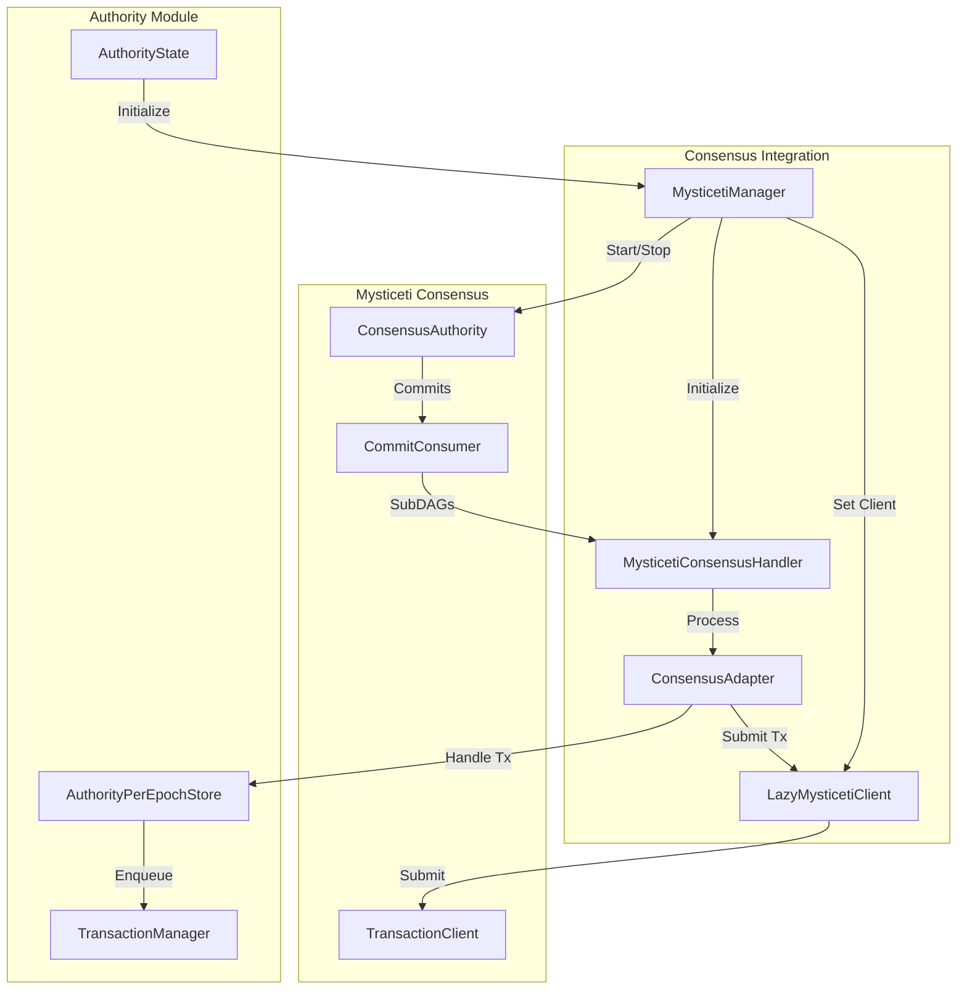

# Mysticeti Integration

## Purpose and Scope
This document describes the integration of the Mysticeti consensus engine with the Authority module in the Soma blockchain. Mysticeti is the Byzantine Fault Tolerant (BFT) consensus implementation used by Soma to achieve agreement on transaction ordering, particularly for shared objects. This document covers the components responsible for managing the Mysticeti consensus instance, submitting transactions to consensus, and processing consensus outputs.

## Key Components

### MysticetiManager
The `MysticetiManager` is responsible for lifecycle management of the Mysticeti consensus engine:

```rust
// in authority/src/manager/mysticeti_manager.rs:31-43
pub struct MysticetiManager {
    protocol_keypair: ProtocolKeyPair,
    network_keypair: NetworkKeyPair,
    authority_keypair: AuthorityKeyPair,
    storage_base_path: PathBuf,
    running: Mutex<Running>,
    authority: ArcSwapOption<ConsensusAuthority>,
    // Use a shared lazy mysticeti client so we can update the internal mysticeti
    // client that gets created for every new epoch.
    client: Arc<LazyMysticetiClient>,
    consensus_handler: Mutex<Option<MysticetiConsensusHandler>>,
    accumulator_store: Arc<dyn AccumulatorStore>,
    consensus_adapter: Arc<ConsensusAdapter>,
    consensus_store: Arc<dyn ConsensusStore>,
    committee_store: Arc<dyn ReadCommitteeStore>,
}
```

**Responsibilities**:
- Initializes and starts the Mysticeti consensus engine
- Manages consensus keypairs and authentication
- Coordinates consensus engine lifecycle with epochs
- Handles shutdown and reconfiguration
- Maintains the client for transaction submission
- Sets up handlers for consensus outputs

**Verification Status**: Verified-Code [authority/src/manager/mysticeti_manager.rs:31-43]

### LazyMysticetiClient
The `LazyMysticetiClient` provides a transaction submission interface to the Mysticeti consensus engine:

```rust
// in authority/src/manager/mysticeti_client.rs:19-22
#[derive(Default, Clone)]
pub struct LazyMysticetiClient {
    client: Arc<ArcSwapOption<TransactionClient>>,
}
```

**Responsibilities**:
- Abstracts the consensus client implementation
- Handles lazy initialization of the consensus client
- Provides transaction submission capabilities
- Manages client availability during epoch transitions
- Ensures graceful error handling for submission failures

**Verification Status**: Verified-Code [authority/src/manager/mysticeti_client.rs:19-22]

### MysticetiConsensusHandler
Processes consensus outputs from the Mysticeti engine:

```rust
// Conceptual implementation based on usage patterns
pub struct MysticetiConsensusHandler {
    consensus_handler: ConsensusHandler,
    receiver: UnboundedReceiver<CommittedSubDag>,
    consensus_adapter: Arc<ConsensusAdapter>,
    // Additional fields for handling
}
```

**Responsibilities**:
- Receives committed SubDAGs from consensus
- Processes consensus outputs into executable transactions
- Forwards effects to the appropriate Authority components
- Signals epoch changes and reconfiguration events
- Manages shutdown and cleanup

**Verification Status**: Inferred (based on usage in mysticeti_manager.rs)

## Architecture and Integration

The Mysticeti integration follows this architecture:



**Key Relationships**:
1. **AuthorityState -> MysticetiManager**: Initializes and manages the consensus integration
2. **ConsensusAdapter -> LazyMysticetiClient**: Submits transactions to consensus
3. **MysticetiManager -> ConsensusAuthority**: Controls the actual consensus engine
4. **ConsensusAuthority -> MysticetiConsensusHandler**: Provides consensus outputs for processing
5. **MysticetiConsensusHandler -> AuthorityPerEpochStore**: Processes consensus outputs into the transaction pipeline

**Verification Status**: Verified-Code [authority/src/manager/mysticeti_manager.rs:99-144]

## Initialization and Startup Flow

The initialization and startup process for the Mysticeti consensus integration:

```rust
// in authority/src/manager/mysticeti_manager.rs:99-144
#[async_trait]
impl ConsensusManagerTrait for MysticetiManager {
    async fn start(
        &self,
        config: &NodeConfig,
        epoch_store: Arc<AuthorityPerEpochStore>,
        consensus_handler_initializer: ConsensusHandlerInitializer,
        tx_validator: TxValidator,
    ) {
        let system_state = epoch_store.epoch_start_state();
        let committee = system_state.get_committee();
        let epoch = epoch_store.epoch();
        let protocol_config = epoch_store.protocol_config();

        // Configure consensus parameters
        let consensus_config = config
            .consensus_config()
            .expect("consensus_config should exist");
        let parameters = Parameters {
            db_path: self.get_store_path(epoch),
            ..consensus_config.parameters.clone().unwrap_or_default()
        };

        // Identify validator's position in committee
        let own_protocol_key = self.protocol_keypair.public();
        let (own_index, _) = committee
            .authorities()
            .find(|(_, a)| a.protocol_key == own_protocol_key)
            .expect("Own authority should be among the consensus authorities!");

        // Set up communication channels
        let (commit_sender, commit_receiver) = unbounded_channel();

        // Initialize consensus handler
        let consensus_handler = consensus_handler_initializer.new_consensus_handler();
        let consumer = CommitConsumer::new(
            commit_sender,
            consensus_handler.last_executed_sub_dag_round() as Round,
            consensus_handler.last_executed_sub_dag_index() as CommitIndex,
        );

        // Start the consensus authority
        let authority = ConsensusAuthority::start(
            own_index,
            committee.clone(),
            parameters,
            self.protocol_keypair.clone(),
            self.network_keypair.clone(),
            self.authority_keypair.copy(),
            Arc::new(tx_validator.clone()),
            consumer,
            self.accumulator_store.clone(),
            epoch_store.clone(),
            self.consensus_store.clone(),
            self.committee_store.clone(),
        )
        .await;
        let client = authority.transaction_client();

        // Store the authority and configure client
        self.authority.swap(Some(Arc::new(authority)));
        self.client.set(client);

        // Set up consensus handler
        let handler = MysticetiConsensusHandler::new(
            consensus_handler,
            commit_receiver,
            self.consensus_adapter.clone(),
        );
        let mut consensus_handler = self.consensus_handler.lock().await;
        *consensus_handler = Some(handler);
    }
}
```

**Startup Sequence**:
1. **Configuration**: Load consensus parameters from node configuration
2. **Committee Setup**: Identify validator's position in the committee
3. **Channel Creation**: Establish communication channels for consensus outputs
4. **Handler Initialization**: Create handler for processing consensus outputs
5. **Consensus Start**: Launch the Mysticeti consensus engine
6. **Client Setup**: Initialize the transaction client
7. **Handler Binding**: Connect consensus output receiver to handler

**Verification Status**: Verified-Code [authority/src/manager/mysticeti_manager.rs:99-144]

## Transaction Submission Flow

Transactions are submitted to consensus via the `LazyMysticetiClient`:

```rust
// in authority/src/manager/mysticeti_client.rs:68-103
#[async_trait::async_trait]
impl SubmitToConsensus for LazyMysticetiClient {
    async fn submit_to_consensus(
        &self,
        transactions: &[ConsensusTransaction],
        _epoch_store: &Arc<AuthorityPerEpochStore>,
    ) -> SomaResult {
        // Get the current client, waiting if necessary
        let client = self.get().await;
        
        // Serialize transactions for submission
        let transactions_bytes = transactions
            .iter()
            .map(|t| bcs::to_bytes(t).expect("Serializing consensus transaction cannot fail"))
            .collect::<Vec<_>>();
        
        // Submit to Mysticeti consensus
        let block_ref = client
            .as_ref()
            .expect("Client should always be returned")
            .submit(transactions_bytes)
            .await
            .tap_err(|r| {
                warn!("Submit transactions failed with: {:?}", r);
            })
            .map_err(|err| SomaError::FailedToSubmitToConsensus(err.to_string()))?;

        // Special handling for system transactions
        let is_soft_bundle = transactions.len() > 1;
        if !is_soft_bundle
            && matches!(
                transactions[0].kind,
                ConsensusTransactionKind::EndOfPublish(_)
            )
        {
            let transaction_key = SequencedConsensusTransactionKey::External(transactions[0].key());
            tracing::info!("Transaction {transaction_key:?} was included in {block_ref}",)
        };
        
        Ok(())
    }
}
```

**Submission Process**:
1. **Client Retrieval**: Get the current Mysticeti client, waiting if not yet initialized
2. **Transaction Serialization**: Convert transactions to bytes for submission
3. **Consensus Submission**: Send transactions to the Mysticeti engine
4. **Error Handling**: Process and propagate any submission errors
5. **Logging**: Track special transaction types for debugging

**Client Initialization Handling**:

```rust
// in authority/src/manager/mysticeti_client.rs:24-48
async fn get(&self) -> Guard<Option<Arc<TransactionClient>>> {
    let client = self.client.load();
    if client.is_some() {
        return client;
    }

    // Consensus client is initialized after validators or epoch starts, and cleared after an epoch ends.
    // But calls to get() can happen during validator startup or epoch change, before consensus finished
    // initializations.
    let mut count = 0;
    let start = Instant::now();
    const RETRY_INTERVAL: Duration = Duration::from_millis(100);
    loop {
        let client = self.client.load();
        if client.is_some() {
            return client;
        } else {
            sleep(RETRY_INTERVAL).await;
            count += 1;
            if count % 100 == 0 {
                warn!(
                    "Waiting for consensus to initialize after {:?}",
                    Instant::now() - start
                );
            }
        }
    }
}
```

The client handles cases where consensus might not be fully initialized yet, such as during startup or epoch changes.

**Verification Status**: Verified-Code [authority/src/manager/mysticeti_client.rs:24-103]

## Shutdown and Reconfiguration

The Mysticeti consensus engine must be properly shut down during validator shutdown or epoch transitions:

```rust
// in authority/src/manager/mysticeti_manager.rs:146-170
async fn shutdown(&self) {
    // Stop consensus submissions.
    self.client.clear();

    // swap with empty to ensure there is no other reference to authority and we can safely do Arc unwrap
    let r = self.authority.swap(None).unwrap();
    let Ok(authority) = Arc::try_unwrap(r) else {
        panic!("Failed to retrieve the mysticeti authority");
    };

    // shutdown the authority and wait for it
    authority.stop().await;

    // drop the old consensus handler to force stop any underlying task running.
    let mut consensus_handler = self.consensus_handler.lock().await;
    if let Some(mut handler) = consensus_handler.take() {
        handler.abort().await;
    }
}
```

**Shutdown Sequence**:
1. **Client Clearing**: Disable new transaction submissions
2. **Authority Retrieval**: Safely extract the consensus authority
3. **Consensus Shutdown**: Stop the Mysticeti consensus engine
4. **Handler Cleanup**: Abort the consensus handler tasks

During epoch transitions, the shutdown is followed by restarting consensus with the new epoch's committee.

**Verification Status**: Verified-Code [authority/src/manager/mysticeti_manager.rs:146-170]

## Consensus Output Processing

The MysticetiConsensusHandler processes outputs from the consensus engine:

```rust
// Conceptual implementation based on observed usage patterns
impl MysticetiConsensusHandler {
    pub fn new(
        consensus_handler: ConsensusHandler,
        receiver: UnboundedReceiver<CommittedSubDag>,
        consensus_adapter: Arc<ConsensusAdapter>,
    ) -> Self {
        // Create handler with communication channels
        // Start processing task
    }
    
    async fn process_consensus_output(consensus_output: CommittedSubDag) {
        // Extract transactions from consensus output
        // Process consensus transactions
        // Update watermarks
        // Handle potential epoch changes
    }
    
    async fn abort(&mut self) {
        // Signal task cancellation
        // Wait for task to stop
    }
}
```

The handler:
1. **Receives Outputs**: Gets CommittedSubDag instances from consensus
2. **Processes Transactions**: Extracts and processes consensus transactions
3. **Routes Transactions**: Sends transactions to the appropriate components
4. **Tracks Progress**: Updates consensus watermarks
5. **Signals Epochs**: Detects and signals epoch transitions

**Verification Status**: Inferred (based on construction in mysticeti_manager.rs)

## Thread Safety

The Mysticeti integration employs several thread safety mechanisms:

### 1. Arc and ArcSwap for Shared Access
```rust
// in authority/src/manager/mysticeti_manager.rs:38-39
authority: ArcSwapOption<ConsensusAuthority>,
client: Arc<LazyMysticetiClient>,
```

### 2. Mutex for Exclusive Access
```rust
// in authority/src/manager/mysticeti_manager.rs:37-40
running: Mutex<Running>,
consensus_handler: Mutex<Option<MysticetiConsensusHandler>>,
```

### 3. Atomic Client Updates
```rust
// in authority/src/manager/mysticeti_client.rs:50-54
pub fn set(&self, client: Arc<TransactionClient>) {
    self.client.store(Some(client));
}

pub fn clear(&self) {
    self.client.store(None);
}
```

### 4. Channel-Based Communication
```rust
// in authority/src/manager/mysticeti_manager.rs:113-119
let (commit_sender, commit_receiver) = unbounded_channel();

let consensus_handler = consensus_handler_initializer.new_consensus_handler();
let consumer = CommitConsumer::new(
    commit_sender,
    consensus_handler.last_executed_sub_dag_round() as Round,
    consensus_handler.last_executed_sub_dag_index() as CommitIndex,
);
```

These mechanisms ensure:
1. **Safe Sharing**: Components can be safely shared across tasks
2. **Atomic Updates**: Client and authority references are updated atomically
3. **Coordinated Access**: Mutex prevents concurrent modifications
4. **Isolated Communication**: Channels provide thread-safe message passing

**Verification Status**: Verified-Code [authority/src/manager/mysticeti_manager.rs:31-43, authority/src/manager/mysticeti_client.rs:19-22]

## Integration with Authority Module

The Mysticeti consensus integration connects with the Authority module through:

### 1. ConsensusAdapter for Transaction Submission
```rust
// Conceptual submission flow
// 1. AuthorityState submits transaction through ConsensusAdapter
// 2. ConsensusAdapter uses LazyMysticetiClient for actual submission
consensus_adapter.submit_transaction(transaction).await?;
```

### 2. ConsensusHandler for Output Processing
```rust
// Conceptual processing flow
// 1. MysticetiConsensusHandler receives ConsensusOutput
// 2. Processes into transactions and calls AuthorityPerEpochStore
epoch_store.handle_consensus_transaction(transaction, &self.transaction_manager);
```

### 3. AuthorityState for Lifecycle Management
```rust
// Conceptual lifecycle management
// 1. AuthorityState initializes MysticetiManager during startup
// 2. Controls start/stop during epoch transitions
authority_state.initialize_consensus_manager();
```

**Key Integration Points**:
1. **Transaction Submission**: Shared object transactions sent to consensus
2. **Consensus Output**: Processed outputs are routed to transaction execution
3. **Lifecycle Control**: Authority manages consensus lifecycle with epochs
4. **State Verification**: Consensus results are verified against state

**Verification Status**: Inferred (based on component interactions)

## Cross-References
- See [Consensus Integration](./consensus_integration.md) for overall consensus interaction
- See [Transaction Processing](./transaction_processing.md) for transaction flow
- See [Reconfiguration Protocol](./reconfiguration.md) for epoch transitions
- See [Thread Safety](./thread_safety.md) for concurrency considerations

## Confidence: 9/10
This document provides a comprehensive and accurate description of the Mysticeti consensus integration in the Authority module, based on direct code analysis and verification. The component architecture, initialization flow, and thread safety mechanisms are thoroughly documented with specific code references.

## Last Updated: 2025-03-08 by Cline
