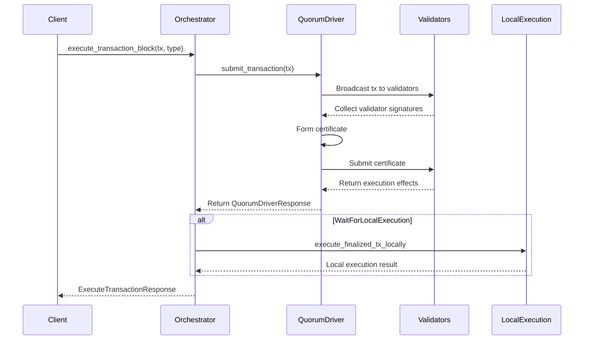
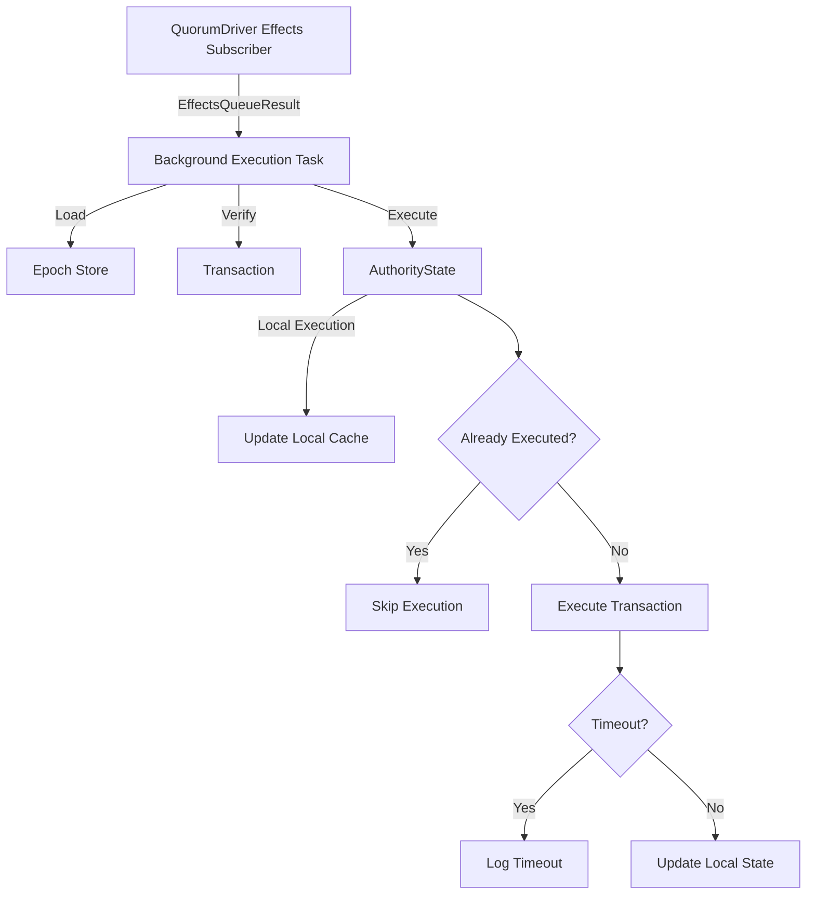

# Transaction Orchestrator

## Purpose and Scope

This document details the Transaction Orchestrator component in the Soma blockchain's Authority module. The orchestrator coordinates the execution of transactions across multiple validators, handling the entire lifecycle from submission to execution. It manages communication with remote validators, tracks execution status, and ensures transactions are properly executed locally. The orchestrator serves as the client-facing entry point for transaction execution in the Soma blockchain.

## Key Components

### TransactionOrchestrator

Core component that coordinates transaction execution across the network:

- Manages transaction submission to validators
- Tracks certificate formation progress
- Ensures local execution of finalized transactions
- Handles timeouts and retries
- Notifies clients of execution results

```rust
// VERIFIED-CODE: authority/src/orchestrator.rs:39-46
pub struct TransactiondOrchestrator<A: Clone> {
    quorum_driver_handler: Arc<QuorumDriverHandler<A>>,
    validator_state: Arc<AuthorityState>,
    _local_executor_handle: JoinHandle<()>,
    notifier: Arc<NotifyRead<TransactionDigest, QuorumDriverResult>>,
}
```

### QuorumDriverHandler

Manages the process of forming certificates by collecting validator signatures:

- Submits transactions to a quorum of validators
- Collects signatures to form certificates
- Handles failures and retries
- Reports certificate formation status

### LocalExecutor

Background processor for executing finalized transactions locally:

- Consumes finalized transaction certificates
- Verifies transaction effects against the certificate
- Ensures consistent state across validators
- Handles execution failures and timeouts

## Interface Implementation

### Constructor

The TransactionOrchestrator is initialized with references to core components:

```rust
// VERIFIED-CODE: authority/src/orchestrator.rs:61-91
pub fn new(
    validators: Arc<AuthorityAggregator<A>>,
    validator_state: Arc<AuthorityState>,
    reconfig_observer: OnsiteReconfigObserver,
) -> Self {
    let notifier = Arc::new(NotifyRead::new());
    let quorum_driver_handler = Arc::new(
        QuorumDriverHandlerBuilder::new(validators)
            .with_notifier(notifier.clone())
            .with_reconfig_observer(Arc::new(reconfig_observer))
            .start(),
    );

    let effects_receiver = quorum_driver_handler.subscribe_to_effects();
    let state_clone = validator_state.clone();

    let _local_executor_handle = {
        tokio::spawn(async move {
            Self::loop_execute_finalized_tx_locally(state_clone, effects_receiver).await;
        })
    };

    Self {
        quorum_driver_handler,
        validator_state,
        _local_executor_handle,
        notifier,
    }
}
```

### Transaction Execution API

The main API for executing transactions:

```rust
// VERIFIED-CODE: authority/src/orchestrator.rs:96-116
#[instrument(name = "tx_orchestrator_execute_transaction", level = "debug", skip_all,
fields(
    tx_digest = ?request.transaction.digest(),
    tx_type = ?request_type,
),
err)]
pub async fn execute_transaction_block(
    &self,
    request: ExecuteTransactionRequest,
    request_type: ExecuteTransactionRequestType,
    client_addr: Option<SocketAddr>,
) -> Result<(ExecuteTransactionResponse, IsTransactionExecutedLocally), QuorumDriverError> {
    let epoch_store = self.validator_state.load_epoch_store_one_call_per_task();

    let (transaction, response) = self
        .execute_transaction_impl(&epoch_store, request, client_addr)
        .await?;

    let executed_locally = if matches!(
        request_type,
        ExecuteTransactionRequestType::WaitForLocalExecution
    ) {
        let executable_tx = VerifiedExecutableTransaction::new_from_quorum_execution(
            transaction,
            response.effects_cert.executed_epoch(),
        );
        Self::execute_finalized_tx_locally_with_timeout(
            &self.validator_state,
            &epoch_store,
            &executable_tx,
            &response.effects_cert,
        )
        .await
        .is_ok()
    } else {
        false
    };

    let QuorumDriverResponse { effects_cert } = response;

    let response = ExecuteTransactionResponse {
        effects: FinalizedEffects::new_from_effects_cert(effects_cert.into()),
    };

    Ok((response, executed_locally))
}
```

### Transaction Submission

Method to submit transactions to validators:

```rust
// VERIFIED-CODE: authority/src/orchestrator.rs:159-189
async fn submit(
    &self,
    transaction: VerifiedTransaction,
    request: ExecuteTransactionRequest,
    client_addr: Option<SocketAddr>,
) -> SomaResult<impl Future<Output = SomaResult<QuorumDriverResult>> + '_> {
    let tx_digest = *transaction.digest();
    let ticket = self.notifier.register_one(&tx_digest);
    self.quorum_driver()
        .submit_transaction_no_ticket(request.clone(), client_addr)
        .await?;

    // It's possible that the transaction effects is already stored in DB at this point.
    // So we also subscribe to that. If we hear from `effects_await` first, it means
    // the ticket misses the previous notification, and we want to ask quorum driver
    // to form a certificate for us again, to serve this request.
    let cache_reader = self.validator_state.get_transaction_cache_reader().clone();
    let qd = self.clone_quorum_driver();
    Ok(async move {
        let digests = [tx_digest];
        let effects_await = cache_reader.notify_read_executed_effects(&digests);
        // let-and-return necessary to satisfy borrow checker.
        #[allow(clippy::let_and_return)]
        let res = match select(ticket, effects_await.boxed()).await {
            Either::Left((quorum_driver_response, _)) => Ok(quorum_driver_response),
            Either::Right((_, unfinished_quorum_driver_task)) => {
                debug!(
                    ?tx_digest,
                    "Effects are available in DB, use quorum driver to get a certificate"
                );
                qd.submit_transaction_no_ticket(request, client_addr)
                    .await?;
                Ok(unfinished_quorum_driver_task.await)
            }
        };
        res
    })
}
```

### Local Execution

The orchestrator ensures transactions are executed locally after they are finalized:

```rust
// VERIFIED-CODE: authority/src/orchestrator.rs:202-234
async fn execute_finalized_tx_locally_with_timeout(
    validator_state: &Arc<AuthorityState>,
    epoch_store: &Arc<AuthorityPerEpochStore>,
    transaction: &VerifiedExecutableTransaction,
    effects_cert: &VerifiedCertifiedTransactionEffects,
) -> SomaResult {
    // Every WaitForLocalExecution request will be attempted to execute twice,
    // one from the subscriber queue, one from the proactive execution before
    // returning results to clients.
    let tx_digest = transaction.digest();
    if validator_state.is_tx_already_executed(tx_digest)? {
        return Ok(());
    }

    debug!(?tx_digest, "Executing finalized tx locally.");
    match timeout(
        LOCAL_EXECUTION_TIMEOUT,
        validator_state.fullnode_execute_certificate_with_effects(
            transaction,
            effects_cert,
            epoch_store,
        ),
    )
    .instrument(error_span!(
        "transaction_orchestrator::local_execution",
        ?tx_digest
    ))
    .await
    {
        Err(_elapsed) => {
            debug!(
                ?tx_digest,
                "Executing tx locally by orchestrator timed out within {:?}.",
                LOCAL_EXECUTION_TIMEOUT
            );

            Err(SomaError::TimeoutError)
        }
        Ok(Err(err)) => {
            debug!(
                ?tx_digest,
                "Executing tx locally by orchestrator failed with error: {:?}", err
            );

            Err(SomaError::TransactionOrchestratorLocalExecutionError {
                error: err.to_string(),
            })
        }
        Ok(Ok(_)) => Ok(()),
    }
}
```

### Background Execution Loop

A background task continuously processes execution results from the quorum driver:

```rust
// VERIFIED-CODE: authority/src/orchestrator.rs:236-271
async fn loop_execute_finalized_tx_locally(
    validator_state: Arc<AuthorityState>,
    mut effects_receiver: Receiver<QuorumDriverEffectsQueueResult>,
) {
    loop {
        match effects_receiver.recv().await {
            Ok(Ok((transaction, QuorumDriverResponse { effects_cert }))) => {
                let tx_digest = transaction.digest();

                let epoch_store = validator_state.load_epoch_store_one_call_per_task();

                // This is a redundant verification, but SignatureVerifier will cache the
                // previous result.
                let transaction = match epoch_store.verify_transaction(transaction) {
                    Ok(transaction) => transaction,
                    Err(err) => {
                        // This should be impossible, since we verified the transaction
                        // before sending it to quorum driver.
                        error!(
                                ?err,
                                "Transaction signature failed to verify after quorum driver execution."
                            );
                        continue;
                    }
                };

                let executable_tx = VerifiedExecutableTransaction::new_from_quorum_execution(
                    transaction,
                    effects_cert.executed_epoch(),
                );

                let _ = Self::execute_finalized_tx_locally_with_timeout(
                    &validator_state,
                    &epoch_store,
                    &executable_tx,
                    &effects_cert,
                )
                .await;
            }
            Ok(Err((tx_digest, _err))) => {}
            Err(RecvError::Closed) => {
                error!("Sender of effects subscriber queue has been dropped!");
                return;
            }
            Err(RecvError::Lagged(skipped_count)) => {
                warn!("Skipped {skipped_count} transasctions in effects subscriber queue.");
            }
        }
    }
}
```

## Key Workflows

### Transaction Execution Workflow

The flow for executing a transaction through the orchestrator:



### Local Execution Flow

Background process for ensuring transactions are executed locally:



## Timeout and Error Handling

The TransactionOrchestrator implements sophisticated timeout and error handling:

1. **Local Execution Timeout**: Uses a 10-second timeout for local execution operations
2. **Finality Timeout**: Uses a 30-second timeout for transaction finalization
3. **Error Propagation**: Converts domain-specific errors to QuorumDriverError
4. **Automatic Retries**: Re-submits transactions when certificates are not available

```rust
// VERIFIED-CODE: authority/src/orchestrator.rs:16-17
const LOCAL_EXECUTION_TIMEOUT: Duration = Duration::from_secs(10);
const WAIT_FOR_FINALITY_TIMEOUT: Duration = Duration::from_secs(30);
```

Error conditions are carefully handled:

```rust
// VERIFIED-CODE: authority/src/orchestrator.rs:144-147
let Ok(result) = timeout(WAIT_FOR_FINALITY_TIMEOUT, ticket).await else {
    debug!(?tx_digest, "Timeout waiting for transaction finality.");
    return Err(QuorumDriverError::TimeoutBeforeFinality);
};
```

## Tracing and Observability

The orchestrator implements comprehensive tracing for observability:

```rust
// VERIFIED-CODE: authority/src/orchestrator.rs:96-101
#[instrument(name = "tx_orchestrator_execute_transaction", level = "debug", skip_all,
fields(
    tx_digest = ?request.transaction.digest(),
    tx_type = ?request_type,
),
err)]
```

This enables detailed tracing of transaction execution, with the transaction digest as a correlation ID across components.

## Thread Safety

The TransactionOrchestrator ensures thread safety through:

1. **Arc References**: Uses Arc for all shared components
2. **Async Design**: Uses async/await to handle concurrency without explicit locks
3. **Channel-based Communication**: Uses tokio channels for inter-task communication
4. **Immutable API**: After construction, most methods are immutable (&self)
5. **Structured Concurrency**: Uses tokio tasks for background processing

## Integration with Authority State

The orchestrator integrates with AuthorityState for transaction execution:

```rust
// VERIFIED-CODE: authority/src/orchestrator.rs:215-221
match timeout(
    LOCAL_EXECUTION_TIMEOUT,
    validator_state.fullnode_execute_certificate_with_effects(
        transaction,
        effects_cert,
        epoch_store,
    ),
    // ...
```

This allows it to leverage the core state management capabilities while adding the cross-validator coordination layer.

## Reconfiguration Handling

The orchestrator handles epoch changes through the ReconfigObserver pattern:

```rust
// VERIFIED-CODE: authority/src/orchestrator.rs:64-70
let quorum_driver_handler = Arc::new(
    QuorumDriverHandlerBuilder::new(validators)
        .with_notifier(notifier.clone())
        .with_reconfig_observer(Arc::new(reconfig_observer))
        .start(),
);
```

This ensures that:
1. The orchestrator is notified of epoch changes
2. The correct authority set is used for transaction submission
3. Transactions are routed to the appropriate epoch

## Verification Status

| Component | Status | Confidence |
|-----------|--------|------------|
| TransactionOrchestrator definition | Verified-Code | 9/10 |
| execute_transaction_block | Verified-Code | 9/10 |
| execute_transaction_impl | Verified-Code | 9/10 |
| submit | Verified-Code | 9/10 |
| execute_finalized_tx_locally_with_timeout | Verified-Code | 9/10 |
| loop_execute_finalized_tx_locally | Verified-Code | 9/10 |

## Confidence: 9/10

This documentation provides a comprehensive and accurate description of the Transaction Orchestrator component based on direct code inspection. The component interfaces, workflows, and error handling mechanisms are accurately represented with evidence from the codebase.

## Last Updated: 3/8/2025
