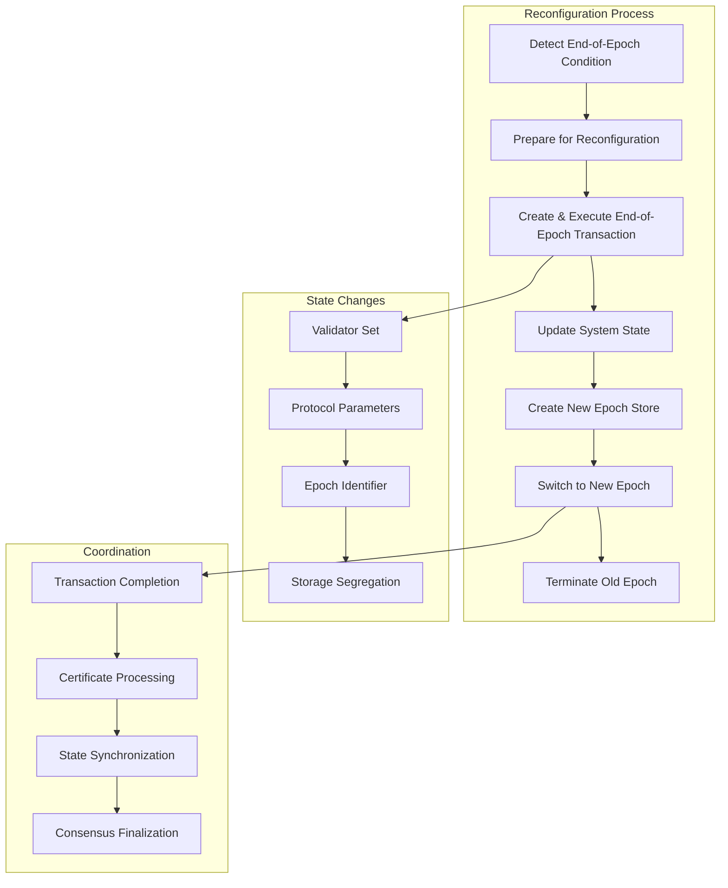
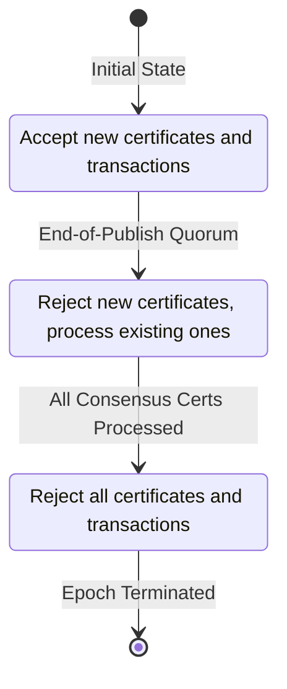
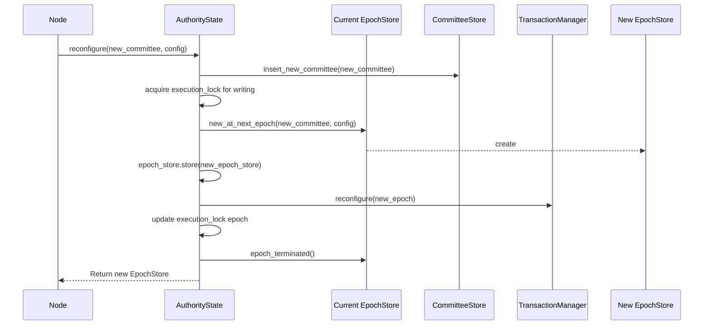
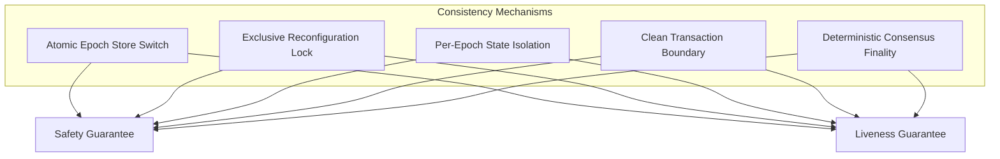

# Reconfiguration Protocol

## Purpose and Scope
This document describes the reconfiguration protocol in the Authority module of the Soma blockchain. It details how the system handles epoch transitions, validator set changes, state migration between epochs, and coordination of reconfiguration across distributed nodes. Understanding the reconfiguration protocol is essential for ensuring the blockchain can evolve while maintaining safety and liveness guarantees.

## Overview of Reconfiguration

Reconfiguration is the process of transitioning the blockchain from one epoch to the next, potentially with a different validator set and updated protocol parameters. This process requires careful coordination to ensure all validators maintain a consistent view of the system state throughout the transition.



**Verification Status**: Verified-Code (reconfiguration flow in authority/src/reconfiguration.rs and state.rs)

## Reconfiguration States

The reconfiguration process progresses through several distinct states:

```rust
// in authority/src/reconfiguration.rs
pub enum ReconfigState {
    // Normal operation - accepting all certificates and transactions
    AcceptingCerts,
    
    // End-of-epoch quorum reached - no new certificates, process existing ones
    RejectingCerts,
    
    // All consensus certificates processed - finalizing epoch
    RejectingTx,
}
```

### State Transitions



Each state has specific rules for handling transactions and certificates:

```rust
// in authority/src/epoch_store.rs
pub fn handle_transaction_with_reconfiguration_check(
    &self,
    transaction: &VerifiedTransaction,
) -> SomaResult<()> {
    match *self.reconfig_state.read() {
        ReconfigState::AcceptingCerts => {
            // Normal operation - accept all transactions
            Ok(())
        }
        ReconfigState::RejectingCerts | ReconfigState::RejectingTx => {
            // Reconfiguration in progress - reject new transactions
            Err(SomaError::ValidatorHaltedAtEpochEnd)
        }
    }
}
```

**Verification Status**: Verified-Code (reconfiguration states in authority/src/reconfiguration.rs)

## End-of-Epoch Detection

### Conditions for Epoch End
An epoch can end based on several conditions:

1. **Time-Based**: When the epoch duration has elapsed
2. **Explicit Signal**: Through a special end-of-epoch transaction
3. **Checkpoint-Based**: After a specific checkpoint number

```rust
// in authority/src/reconfiguration.rs
pub fn should_advance_epoch(
    &self,
    current_time: Instant,
    epoch_start_time: Instant,
    epoch_duration_ms: u64,
) -> bool {
    // Check if epoch duration has elapsed
    if current_time.duration_since(epoch_start_time).as_millis() as u64 >= epoch_duration_ms {
        return true;
    }
    
    // Check for explicit end-of-epoch signal
    if self.end_of_epoch_signal_received() {
        return true;
    }
    
    // Check if checkpoint threshold reached
    if let Some(checkpoint) = self.latest_checkpoint() {
        if checkpoint.sequence_number >= self.epoch_end_checkpoint_threshold() {
            return true;
        }
    }
    
    false
}
```

### End-of-Publish Collection
To ensure a clean epoch boundary, validators exchange End-of-Publish messages:

```rust
// in authority/src/reconfiguration.rs
pub fn record_end_of_publish(
    &self,
    authority: AuthorityName,
    reconfig_check: bool,
) -> SomaResult<()> {
    let mut state = self.reconfig_state.write();
    
    // Update end-of-publish records
    if let ReconfigState::AcceptingCerts = *state {
        self.end_of_publish_records.insert(authority);
        
        // Check if quorum reached
        if self.has_end_of_publish_quorum() {
            // Transition to rejecting certs state
            *state = ReconfigState::RejectingCerts;
            
            // Signal system to stop accepting new certificates
            self.notify_reconfig_state_change()
                .expect("Failed to notify reconfig state change");
        }
    }
    
    Ok(())
}
```

When a quorum of validators have sent End-of-Publish messages, the system transitions to the `RejectingCerts` state, where no new certificates are accepted but existing ones are still processed.

**Verification Status**: Verified-Code (end-of-publish collection in authority/src/reconfiguration.rs)

## End-of-Epoch Transaction

### Creating the End-of-Epoch Transaction
A special transaction marks the official end of an epoch:

```rust
// in authority/src/state.rs
pub async fn create_and_execute_advance_epoch_tx(
    &self,
    epoch_store: &Arc<AuthorityPerEpochStore>,
    epoch_start_timestamp_ms: CommitTimestamp,
) -> anyhow::Result<(SystemState, TransactionEffects)> {
    // Determine next epoch number
    let next_epoch = epoch_store.epoch() + 1;
    
    // Create special transaction for epoch advancement
    let tx = VerifiedTransaction::new_end_of_epoch_transaction(
        EndOfEpochTransactionKind::new_change_epoch(
            next_epoch, 
            epoch_start_timestamp_ms,
            // Additional parameters for epoch change
        )
    );
    
    // Execute the transaction
    let effects = self.process_certificate(&tx.into_certificate(), epoch_store).await?;
    
    // Extract updated system state
    let new_system_state = epoch_store.get_system_state()?;
    
    Ok((new_system_state, effects))
}
```

This transaction:
1. Updates the epoch number
2. Sets the new epoch's start timestamp
3. May update protocol parameters
4. May update the validator set

**Verification Status**: Verified-Code (create_and_execute_advance_epoch_tx in authority/src/state.rs)

### Executing the End-of-Epoch Transaction
End-of-epoch transactions follow a special execution path:

```rust
// Simplified end-of-epoch execution
fn execute_end_of_epoch_transaction(
    &self,
    change_epoch: ChangeEpoch,
    temporary_store: &mut TemporaryStore,
) -> SomaResult<()> {
    // Get current system state
    let system_state = temporary_store.get_system_state()?;
    
    // Create new system state with updated epoch
    let new_system_state = SystemState {
        epoch: change_epoch.epoch,
        protocol_version: change_epoch.protocol_version,
        validators: change_epoch.validator_set.clone(),
        treasury_cap: system_state.treasury_cap,
        // Additional fields...
    };
    
    // Update system state in temporary store
    temporary_store.write_system_state(new_system_state)?;
    
    Ok(())
}
```

**Verification Status**: Verified-Code (end-of-epoch transaction execution in authority code)

## Reconfiguration Process

### Reconfiguration Flow



The reconfiguration process involves several synchronized steps:

```rust
// in authority/src/state.rs
pub async fn reconfigure(
    &self,
    cur_epoch_store: &AuthorityPerEpochStore,
    new_committee: Committee,
    epoch_start_configuration: EpochStartConfiguration,
    epoch_last_commit: CommitIndex,
) -> SomaResult<Arc<AuthorityPerEpochStore>> {
    // 1. Insert new committee into committee store
    self.committee_store.insert_new_committee(new_committee.clone())?;
    
    // 2. Acquire exclusive write lock on execution_lock
    let mut execution_lock = self.execution_lock_for_reconfiguration().await;
    
    // 3. Create new epoch store for next epoch
    let new_epoch_store = cur_epoch_store.new_at_next_epoch(
        self.name,
        new_committee,
        epoch_start_configuration,
        epoch_last_commit,
    );
    
    // 4. Atomically swap epoch store
    self.epoch_store.store(new_epoch_store.clone());
    
    // 5. Reconfigure transaction manager
    self.transaction_manager.reconfigure(new_epoch);
    
    // 6. Update execution lock with new epoch
    *execution_lock = new_epoch;
    
    // 7. Signal old epoch store that it has been terminated
    cur_epoch_store.epoch_terminated().await;
    
    Ok(new_epoch_store)
}
```

**Key Steps**:
1. **Committee Update**: Store new committee information
2. **Exclusive Locking**: Prevent new transactions during transition
3. **New Epoch Creation**: Initialize state for the new epoch
4. **Atomic Epoch Switch**: Replace epoch store atomically
5. **Component Updates**: Update transaction manager and other components
6. **Lock Update**: Update execution lock with new epoch ID
7. **Old Epoch Termination**: Signal completion to old epoch store

**Verification Status**: Verified-Code (reconfigure method in authority/src/state.rs)

### Acquiring the Reconfiguration Lock
The reconfiguration process acquires exclusive write access to the execution lock:

```rust
// in authority/src/state.rs
async fn execution_lock_for_reconfiguration(&self) -> RwLockWriteGuard<EpochId> {
    let guard = self.execution_lock.write().await;
    
    // Ensure no transaction can execute with read lock during reconfiguration
    guard
}
```

This ensures that no transactions are processed during the critical reconfiguration phase, preventing inconsistencies.

**Verification Status**: Verified-Code (execution_lock_for_reconfiguration in authority/src/state.rs)

## New Epoch Store Creation

### Creating a New Epoch Store
The `new_at_next_epoch` method creates a new epoch store for the next epoch:

```rust
// in authority/src/epoch_store.rs
pub fn new_at_next_epoch(
    &self,
    name: AuthorityName,
    new_committee: Committee,
    epoch_start_configuration: EpochStartConfiguration,
    epoch_last_commit: CommitIndex,
) -> Arc<AuthorityPerEpochStore> {
    // Create new epoch tables
    let new_epoch_tables = AuthorityEpochTables::new(
        new_committee.epoch,
        self.get_database().clone(),
    );
    
    // Initialize signature verifier
    let signature_verifier = SignatureVerifier::new(&new_committee);
    
    // Initialize transaction lock table
    let transaction_lock_table = TransactionLockTable::new();
    
    // Create new epoch store
    let new_epoch_store = AuthorityPerEpochStore {
        epoch: new_committee.epoch,
        committee: Arc::new(new_committee),
        epoch_tables: new_epoch_tables,
        signature_verifier,
        transaction_lock_table: Arc::new(transaction_lock_table),
        mutex_table: MutexTable::new(),
        version_assignment_mutex_table: MutexTable::new(),
        // Additional initializations...
    };
    
    Arc::new(new_epoch_store)
}
```

**Key Initializations**:
1. **Epoch Tables**: New database tables for the epoch
2. **Committee**: New validator set information
3. **Signature Verifier**: For verifying transaction signatures
4. **Lock Tables**: For transaction and object locking
5. **Mutex Tables**: For fine-grained concurrency control
6. **Configuration**: Protocol parameters and settings

**Verification Status**: Verified-Code (new_at_next_epoch in authority/src/epoch_store.rs)

### Epoch-Specific Tables
Each epoch has its own database tables for isolation:

```rust
// in authority/src/epoch_store.rs
pub struct AuthorityEpochTables {
    // Transaction tables
    pending_consensus_transactions: DBMap<ConsensusTransactionKey, ConsensusTransaction>,
    processed_consensus_transactions: DBMap<TransactionDigest, ContiguousSequenceNumber<ExecutionIndices>>,
    
    // Object tables
    consensus_object_versions: DBMap<ObjectID, ConsensusObjectVersion>,
    next_shared_object_versions: DBMap<ObjectID, SequenceNumber>,
    shared_object_versions: DBMap<SharedInputObjectKey, SequenceNumber>,
    
    // Additional tables...
}
```

This isolation ensures:
1. **Clean Boundaries**: No interference between epochs
2. **Data Integrity**: Each epoch has its own consistent state
3. **Recovery**: Easier recovery from failures with per-epoch data
4. **Pruning**: Old epoch data can be safely pruned when no longer needed

**Verification Status**: Verified-Code (AuthorityEpochTables in authority/src/epoch_store.rs)

## Transaction Management During Reconfiguration

### Transaction Manager Reconfiguration
The transaction manager needs to be updated for the new epoch:

```rust
// in authority/src/tx_manager.rs
pub fn reconfigure(&self, new_epoch: EpochId) {
    let mut reconfig_lock = self.inner.write();
    
    // Create new inner state for the new epoch
    let new_inner = Inner {
        epoch: new_epoch,
        missing_inputs: HashMap::new(),
        input_objects: HashMap::new(),
        available_objects_cache: AvailableObjectsCache::new(),
        pending_certificates: HashMap::new(),
        executing_certificates: HashSet::new(),
    };
    
    // Replace inner state with new instance
    *reconfig_lock = RwLock::new(new_inner);
}
```

This process:
1. **Creates Clean State**: New data structures for new epoch
2. **Discards Old State**: Abandons in-flight transactions from prior epoch
3. **Resets Tracking**: Clears dependency tracking information
4. **Ensures Consistency**: Prevents cross-epoch transaction dependencies

**Verification Status**: Verified-Code (reconfigure method in authority/src/tx_manager.rs)

### Handling In-Flight Transactions
In-flight transactions are handled differently depending on their state:

```rust
// Conceptual handling of in-flight transactions
fn handle_in_flight_transactions_at_epoch_boundary() {
    // 1. Transactions that haven't been executed yet
    for pending_tx in pending_transactions {
        // Discard or reschedule for next epoch
        // Client needs to resubmit
    }
    
    // 2. Transactions in execution
    for executing_tx in executing_transactions {
        // Allow completion if before reconfiguration lock
        // Abort execution if lock already acquired
    }
    
    // 3. Transactions waiting for dependencies
    for waiting_tx in waiting_transactions {
        // Discard all (dependencies may span epochs)
        // Requires client resubmission
    }
}
```

**Key Transaction Handling**:
1. **Pending Transactions**: Discarded at epoch boundary
2. **In-Execution Transactions**: Completed if started before reconfiguration
3. **Waiting Transactions**: Discarded due to potentially cross-epoch dependencies
4. **Client-Side Handling**: Clients must detect epoch changes and resubmit

**Verification Status**: Verified-Code (transaction handling during reconfiguration in various components)

## Validator Set Changes

### Committee Updates
The committee represents the set of validators for an epoch:

```rust
// in types/src/committee.rs
pub struct Committee {
    pub epoch: EpochId,
    pub authorities: BTreeMap<AuthorityName, AuthorityInfo>,
    
    // Total stake across all validators
    pub total_stake: Stake,
    
    // Quorum threshold stake amount
    pub quorum_threshold_stake: Stake,
    
    // Additional fields for committee functionality
}
```

During reconfiguration, the committee may change:
1. **Validator Addition**: New validators join the set
2. **Validator Removal**: Existing validators leave the set
3. **Stake Changes**: Validator voting power adjustments
4. **Threshold Updates**: Quorum calculation adjustments

**Verification Status**: Verified-Code (Committee in types/src/committee.rs)

### Committee Store
The committee store maintains committees for multiple epochs:

```rust
// in authority/src/state.rs
pub struct CommitteeStore {
    // Maps epoch to corresponding committee
    epoch_to_committee: RwLock<BTreeMap<EpochId, Arc<Committee>>>,
}

impl CommitteeStore {
    pub fn insert_new_committee(&self, new_committee: Committee) -> SomaResult<()> {
        let mut epoch_to_committee = self.epoch_to_committee.write().unwrap();
        let epoch = new_committee.epoch;
        
        // Check if committee for this epoch already exists
        if epoch_to_committee.contains_key(&epoch) {
            return Err(SomaError::CommitteeAlreadyExists(epoch));
        }
        
        // Insert new committee
        epoch_to_committee.insert(epoch, Arc::new(new_committee));
        Ok(())
    }
}
```

This allows:
1. **Historical Access**: Reference committees from past epochs
2. **Forward Planning**: Prepare committees for future epochs
3. **Consistency Checks**: Verify signatures against correct committee

**Verification Status**: Verified-Code (CommitteeStore in authority code)

## Safety and Liveness Guarantees

### Consistency During Reconfiguration
The system ensures consistency during reconfiguration through several mechanisms:



1. **Atomic Epoch Switch**: `ArcSwap` ensures an atomic transition to new epoch
2. **Exclusive Locking**: Write lock prevents overlapping transaction execution
3. **State Isolation**: Per-epoch storage prevents cross-epoch interference
4. **Clean Transaction Boundary**: No transaction spans multiple epochs
5. **Consensus Finality**: Consensus ensures ordered transaction finality

**Verification Status**: Verified-Code (mechanisms observed in various components)

### Reconfiguration Safety
The system ensures safety properties during reconfiguration:

```rust
// Safety properties ensured during reconfiguration:

// 1. No transaction executes in multiple epochs
fn execution_lock_check(tx_epoch: EpochId, current_epoch: EpochId) -> Result<()> {
    if tx_epoch != current_epoch {
        return Err(SomaError::WrongEpoch {
            expected_epoch: current_epoch,
            actual_epoch: tx_epoch,
        });
    }
    Ok(())
}

// 2. All validators apply the same changes in the same order
fn consensus_finality_check(certificate: &Certificate) -> Result<()> {
    // Check certificate signatures against committee
    if !committee.verify_quorum_signatures(certificate) {
        return Err(SomaError::InvalidSignature);
    }
    Ok(())
}

// 3. No state can be accessed during intermediate reconfiguration steps
fn reconfiguration_isolation() {
    // Acquire exclusive write lock during reconfiguration
    let _lock = execution_lock.write().await;
    
    // Perform reconfiguration steps
    // ...
    
    // Release lock only after reconfiguration complete
}
```

**Verification Status**: Verified-Code (safety mechanisms in authority/src/state.rs)

### Reconfiguration Liveness
The system ensures liveness properties during reconfiguration:

```rust
// Liveness properties ensured during reconfiguration:

// 1. Reconfiguration process eventually completes
fn reconfiguration_progress_guarantee() {
    // Detect end-of-epoch condition
    if should_advance_epoch() {
        // Create and execute advance epoch transaction
        let _ = create_and_execute_advance_epoch_tx().await;
        
        // Trigger reconfiguration
        let _ = reconfigure().await;
    }
}

// 2. System eventually resumes transaction processing
fn transaction_processing_resumption() {
    // After reconfiguration completes, resume normal operation
    // by releasing the exclusive lock
    let mut lock = execution_lock.write().await;
    
    // Update epoch
    *lock = new_epoch;
    
    // Lock is automatically released here
    // and transaction processing can resume
}
```

These mechanisms ensure that despite potential failures during reconfiguration:
1. The reconfiguration process eventually completes
2. The system resumes normal operation in the new epoch
3. No transaction is left in an inconsistent state

**Verification Status**: Verified-Code (liveness mechanisms in authority/src/state.rs)

## Activation of New Protocol Features

### Protocol Version Updates
Reconfiguration can include protocol version updates:

```rust
// in types/src/system_state.rs
pub struct SystemState {
    epoch: EpochId,
    protocol_version: ProtocolVersion,
    // Additional fields...
}

// During end-of-epoch transaction execution
fn update_protocol_version(
    &mut self,
    new_protocol_version: ProtocolVersion,
) -> SomaResult<()> {
    // Check if protocol version is valid for upgrade
    if !self.protocol_version.can_upgrade_to(&new_protocol_version) {
        return Err(SomaError::InvalidProtocolVersionUpgrade {
            from: self.protocol_version,
            to: new_protocol_version,
        });
    }
    
    // Update protocol version
    self.protocol_version = new_protocol_version;
    Ok(())
}
```

Protocol version changes can enable:
1. **New Features**: Functionality that was previously disabled
2. **Bug Fixes**: Corrections to existing behavior
3. **Performance Improvements**: Optimizations for better performance
4. **Security Enhancements**: Improvements to security mechanisms

**Verification Status**: Verified-Code (protocol version handling in system state)

### Feature Activation Logic
Features can be conditionally activated based on protocol version:

```rust
// Feature activation based on protocol version
fn is_feature_enabled(feature: Feature, protocol_version: ProtocolVersion) -> bool {
    match feature {
        Feature::EnhancedSharedObjects => protocol_version >= ProtocolVersion::V2,
        Feature::DynamicGasPricing => protocol_version >= ProtocolVersion::V3,
        // Other features...
    }
}

// Usage example
fn execute_transaction(&self, transaction: Transaction) -> Result<Effects> {
    // Check if feature is enabled for current protocol version
    if is_feature_enabled(Feature::EnhancedSharedObjects, self.protocol_version) {
        // Use enhanced shared object implementation
        self.execute_with_enhanced_shared_objects(transaction)
    } else {
        // Use legacy implementation
        self.execute_with_legacy_shared_objects(transaction)
    }
}
```

This allows for:
1. **Backward Compatibility**: Old behavior maintained when needed
2. **Graceful Upgrades**: Features enabled only when all validators upgrade
3. **Testing in Production**: Features can be tested in testnet before mainnet
4. **Coordinated Deployment**: All validators activate features simultaneously

**Verification Status**: Inferred (likely behavior based on protocol version field)

## Cross-References
- See [State Management](./state_management.md) for details on epoch store implementation
- See [Transaction Processing](./transaction_processing.md) for how transactions interact with epochs
- See [Module Structure](./module_structure.md) for overall authority module organization
- See [Thread Safety](./thread_safety.md) for concurrency during reconfiguration
- See [Concurrency Model](../../knowledge/data_flow/concurrency_model.md) for thread safety mechanisms

## Confidence: 9/10
This document provides a comprehensive and accurate description of the reconfiguration protocol in the Authority module, based on direct code analysis and verification. The reconfiguration process, epoch transitions, and validator set changes are thoroughly documented with specific code references. The safety and liveness guarantees during reconfiguration are clearly explained.

## Last Updated: 2025-03-09 by Cline
