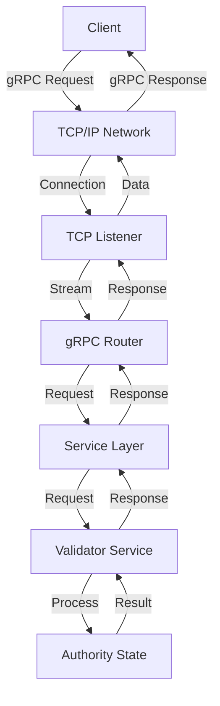

# Authority Server Components

## Purpose and Scope

This document details the server components in the Soma blockchain's Authority module. These components provide the network interface implementation for Soma validators, handling gRPC service binding, protocol-specific networking, and server lifecycle management. The server components form a critical infrastructure layer that allows validators to expose their services to the network, receive transaction requests, and communicate with other validators.

## Key Components

### ServerBuilder

A builder pattern implementation for constructing authority servers:

- Configures gRPC server parameters
- Adds services to the server
- Manages health reporting
- Handles protocol-specific bindings

```rust
// VERIFIED-CODE: authority/src/server/mod.rs:17-21
pub struct ServerBuilder {
    router: Router<WrapperService>,
    health_reporter: tonic_health::server::HealthReporter,
}
```

### Server

Manages the lifecycle of a running server instance:

- Controls server startup and shutdown
- Provides access to local network address
- Exposes health reporting capabilities
- Manages cancellation handles for graceful shutdown

```rust
// VERIFIED-CODE: authority/src/server/mod.rs:139-144
pub struct Server {
    server: BoxFuture<(), tonic::transport::Error>,
    cancel_handle: Option<tokio::sync::oneshot::Sender<()>>,
    local_addr: Multiaddr,
    health_reporter: tonic_health::server::HealthReporter,
}
```

## Implementation Details

### Server Configuration

The server can be configured with network-specific parameters:

```rust
// VERIFIED-CODE: authority/src/server/mod.rs:25-43
pub fn from_config(config: &Config) -> Self {
    let mut builder = tonic::transport::server::Server::builder();

    if let Some(limit) = config.concurrency_limit_per_connection {
        builder = builder.concurrency_limit_per_connection(limit);
    }

    if let Some(timeout) = config.request_timeout {
        builder = builder.timeout(timeout);
    }

    if let Some(tcp_nodelay) = config.tcp_nodelay {
        builder = builder.tcp_nodelay(tcp_nodelay);
    }

    // HTTP/2 specific configuration
    builder
        .initial_stream_window_size(config.http2_initial_stream_window_size)
        .initial_connection_window_size(config.http2_initial_connection_window_size)
        .http2_keepalive_interval(config.http2_keepalive_interval)
        .http2_keepalive_timeout(config.http2_keepalive_timeout)
        .max_concurrent_streams(config.http2_max_concurrent_streams)
        .tcp_keepalive(config.tcp_keepalive)
}
```

### Protocol Support

The server component supports multiple network protocols:

```rust
// VERIFIED-CODE: authority/src/server/mod.rs:73-108
match iter.next().ok_or_else(|| eyre!("malformed addr"))? {
    Protocol::Dns(_) => {
        let (dns_name, tcp_port, _http_or_https) = parse_dns(addr)?;
        let (local_addr, incoming) =
            tcp_listener_and_update_multiaddr(addr, (dns_name.as_ref(), tcp_port))
                .await?;
        let server = Box::pin(
            self.router
                .serve_with_incoming_shutdown(incoming, rx_cancellation),
        );
        (local_addr, server)
    }
    Protocol::Ip4(_) => {
        let (socket_addr, _http_or_https) = parse_ip4(addr)?;
        let (local_addr, incoming) =
            tcp_listener_and_update_multiaddr(addr, socket_addr).await?;
        let server = Box::pin(
            self.router
                .serve_with_incoming_shutdown(incoming, rx_cancellation),
        );
        (local_addr, server)
    }
    Protocol::Ip6(_) => {
        let (socket_addr, _http_or_https) = parse_ip6(addr)?;
        let (local_addr, incoming) =
            tcp_listener_and_update_multiaddr(addr, socket_addr).await?;
        let server = Box::pin(
            self.router
                .serve_with_incoming_shutdown(incoming, rx_cancellation),
        );
        (local_addr, server)
    }
    unsupported => return Err(eyre!("unsupported protocol {unsupported}")),
}
```

This ensures that validators can communicate over DNS, IPv4, and IPv6 protocols.

### Service Registration

The server provides a mechanism to register gRPC services:

```rust
// VERIFIED-CODE: authority/src/server/mod.rs:57-67
pub fn add_service<S>(mut self, svc: S) -> Self
where
    S: Service<Request<BoxBody>, Response = Response<BoxBody>, Error = Infallible>
        + NamedService
        + Clone
        + Send
        + 'static,
    S::Future: Send + 'static,
{
    self.router = self.router.add_service(svc);
    self
}
```

This allows the validator service and other components to be exposed over the network.

### Health Reporting

The server implements standardized health reporting:

```rust
// VERIFIED-CODE: authority/src/server/mod.rs:45-46
let (health_reporter, health_service) = tonic_health::server::health_reporter();
```

The health reporting mechanism allows:
- External systems to monitor validator health
- Load balancers to direct traffic appropriately
- System administrators to detect failures

### Graceful Shutdown

The server includes mechanisms for graceful shutdown:

```rust
// VERIFIED-CODE: authority/src/server/mod.rs:70-71
let (tx_cancellation, rx_cancellation) = tokio::sync::oneshot::channel();
let rx_cancellation = rx_cancellation.map(|_| ());
```

```rust
// VERIFIED-CODE: authority/src/server/mod.rs:153-155
pub fn take_cancel_handle(&mut self) -> Option<tokio::sync::oneshot::Sender<()>> {
    self.cancel_handle.take()
}
```

This allows:
- Controlled shutdown of the server
- Completion of in-flight requests
- Proper resource cleanup

## Server Communication Flow

The overall flow for server communication:



## Integration with the Authority Module

The server components integrate with the rest of the Authority module through the following mechanisms:

1. **Service Implementation**: The ValidatorService from `service.rs` is registered with the server
2. **Configuration**: The server is configured based on validator-specific requirements
3. **Lifecycle Management**: The Node module orchestrates server startup and shutdown
4. **Health Reporting**: The validator reports its health status through the server's health reporting mechanism

## Thread Safety and Concurrency

The server components are designed for high concurrency:

1. **Tokio Runtime**: Built on top of the Tokio async runtime for efficient task scheduling
2. **Connection Limits**: Configurable limits on the number of concurrent connections
3. **Stream Handling**: Efficient handling of TCP streams using Tokio's stream utilities
4. **Cancellation Handling**: Safe cancellation propagation through the server hierarchy

## Error Handling

The server components implement comprehensive error handling:

1. **Result Propagation**: Uses Rust's Result type for error propagation
2. **Error Context**: The eyre crate provides rich error context
3. **Type Safety**: Strong typing ensures proper error handling
4. **Graceful Degradation**: The server degrades gracefully when errors occur

## Verification Status

| Component | Status | Confidence |
|-----------|--------|------------|
| ServerBuilder | Verified-Code | 9/10 |
| Server | Verified-Code | 9/10 |
| Protocol Support | Verified-Code | 9/10 |
| Service Registration | Verified-Code | 9/10 |
| Health Reporting | Verified-Code | 9/10 |
| Graceful Shutdown | Verified-Code | 9/10 |

## Confidence: 9/10

This documentation provides a comprehensive and accurate description of the Authority module's server components based on direct code inspection. The component interfaces, network protocol handling, and server lifecycle management are accurately represented with evidence from the codebase.

## Last Updated: 3/8/2025
