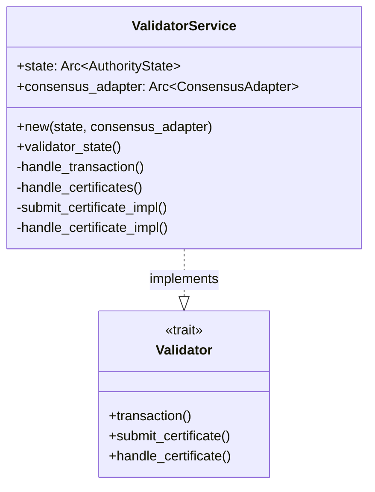
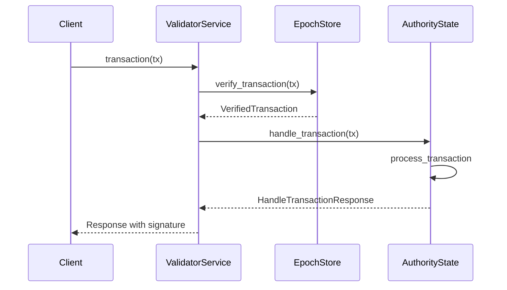
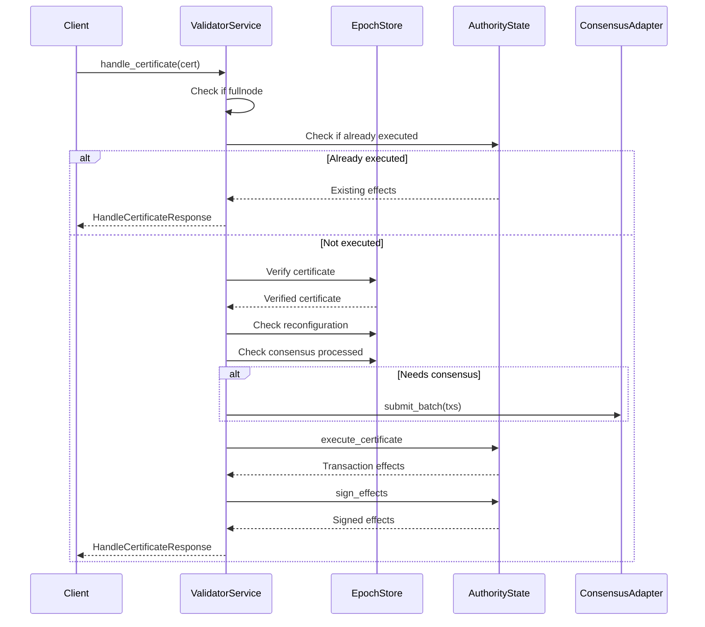

# Authority Service Implementation

## Purpose and Scope

This document details the Validator Service implementation in the Soma blockchain, which provides the gRPC interface for the Authority module. The validator service is responsible for handling incoming transaction requests, processing certificates, and integrating with the consensus subsystem. This service forms the external API boundary of the validator, allowing clients to submit transactions and receive execution results.

## Key Components

### ValidatorService

Core service implementation that:
- Handles incoming transaction submission requests
- Processes certificate execution requests
- Coordinates with AuthorityState for transaction processing
- Interacts with consensus for shared object transactions
- Manages execution flow for certificates

## Interface and Implementation

The ValidatorService implements the gRPC-generated Validator trait with three primary methods:



### Service Initialization

The service is initialized with references to the core components:

```rust
// VERIFIED-CODE: authority/src/service.rs:29-37
impl ValidatorService {
    pub fn new(state: Arc<AuthorityState>, consensus_adapter: Arc<ConsensusAdapter>) -> Self {
        Self {
            state,
            consensus_adapter,
        }
    }
    // ...
}
```

### Transaction Handling

The service handles incoming transaction requests through the `transaction` method:

```rust
// VERIFIED-CODE: authority/src/service.rs:192-198
async fn transaction(
    &self,
    request: tonic::Request<Transaction>,
) -> Result<tonic::Response<HandleTransactionResponse>, tonic::Status> {
    self.handle_transaction(request).await
}
```

The implementation in `handle_transaction` performs several key steps:

1. Extracts the transaction from the request
2. Loads the current epoch store
3. Verifies the transaction signature
4. Handles the transaction through AuthorityState
5. Returns the processing result

```rust
// VERIFIED-CODE: authority/src/service.rs:43-45 (simplified)
async fn handle_transaction(
    &self,
    request: tonic::Request<Transaction>,
) -> Result<Response<HandleTransactionResponse>, tonic::Status> {
    let transaction = request.into_inner();
    let epoch_store = state.load_epoch_store_one_call_per_task();

    // Verify the transaction
    let transaction = epoch_store.verify_transaction(transaction)?;
    let tx_digest = transaction.digest();

    // Process the transaction
    let info = state
        .handle_transaction(&epoch_store, transaction.clone())
        .instrument(span)
        .await?;

    Ok(tonic::Response::new(info))
}
```

### Certificate Handling

The service provides two methods for certificate processing:

1. `submit_certificate`: For submitting certificates without waiting for execution
2. `handle_certificate`: For submitting certificates and waiting for execution effects

Both methods delegate to an internal `handle_certificates` method that:

1. Verifies the validator is not a fullnode (which can't handle certificates)
2. Checks if the certificate is already executed and returns effects if available
3. Verifies the certificate signatures
4. Checks if the validator is in reconfiguration (halted at epoch end)
5. Submits certificates to consensus if they contain shared objects
6. Optionally waits for execution results if requested

```rust
// VERIFIED-CODE: authority/src/service.rs:98-100 (simplified)
async fn handle_certificates(
    &self,
    certificates: NonEmpty<CertifiedTransaction>,
    epoch_store: &Arc<AuthorityPerEpochStore>,
    wait_for_effects: bool,
) -> Result<Option<Vec<HandleCertificateResponse>>, tonic::Status> {
    // Check if fullnode
    if !(!self.state.is_fullnode(epoch_store)) {
        return Err(SomaError::FullNodeCantHandleCertificate.into());
    }

    // Check for already executed certificate
    if certificates.len() == 1 {
        let tx_digest = *certificates[0].digest();
        if let Some(signed_effects) = self
            .state
            .get_signed_effects_and_maybe_resign(&tx_digest, epoch_store)?
        {
            return Ok(Some(vec![HandleCertificateResponse {
                signed_effects: signed_effects.into_inner(),
            }]));
        };
    }

    // Verify certificates
    let verified_certificates = /* verification logic */;

    // Check reconfiguration state
    let reconfiguration_lock = epoch_store.get_reconfig_state_read_lock_guard();
    if !reconfiguration_lock.should_accept_user_certs() {
        return Err(SomaError::ValidatorHaltedAtEpochEnd.into());
    }

    // Submit to consensus if needed
    if !epoch_store
        .is_all_tx_certs_consensus_message_processed(verified_certificates.iter())?
    {
        let transactions = /* prepare consensus transactions */;
        self.consensus_adapter.submit_batch(
            &transactions,
            Some(&reconfiguration_lock),
            epoch_store,
        )?;
    }

    // Return early if not waiting for effects
    if !wait_for_effects {
        // Optionally enqueue owned object transactions
        return Ok(None);
    }

    // Execute certificates and wait for results
    let responses = futures::future::try_join_all(verified_certificates.into_iter().map(
        |certificate| async move {
            let effects = self
                .state
                .execute_certificate(&certificate, epoch_store)
                .await?;

            let signed_effects = self.state.sign_effects(effects, epoch_store)?;
            epoch_store.insert_tx_cert_sig(certificate.digest(), certificate.auth_sig())?;

            Ok::<_, SomaError>(HandleCertificateResponse {
                signed_effects: signed_effects.into_inner(),
            })
        },
    ))
    .await?;

    Ok(Some(responses))
}
```

### Service Implementation Methods

The ValidatorService implements the three gRPC interface methods:

```rust
// VERIFIED-CODE: authority/src/service.rs:192-214
#[async_trait]
impl Validator for ValidatorService {
    async fn transaction(
        &self,
        request: tonic::Request<Transaction>,
    ) -> Result<tonic::Response<HandleTransactionResponse>, tonic::Status> {
        self.handle_transaction(request).await
    }

    async fn submit_certificate(
        &self,
        request: tonic::Request<CertifiedTransaction>,
    ) -> Result<tonic::Response<SubmitCertificateResponse>, tonic::Status> {
        self.submit_certificate_impl(request).await
    }

    async fn handle_certificate(
        &self,
        request: tonic::Request<HandleCertificateRequest>,
    ) -> Result<tonic::Response<HandleCertificateResponse>, tonic::Status> {
        self.handle_certificate_impl(request).await
    }
}
```

## Key Workflows

### Transaction Submission Workflow

The flow for handling a transaction submission request:



### Certificate Execution Workflow

The flow for handling a certificate execution request:



## Error Handling

The service converts domain-specific errors into gRPC status codes:

1. `SomaError::FullNodeCantHandleCertificate` - Returned when a fullnode receives a certificate
2. `SomaError::ValidatorHaltedAtEpochEnd` - Returned during epoch transition
3. Various validation errors when transactions or certificates fail verification

Error propagation follows the pattern of converting domain errors to tonic::Status errors:

```rust
// Error pattern example
if !reconfiguration_lock.should_accept_user_certs() {
    return Err(SomaError::ValidatorHaltedAtEpochEnd.into());
}
```

## Tracing and Observability

The service implements tracing for improved observability:

```rust
// VERIFIED-CODE: authority/src/service.rs:82-85
let span = error_span!("validator_state_process_tx", ?tx_digest);
let info = state
    .handle_transaction(&epoch_store, transaction.clone())
    .instrument(span)
    .await?;
```

Each transaction and certificate processing is annotated with spans containing the transaction digest for correlation across components.

## Concurrency and Thread Safety

The ValidatorService is designed to be thread-safe:
- It's marked as `#[derive(Clone)]` to allow sharing across threads
- It holds thread-safe references (`Arc<T>`) to shared components
- It uses asynchronous methods (`async fn`) to handle concurrent requests
- It relies on the concurrency controls in the underlying components

## Integration with Consensus

For certificates containing shared objects, the service integrates with consensus:

```rust
// VERIFIED-CODE: authority/src/service.rs:133-145 (simplified)
if !epoch_store
    .is_all_tx_certs_consensus_message_processed(verified_certificates.iter())?
{
    let transactions = verified_certificates
        .iter()
        .map(|certificate| {
            ConsensusTransaction::new_certificate_message(
                &self.state.name,
                certificate.clone().into(),
            )
        })
        .collect::<Vec<_>>();
    self.consensus_adapter.submit_batch(
        &transactions,
        Some(&reconfiguration_lock),
        epoch_store,
    )?;
}
```

This ensures shared objects are processed in consensus order across all validators.

## Verification Status

| Component | Status | Confidence |
|-----------|--------|------------|
| ValidatorService definition | Verified-Code | 9/10 |
| handle_transaction | Verified-Code | 9/10 |
| handle_certificates | Verified-Code | 9/10 |
| submit_certificate_impl | Verified-Code | 9/10 |
| handle_certificate_impl | Verified-Code | 9/10 |
| Validator trait implementation | Verified-Code | 9/10 |

## Confidence: 9/10

This documentation provides a comprehensive and accurate description of the Authority module's service implementation based on direct code inspection. The component interfaces, workflows, and error handling mechanisms are accurately represented with evidence from the codebase.

## Last Updated: 3/8/2025
