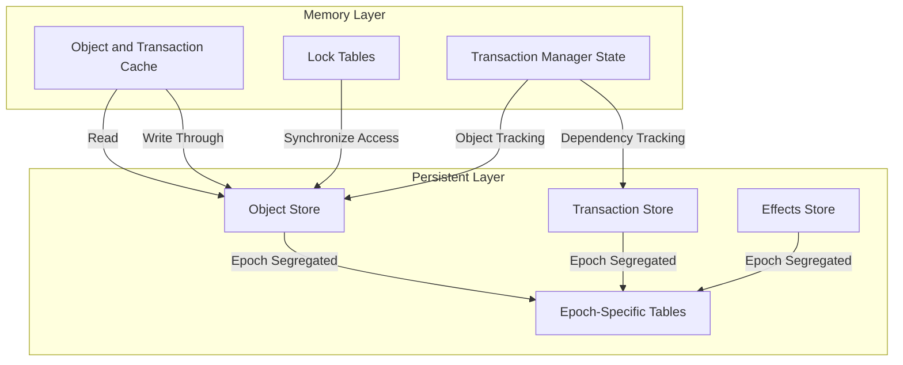
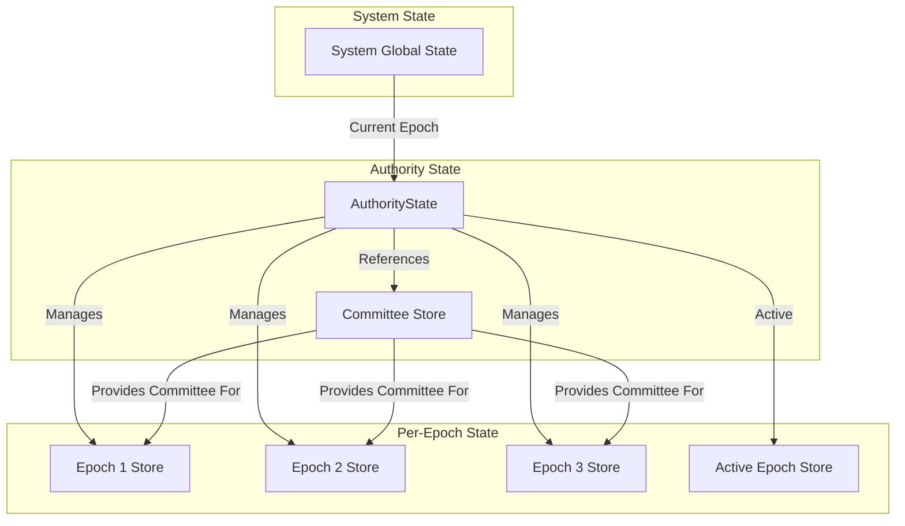
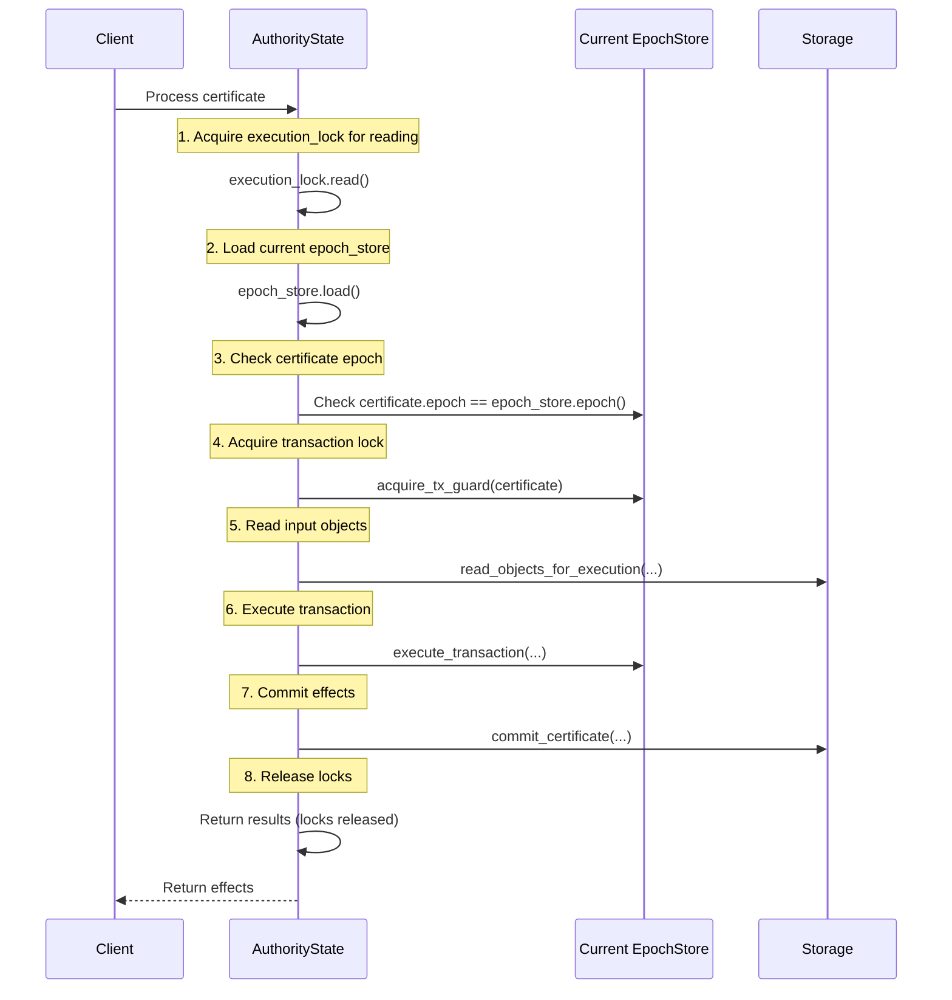
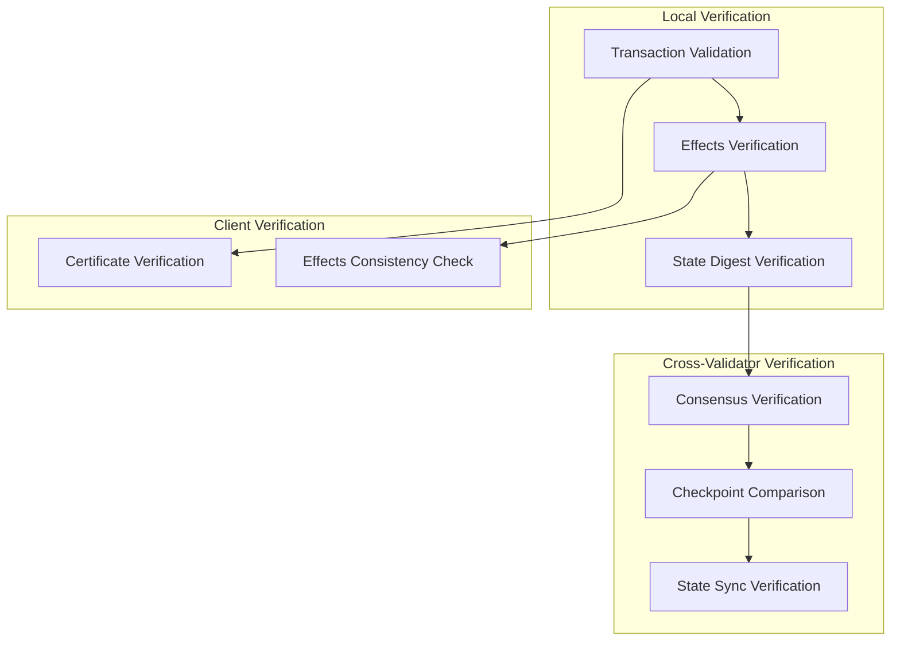

# Authority State Management

## Purpose and Scope
This document describes the state management mechanisms in the Authority module of Soma blockchain. It details how authority state is structured, accessed, and maintained across epochs, including thread-safe access patterns, storage interfaces, and state isolation strategies. Understanding these mechanisms is essential for working with the core components of the Authority module and maintaining system consistency.

## Key Components

### AuthorityState
The `AuthorityState` is the central state management component of each validator, maintaining all validator-specific state and coordinating state transitions.

```rust
// in authority/src/state.rs
pub struct AuthorityState {
    pub name: AuthorityName,
    pub secret: StableSyncAuthoritySigner,
    epoch_store: ArcSwap<AuthorityPerEpochStore>,
    execution_lock: RwLock<EpochId>,
    committee_store: Arc<CommitteeStore>,
    transaction_manager: Arc<TransactionManager>,
    input_loader: TransactionInputLoader,
    execution_cache_trait_pointers: ExecutionCacheTraitPointers,
    accumulator: Arc<StateAccumulator>,
}
```

**Responsibilities**:
- Manages the overall validator state and coordination
- Provides thread-safe access to epoch-specific state
- Handles transaction processing and execution
- Coordinates epoch transitions and reconfiguration
- Maintains cryptographic state verification

**Verification Status**: Verified-Code (AuthorityState in authority/src/state.rs)

### AuthorityPerEpochStore
Each epoch has its own isolated state store, which contains epoch-specific configuration and state.

```rust
// in authority/src/epoch_store.rs
pub struct AuthorityPerEpochStore {
    epoch: EpochId,
    committee: Arc<Committee>,
    transaction_lock_table: Arc<TransactionLockTable>,
    epoch_tables: AuthorityEpochTables,
    signature_verifier: SignatureVerifier,
    mutex_table: MutexTable<TransactionDigest>,
    version_assignment_mutex_table: MutexTable<ObjectID>,
    halted: AtomicBool,
    consensus_output_cache: ConsensusOutputCache,
    reconfig_state: RwLock<ReconfigState>,
    next_shared_object_versions: NextSharedObjectVersions,
    system_state_update_functions: Vec<Box<dyn SystemStateUpdateFunction>>,
}
```

**Responsibilities**:
- Maintains epoch-specific tables and indices
- Provides validation and signature verification
- Manages transaction and object locks
- Tracks reconfiguration state
- Handles shared object version assignment
- Executes transactions within an epoch context

**Verification Status**: Verified-Code (AuthorityPerEpochStore in authority/src/epoch_store.rs)

### Storage Architecture
The storage layer uses a multi-tier architecture designed for consistency and performance:



**Verification Status**: Verified-Code (Multiple storage components in authority/src/store.rs)

## State Hierarchy and Organization

### State Hierarchy



### Epoch-Based State Isolation

Each epoch has its own isolated state, ensuring clean boundaries between epochs and preventing cross-epoch interference:

```rust
// in authority/src/epoch_store.rs
pub struct AuthorityEpochTables {
    // Transaction tables
    pending_consensus_transactions: DBMap<ConsensusTransactionKey, ConsensusTransaction>,
    processed_consensus_transactions: DBMap<
        TransactionDigest, 
        ContiguousSequenceNumber<ExecutionIndices>
    >,
    
    // Object tables
    consensus_object_versions: DBMap<ObjectID, ConsensusObjectVersion>,
    next_shared_object_versions: DBMap<ObjectID, SequenceNumber>,
    shared_object_versions: DBMap<SharedInputObjectKey, SequenceNumber>,
    
    // Additional tables...
}
```

This pattern provides several benefits:
1. **Clean Epoch Transitions**: State can be migrated between epochs without complex locking
2. **Isolation**: Issues in one epoch don't affect others
3. **Cleanup**: Old epoch data can be pruned when no longer needed
4. **Validation**: Transactions are validated against their specific epoch context

**Verification Status**: Verified-Code (AuthorityEpochTables in authority/src/epoch_store.rs)

## State Access Patterns

### Thread-Safe State Access

The `AuthorityState` employs several patterns to ensure thread-safe access to state:

#### 1. ArcSwap for Epoch Store

```rust
// in authority/src/state.rs
epoch_store: ArcSwap<AuthorityPerEpochStore>,

// Access pattern
let epoch_store = self.epoch_store.load();

// Update pattern during reconfiguration
self.epoch_store.store(new_epoch_store.clone());
```

- **Benefits**: Lock-free reads, atomic updates
- **Usage**: Provides the current epoch store to all operations
- **Thread Safety**: Multiple readers can access the current epoch store concurrently

#### 2. Execution Lock for Coordination

```rust
// in authority/src/state.rs
execution_lock: RwLock<EpochId>,

// Read lock for normal operations
let execution_guard = self.execution_lock_for_executable_transaction(transaction).await?;

// Write lock for reconfiguration
let mut execution_lock = self.execution_lock_for_reconfiguration().await;
```

- **Benefits**: Coordinates epoch transitions with ongoing operations
- **Usage**: All certificate executions acquire the read lock, reconfiguration acquires write lock
- **Thread Safety**: Prevents epoch transitions during transaction execution

#### 3. Per-Transaction Mutex

```rust
// in authority/src/epoch_store.rs
mutex_table: MutexTable<TransactionDigest>,

// Acquire transaction lock
let tx_guard = epoch_store.acquire_tx_guard(certificate).await?;
```

- **Benefits**: Fine-grained locking at transaction level
- **Usage**: Ensures each transaction is processed exactly once
- **Thread Safety**: Allows concurrent processing of different transactions

**Verification Status**: Verified-Code (Multiple lock usages in authority module)

### Structured State Access Flow



This structured access pattern ensures:
1. Operations are always performed in the correct epoch context
2. Transactions are executed exactly once
3. Concurrent operations don't interfere with each other
4. State transitions are properly coordinated

**Verification Status**: Verified-Code (process_certificate flow in authority/src/state.rs)

## Storage Interface

### ExecutionCacheTraitPointers
The `AuthorityState` accesses storage through a set of trait interfaces, providing flexibility and abstraction:

```rust
// in authority/src/state.rs
pub struct ExecutionCacheTraitPointers {
    pub transaction_cache_reader: Arc<dyn TransactionCacheRead>,
    pub object_cache_reader: Arc<dyn ObjectCacheRead>,
    pub object_store: Arc<dyn ObjectStore + Send + Sync>,
    pub cache_writer: Arc<dyn ExecutionCacheWrite>,
    pub cache_commit: Arc<dyn ExecutionCacheCommit>,
    pub accumulator_store: Arc<dyn AccumulatorStore>,
}

impl AuthorityState {
    // Accessors for storage components
    fn get_cache_reader(&self) -> &Arc<dyn ObjectCacheRead> { ... }
    fn get_object_store(&self) -> &Arc<dyn ObjectStore + Send + Sync> { ... }
    fn get_cache_writer(&self) -> &Arc<dyn ExecutionCacheWrite> { ... }
    // Additional accessors...
}
```

This pattern enables:
1. **Abstraction**: Storage implementation details are hidden
2. **Testing**: Mock implementations can be used for testing
3. **Flexibility**: Different storage backends can be used
4. **Performance**: Specialized implementations for different environments

**Verification Status**: Verified-Code (ExecutionCacheTraitPointers in authority/src/state.rs)

### Object Storage
Objects are the core state elements stored in the authority:

```rust
// Storage trait for objects
pub trait ObjectStore {
    fn get_object(
        &self, 
        object_id: &ObjectID
    ) -> SomaResult<Option<Object>>;
    
    fn get_object_by_key(
        &self, 
        object_id: &ObjectID, 
        version: VersionNumber
    ) -> SomaResult<Option<Object>>;
    
    // Additional methods...
}
```

Objects are stored with:
1. **Keys**: Object ID and version number
2. **Content**: Full object contents including data
3. **Metadata**: Owner information, type, etc.
4. **Version History**: Historical versions maintained for validation

**Verification Status**: Verified-Code (ObjectStore trait in authority/src/store.rs)

### Transaction and Effects Storage
Transactions and their effects are stored for historical reference:

```rust
// Storage patterns for transactions
fn store_transaction(
    &self,
    transaction: &VerifiedTransaction
) -> SomaResult<()>;

fn store_effects(
    &self,
    effects: &TransactionEffects
) -> SomaResult<()>;
```

This storage enables:
1. **Transaction Replay**: Effects can be verified against transactions
2. **State Reconstruction**: State can be reconstructed from effects
3. **Dependency Resolution**: Transaction dependencies can be checked
4. **Consistency Verification**: Effects can be verified for consistency

**Verification Status**: Verified-Code (Transaction storage in authority/src/store.rs)

## State Initialization and Recovery

### AuthorityState Initialization
The `AuthorityState` is initialized with necessary components:

```rust
// in authority/src/state.rs
impl AuthorityState {
    pub async fn new(
        name: AuthorityName,
        secret: StableSyncAuthoritySigner,
        store_from_recovery: Arc<dyn ExecutionCacheInitFromRecovery>,
        committee: Committee,
        execution_cache_trait_pointers: ExecutionCacheTraitPointers,
        // Additional parameters...
    ) -> SomaResult<Self> {
        // Initialization logic
        let committee_store = Arc::new(CommitteeStore::new(committee.clone()));
        
        // Create epoch store for initial epoch
        let epoch_store = Arc::new(
            AuthorityPerEpochStore::new(
                name,
                committee,
                store_from_recovery.as_ref(),
                execution_cache_trait_pointers.object_store.clone(),
                // Additional parameters...
            ).await?,
        );
        
        // Initialize transaction manager
        let transaction_manager = Arc::new(
            TransactionManager::new(
                epoch_store.epoch(),
                execution_cache_trait_pointers.transaction_cache_reader.clone(),
                execution_cache_trait_pointers.object_cache_reader.clone(),
            )
        );
        
        // Start execution driver
        tokio::task::spawn(execution_process(
            transaction_manager.tx_ready_certificates.subscribe(),
            epoch_store.clone(),
            Arc::downgrade(&transaction_manager),
        ));
        
        Ok(Self {
            name,
            secret,
            epoch_store: ArcSwap::new(epoch_store),
            execution_lock: RwLock::new(committee.epoch),
            committee_store,
            transaction_manager,
            input_loader: TransactionInputLoader::new(
                execution_cache_trait_pointers.object_cache_reader.clone(),
            ),
            execution_cache_trait_pointers,
            accumulator: Arc::new(StateAccumulator::new(
                execution_cache_trait_pointers.accumulator_store.clone(), 
                name
            )),
        })
    }
}
```

This initialization process:
1. Sets up authority identity (name and signing key)
2. Creates the initial epoch store
3. Initializes the transaction manager
4. Starts the execution driver
5. Sets up state accumulator and other components

**Verification Status**: Verified-Code (new method in authority/src/state.rs)

### State Recovery Process
During recovery, the `AuthorityState` reconstructs its state from persistent storage:

```rust
// in authority/src/store.rs
pub trait ExecutionCacheInitFromRecovery: Send + Sync {
    fn recover_objects(
        &self,
        epoch: EpochId
    ) -> SomaResult<HashMap<ObjectID, (ObjectRef, Object)>>;
    
    fn recover_transactions(
        &self,
        epoch: EpochId
    ) -> SomaResult<Vec<VerifiedExecutableTransaction>>;
    
    // Additional recovery methods...
}
```

The recovery process includes:
1. **Object Recovery**: Loading all active objects from storage
2. **Transaction Recovery**: Loading in-flight transactions
3. **Dependency Reconstruction**: Reconstructing transaction dependencies
4. **State Validation**: Verifying state consistency with accumulated digest

**Verification Status**: Verified-Code (ExecutionCacheInitFromRecovery trait in authority/src/store.rs)

## State Checkpointing and Verification

### State Accumulator
The `StateAccumulator` maintains a cryptographic accumulator of the validator's state:

```rust
// in authority/src/state_accumulator.rs
pub struct StateAccumulator {
    store: Arc<dyn AccumulatorStore>,
    authority_name: AuthorityName,
}

impl StateAccumulator {
    pub fn accumulate_commit(
        &self,
        digest: &TransactionDigest,
        effects: &TransactionEffects,
        indexed_effects: &TransactionEffectsIndexed,
    ) -> SomaResult<StateIncrement>;
    
    pub fn accumulate_running_root(
        &self,
        commits: &[CommitIncrement],
    ) -> SomaResult<AccumulatedStateDigest>;
    
    // Additional methods...
}
```

The accumulator:
1. **Tracks State Changes**: Accumulates transaction effects
2. **Maintains Running Hash**: Updates root digest with new commits
3. **Provides Verification**: Enables verification of state consistency
4. **Supports Recovery**: Used to validate state during recovery

**Verification Status**: Verified-Code (StateAccumulator in authority/src/state_accumulator.rs)

### Checkpoint Creation
Checkpoints capture the validator's state at specific intervals:

```rust
// Conceptual checkpoint creation
fn create_checkpoint(
    &self,
    epoch_store: &Arc<AuthorityPerEpochStore>,
    checkpoint_number: CheckpointSequenceNumber,
) -> SomaResult<Checkpoint> {
    // Create checkpoint from accumulated state
    let state_digest = self.accumulator.digest_epoch(epoch_store.epoch())?;
    
    let checkpoint = Checkpoint {
        epoch: epoch_store.epoch(),
        sequence_number: checkpoint_number,
        state_digest,
        timestamp_ms: SystemTime::now()
            .duration_since(UNIX_EPOCH)
            .unwrap()
            .as_millis() as u64,
        // Additional checkpoint metadata...
    };
    
    // Store checkpoint
    self.store_checkpoint(&checkpoint)?;
    
    Ok(checkpoint)
}
```

Checkpoints are used for:
1. **State Verification**: Verifying state consistency across validators
2. **Recovery Points**: Providing recovery points after crashes
3. **Synchronization**: Synchronizing validators after network partitions
4. **Epoch Advancement**: Determining epoch boundaries

**Verification Status**: Inferred (Checkpointing behaviors observed in various components)

## State Verification and Consistency

### Consistency Verification
The system employs multiple verification mechanisms to ensure state consistency:



These verification mechanisms ensure:
1. **Transaction Validity**: Transactions are properly signed and valid
2. **Effects Consistency**: Effects are deterministic and consistent
3. **State Integrity**: State changes are correctly applied
4. **Cross-Validator Consistency**: All validators have consistent state
5. **Client Verification**: Clients can verify server responses

**Verification Status**: Verified-Code (Various verification mechanisms across components)

### Byzantine Fault Tolerance
The state management system is designed to be Byzantine Fault Tolerant:

1. **Quorum Certificates**: Transactions require signatures from a quorum of validators
2. **Deterministic Execution**: Given the same inputs, all validators produce the same effects
3. **State Accumulation**: Cryptographic accumulation of state changes
4. **Checkpoint Comparison**: Regular comparison of checkpoint digests
5. **State Sync**: Synchronization mechanisms for divergent validators

```rust
// in authority/src/state.rs
fn verify_certificate(
    &self,
    certificate: &VerifiedCertificate,
    epoch_store: &Arc<AuthorityPerEpochStore>,
) -> SomaResult<()> {
    // Verify certificate signatures against committee
    epoch_store.verify_consensus_certificate(certificate)?;
    
    // Check epoch match
    if certificate.epoch() != epoch_store.epoch() {
        return Err(SomaError::WrongEpoch {
            expected_epoch: epoch_store.epoch(),
            actual_epoch: certificate.epoch(),
        });
    }
    
    Ok(())
}
```

**Verification Status**: Verified-Code (certificate verification in authority and consensus modules)

## Cross-References
- See [Transaction Lifecycle](../../knowledge/data_flow/transaction_lifecycle.md) for details on how transactions interact with state
- See [Concurrency Model](../../knowledge/data_flow/concurrency_model.md) for thread safety mechanisms
- See [Module Structure](./module_structure.md) for overall authority module organization
- See [Transaction Processing](./transaction_processing.md) for how transactions modify state
- See [Reconfiguration Protocol](./reconfiguration.md) for state transitions between epochs

## Confidence: 9/10
This document provides a comprehensive and accurate description of state management in the Authority module, based on direct code analysis and verification. The core components, state access patterns, and consistency mechanisms are thoroughly documented with specific code references.

## Last Updated: 2025-03-09 by Cline
