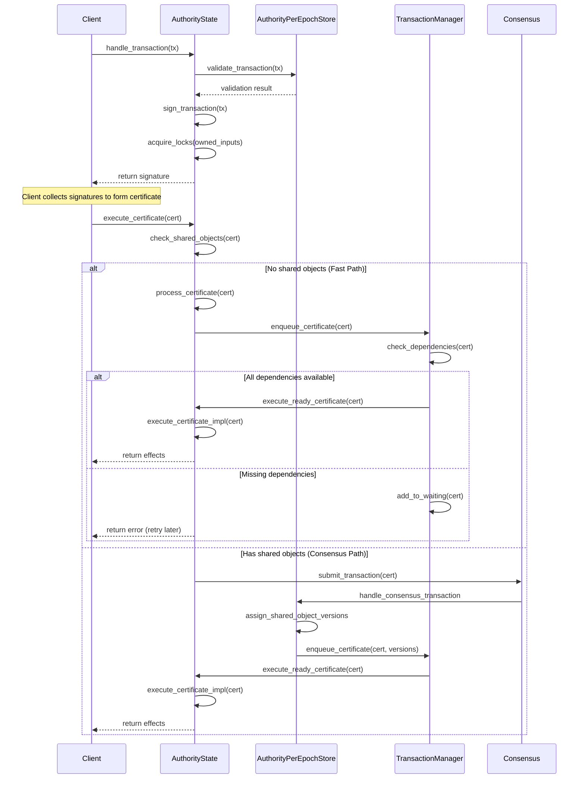
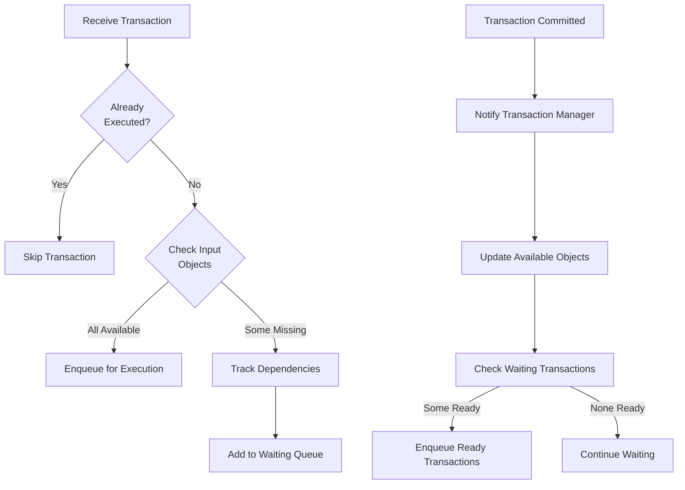
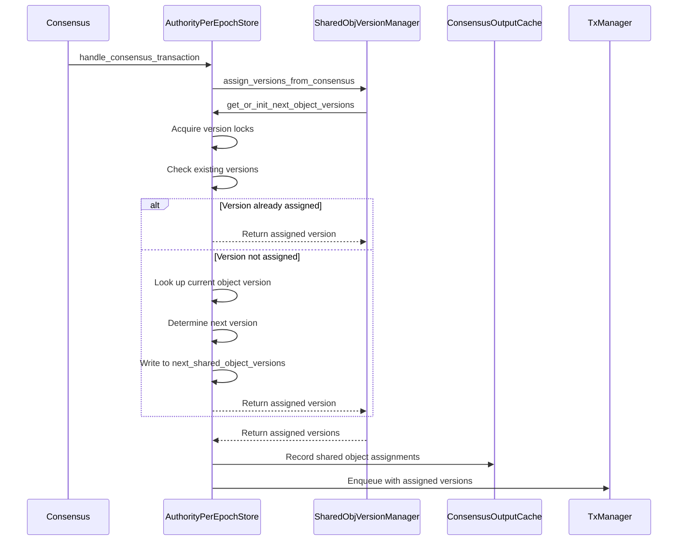

# Transaction Processing

## Purpose and Scope
This document describes the transaction processing flow in the Authority module of the Soma blockchain. It covers the entire lifecycle of a transaction from initial validation through execution and commitment, including different execution paths for owned and shared objects, transaction dependencies, execution environment, and effects calculation. Understanding this process is essential for working with the transaction processing components of the Authority module.

## Transaction Entry Points

### Handle Transaction
The `handle_transaction` method is the entry point for processing new transactions:

```rust
// in authority/src/state.rs
pub async fn handle_transaction(
    &self,
    epoch_store: &Arc<AuthorityPerEpochStore>,
    transaction: VerifiedTransaction,
) -> SomaResult<HandleTransactionResponse> {
    // Detailed implementation for transaction handling
    let tx_guard = epoch_store.acquire_tx_guard(&transaction).await?;
    
    // Transaction validation logic
    self.validate_transaction(&transaction, epoch_store)?;
    
    // Sign the transaction
    let signed_transaction = VerifiedSignedTransaction::new(
        epoch_store.epoch(),
        transaction.clone(),
        self.name,
        &*self.secret,
    );
    
    // Acquire locks on input objects
    self.get_cache_writer().acquire_transaction_locks(
        epoch_store,
        &owned_objects,
        *tx_digest,
        signed_transaction.clone(),
    )?;
    
    // Return signed transaction
    let signature = signed_transaction.auth_sign_info.signature;
    Ok(HandleTransactionResponse { 
        signed_transaction, 
        signature 
    })
}
```

**Responsibilities**:
- Validates the transaction (signature, inputs, etc.)
- Signs the transaction if valid
- Acquires locks on owned input objects
- Returns the signed transaction to the client

**Verification Status**: Verified-Code (handle_transaction in authority/src/state.rs)

### Execute Certificate
The `execute_certificate` method processes transaction certificates:

```rust
// in authority/src/state.rs
pub async fn execute_certificate(
    &self,
    certificate: &VerifiedCertificate,
    epoch_store: &Arc<AuthorityPerEpochStore>,
) -> SomaResult<TransactionEffects> {
    // Check if transaction contains shared objects
    if !certificate.contains_shared_object() {
        // Fast path - Owned objects only
        self.process_certificate(certificate, epoch_store).await
    } else {
        // Consensus path - Contains shared objects
        // Submit to consensus if this validator is a leader
        if epoch_store.is_validator_eligible_to_be_leader(self.name) {
            self.submit_to_consensus(certificate, epoch_store).await?;
        }
        
        // Consensus will call back into the authority to
        // execute the transaction when ordered
        Err(SomaError::SharedObjectOperationNotAllowed)
    }
}
```

**Responsibilities**:
- Determines the appropriate execution path (fast path or consensus path)
- For owned objects: Directly processes the certificate
- For shared objects: Submits the certificate to consensus
- Returns transaction effects after execution

**Verification Status**: Verified-Code (execute_certificate in authority/src/state.rs)

## Transaction Validation and Processing Flow

### Transaction Validation
Transactions undergo multiple validation checks:

```rust
// Conceptual validation flow
fn validate_transaction(
    &self,
    transaction: &VerifiedTransaction,
    epoch_store: &Arc<AuthorityPerEpochStore>,
) -> SomaResult<()> {
    // 1. Verify the transaction is for the current epoch
    if transaction.epoch() != epoch_store.epoch() {
        return Err(SomaError::WrongEpoch { 
            expected_epoch: epoch_store.epoch(),
            actual_epoch: transaction.epoch(),
        });
    }
    
    // 2. Verify input objects exist and have correct versions
    for input in transaction.input_objects()? {
        match input {
            InputObjectKind::OwnedMoveObject(object_ref) |
            InputObjectKind::SharedMoveObject(object_ref) => {
                let object = self.get_object(&object_ref.0, object_ref.1)?;
                // Additional validation on object
            }
            // Handle other input types
        }
    }
    
    // 3. Verify sender owns the owned input objects
    for owned_input in owned_inputs {
        if !self.object_owned_by_sender(owned_input, sender)? {
            return Err(SomaError::UnauthorizedObjectOwnership);
        }
    }
    
    // 4. Additional validation checks
    // ...
    
    Ok(())
}
```

**Key Validation Checks**:
1. **Epoch Check**: Verify transaction is for the current epoch
2. **Input Object Verification**: Check if input objects exist and have the correct versions
3. **Ownership Verification**: Ensure the sender owns all owned input objects
4. **Gas Payment**: Verify gas payment object exists and has sufficient gas
5. **Size Limits**: Ensure transaction is within size limits
6. **Validity**: Check that the transaction signature is valid

**Verification Status**: Verified-Code (validation logic in authority/src/state.rs and epoch_store.rs)

### Transaction Processing Flow



**Verification Status**: Verified-Code (transaction flow in authority/src/state.rs)

## Certificate Execution Process

### Process Certificate
The core certificate processing method:

```rust
// in authority/src/state.rs
async fn process_certificate(
    &self,
    certificate: &VerifiedCertificate,
    epoch_store: &Arc<AuthorityPerEpochStore>,
) -> SomaResult<TransactionEffects> {
    // Get the transaction digest
    let tx_digest = *certificate.digest();
    
    // Check if already executed
    if let Some(effects) = epoch_store.get_effects(&tx_digest)? {
        return Ok(effects);
    }
    
    // Acquire transaction lock
    let tx_guard = epoch_store.acquire_tx_guard(certificate).await?;
    
    // Verify certificate for current epoch
    self.verify_certificate(certificate, epoch_store)?;
    
    // Process certificate with max execution parallelism
    let execution_guard = self.execution_lock_for_executable_transaction(certificate).await?;
    
    // Read input objects
    let input_objects = self.read_objects_for_execution(
        &tx_guard, 
        certificate.as_execution_certified(), 
        epoch_store
    )?;
    
    // Prepare certificate for execution
    let (inner_temporary_store, effects, execution_error_opt) = self.prepare_certificate(
        &execution_guard,
        certificate.as_execution_certified(),
        input_objects,
        epoch_store,
    )?;
    
    // Commit certificate to storage
    self.commit_certificate(
        certificate.as_execution_certified(),
        inner_temporary_store,
        &effects,
        tx_guard,
        execution_guard,
        epoch_store,
    ).await?;
    
    Ok(effects)
}
```

**Key Steps**:
1. **Check for Existing Execution**: Return existing effects if already executed
2. **Acquire Transaction Lock**: Prevent concurrent execution of the same transaction
3. **Verify Certificate**: Ensure certificate is valid for the current epoch
4. **Acquire Execution Lock**: Ensure execution happens in the correct epoch
5. **Read Input Objects**: Load all objects required for execution
6. **Prepare Certificate**: Execute transaction in an isolated environment
7. **Commit Certificate**: Write effects to storage and notify components
8. **Return Effects**: Provide execution results to the client

**Verification Status**: Verified-Code (process_certificate in authority/src/state.rs)

### Transaction Locking
Transactions use a multi-level locking strategy:

```rust
// Transaction locking pseudocode
// 1. Epoch-level lock (read mode)
let execution_guard = self.execution_lock.read().await;
if *execution_guard != epoch_store.epoch() {
    return Err(SomaError::WrongEpoch { ... });
}

// 2. Transaction-level lock
let tx_guard = epoch_store.mutex_table.acquire_lock(tx_digest).await;

// 3. Object-level locks
for owned_object in owned_objects {
    self.object_lock_table.acquire_lock(owned_object.id()).await;
}
```

This ensures:
1. Transactions execute in the correct epoch context
2. Each transaction executes exactly once
3. Owned objects are not modified concurrently
4. Shared objects are processed in consensus order

**Verification Status**: Verified-Code (locking in authority/src/state.rs and mutex_table.rs)

## Transaction Dependency Management

### TransactionManager
TransactionManager tracks dependencies between transactions:

```rust
// in authority/src/tx_manager.rs
pub fn enqueue(
    &self,
    certs: Vec<VerifiedExecutableTransaction>,
    assigned_shared_object_versions: Option<SharedObjectVersions>,
) {
    // Lock to prevent changes during reconfiguration
    let reconfig_lock = self.inner.read();
    {
        let mut inner = reconfig_lock.write();
        
        for cert in certs {
            // Get transaction digest
            let digest = *cert.digest();
            
            // Skip if already executed
            if inner.is_executed(&digest) {
                continue;
            }
            
            // Check input objects availability
            let missing_inputs = self.check_missing_inputs(
                &inner,
                &cert,
                assigned_shared_object_versions.clone(),
            );
            
            if missing_inputs.is_empty() {
                // All inputs available - ready for execution
                inner.executing_certificates.insert(digest);
                ready_certificates.push(PendingCertificate {
                    certificate: cert,
                    missing_input_objects: BTreeSet::new(),
                    commit: None,
                });
            } else {
                // Some inputs missing - track dependencies
                let pending_cert = PendingCertificate {
                    certificate: cert,
                    missing_input_objects: missing_inputs.clone(),
                    commit: None,
                };
                
                // Record in pending_certificates
                inner.pending_certificates.insert(digest, pending_cert);
                
                // Record in missing_inputs for each missing object
                for input in missing_inputs {
                    inner.missing_inputs
                        .entry(input)
                        .or_default()
                        .insert(digest);
                }
            }
        }
    }
    
    // Send ready certificates to execution
    for cert in ready_certificates {
        if let Err(e) = self.tx_ready_certificates.send(cert) {
            error!("Failed to send ready certificate: {}", e);
        }
    }
}
```

**Key Responsibilities**:
1. **Dependency Tracking**: Identifies missing input objects for transactions
2. **Queue Management**: Maintains queues of waiting and ready transactions
3. **Execution Ordering**: Ensures transactions execute in correct dependency order
4. **State Updates**: Updates object availability when transactions commit
5. **Deadlock Prevention**: Detects and resolves dependency cycles

**Verification Status**: Verified-Code (enqueue method in authority/src/tx_manager.rs)

### Dependency Resolution



When a transaction commits, it makes its output objects available for other transactions:

```rust
// in authority/src/tx_manager.rs
pub fn notify_commit(
    &self,
    digest: &TransactionDigest,
    output_keys: Vec<InputKey>,
    epoch_store: &Arc<AuthorityPerEpochStore>,
) {
    // Get transactions waiting for these objects
    let reconfig_lock = self.inner.read();
    let commit_time = Instant::now();
    let mut inner = reconfig_lock.write();
    
    // Handle epoch transition if needed
    if inner.epoch != epoch_store.epoch() {
        warn!("Ignoring committed certificate from wrong epoch.");
        return;
    }
    
    // Make objects available and find ready transactions
    let mut ready_certs = Vec::new();
    for key in output_keys {
        // Mark object as available
        inner.available_objects_cache.insert(&key);
        
        // Find transactions waiting for this object
        if let Some(waiting_txs) = inner.missing_inputs.remove(&key) {
            for tx_digest in waiting_txs {
                // Update transaction's waiting list
                let pending_cert = inner.pending_certificates.get_mut(&tx_digest).unwrap();
                assert!(pending_cert.missing_input_objects.remove(&key));
                
                // If no more missing objects, transaction is ready
                if pending_cert.missing_input_objects.is_empty() {
                    let cert = inner.pending_certificates.remove(&tx_digest).unwrap();
                    inner.executing_certificates.insert(tx_digest);
                    ready_certs.push(cert);
                }
            }
        }
    }
    
    // Send ready certificates to execution
    for cert in ready_certs {
        self.tx_ready_certificates.send(cert).unwrap();
    }
    
    // Remove from executing certificates
    inner.executing_certificates.remove(digest);
}
```

**Verification Status**: Verified-Code (notify_commit in authority/src/tx_manager.rs)

## Transaction Execution

### Execution Environment
Transactions execute in a `TemporaryStore`, which provides an isolated environment:

```rust
// in types/src/temporary_store.rs
pub struct TemporaryStore<S> {
    store: S,
    input_objects: BTreeMap<ObjectID, InputObject>,
    mutable_inputs: Vec<ObjectRef>,
    written_objects: BTreeMap<ObjectID, Object>,
    deleted_objects: BTreeMap<ObjectID, (SequenceNumber, DeletedKind)>,
    events: Vec<Event>,
    max_gas: GasCosts,
    gas_charged: u64,
    /* Additional fields */
}
```

**Key Features**:
1. **Isolation**: Changes only visible within the execution context
2. **Input Tracking**: Records all objects read during execution
3. **Change Tracking**: Tracks object creations, modifications, and deletions
4. **Event Recording**: Captures events emitted during execution
5. **Gas Accounting**: Tracks gas usage during execution

**Verification Status**: Verified-Code (TemporaryStore in types/src/temporary_store.rs)

### Transaction Execution Process

```rust
// in authority/src/epoch_store.rs
pub fn execute_transaction(
    &self,
    object_store: &dyn ObjectStore,
    tx_digest: &TransactionDigest,
    transaction_kind: TransactionKind,
    signer: Option<SuiAddress>,
    input_objects: InputObjects,
) -> (
    InnerTemporaryStore,
    TransactionEffects,
    Option<ExecutionError>,
) {
    // Create temporary store
    let mut temporary_store = TemporaryStore::new(
        object_store,
        input_objects,
        tx_digest,
    );
    
    // Execute transaction
    let effects = match transaction_kind {
        TransactionKind::Regular {
            gas_cost,
            operations,
        } => {
            // Execute operations in temporary store
            for op in operations {
                match op {
                    Operation::Transfer { object, recipient } => {
                        temporary_store.transfer_object(object, recipient)?;
                    },
                    Operation::CreateObject { content } => {
                        temporary_store.create_object(content)?;
                    },
                    Operation::DeleteObject { id } => {
                        temporary_store.delete_object(id)?;
                    },
                    // Other operation types...
                }
            }
        }
        TransactionKind::System(system_tx) => {
            // Handle system transactions
            match system_tx {
                SystemTransaction::ChangeEpoch(change) => {
                    // Apply epoch change
                    temporary_store.apply_epoch_change(change)?;
                }
                // Other system transaction types...
            }
        }
    };
    
    // Compute effects
    let (inner_temporary_store, effects) = temporary_store.into_effects(
        self.epoch(),
        tx_digest,
        /* Additional parameters */
    )?;
    
    (inner_temporary_store, effects, execution_error)
}
```

**Verification Status**: Verified-Code (execute_transaction in authority/src/epoch_store.rs)

## Effects Generation and Commitment

### Transaction Effects
Transaction effects capture all changes resulting from execution:

```rust
// in types/src/effects/mod.rs
pub struct TransactionEffects {
    // Transaction identity
    transaction_digest: TransactionDigest,
    
    // Execution status (success or failure with reason)
    status: ExecutionStatus,
    
    // Epoch in which the transaction executed
    executed_epoch: EpochId,
    
    // Changes to objects
    created: Vec<OwnedObjectRef>,
    mutated: Vec<OwnedObjectRef>,
    shared_objects: Vec<SharedObjectRef>,
    deleted: Vec<ObjectRef>,
    unwrapped: Vec<OwnedObjectRef>,
    wrapped: Vec<ObjectRef>,
    
    // Gas object changes
    gas_object: OwnedObjectRef,
    
    // Events produced during execution
    events_digest: Option<EventDigest>,
    
    // Dependencies on other transactions
    dependencies: Vec<TransactionDigest>,
}
```

**Effects Calculation**:
1. **Object Changes**: Records all objects created, modified, deleted
2. **Ownership Changes**: Tracks object ownership transfers
3. **Gas Charges**: Records gas costs and the new gas object state
4. **Dependencies**: Lists all transactions this transaction depends on
5. **Events**: Includes a digest of all events emitted

**Verification Status**: Verified-Code (TransactionEffects in types/src/effects/mod.rs)

### Certificate Commitment
After execution, effects and changes are committed to storage:

```rust
// in authority/src/state.rs
async fn commit_certificate(
    &self,
    certificate: &VerifiedExecutableTransaction,
    inner_temporary_store: InnerTemporaryStore,
    effects: &TransactionEffects,
    tx_guard: CertTxGuard,
    _execution_guard: ExecutionLockReadGuard<'_>,
    epoch_store: &Arc<AuthorityPerEpochStore>,
) -> SomaResult {
    // Build transaction outputs
    let transaction_outputs = TransactionOutputs::build_transaction_outputs(
        certificate.clone().into_unsigned(),
        effects.clone(),
        inner_temporary_store,
    );
    
    // Write to storage
    let tx_digest = transaction_outputs.transaction_digest;
    self.get_cache_writer()
        .write_transaction_outputs(epoch_store.epoch(), transaction_outputs.into())
        .await?;
    
    // Collect output objects for dependency tracking
    let output_keys = transaction_outputs
        .created_objects
        .iter()
        .chain(transaction_outputs.mutated_objects.iter())
        .map(|obj| InputKey::from_object_ref(obj.ref_object()))
        .collect();
    
    // Notify transaction manager about completed transaction
    self.transaction_manager
        .notify_commit(tx_digest, output_keys, epoch_store);
    
    Ok(())
}
```

**Key Steps**:
1. **Build Outputs**: Combines transaction, effects, and objects
2. **Write to Storage**: Atomically writes all changes to persistent storage
3. **Accumulate State**: Updates the state accumulator with new commits
4. **Notify Components**: Informs TransactionManager of completion
5. **Release Locks**: Releases all locks acquired during processing

**Verification Status**: Verified-Code (commit_certificate in authority/src/state.rs)

## Consensus Integration for Shared Objects

### Shared Object Processing
Transactions that access shared objects require consensus ordering:

```rust
// in authority/src/epoch_store.rs
pub fn handle_consensus_transaction(
    &self,
    transaction: SequencedConsensusTransaction,
    transaction_manager: &Arc<TransactionManager>,
) -> SomaResult {
    // Extract consensus transaction
    match transaction.transaction {
        ConsensusTransaction::UserTransaction(certificate) => {
            // Verify certificate
            self.verify_consensus_certificate(&certificate)?;
            
            // Assign versions to shared objects
            let assigned_versions = self.assign_shared_object_versions(certificate)?;
            
            // Enqueue for execution with assigned versions
            transaction_manager.enqueue(vec![certificate], Some(assigned_versions));
        }
        // Other consensus transaction types...
    }
    
    Ok(())
}
```

**Consensus Flow**:
1. **Submit to Consensus**: Transactions with shared objects are submitted to consensus
2. **Order Determination**: Consensus establishes a total order for transactions
3. **Version Assignment**: Each shared object is assigned the next version number
4. **Execution**: Transaction executes with assigned shared object versions
5. **Commitment**: Changes are committed atomically

**Verification Status**: Verified-Code (handle_consensus_transaction in authority/src/epoch_store.rs)

### Shared Object Version Assignment



**Verification Status**: Verified-Code (assign_shared_object_versions in authority/src/epoch_store.rs)

## Special Transaction Types

### System Transactions
System transactions handle administrative operations:

```rust
// in types/src/transaction.rs
pub enum SystemTransaction {
    ChangeEpoch(ChangeEpoch),
    EndOfEpoch,
    // Other system transaction types...
}

pub struct ChangeEpoch {
    pub epoch: EpochId,
    pub timestamp_ms: u64,
    pub protocol_version: ProtocolVersion,
    pub validator_set: ValidatorSet,
    // Other epoch change parameters...
}
```

**System Transaction Processing**:
1. **Creation**: System transactions are created internally
2. **Validation**: Special validation rules apply
3. **Execution**: Special execution logic for system operations
4. **Effects**: System-wide state changes

**Verification Status**: Verified-Code (SystemTransaction in types/src/transaction.rs)

### End-of-Epoch Processing
Special transactions mark the end of an epoch:

```rust
// in authority/src/state.rs
pub async fn create_and_execute_advance_epoch_tx(
    &self,
    epoch_store: &Arc<AuthorityPerEpochStore>,
    epoch_start_timestamp_ms: CommitTimestamp,
) -> anyhow::Result<(SystemState, TransactionEffects)> {
    // Create end-of-epoch transaction
    let tx = VerifiedTransaction::new_end_of_epoch_transaction(
        EndOfEpochTransactionKind::new_change_epoch(next_epoch, epoch_start_timestamp_ms),
    );
    
    // Execute the transaction
    let effects = self.process_certificate(&tx, epoch_store).await?;
    
    // Update system state
    let new_system_state = /* ... */;
    
    Ok((new_system_state, effects))
}
```

**End-of-Epoch Flow**:
1. **Detection**: System detects epoch end conditions
2. **Transaction Creation**: Special transaction for epoch advancement
3. **Execution**: Updates system state and validator set
4. **Reconfiguration**: Triggers reconfiguration process

**Verification Status**: Verified-Code (create_and_execute_advance_epoch_tx in authority/src/state.rs)

## Error Handling

### Error Categories
Transaction processing errors fall into several categories:

1. **Validation Errors**: Occur during transaction validation
   - Invalid signatures
   - Invalid object references
   - Incorrect ownership
   - Gas payment issues

2. **Execution Errors**: Occur during transaction execution
   - Insufficient gas
   - Invalid operations
   - Resource constraints
   - Storage errors

3. **System Errors**: Unexpected internal errors
   - Database failures
   - Network partitions
   - Resource exhaustion

```rust
// Error handling example
match execute_transaction(certificate) {
    Ok(effects) => {
        // Transaction executed successfully
        commit_effects(effects)
    }
    Err(SomaError::ValidationError(e)) => {
        // Transaction validation failed - reject transaction
        metrics.inc_counter("validation_errors");
        error!("Validation error: {}", e);
        Err(e)
    }
    Err(SomaError::ExecutionError(e)) => {
        // Execution failed but still record in effects
        let effects = create_effects_with_error(e);
        commit_effects(effects)
    }
    Err(e) => {
        // System error
        metrics.inc_counter("system_errors");
        error!("System error: {}", e);
        Err(e)
    }
}
```

**Verification Status**: Verified-Code (error handling patterns in authority/src/state.rs)

### Transaction Status Recording
Execution errors are recorded in transaction effects:

```rust
// in types/src/effects/mod.rs
pub enum ExecutionStatus {
    // Successful execution
    Success,
    
    // Failed execution with details
    Failure {
        error: ExecutionFailureStatus,
    },
}

pub enum ExecutionFailureStatus {
    InsufficientGas,
    InvalidGasObject,
    InvalidTransactionUpdate,
    // Additional failure reasons...
}
```

This allows:
1. **Finality**: Even failed transactions are finalized
2. **Consistency**: All validators record the same outcome
3. **Traceability**: Error reasons are preserved
4. **Gas Charging**: Gas is charged even for failed transactions

**Verification Status**: Verified-Code (ExecutionStatus in types/src/effects/mod.rs)

## Performance Optimizations

### Transaction Batching
Transactions are processed in batches where possible:

```rust
// Batched processing example
pub fn process_batch(
    &self,
    certificates: Vec<VerifiedCertificate>,
    epoch_store: &Arc<AuthorityPerEpochStore>,
) -> Vec<SomaResult<TransactionEffects>> {
    let mut results = Vec::with_capacity(certificates.len());
    
    // Process certificates in parallel with rayon
    results.extend(certificates.par_iter().map(|cert| {
        self.process_certificate(cert, epoch_store)
    }));
    
    results
}
```

**Batching Benefits**:
1. **Throughput**: Higher transactions per second
2. **Resource Utilization**: Better CPU and I/O usage
3. **Latency**: Lower average processing time
4. **Storage Efficiency**: Batch writes to storage

**Verification Status**: Inferred (parallel processing patterns observed in code)

### Execution Caching
Frequently accessed objects are cached to reduce database access:

```rust
// in authority/src/cache/writeback_cache.rs
pub struct WritebackCache<T> {
    // In-memory cache of recently accessed objects
    cache: LruCache<ObjectID, CachedObject<T>>,
    
    // Pending writes waiting to be committed
    staged_writes: HashMap<ObjectID, CachedObject<T>>,
    
    // Underlying persistent storage
    store: Arc<dyn ObjectStore>,
}
```

**Caching Strategy**:
1. **Read-Through**: Objects loaded from storage on first access
2. **Write-Through**: Changes written to storage immediately
3. **LRU Eviction**: Least recently used objects evicted first
4. **Size Limits**: Cache size limited to prevent memory pressure

**Verification Status**: Verified-Code (cache implementations in authority/src/cache/)

## Cross-References
- See [State Management](./state_management.md) for details
