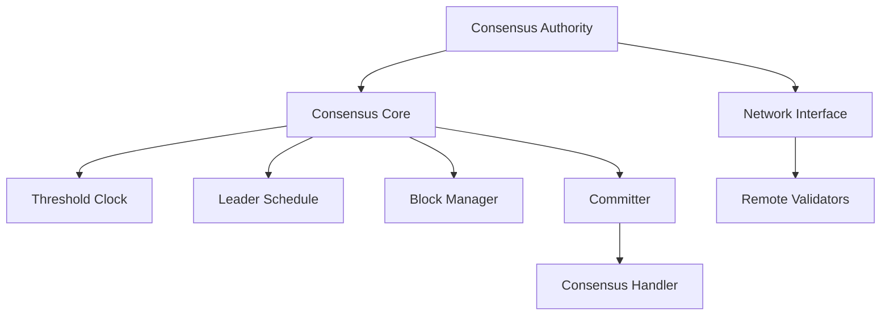

# Consensus Module

## Purpose and Scope
This document describes the Consensus module, which implements the Byzantine Fault Tolerant (BFT) consensus protocol in the Soma blockchain. It explains the module's core components, their interactions, and the key workflows involved in achieving agreement across validators.

## Key Components

### ConsensusAuthority
- Main consensus entrypoint abstraction
- Interfaces with authority state

### Core
- Implements core Mysticeti consensus logic
- Manages voting via ancestors to propose
- Tracks block proposals and confirmation
- Maintains consensus state machine

### ThresholdClock
- Manages consensus rounds
- Implements timeout mechanisms

### LeaderSchedule
- Determines block proposers for each round
- Implements stake-weighted selection
- Ensures fair distribution of leadership
- Provides deterministic selection

### BlockManager
- Handles block creation and verification
- Manages block dependencies
- Manages DAGState
- Processes block proposals
- Validates block contents

### UniversalCommitter
- Forms commit certificates
- Validates commit conditions
- Processes finalized blocks
- Notifies authority about committed transactions

## Module Architecture

## Primary Workflows

### Block Proposal
1. ThresholdClock advances to new round
2. LeaderSchedule selects round leader
3. Block filled with pending transactions
4. Block references valid ancestor blocks from previous round
5. Block signed and broadcast to validators
6. Other validators buffer and verify the block

### Commit Processing
1. Committer processes certified blocks in DAG
2. Consensus transactions ordered and finalized using commit rules
3. Authority state notified of committed subdag

## Key Interfaces

### With Authority Module
- Receives transactions for ordering
- Provides ordered commit certificates
- Signals epoch transitions
- Receives new committee information

### With Node Module
- Lifecycle management
- Configuration updates

## Byzantine Fault Tolerance

### Safety Properties
- Agreement: All honest validators commit the same blocks
- Validity: Only valid blocks are committed
- Total Order: All transactions have a clear order
- Durability: Once committed, blocks are never reverted

### Liveness Properties
- Progress despite f < n/3 Byzantine validators
- Eventual consensus during synchronous periods
- Recovery from temporary network partitions

## Confidence: 7/10
This document provides a high-level overview of the Consensus module's structure and responsibilities but requires more detailed explanations of the consensus protocol implementation and fault tolerance mechanisms.

## Last Updated: 2025-03-08 by Cline
