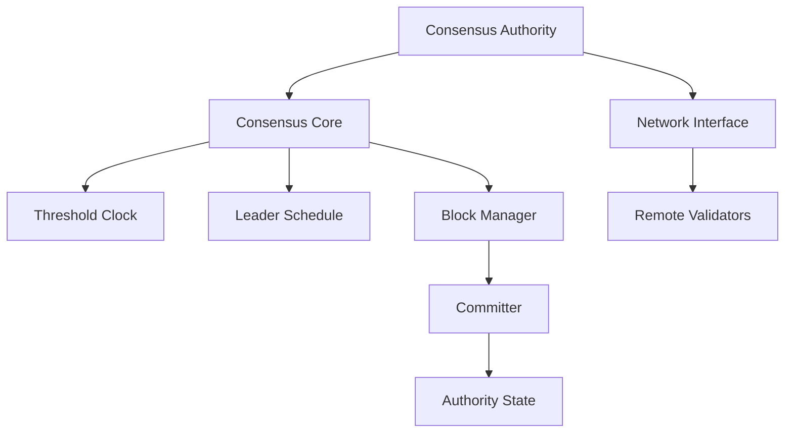

# Consensus Module

## Purpose and Scope
This document describes the Consensus module, which implements the Byzantine Fault Tolerant (BFT) consensus protocol in the Soma blockchain. It explains the module's core components, their interactions, and the key workflows involved in achieving agreement across validators.

## Key Components

### ConsensusAuthority
- Main consensus engine
- Manages consensus state and protocol
- Coordinates with other validators
- Interfaces with authority state

### Core
- Implements core consensus logic
- Manages voting and view changes
- Tracks block proposals and confirmation
- Maintains consensus state machine

### ThresholdClock
- Manages consensus rounds
- Tracks voting progress
- Implements timeout mechanisms
- Triggers view changes when needed

### LeaderSchedule
- Determines block proposers for each round
- Implements stake-weighted selection
- Ensures fair distribution of leadership
- Provides deterministic selection

### Block Manager
- Handles block creation and verification
- Manages block dependencies
- Processes block proposals
- Validates block contents

### Committer
- Forms commit certificates
- Validates commit conditions
- Processes finalized blocks
- Notifies about committed transactions

## Module Architecture

## Primary Workflows

### Block Proposal
1. ThresholdClock advances to new round
2. LeaderSchedule selects round leader
3. If local node is leader, create new block
4. Block filled with pending transactions
5. Block signed and broadcast to validators
6. Other validators buffer and verify the block

### Voting and Certification
1. Validators receive and verify block
2. If valid, create and sign vote
3. Votes broadcast to other validators
4. Votes collected and validated
5. When threshold reached, form certificate
6. Certificate broadcast to network

### Commit Processing
1. Certificate verified against committee
2. Committer processes certified block
3. Consensus transactions ordered and finalized
4. Authority state notified of commit
5. Next round initiated by ThresholdClock
6. Process repeats for next block

### View Change
1. ThresholdClock detects leader timeout
2. Timeout vote created and broadcast
3. When timeout threshold reached, view changed
4. New leader selected for current round
5. Protocol continues with new leader
6. Original leader proposal ignored if late

## Key Interfaces

### With Authority Module
- Receives transactions for ordering
- Provides ordered commit certificates
- Signals epoch transitions
- Receives new committee information

### With P2P Module
- Sends and receives consensus messages
- Discovers other validators
- Maintains connections to committee
- Receives network status updates

### With Node Module
- Lifecycle management
- Configuration updates
- Resource allocation
- Metrics reporting

## Design Patterns

### State Machine Replication
- Deterministic state transitions
- Identical execution across validators
- Ordered transaction processing
- Consistent state after execution

### Leader-Based Consensus
- Leader proposes, others validate
- Round-robin or weighted leader selection
- View changes for failed leaders
- Clear leader responsibilities

### Threshold Signatures
- Efficient multi-signature scheme
- Compact representation of multiple validators
- Threshold-based verification
- Reduced bandwidth requirements

## Byzantine Fault Tolerance

### Safety Properties
- Agreement: All honest validators commit the same blocks
- Validity: Only valid blocks are committed
- Total Order: All transactions have a clear order
- Durability: Once committed, blocks are never reverted

### Liveness Properties
- Progress despite f < n/3 Byzantine validators
- Eventual consensus during synchronous periods
- View changes to replace faulty leaders
- Recovery from temporary network partitions

## Confidence: 5/10
This document provides a high-level overview of the Consensus module's structure and responsibilities but requires more detailed explanations of the consensus protocol implementation and fault tolerance mechanisms.

## Last Updated: 2025-03-08 by Cline
