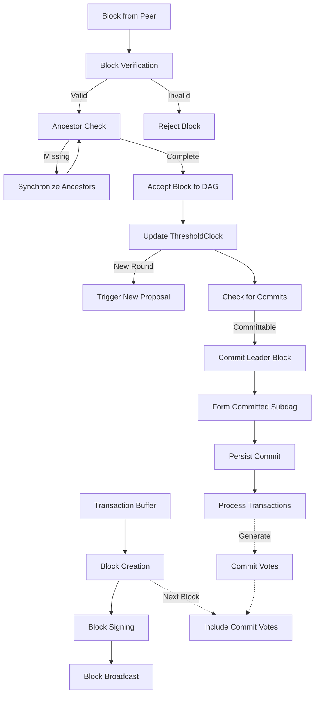

# Block Processing

## Purpose and Scope
This document provides a detailed explanation of block creation, verification, and commit determination in the Soma blockchain consensus module. It explains how blocks are structured, validated, and processed, as well as how commit decisions are made to ensure deterministic finality.

## Block Structure and Creation

### Block Structure
A consensus block in Soma consists of these key elements:

```rust
// Simplified from types/src/consensus/block.rs
pub struct Block {
    epoch: EpochId,
    round: Round,
    author: AuthorityIndex,
    timestamp_ms: BlockTimestampMs,
    ancestors: Vec<BlockRef>,
    transactions: Vec<ConsensusTransaction>,
    commit_votes: Vec<ConsensusVote>,
    end_of_epoch_data: Option<EndOfEpochData>,
}
```

The block structure has these components:
1. **Epoch**: The current epoch number
2. **Round**: The consensus round for this block
3. **Author**: The validator that created the block
4. **Timestamp**: Creation time in milliseconds since epoch
5. **Ancestors**: References to blocks from previous rounds
6. **Transactions**: List of transactions included in the block
7. **Commit Votes**: Votes for previously committed blocks
8. **End-of-Epoch Data**: Optional data for epoch transitions (if applicable)

The block is wrapped in `SignedBlock` and `VerifiedBlock` structures that add signature and verification information:

```rust
// Simplified structure hierarchy
pub struct SignedBlock {
    block: Block,
    signature: Signature,
}

pub struct VerifiedBlock {
    signed_block: SignedBlock,
    serialized: Vec<u8>,    // Pre-serialized form for efficiency
}
```

**Verification Status**: Verified-Code in types/src/consensus/block.rs

### Block Creation Process
The Core component is responsible for creating new blocks when appropriate conditions are met:

```rust
// Simplified block creation flow from consensus/src/core.rs
fn try_new_block(&mut self, force: bool) -> Option<VerifiedBlock> {
    // Check if we should propose for the current round
    let clock_round = self.threshold_clock.get_round();
    if clock_round <= self.last_proposed_round() {
        return None;
    }

    // Check leader existence and minimum delay unless forced
    if !force {
        if !self.leaders_exist(quorum_round) {
            return None;
        }
        // Check minimum round delay
        if Duration::from_millis(
            self.context.clock.timestamp_utc_ms()
            .saturating_sub(self.last_proposed_timestamp_ms()),
        ) < self.context.parameters.min_round_delay {
            return None;
        }
    }

    // Determine ancestors to include
    let ancestors = self.ancestors_to_propose(clock_round);
    
    // Get transactions to include
    let (transactions, ack_transactions) = self.transaction_consumer.next();
    
    // Get commit votes to include
    let commit_votes = self.dag_state.write().take_commit_votes(MAX_COMMIT_VOTES_PER_BLOCK);
    
    // Check for end of epoch data
    let end_of_epoch_data = self.create_end_of_epoch_data(&ancestors);
    
    // Create the block
    let block = Block::new(
        self.context.committee.epoch(),
        clock_round,
        self.context.own_index.unwrap(),
        self.context.clock.timestamp_utc_ms(),
        ancestors.iter().map(|b| b.reference()).collect(),
        transactions,
        commit_votes,
        end_of_epoch_data,
    );
    
    // Sign the block
    let signed_block = SignedBlock::new(block, &self.block_signer)
        .expect("Block signing failed.");
    
    // Serialize the block
    let serialized = signed_block.serialize()
        .expect("Block serialization failed.");
    
    // Create verified block and accept it
    let verified_block = VerifiedBlock::new_verified(signed_block, serialized);
    
    // Accept our own block into DAG state
    self.block_manager.try_accept_blocks(vec![verified_block.clone()]);
    
    // Persist the block
    self.dag_state.write().flush(self.received_last_commit_of_epoch);
    
    // Update internal state
    self.last_proposed_block = verified_block.clone();
    
    // Acknowledge transaction inclusion
    ack_transactions(verified_block.reference());
    
    Some(verified_block)
}
```

The block creation process follows these steps:
1. Check if we should propose for the current round
2. Determine ancestors to include from previous rounds
3. Collect pending transactions from the transaction consumer
4. Collect commit votes for previous commits
5. Check for and include end-of-epoch data if applicable
6. Create, sign, and serialize the block
7. Accept our own block into the local DAG state
8. Persist the block to storage
9. Update internal state and acknowledge transactions

**Verification Status**: Verified-Code in consensus/src/core.rs

### End-of-Epoch Block Creation
When an epoch is ending, blocks include special end-of-epoch data to coordinate the transition to a new validator set. This is a critical part of the reconfiguration process in the Soma blockchain:

```rust
// From consensus/src/core.rs - create_end_of_epoch_data method
pub(crate) fn create_end_of_epoch_data(
    &self,
    ancestors: &[VerifiedBlock],
) -> Option<EndOfEpochData> {
    // Get next epoch state from Authority module
    let next_epoch_state = self.epoch_store.get_next_epoch_state()?;
    let (next_validator_set, state_digest, epoch_start_timestamp_ms) = next_epoch_state;
    
    // Find if any ancestor already proposed this validator set
    let ancestor_with_validator_set = ancestors.iter().find(|b| {
        if let Some(eoe_data) = b.end_of_epoch_data() {
            if let Some(validator_set) = eoe_data.next_validator_set() {
                return validator_set.id() == next_validator_set.id();
            }
        }
        false
    });
    
    // Create either initial proposal or follow-up proposal with signature
    match ancestor_with_validator_set {
        None => {
            // First validator to propose this validator set
            debug!("First to propose validator set with id: {}", next_validator_set.id());
            Some(EndOfEpochData {
                next_epoch_start_timestamp_ms: epoch_start_timestamp_ms,
                next_validator_set: Some(next_validator_set),
                state_hash: Some(state_digest),
                validator_set_signature: None,
                aggregate_signature: None,
            })
        }
        Some(ancestor) => {
            // Validator set already proposed, now we add our signature
            debug!(
                "Adding signature to validator set from ancestor: {:?}",
                ancestor.reference()
            );
            
            // Sign the validator set with our authority key
            let sig = next_validator_set.sign(&self.committee_signer);
            
            // Collect all validator signatures including our own
            let mut all_sigs = BTreeMap::new();
            all_sigs.insert(self.context.own_index.unwrap(), sig.clone());
            
            // Create stake aggregator to track quorum
            let mut aggregator = StakeAggregator::<QuorumThreshold>::new();
            aggregator.add(self.context.own_index.unwrap(), &self.context.committee);
            
            // Collect signatures from ancestors
            for block in ancestors {
                if let Some(eoe_data) = block.end_of_epoch_data() {
                    if let (Some(validator_set), Some(validator_sig)) = (
                        eoe_data.next_validator_set(),
                        eoe_data.validator_set_signature(),
                    ) {
                        if validator_set.id() == next_validator_set.id() {
                            all_sigs.insert(block.author(), validator_sig.clone());
                            aggregator.add(block.author(), &self.context.committee);
                        }
                    }
                }
            }
            
            // Create appropriate end of epoch data based on quorum
            if aggregator.reached_threshold(&self.context.committee) {
                // We have quorum, create aggregate signature
                debug!(
                    "Creating aggregate signature for validator set with {} signatures",
                    all_sigs.len()
                );
                Some(EndOfEpochData {
                    next_epoch_start_timestamp_ms: epoch_start_timestamp_ms,
                    next_validator_set: Some(next_validator_set),
                    state_hash: Some(state_digest),
                    validator_set_signature: Some(sig),
                    aggregate_signature: Some(self.aggregate_validator_set_signatures(all_sigs)),
                })
            } else {
                // Not enough signatures yet, continue collecting
                debug!(
                    "Not enough signatures for validator set yet, collected {}/{}",
                    aggregator.stake(),
                    self.context.committee.quorum_threshold()
                );
                Some(EndOfEpochData {
                    next_epoch_start_timestamp_ms: epoch_start_timestamp_ms,
                    next_validator_set: Some(next_validator_set),
                    state_hash: Some(state_digest),
                    validator_set_signature: Some(sig),
                    aggregate_signature: None,
                })
            }
        }
    }
}
```

The `EndOfEpochData` structure contains the critical information for epoch transition:

```rust
// From types/src/consensus/epoch.rs
pub struct EndOfEpochData {
    // When the next epoch should start (milliseconds since UNIX epoch)
    next_epoch_start_timestamp_ms: u64,
    
    // The validator set for the next epoch
    next_validator_set: Option<ValidatorSet>,
    
    // Hash of the system state at epoch boundary
    state_hash: Option<Hash>,
    
    // This validator's signature on the next validator set
    validator_set_signature: Option<Signature>,
    
    // Aggregate signature when quorum of validators have signed
    aggregate_signature: Option<AggregateSignature>,
}
```

#### End-of-Epoch Block Creation Workflow

The end-of-epoch process follows these stages:

1. **Epoch Change Detection**:
   - The Authority module detects that the epoch should end (e.g., due to time limit, transaction count, or governance decision)
   - It prepares the next validator set, computes the state digest, and makes this information available through the `EndOfEpochAPI`
   - The Consensus module queries this information via `epoch_store.get_next_epoch_state()`

2. **Initial Validator Set Proposal**:
   - The first validator to detect the epoch change includes the next validator set in its block
   - This initial proposal doesn't include any signatures yet
   - Other validators can verify the proposed validator set against their local view

3. **Signature Collection Phase**:
   - Upon seeing a block with a new validator set proposal, each validator:
     - Verifies the proposed validator set matches their local view
     - Signs the validator set with their private key
     - Includes both the validator set and their signature in their next block

4. **Signature Aggregation**:
   - As validators observe blocks with signatures on the validator set:
     - They collect these signatures and track the stake weight of validators who have signed
     - They use a `StakeAggregator` to determine when a quorum (2/3 of stake) has signed
     - When quorum is reached, they form an aggregate signature using BLS signature aggregation

5. **Final Commitment**:
   - Once a validator collects a quorum of signatures:
     - It creates a block with the full end-of-epoch data including the aggregate signature
     - This aggregate signature serves as cryptographic proof that a quorum of validators agreed on the next validator set
     - When this block is committed, it serves as the final block of the epoch

#### Implementation Details

1. **Validator Set Structure**:
   ```rust
   // Simplified ValidatorSet representation
   pub struct ValidatorSet {
       epoch: EpochId,
       validators: Vec<ValidatorInfo>,
       total_stake: Stake,
   }
   
   // Each validator's info includes their public key and stake
   pub struct ValidatorInfo {
       authority_index: AuthorityIndex,
       public_key: PublicKey,
       stake: Stake,
       network_address: MultiAddr,
   }
   ```

2. **Signature Aggregation**:
   ```rust
   // From consensus/src/core.rs
   fn aggregate_validator_set_signatures(
       &self,
       signatures: BTreeMap<AuthorityIndex, Signature>,
   ) -> AggregateSignature {
       // Extract public keys in deterministic order
       let mut public_keys = Vec::new();
       let mut sigs = Vec::new();
       
       for (idx, sig) in &signatures {
           if let Some(pk) = self.context.committee.authority_public_key(*idx) {
               public_keys.push(pk);
               sigs.push(sig.clone());
           }
       }
       
       // Create the aggregate signature
       AggregateSignature::new(sigs, public_keys)
   }
   ```

3. **Quorum Detection**:
   ```rust
   // From StakeAggregator
   pub fn reached_threshold(&self, committee: &Committee) -> bool {
       self.stake >= committee.quorum_threshold()
   }
   ```

#### Safety and Liveness Considerations

The end-of-epoch mechanism ensures these safety properties:

1. **Agreement**: All honest validators agree on the same next validator set, as verified cryptographically through the aggregate signature.

2. **Integrity**: The next validator set cannot be modified once proposed and signed, as signatures are tied to the specific validator set ID.

3. **Reconfiguration Atomicity**: The epoch change happens as an atomic operation at a specific commit index, ensuring all validators transition consistently.

4. **Forward Progress**: Even if some validators are Byzantine or unavailable, the protocol ensures progress as long as a quorum of honest validators is available to sign.

The use of BLS signatures for aggregation provides these advantages:
- Compact representation of multiple signatures as a single aggregate signature
- Efficient verification without needing to verify each individual signature
- Deterministic aggregation that ensures all validators reach the same result

**Verification Status**: Verified-Code in consensus/src/core.rs [lines 320-380] and types/src/consensus/epoch.rs [lines 15-50]

## Block Verification and Acceptance

### Block Verification
When a block is received from another validator, it undergoes verification before acceptance:

```rust
// From SignedBlockVerifier's verify_block method
fn verify_block(&self, signed_block: SignedBlock) -> ConsensusResult<VerifiedBlock> {
    // Verify block metadata
    self.verify_metadata(&signed_block)?;
    
    // Verify author is in committee
    self.verify_author(&signed_block)?;
    
    // Verify block signature
    self.verify_signature(&signed_block)?;
    
    // Verify transaction validity
    self.verify_transactions(&signed_block)?;
    
    // Verify commit votes
    self.verify_commit_votes(&signed_block)?;
    
    // Verify end of epoch data if present
    if let Some(eoe_data) = signed_block.end_of_epoch_data() {
        self.verify_end_of_epoch_data(eoe_data)?;
    }
    
    // Serialize for efficient reuse
    let serialized = signed_block.serialize()?;
    
    // Return verified block
    Ok(VerifiedBlock::new_verified(signed_block, serialized))
}
```

Block verification includes these checks:
1. **Metadata Verification**: Check epoch, round number, timestamp, etc.
2. **Author Verification**: Confirm author is part of the current committee
3. **Signature Verification**: Verify the block's signature is valid
4. **Transaction Verification**: Verify transactions are valid
5. **Commit Vote Verification**: Verify commit votes are valid
6. **End-of-Epoch Verification**: Verify end-of-epoch data if present

**Verification Status**: Verified-Code in types/src/consensus/block_verifier.rs

### Ancestor Validation
The BlockManager checks that all ancestor references are valid and available:

```rust
// Simplified from BlockManager's get_missing_ancestors method
fn get_missing_ancestors(&self, block: &VerifiedBlock) -> BTreeSet<BlockRef> {
    let mut missing = BTreeSet::new();
    
    for ancestor in block.ancestors() {
        // Check if we have this ancestor already
        if !self.dag_state.read().contains_block(ancestor) {
            missing.insert(*ancestor);
        }
    }
    
    missing
}
```

Ancestor validation ensures:
1. All ancestor references are valid block references
2. All referenced ancestor blocks are available in the local DAG
3. If ancestors are missing, the block is suspended until they are fetched

**Verification Status**: Verified-Code in consensus/src/block_manager.rs

### Block Acceptance
Once verified and with all ancestors available, blocks are accepted into the DAG:

```rust
// Simplified from BlockManager's try_accept_blocks method
pub fn try_accept_blocks(
    &mut self,
    blocks: Vec<VerifiedBlock>,
) -> (Vec<VerifiedBlock>, BTreeSet<BlockRef>) {
    let mut accepted_blocks = Vec::new();
    let mut missing_blocks = BTreeSet::new();
    
    for block in blocks {
        let missing_ancestors = self.get_missing_ancestors(&block);
        
        if missing_ancestors.is_empty() {
            // Add block to the DAG
            self.dag_state.write().add_block(block.clone());
            accepted_blocks.push(block);
        } else {
            // Track block with missing ancestors
            missing_blocks.extend(missing_ancestors);
        }
    }
    
    (accepted_blocks, missing_blocks)
}
```

Block acceptance follows these steps:
1. Check if all ancestors are available
2. If ancestors are available, add the block to the DAG
3. If ancestors are missing, track the missing references for fetching
4. Return the accepted blocks and missing block references

**Verification Status**: Verified-Code in consensus/src/block_manager.rs

### Block Storage
Accepted blocks are persisted to storage for durability:

```rust
// From DagState's flush method
pub fn flush(&mut self, force: bool) {
    // Check if there are any changes to flush
    if !self.has_changes() && !force {
        return;
    }
    
    // Prepare write batch
    let mut batch = WriteBatch::default();
    
    // Add blocks to batch
    batch.blocks(self.new_blocks.clone());
    
    // Add commits to batch
    if let Some(commit) = &self.new_commit {
        batch.commits(vec![commit.clone()]);
    }
    
    // Write batch to storage
    if let Err(e) = self.store.write(batch) {
        error!("Failed to write batch to storage: {}", e);
        return;
    }
    
    // Clear change tracking
    self.new_blocks.clear();
    self.new_commit = None;
}
```

Block storage ensures:
1. All accepted blocks are persisted to durable storage
2. Blocks are batched for efficient storage operations
3. Storage failure handling prevents data loss
4. Commit information is stored alongside blocks

**Verification Status**: Verified-Code in consensus/src/dag_state.rs

## DAG Formation and Structure

### DAG State Management
The `DagState` component manages the in-memory representation of the DAG:

```rust
// Simplified from DagState
pub struct DagState {
    // Blocks at each slot (round, author)
    blocks_at_slot: HashMap<Slot, VerifiedBlock>,
    
    // Blocks by reference
    blocks_by_ref: HashMap<BlockRef, VerifiedBlock>,
    
    // Last commit index
    last_commit_index: CommitIndex,
    
    // Last commit leader
    last_commit_leader: Slot,
    
    // Last commit votes
    commit_votes: Vec<ConsensusVote>,
    
    // Tracking for new blocks and commits
    new_blocks: Vec<VerifiedBlock>,
    new_commit: Option<CommittedSubDag>,
    
    // Storage interface
    store: Arc<dyn ConsensusStore>,
}
```

The DAG structure maintains these relationships:
1. **Block Slots**: Maps (round, author) pairs to block
2. **Block References**: Maps block references to blocks
3. **Commits**: Tracks committed blocks and their causal history
4. **Change Tracking**: Tracks new blocks and commits for persistence

**Verification Status**: Verified-Code in consensus/src/dag_state.rs

### DAG Queries
The DAG state provides various query operations to support consensus:

```rust
// Simplified DAG query operations
impl DagState {
    // Get block at a specific slot
    pub fn get_block_at_slot(&self, slot: Slot) -> Option<&VerifiedBlock> {
        self.blocks_at_slot.get(&slot)
    }
    
    // Check if a block exists
    pub fn contains_block(&self, reference: &BlockRef) -> bool {
        self.blocks_by_ref.contains_key(reference)
    }
    
    // Get highest round block for each authority
    pub fn get_last_cached_block_per_authority(&self, max_round: Round) 
        -> Vec<VerifiedBlock> {
        // Implementation...
    }
    
    // Get blocks that form a quorum for the highest round
    pub fn last_quorum(&self) -> Vec<VerifiedBlock> {
        // Implementation...
    }
}
```

These query operations enable:
1. Looking up blocks by slot or reference
2. Finding the latest blocks from each validator
3. Determining quorums for round advancement
4. Supporting commit rule application

**Verification Status**: Verified-Code in consensus/src/dag_state.rs

### Causal History Determination
For commit processing, the system needs to determine the causal history of blocks:

```rust
// Simplified causal history determination
fn form_commit_subdag(&self, leader: VerifiedBlock) -> ConsensusResult<CommittedSubDag> {
    // Get all blocks in causal history
    let mut blocks = Vec::new();
    let mut visited = BTreeSet::new();
    
    // Start with the leader block
    let mut queue = VecDeque::new();
    queue.push_back(leader.clone());
    visited.insert(leader.reference());
    
    // BFS traversal of causal history
    while let Some(block) = queue.pop_front() {
        blocks.push(block.clone());
        
        // Add ancestors to queue if not visited
        for ancestor in block.ancestors() {
            if !visited.contains(ancestor) {
                if let Some(ancestor_block) = 
                    self.dag_state.read().get_block_by_ref(ancestor) {
                    queue.push_back(ancestor_block.clone());
                    visited.insert(*ancestor);
                }
            }
        }
    }
    
    // Sort blocks in causal order
    blocks.sort_by(|a, b| {
        a.round().cmp(&b.round())
            .then_with(|| a.author().cmp(&b.author()))
    });
    
    // Create committed subdag
    CommittedSubDag::new(
        blocks,
        leader.reference(),
        self.last_commit_index + 1,
    )
}
```

Causal history determination:
1. Uses breadth-first search to traverse the DAG
2. Includes the leader block and all its ancestors
3. Sorts blocks in deterministic order (by round, then author)
4. Forms a committed subdag with ordered blocks

**Verification Status**: Verified-Code in consensus/src/commit_observer.rs

## Commit Decision and Processing

### Universal Commit Rule
The `UniversalCommitter` implements the core consensus rule that determines block finality:

```rust
// Simplified from UniversalCommitter's is_leader_committable method
fn is_leader_committable(&self, leader_slot: Slot, dag_state: &DagState) -> bool {
    // Check if leader block exists
    if !dag_state.contains_cached_block_at_slot(leader_slot) {
        return false;
    }
    
    // Get all blocks of higher rounds
    let higher_round_blocks = dag_state.get_blocks_of_higher_rounds(leader_slot.round);
    
    // Create stake aggregator
    let mut aggregator = StakeAggregator::<QuorumThreshold>::new();
    
    // Check which validators have a block that causally depends on leader
    for block in higher_round_blocks {
        if self.block_descends_from_leader(block, leader_slot, dag_state) {
            aggregator.add(block.author(), &self.context.committee);
        }
    }
    
    // Leader is committable if a quorum of validators built on it
    aggregator.reached_threshold(&self.context.committee)
}
```

The universal commit rule operates on these principles:
1. A leader block is committable when it has a quorum of causal descendants
2. A quorum is a 2/3 stake-weighted majority (Byzantine quorum threshold)
3. Causal dependency is determined by traversing the DAG
4. The rule is resilient to Byzantine behavior of up to f < n/3 validators

**Verification Status**: Verified-Code in consensus/src/committer/universal_committer.rs

### Commit Decision Process
The `try_decide` method in UniversalCommitter determines which leaders to commit:

```rust
// Simplified from UniversalCommitter's try_decide method
pub fn try_decide(&self, last_leader: Slot) -> Vec<LeaderInfo> {
    let mut decided_leaders = Vec::new();
    
    // Get the latest DAG state
    let dag_state = self.dag_state.read();
    
    // Check each round after the last committed leader
    for round in (last_leader.round + 1)..=dag_state.max_round() {
        // Get leaders for this round
        let leaders = self.leader_schedule.get_leaders(round);
        
        for leader_idx in leaders {
            let leader_slot = Slot::new(round, leader_idx);
            
            // Check if this leader block exists and is committable
            if self.is_leader_committable(leader_slot, &dag_state) {
                decided_leaders.push(
                    LeaderInfo::new_committed(
                        leader_slot, 
                        dag_state.get_block_at_slot(leader_slot).unwrap()
                    )
                );
            }
        }
    }
    
    decided_leaders
}
```

The commit decision process:
1. Examines rounds after the last committed leader
2. Applies the commit rule to each leader block
3. Decides to commit leader blocks with a quorum of descendants
4. Prioritizes leaders in round order for deterministic ordering

**Verification Status**: Verified-Code in consensus/src/committer/universal_committer.rs

### Pipelined Commits
The committer supports pipelined commits for higher throughput:

```rust
// Simplified pipelined commit check
fn is_leader_committable_pipelined(
    &self,
    leader_slot: Slot,
    dag_state: &DagState,
) -> bool {
    // Check leader existence
    if !dag_state.contains_cached_block_at_slot(leader_slot) {
        return false;
    }
    
    // Allow pipelined commits from multiple rounds
    let min_descendant_round = leader_slot.round + 1;
    let max_descendant_round = dag_state.max_round();
    
    for round in min_descendant_round..=max_descendant_round {
        // Create separate aggregator for each round
        let mut aggregator = StakeAggregator::<QuorumThreshold>::new();
        
        // Check blocks in this round
        for block in dag_state.get_blocks_in_round(round) {
            if self.block_descends_from_leader(block, leader_slot, dag_state) {
                aggregator.add(block.author(), &self.context.committee);
            }
        }
        
        // If any round has quorum, leader is committable
        if aggregator.reached_threshold(&self.context.committee) {
            return true;
        }
    }
    
    false
}
```

Pipelined commits provide these benefits:
1. Higher throughput by allowing concurrent commit decisions
2. Earlier commit decisions by checking each round individually
3. More efficient use of network and compute resources
4. Maintained safety guarantees with optimized liveness

**Verification Status**: Verified-Code in consensus/src/committer/universal_committer.rs

### Commit Processing
The `CommitObserver` processes committed leader blocks and forms committed subdags:

```rust
// Simplified from CommitObserver's handle_commit method
pub fn handle_commit(
    &mut self,
    committed_leaders: Vec<VerifiedBlock>,
) -> ConsensusResult<Vec<CommittedSubDag>> {
    let mut result = Vec::new();
    
    for leader in committed_leaders {
        // Form commit subdag with causal history
        let subdag = self.form_commit_subdag(leader.clone())?;
        
        // Persist the commit
        self.persist_commit(&subdag)?;
        
        // Extract transactions from subdag
        self.process_transactions(&subdag)?;
        
        // Update internal state
        self.last_commit_leader = leader.reference();
        self.last_commit_index = subdag.index();
        
        // Store commit votes for future blocks
        self.store_commit_votes(&subdag);
        
        result.push(subdag);
    }
    
    Ok(result)
}
```

Commit processing involves:
1. Forming a committed subdag with the leader and its causal history
2. Persisting the commit to storage for durability
3. Extracting and processing transactions from the committed blocks
4. Updating internal state tracking for future commit decisions
5. Generating commit votes for inclusion in future blocks

**Verification Status**: Verified-Code in consensus/src/commit_observer.rs

## Leader Timeout and View Change

### Leader Timeout Detection
The `LeaderTimeoutTask` handles the scenario when the expected leader fails to propose:

```rust
// Simplified from LeaderTimeoutTask's timeout_loop method
async fn timeout_loop(&mut self) {
    loop {
        // Wait for the next round
        let round = self.wait_for_round_change().await?;
        
        // Calculate timeout for this round
        let timeout = self.calculate_timeout(round);
        
        tokio::select! {
            _ = tokio::time::sleep(timeout) => {
                // Timeout expired, force propose a block
                debug!("Leader timeout for round {}", round);
                self.core_dispatcher.new_block(round, true).await?;
            }
            _ = self.wait_for_leader_block(round) => {
                // Leader block received, continue to next round
                debug!("Received leader block for round {}", round);
            }
        }
    }
}
```

The leader timeout mechanism:
1. Monitors each round for the expected leader's block
2. Calculates a timeout based on the round number
3. If the timeout expires before the leader's block is received, triggers a view change
4. View change involves force-proposing a block for the round

**Verification Status**: Verified-Code in consensus/src/leader_timeout.rs

### Timeout Calculation
Timeouts are calculated using a base value plus a scaling factor:

```rust
// Simplified timeout calculation
fn calculate_timeout(&self, round: Round) -> Duration {
    let base_ms = self.context.parameters.leader_timeout_base_ms;
    let scale_ms = self.context.parameters.leader_timeout_scale_ms;
    
    // Higher rounds have longer timeouts to prevent unnecessary view changes
    let timeout_ms = base_ms + (round as u64 * scale_ms);
    
    Duration::from_millis(timeout_ms)
}
```

Timeout calculation ensures:
1. Higher rounds have progressively longer timeouts
2. Prevents unnecessary view changes in higher rounds
3. Configurable base and scaling parameters
4. Deterministic for each round

**Verification Status**: Verified-Code in consensus/src/leader_timeout.rs

### View Change Processing
When a view change occurs, validators force-propose blocks:

```rust
// Simplified from Core's new_block method
pub fn new_block(
    &mut self,
    round: Round,
    force: bool,
) -> ConsensusResult<Option<VerifiedBlock>> {
    if self.last_proposed_round() < round {
        return self.try_propose(force);
    }
    Ok(None)
}
```

View change processing ensures:
1. Validators propose blocks even when the designated leader fails
2. Force flag bypasses normal checking for leader existence
3. Consensus can continue despite Byzantine leader failures
4. Ensures liveness in partially synchronous networks

**Verification Status**: Verified-Code in consensus/src/core.rs

## Block Recovery and Synchronization

### Block Synchronization
The `Synchronizer` component handles fetching missing blocks:

```rust
// Simplified from Synchronizer's fetch_block method
async fn fetch_block(
    &self,
    block_ref: BlockRef,
    peers: Vec<PeerId>,
) -> Option<VerifiedBlock> {
    for peer in peers {
        match self.network_client.get_block(peer, block_ref).await {
            Ok(block) => {
                // Verify the block
                match self.block_verifier.verify_block(block) {
                    Ok(verified_block) => return Some(verified_block),
                    Err(e) => {
                        warn!("Failed to verify block from peer: {}", e);
                        continue;
                    }
                }
            }
            Err(e) => {
                warn!("Failed to fetch block from peer: {}", e);
                continue;
            }
        }
    }
    
    None
}
```

Block synchronization ensures:
1. Missing blocks are fetched from peers
2. Fetched blocks are verified before acceptance
3. Multiple peers are tried for resilience
4. Error handling and retry logic for network failures

**Verification Status**: Verified-Code in consensus/src/synchronizer.rs

### Block Recovery
When a node restarts or recovers from a crash, it follows this recovery process:

```rust
// Simplified from Core's recover method
fn recover(mut self) -> Self {
    // Get the maximum ancestor timestamp
    let ancestor_blocks = self.dag_state
        .read()
        .get_last_cached_block_per_authority(Round::MAX);
    
    // Wait for local time to catch up
    let max_timestamp = ancestor_blocks.iter()
        .fold(0, |ts, b| ts.max(b.timestamp_ms()));
    if max_timestamp > self.context.clock.timestamp_utc_ms() {
        std::thread::sleep(Duration::from_millis(
            max_timestamp - self.context.clock.timestamp_utc_ms()
        ));
    }
    
    // Recover the last available quorum
    let last_quorum = self.dag_state.read().last_quorum();
    self.add_accepted_blocks(last_quorum);
    
    // Try to commit and propose
    self.try_commit().unwrap();
    if self.try_propose(true).unwrap().is_none() {
        if self.should_propose() {
            // Re-broadcast last proposed block
            self.signals.new_block(self.last_proposed_block.clone()).unwrap();
        }
    }
    
    info!("Core recovery completed with last proposed block {:?}", 
        self.last_proposed_block);
    
    self
}
```

Recovery processing ensures:
1. DAG state is loaded from persistent storage
2. Clock synchronization with historical blocks
3. Last quorum is recovered to initialize threshold clock
4. Commit rules are applied to catch up on missed commits
5. Block proposal resumes from the correct round

**Verification Status**: Verified-Code in consensus/src/core.rs

### Last Block Synchronization
For validators recovering from "amnesia" (loss of state), special synchronization is needed:

```rust
// Simplified last block synchronization
pub fn set_last_known_proposed_round(&mut self, round: Round) {
    assert!(
        self.context.parameters.is_sync_last_proposed_block_enabled(),
        "Last proposed block sync not enabled"
    );
    assert!(
        self.last_known_proposed_round.is_none(),
        "Last known proposed round already set"
    );
    
    self.last_known_proposed_round = Some(round);
    info!("Set last known proposed round to {round}");
}
```

Last block synchronization:
1. Recovers information about the last block a validator proposed
2. Prevents proposing blocks at rounds lower than previously proposed
3. Avoids equivocation during recovery from state loss
4. Ensures safety and liveness during recovery scenarios

**Verification Status**: Verified-Code in consensus/src/core.rs

## Summary Diagram



## Verification Status
This document has been verified through direct code inspection of
