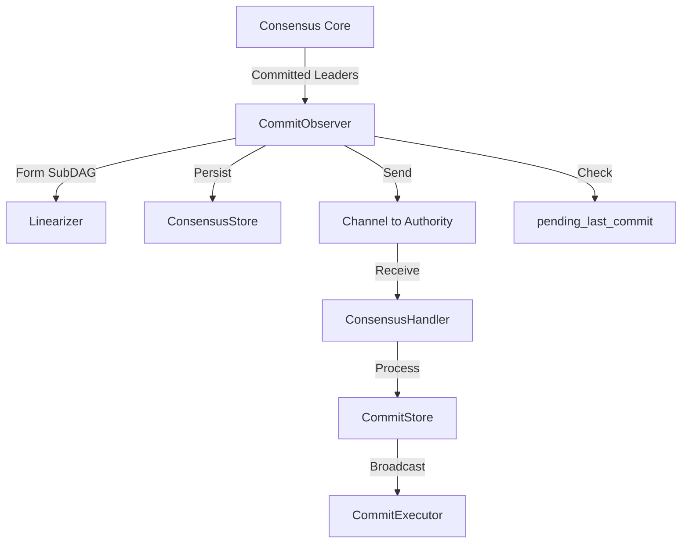

# Commit Observer

## Purpose and Scope
This document details the CommitObserver component in the Consensus module, which serves as a critical interface between the Consensus and Authority modules in the Soma blockchain. The CommitObserver is responsible for processing committed leader blocks, forming CommittedSubDag objects containing ordered transactions, and sending these to the Authority module for execution. This document explains its architecture, responsibilities, implementation details, and cross-module interaction patterns.

## Key Responsibilities

1. **Commit Processing**: Receives and processes committed leader blocks from the consensus engine
2. **SubDAG Formation**: Forms CommittedSubDag objects containing leader blocks and their causal history
3. **Transaction Ordering**: Ensures deterministic ordering of transactions across validators
4. **Cross-Module Communication**: Sends CommittedSubDag objects to the Authority module
5. **Recovery Management**: Ensures consistency after node restarts by resending missed commits
6. **End-of-Epoch Handling**: Special processing for blocks marking the end of an epoch

## Architecture



## Component Structure

The CommitObserver is implemented in `consensus/src/commit_observer.rs`:

```rust
pub(crate) struct CommitObserver {
    context: Arc<Context>,
    /// Component to deterministically collect subdags for committed leaders.
    commit_interpreter: Linearizer,
    /// An unbounded channel to send committed sub-dags to the consumer of consensus output.
    sender: UnboundedSender<CommittedSubDag>,
    /// Persistent storage for blocks, commits and other consensus data.
    store: Arc<dyn ConsensusStore>,
    leader_schedule: Arc<LeaderSchedule>,
    pending_last_commit: Option<CommittedSubDag>,
}
```

### Key Fields:
- **commit_interpreter (Linearizer)**: Determines causal ordering of transactions in a commit
- **sender (UnboundedSender)**: Channel to send CommittedSubDag objects to the Authority
- **store (ConsensusStore)**: Persistent storage for consensus data
- **pending_last_commit**: Holds the last commit of an epoch awaiting sufficient validator votes

## Implementation Details

### Initialization

The CommitObserver is initialized with a communication channel from the Authority module:

```rust
pub(crate) fn new(
    context: Arc<Context>,
    commit_consumer: CommitConsumer,
    dag_state: Arc<RwLock<DagState>>,
    store: Arc<dyn ConsensusStore>,
    leader_schedule: Arc<LeaderSchedule>,
) -> Self {
    let mut observer = Self {
        context,
        commit_interpreter: Linearizer::new(dag_state.clone(), leader_schedule.clone()),
        sender: commit_consumer.sender,
        store,
        leader_schedule,
        pending_last_commit: None,
    };

    observer.recover_and_send_commits(commit_consumer.last_processed_commit_index);
    observer
}
```

Key aspects:
1. The `commit_consumer.sender` field connects to a channel in the Authority module
2. The `recover_and_send_commits` call ensures any missed commits are resent on startup
3. The `CommitConsumer` provided by Authority tracks the last processed commit index

### Commit Processing

When leader blocks are committed, the `handle_commit` method processes them:

```rust
pub(crate) fn handle_commit(
    &mut self,
    committed_leaders: Vec<VerifiedBlock>,
) -> ConsensusResult<Vec<CommittedSubDag>> {
    let committed_sub_dags = self.commit_interpreter.handle_commit(committed_leaders);
    let mut sent_sub_dags = Vec::with_capacity(committed_sub_dags.len());
    for committed_sub_dag in committed_sub_dags.into_iter() {
        // If commit is the last commit of epoch, wait to send until ensuring it has enough votes
        if committed_sub_dag.is_last_commit_of_epoch() {
            self.pending_last_commit = Some(committed_sub_dag.clone());
            sent_sub_dags.push(committed_sub_dag);
            self.try_send_last_commit()?;
            continue;
        }

        // Failures in sender.send() are assumed to be permanent
        if let Err(err) = self.sender.send(committed_sub_dag.clone()) {
            tracing::error!(
                "Failed to send committed sub-dag, probably due to shutdown: {err:?}"
            );
            return Err(ConsensusError::Shutdown);
        }
        tracing::debug!(
            "Sending to execution commit {} leader {}",
            committed_sub_dag.commit_ref,
            committed_sub_dag.leader
        );
        sent_sub_dags.push(committed_sub_dag);
    }

    tracing::trace!("Committed & sent {sent_sub_dags:#?}");
    Ok(sent_sub_dags)
}
```

Key aspects:
1. The Linearizer (`commit_interpreter`) forms a CommittedSubDag for each leader
2. Special handling for the last commit of an epoch to ensure sufficient votes
3. CommittedSubDag objects are sent through the channel to the Authority module
4. Errors in sending are considered permanent (likely node shutdown)

### CommittedSubDag Structure

The CommittedSubDag contains a complete package of ordered transactions for execution:

```rust
pub struct CommittedSubDag {
    pub commit_ref: CommitRef,
    pub subdag: Vec<BlockRef>,
    pub transactions: BTreeMap<AuthorityName, Vec<ConsensusTransaction>>,
    pub timestamp_ms: u64,
    pub epoch: EpochId,
    pub end_of_epoch_block: Option<VerifiedBlock>,
}
```

Key components:
1. **commit_ref**: Unique identifier (index and digest) for the commit
2. **subdag**: References to all blocks in the subDAG
3. **transactions**: Ordered transactions from the subDAG by authority
4. **timestamp_ms**: Timestamp for the commit
5. **epoch**: Epoch ID this commit belongs to
6. **end_of_epoch_block**: Optional block marking epoch end

### Recovery Mechanism

To ensure consistency after node restarts, CommitObserver resends missed commits:

```rust
fn recover_and_send_commits(&mut self, last_processed_commit_index: CommitIndex) {
    let now = Instant::now();
    let last_commit = self
        .store
        .read_last_commit()
        .expect("Reading the last commit should not fail");

    if let Some(last_commit) = &last_commit {
        let last_commit_index = last_commit.index();

        assert!(last_commit_index >= last_processed_commit_index);
        if last_commit_index == last_processed_commit_index {
            debug!("Nothing to recover for commit observer as commit index {last_commit_index} = {last_processed_commit_index} last processed index");
            return;
        }
    };

    // We should not send the last processed commit again, so last_processed_commit_index+1
    let unsent_commits = self
        .store
        .scan_commits(((last_processed_commit_index + 1)..=CommitIndex::MAX).into())
        .expect("Scanning commits should not fail");

    info!("Recovering commit observer after index {last_processed_commit_index} with last commit {} and {} unsent commits", last_commit.map(|c|c.index()).unwrap_or_default(), unsent_commits.len());

    // Resend all the committed subdags to the consensus output channel
    // for all the commits above the last processed index.
    let mut last_sent_commit_index = last_processed_commit_index;
    let num_unsent_commits = unsent_commits.len();
    for (index, commit) in unsent_commits.into_iter().enumerate() {
        // Commit index must be continuous.
        assert_eq!(commit.index(), last_sent_commit_index + 1);

        info!("Sending commit {} during recovery", commit.index());
        let committed_sub_dag = load_committed_subdag_from_store(self.store.as_ref(), commit);
        self.sender.send(committed_sub_dag).unwrap_or_else(|e| {
            panic!(
                "Failed to send commit during recovery, probably due to shutdown: {:?}",
                e
            )
        });

        last_sent_commit_index += 1;
    }

    info!(
        "Commit observer recovery completed, took {:?}",
        now.elapsed()
    );
}
```

Key aspects:
1. Compares the last processed commit index with the last stored commit
2. Fetches and resends any commits that might have been missed
3. Ensures continuous commit indexes without gaps
4. Provides atomic recovery to maintain system consistency

### End-of-Epoch Handling

Special handling is provided for the last commit of an epoch:

```rust
pub(crate) fn try_send_last_commit(&mut self) -> ConsensusResult<Option<CommittedSubDag>> {
    // Check if we have a pending last commit of epoch
    let last_commit = match &self.pending_last_commit {
        Some(commit) => commit,
        None => return Ok(None),
    };

    // Read commit votes
    let votes = self.store.read_commit_votes(last_commit.commit_ref.index)?;

    // Check if we have enough votes
    let mut stake_aggregator = StakeAggregator::<QuorumThreshold>::new();
    for vote in &votes {
        stake_aggregator.add(vote.author, &self.context.committee);
    }

    if !stake_aggregator.reached_threshold(&self.context.committee) {
        return Ok(None);
    }

    info!(
        "Last commit of epoch {} has enough votes, sending to execution",
        last_commit.commit_ref.index
    );

    // We have enough votes, send the committed subdag
    if let Err(err) = self.sender.send(last_commit.clone()) {
        tracing::error!(
            "Failed to send last committed sub-dag, probably due to shutdown: {err:?}"
        );
        return Err(ConsensusError::Shutdown);
    }

    Ok(Some(last_commit.clone()))
}
```

Key aspects:
1. For end-of-epoch commits, ensures a quorum of validator votes before sending
2. Reads commit votes from the consensus store
3. Uses a stake-weighted aggregator to check quorum threshold
4. Only sends the commit when sufficient votes are available
5. Critical for reliable epoch transitions

## Cross-Module Integration

### ConsensusAuthority to CommitObserver

In the Consensus module, the CommitObserver is initialized by ConsensusAuthority:

```rust
// Simplified from ConsensusAuthority::start
let (commit_sender, commit_receiver) = unbounded_channel();
let commit_consumer = CommitConsumer::new(
    commit_sender,
    last_executed_round,
    last_executed_commit_index,
);

let commit_observer = CommitObserver::new(
    context.clone(),
    commit_consumer,
    dag_state.clone(),
    store.clone(),
    leader_schedule.clone(),
);
```

### CommitObserver to ConsensusHandler

The integration with the Authority module happens through the CommitConsumer:

```rust
pub struct CommitConsumer {
    // A channel to send the committed sub dags through
    pub sender: UnboundedSender<CommittedSubDag>,
    // Leader round of the last commit that the consumer has processed.
    pub last_processed_commit_round: Round,
    // Index of the last commit that the consumer has processed.
    pub last_processed_commit_index: CommitIndex,
}
```

This is passed to the MysticetiConsensusHandler in the Authority module:

```rust
// In authority/src/handler.rs
pub struct MysticetiConsensusHandler {
    handle: Option<tokio::task::JoinHandle<()>>,
}

impl MysticetiConsensusHandler {
    pub fn new(
        mut consensus_handler: ConsensusHandler,
        mut receiver: UnboundedReceiver<CommittedSubDag>,
        consensus_adapter: Arc<ConsensusAdapter>,
    ) -> Self {
        let handle = tokio::spawn(async move {
            while let Some(consensus_output) = receiver.recv().await {
                let commit_timestamp_ms = consensus_output.timestamp_ms;

                consensus_handler
                    .handle_consensus_output_internal(consensus_output.clone())
                    .await;

                // Additional processing...
            }
        });
        Self {
            handle: Some(handle),
        }
    }
}
```

### Data Flow Across Module Boundaries

The complete flow from consensus to authority:

1. **Consensus Core**: Determines which leader blocks are committed
2. **CommitObserver**: Forms CommittedSubDag objects for committed leaders
3. **Channel Communication**: Sends CommittedSubDag through UnboundedSender/Receiver
4. **MysticetiConsensusHandler**: Receives CommittedSubDag in Authority module
5. **ConsensusHandler**: Processes the commit and passes to CommitStore
6. **CommitStore**: Stores the commit and updates watermarks
7. **CommitExecutor**: Executes transactions from the commit
8. **TransactionManager**: Manages transaction execution and state updates

This observer pattern implementation enables:
- Loose coupling between modules
- Clear responsibility boundaries
- Consistent processing of commits from multiple sources
- Reliable recovery after crashes or restarts

## Thread Safety Considerations

The CommitObserver implements several thread safety mechanisms:

1. **Arc for Shared Data**: Uses Arc for shared data structures
2. **RwLock for DAG State**: Protects the DAG state with RwLock
3. **Channel-Based Communication**: Uses tokio channels for thread-safe message passing
4. **Immutable Data Sharing**: Passes immutable CommittedSubDag objects between threads
5. **Atomic Commit Processing**: Ensures atomic processing of commit batches

## Verification Status

| Component | Verification Status | Confidence | File Reference |
|-----------|---------------------|------------|----------------|
| CommitObserver Structure | Verified-Code | 9/10 | consensus/src/commit_observer.rs:36-43 |
| handle_commit Method | Verified-Code | 9/10 | consensus/src/commit_observer.rs:65-100 |
| recover_and_send_commits | Verified-Code | 9/10 | consensus/src/commit_observer.rs:170-220 |
| try_send_last_commit | Verified-Code | 8/10 | consensus/src/commit_observer.rs:105-140 |
| Cross-Module Integration | Verified-Code | 9/10 | authority/src/handler.rs:80-120 |

## Common Misconceptions

1. **Misconception**: CommitObserver directly executes transactions.
   **Clarification**: CommitObserver only forms and sends CommittedSubDag objects; execution happens in the Authority module.

2. **Misconception**: CommitObserver is part of the Authority module.
   **Clarification**: CommitObserver is in the Consensus module and acts as an interface to Authority.

3. **Misconception**: Commits from P2P sync follow a different path.
   **Clarification**: Both consensus-produced and P2P-synced commits use the same CommitStore and execution path.

4. **Misconception**: End-of-epoch commits are sent immediately.
   **Clarification**: End-of-epoch commits undergo additional verification for vote quorum before being sent.

## Cross-References
- See [Consensus Workflow](./consensus_workflow.md) for overall consensus flow
- See [Authority Commit Processing](../authority/commit_processing.md) for commit execution
- See [Cross-Module Relationships](../../knowledge/data_flow/cross_module_relationships.md) for broader integration context

## Confidence: 9/10

This document provides a detailed and accurate description of the CommitObserver component based on direct code analysis. The component structure, implementation details, and cross-module integration are thoroughly documented with specific code references.

## Last Updated: 2025-03-08 by Cline
