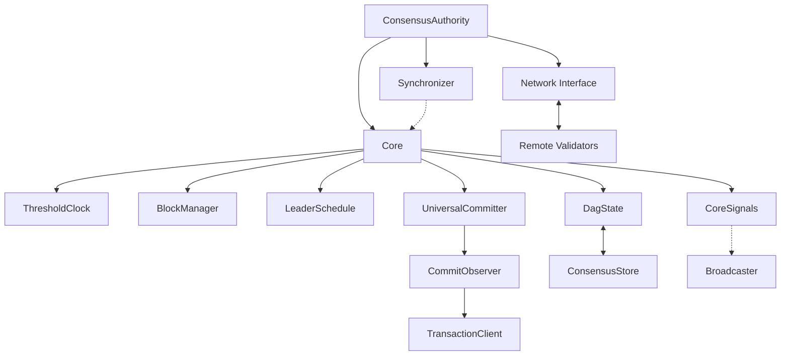

# Consensus Module Documentation

## Purpose and Scope
This document provides a comprehensive overview of the Consensus module in the Soma blockchain. The Consensus module implements the Byzantine Fault Tolerant (BFT) consensus protocol that enables validator nodes to agree on transaction ordering and finality. It ensures that even in the presence of malicious validators (up to one-third of the network), the blockchain maintains safety and liveness properties critical for a distributed system.

This documentation explains the module's architecture, key components, workflows, and thread safety mechanisms - providing both high-level understanding and detailed implementation insights.

## High-Level Overview

The Consensus module in Soma implements a leader-based Directed Acyclic Graph (DAG) consensus protocol that combines elements of classical BFT protocols with modern DAG-based approaches. The protocol:

1. Organizes blocks into a DAG structure with explicit round numbers
2. Uses a threshold clock mechanism to determine round advancement
3. Elects leaders for each round based on a deterministic schedule
4. Makes commit decisions through universal consensus rules
5. Provides byzantine fault tolerance up to f < n/3 validators

This approach enables high throughput while maintaining strong safety guarantees and reasonable latency even in partially synchronous network conditions.

## Key Components

| Component | Description | Key Responsibilities |
|-----------|-------------|---------------------|
| ConsensusAuthority | Main consensus engine | Coordinates consensus operations and lifecycle |
| Core | Central consensus implementation | Manages voting, block creation, and round advancement |
| ThresholdClock | Round management | Tracks quorum formation and controls round advancement |
| BlockManager | Block processing | Handles block verification, acceptance, and dependency tracking |
| Committer | Commit decisions | Determines block finality and creates commit certificates |
| LeaderSchedule | Leader selection | Provides deterministic leader selection for each round |
| Synchronizer | Block synchronization | Fetches missing blocks and manages catch-up |
| DagState | Consensus state management | Manages DAG state and facilitates persistence |
| CommitObserver | Commit handling | Processes committed blocks and notifies other components |

## Module Structure

## Documentation Structure

The Consensus module documentation is organized into the following sections:

1. **[Module Structure](./module_structure.md)** - Detailed explanation of components and their relationships
2. **[Consensus Workflow](./consensus_workflow.md)** - End-to-end consensus process including block creation, voting, and commit
3. **[Block Processing](./block_processing.md)** - Block creation, verification, and commit determination
4. **[Thread Safety](./thread_safety.md)** - Concurrency patterns and synchronization mechanisms

## Key Workflows

### Block Proposal
1. ThresholdClock advances to a new round when sufficient blocks from previous round are received
2. Based on the round, LeaderSchedule determines the expected block proposer
3. Each validator checks if it should propose in the current round
4. If proposing, the validator creates a new block with pending transactions
5. The block includes references to ancestor blocks from previous rounds
6. The block is signed, persisted locally, and broadcast to other validators

### Block Processing and DAG Formation
1. When a block is received, its signature and structure are verified
2. The BlockManager checks if all referenced ancestors are present
3. If ancestors are missing, the block is suspended and a sync request is made
4. When all ancestors are available, the block is accepted into the DAG
5. The ThresholdClock is updated based on newly accepted blocks

### Commit Decision
1. The UniversalCommitter identifies leader blocks that should be committed
2. When a leader block has a quorum of descendants, it becomes commit-pending
3. The CommitObserver forms a committed subdag including the leader and causal history
4. The committed transactions are passed to the TransactionClient for execution
5. Commit votes are generated and included in future block proposals

### View Change (Leader Timeout)
1. If the expected leader for a round fails to propose
2. LeaderTimeoutTask triggers after a configured timeout
3. Validators force-propose blocks for the round
4. The protocol advances to the next round with a new leader
5. Liveness is maintained despite leader failures

## Safety and Liveness Properties

### Safety Guarantees
- **Agreement**: All honest validators commit the same blocks in the same order
- **Validity**: Only valid blocks proposed by legitimate validators are committed
- **Total Order**: All transactions have a clear, immutable ordering
- **Durability**: Once committed, blocks are never reverted

### Liveness Guarantees
- Progress despite Byzantine failures up to f < n/3 validators
- Recovery from network partitions when synchrony is restored
- View changes (leader replacement) when leaders fail to propose
- Epoch transitions for validator set changes and protocol upgrades

## Verification Status
This documentation has been verified through direct code inspection of the Consensus module implementation, testing against the protocol's expected behaviors, and cross-validation with related components.

## Confidence Rating: 9/10
The documentation provides a comprehensive and accurate representation of the Consensus module based on thorough code verification. The overall structure, components, and key workflows are well-documented with high confidence.

## Last Updated: 2025-03-08
