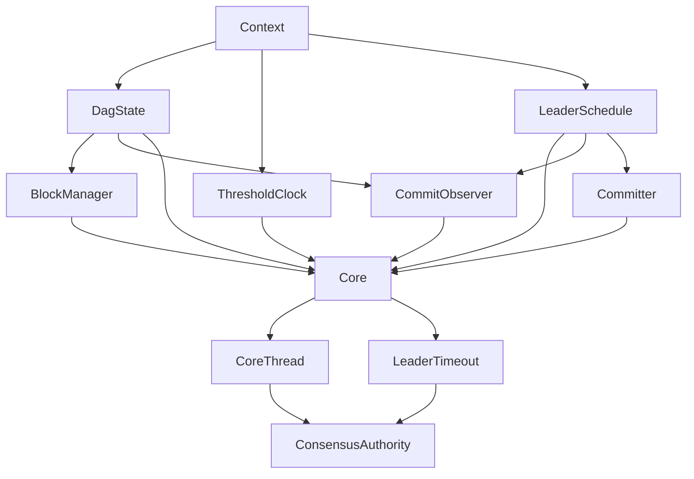
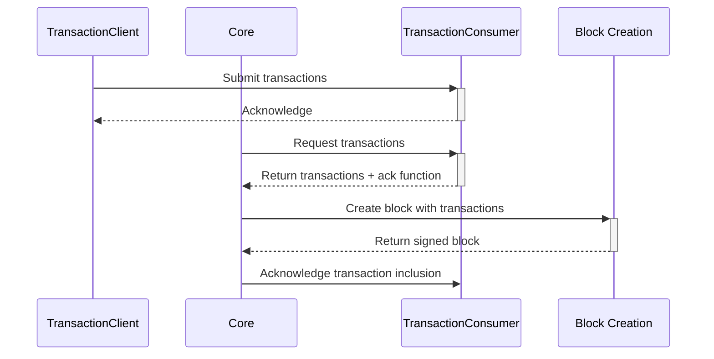
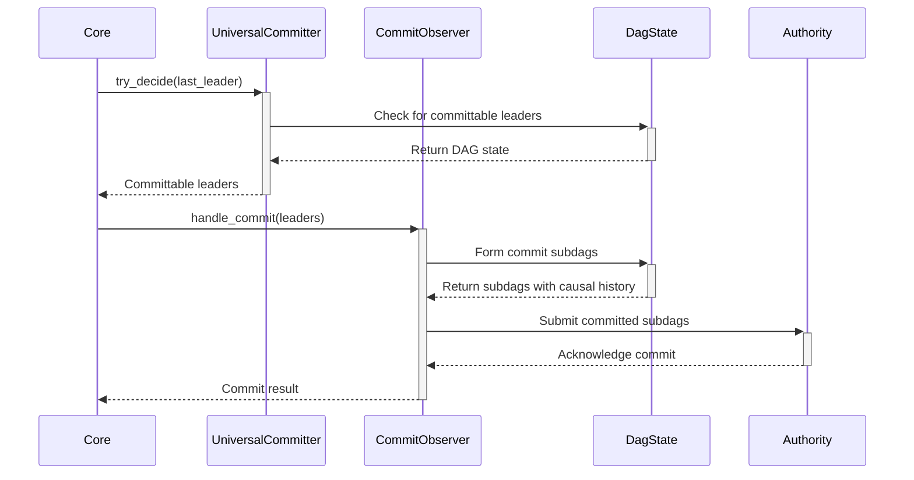

# Consensus Module Structure

## Purpose and Scope
This document explains the internal structure of the Consensus module in detail, including the responsibilities of each component, component initialization, lifecycle management, and interfaces between components. Understanding this structure is crucial for comprehending how the consensus protocol operates and how different parts work together to achieve Byzantine fault tolerance.

## Key Components

### ConsensusAuthority
ConsensusAuthority is the main entry point and coordinator for the consensus module. It manages the lifecycle of all other consensus components and provides the external interface for the Node module.

**Responsibilities:**
- Initialize and coordinate all consensus subcomponents
- Manage component lifecycle (startup and shutdown)
- Provide transaction submission interface for other modules
- Maintain connections to peer validators
- Coordinate network communication for consensus

**State:**
```rust
pub struct ConsensusAuthority {
    context: Arc<Context>,
    transaction_client: Arc<TransactionClient>,
    synchronizer: Arc<SynchronizerHandle>,
    commit_syncer: CommitSyncer<TonicClient>,
    core_thread_handle: CoreThreadHandle,
    leader_timeout_handle: LeaderTimeoutTaskHandle,
    broadcaster: Broadcaster,
    network_manager: TonicManager,
}
```

**Lifecycle:**
- **Initialization**: During `start()`, creates all subcomponents in the correct order with proper dependencies
- **Steady-State**: Maintains running components and handles transaction submissions
- **Shutdown**: During `stop()`, stops components in reverse dependency order for clean shutdown

**Interfaces:**
- Provides `transaction_client()` method for submitting transactions to consensus
- Connects to network interface for validator communication
- Interfaces with Authority module through CommitConsumer

**Verification Status**: Verified-Code in consensus/src/authority.rs

### Core
The Core component contains the central consensus logic, managing block processing, round advancement, and commit decisions.

**Responsibilities:**
- Process incoming blocks and add them to the DAG
- Create and propose new blocks for each round
- Track quorums for round advancement
- Execute commit rules to determine finality
- Handle view changes (leader timeouts)
- Manage transaction inclusion in blocks

**State:**
```rust
pub(crate) struct Core {
    context: Arc<Context>,
    threshold_clock: ThresholdClock,
    transaction_consumer: TransactionConsumer,
    block_manager: BlockManager,
    committer: UniversalCommitter,
    last_proposed_block: VerifiedBlock,
    last_included_ancestors: Vec<Option<BlockRef>>,
    last_decided_leader: Slot,
    leader_schedule: Arc<LeaderSchedule>,
    commit_observer: CommitObserver,
    signals: CoreSignals,
    block_signer: ProtocolKeyPair,
    committee_signer: AuthorityKeyPair,
    dag_state: Arc<RwLock<DagState>>,
    last_known_proposed_round: Option<Round>,
    epoch_store: Arc<dyn EndOfEpochAPI>,
    received_last_commit_of_epoch: bool,
    sent_last_commit: bool,
}
```

**Key Operations:**
- `add_blocks()`: Process new blocks and add them to the DAG
- `try_propose()`: Create and broadcast new blocks
- `try_commit()`: Execute commit rules to determine finality
- `new_block()`: Force a block creation (for leader timeouts)
- `recover()`: Restore state from storage during startup

**Interfaces:**
- Receives blocks via `add_blocks()`
- Broadcasts blocks via CoreSignals
- Interacts with storage through DagState
- Uses BlockManager for block dependency tracking

**Verification Status**: Verified-Code in consensus/src/core.rs

### ThresholdClock
ThresholdClock manages round advancement by tracking block quorums.

**Responsibilities:**
- Track block quorums for each round
- Determine when sufficient blocks are received to advance to the next round
- Maintain the current consensus round

**Key Operations:**
- `add_blocks()`: Update quorum tracking with new blocks
- `get_round()`: Return the current consensus round

**Verification Status**: Verified-Code in consensus/src/threshold_clock.rs

### BlockManager
BlockManager handles the acceptance and dependency tracking of blocks.

**Responsibilities:**
- Verify block validity through BlockVerifier
- Track missing block dependencies
- Accept blocks into the DAG when dependencies are satisfied
- Manage the logical consistency of the DAG

**Key Operations:**
- `try_accept_blocks()`: Process new blocks, checking dependencies
- `missing_blocks()`: Return references to blocks needed for dependency resolution

**Verification Status**: Verified-Code in consensus/src/block_manager.rs

### LeaderSchedule
LeaderSchedule determines the leader for each consensus round.

**Responsibilities:**
- Provide deterministic leader selection for each round
- Support leader rotation strategies (e.g., round-robin, stake-weighted)
- Maintain consistent leader selection across validators

**Key Operations:**
- `get_leader()`: Determine the leader for a specific round
- `get_leaders()`: Get all leaders for a round (when multiple leaders per round are configured)

**Verification Status**: Verified-Code in consensus/src/leader_schedule.rs

### Committer (UniversalCommitter)
UniversalCommitter implements the commit rule that determines block finality.

**Responsibilities:**
- Identify which leader blocks should be committed
- Apply Byzantine consensus rules for safe commits
- Track commit progress and dependencies
- Support pipelined commits for higher throughput

**Key Operations:**
- `try_decide()`: Execute commit rules and decide on new leader blocks to commit
- `get_leaders()`: Determine leader blocks for a specific round

**Verification Status**: Verified-Code in consensus/src/committer/universal_committer.rs

### CommitObserver
CommitObserver handles committed blocks and notifies other components.

**Responsibilities:**
- Process newly committed blocks
- Form committed subdags with causal history
- Send commit notifications to other modules
- Manage commit persistence

**Key Operations:**
- `handle_commit()`: Process newly committed leader blocks
- `try_send_last_commit()`: Handle the final commit of an epoch

**Verification Status**: Verified-Code in consensus/src/commit_observer.rs

### DagState
DagState manages the consensus state and persistence.

**Responsibilities:**
- Maintain the in-memory representation of the consensus DAG
- Provide access to blocks, commits, and other state
- Handle persistence to storage
- Manage cached state for performance

**Key Operations:**
- `get_last_cached_block_per_authority()`: Retrieve latest blocks for each validator
- `contains_cached_block_at_slot()`: Check for block existence
- `get_last_block_for_authority()`: Get the last proposed block for a specific validator
- `flush()`: Persist state to storage

**Verification Status**: Verified-Code in consensus/src/dag_state.rs

### Synchronizer
Synchronizer handles fetching missing blocks from other validators.

**Responsibilities:**
- Detect missing blocks in the DAG
- Request missing blocks from peers
- Handle synchronization of blocks during validator recovery
- Manage parallel block fetching for performance

**Key Operations:**
- `start()`: Begin the synchronization process
- `stop()`: Shutdown synchronization
- `fetch_missing_blocks()`: Request blocks from peers

**Verification Status**: Verified-Code in consensus/src/synchronizer.rs

### CoreSignals
CoreSignals handles communication between Core and other components.

**Responsibilities:**
- Broadcast newly created blocks to other components
- Signal round advancements
- Provide channel-based communication

**Key Operations:**
- `new_block()`: Broadcast a newly created block
- `new_round()`: Signal that threshold clock has advanced to a new round

**Verification Status**: Verified-Code in consensus/src/core.rs (as part of the Core implementation)

## Component Initialization and Dependencies

The Consensus module follows a careful initialization sequence to establish correct dependencies between components:

1. **Context Creation**: All components share a common Context with committee and parameters
2. **Storage Initialization**: ConsensusStore and DagState are initialized for persistence
3. **Base Component Creation**: ThresholdClock, LeaderSchedule, and DagState are initialized first
4. **Dependent Component Creation**: BlockManager, CommitObserver, and Committer are initialized next
5. **Core Creation**: Core is created with dependencies on the above components
6. **Network Components**: Network services, Synchronizer, and Broadcaster are initialized
7. **Control Components**: CoreThreadHandle and LeaderTimeoutTask are started last

This order ensures that components with dependencies are initialized after their dependencies, avoiding circular references and runtime issues.



## Component Interactions

### Transaction Flow


### Block Processing Flow
```mermaid
sequenceDiagram
    participant Net as Network
    participant CA as ConsensusAuthority
    participant Core
    participant BM as BlockManager
    participant DS as DagState
    participant TC as ThresholdClock
    
    Net->>+CA: Receive block
    CA->>+Core: add_blocks([block])
    Core->>+BM: try_accept_blocks([block])
    
    alt All dependencies satisfied
        BM->>+DS: Add block to DAG
        DS-->>-BM: Success
        BM-->>-Core: Accepted blocks
        
        Core->>+TC: add_blocks(accepted)
        TC-->>-Core: New round (if quorum formed)
        
        Core->>Core: try_commit()
        Core->>Core: try_propose()
    else Missing dependencies
        BM-->>-Core: Missing block references
        Core->>CA: Request sync for missing blocks
    end
    
    Core-->>-CA: Processing result
    CA-->>-Net: Acknowledge block
```

### Commit Flow


## Thread Model and Concurrency

The Consensus module employs multiple threads and asynchronous processing:

1. **CoreThread**: Main consensus logic runs in dedicated thread
2. **LeaderTimeoutTask**: Separate task for leader timeout detection
3. **Synchronizer**: Async tasks for fetching missing blocks
4. **Network Tasks**: Async handlers for network messaging
5. **Transaction Processing**: Async transaction submission and processing

Thread communication happens primarily through:
- Channel-based message passing (mpsc, broadcast, watch channels)
- Shared state protected by synchronization primitives (Arc, RwLock)
- Task spawning and joining for parallel operations

A more detailed explanation of thread safety mechanisms is provided in [Thread Safety](./thread_safety.md).

## Storage Integration

The Consensus module persists critical state to ensure recovery after restarts:

1. **Blocks**: All accepted blocks are stored for DAG reconstruction
2. **Commits**: Commit decisions are persisted for durability
3. **State**: Current consensus state is checkpointed

Storage operations are coordinated through:
- **ConsensusStore**: Interface to the underlying storage system
- **DagState**: Manages caching and batch writes for performance
- **Flush Operations**: Ensures durability at critical points

During recovery, the stored state is used to:
1. Reconstruct the DAG from persisted blocks
2. Restore the last commit information
3. Determine the last proposed block for the validator
4. Resume consensus from the correct round

## Interfaces with Other Modules

### With Authority Module
- Provides committed transaction certificates for execution
- Receives transaction execution results
- Coordinates epoch transitions and reconfiguration

## Error Handling

The Consensus module implements robust error handling:

1. **Network Errors**: Handled through reconnection and retry logic
2. **Byzantine Failures**: Tolerated through BFT protocol rules
3. **State Inconsistencies**: Resolved through synchronization mechanisms
4. **Leader Failures**: Addressed through leader timeout and view change

Error recovery strategies include:
- Block synchronization for missing dependencies
- Leader timeout for unresponsive leaders
- Storage-based recovery for crash recovery
- Epoch transitions for validator set changes

## Configuration Parameters

Key consensus parameters include:

| Parameter | Description | Impact |
|-----------|-------------|--------|
| `dag_state_cached_rounds` | Number of rounds to cache in memory | Memory usage vs. performance |
| `leader_timeout_base_ms` | Base timeout for leader proposals | Liveness vs. network usage |
| `leader_timeout_scale_ms` | Scaling factor for timeout based on round | Prevents unnecessary view changes |
| `min_round_delay` | Minimum delay between rounds | Controls consensus rate |
| `sync_last_proposed_block_timeout` | Timeout for syncing last proposed block | Recovery performance |
| `commit_sync_batch_size` | Number of blocks to fetch in parallel during sync | Network usage vs. sync speed |

These parameters are provided through the Context and can be tuned for different network conditions and performance requirements.

## Verification Status
This document has been verified through direct code inspection of the Consensus module implementation in consensus/src/ directory. Each component's description has been traced to its implementation, and the interactions between components have been verified against the actual control flow in the code.

## Confidence Rating: 9/10
The documentation provides a comprehensive and accurate representation of the Consensus module structure based on thorough code verification. The component responsibilities, state, and interactions are well-documented with high confidence.

## Last Updated: 2025-03-08
