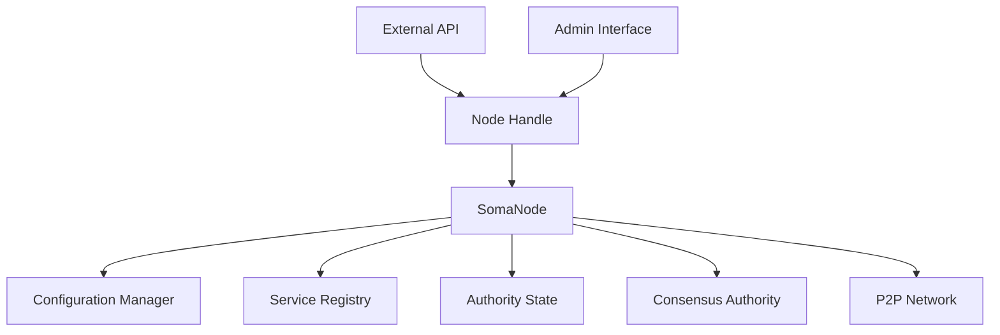

# Node Module

## Purpose and Scope
This document describes the Node module, which is responsible for lifecycle management and orchestration of all Soma blockchain components. It explains the node's core responsibilities, initialization process, and how it coordinates the various modules to form a complete validator or fullnode.

## Key Components

### SomaNode
- Main node implementation
- Manages component lifecycle
- Coordinates services and dependencies
- Handles startup and shutdown sequences

### NodeHandle
- External interface to node functionality
- Provides controlled access to node operations
- Manages request routing to internal components
- Implements administrative API

### ConfigManager
- Loads and validates node configuration
- Distributes configuration to components
- Handles runtime configuration changes
- Persists configuration updates

### ServiceRegistry
- Registers and manages node services
- Tracks service health and status
- Handles service discovery
- Coordinates service dependencies

## Module Architecture

## Primary Workflows

### Node Initialization
1. Load configuration from disk or environment
2. Initialize storage systems and databases
3. Create authority state with genesis or restore point
4. Initialize network and P2P components
5. Start consensus engine (validators only)
6. Register services with service registry
7. Open external interfaces and APIs

### Transaction Processing Pipeline
1. Receive transaction from external API or P2P
2. Route to appropriate handler (authority state)
3. Monitor transaction progress
4. Return results through appropriate channel
5. Update metrics and state

### Node Shutdown
1. Stop accepting new requests
2. Complete processing of in-flight transactions
3. Flush state to persistent storage
4. Shutdown components in dependency order
5. Release resources and exit cleanly

### Checkpoint Management
1. Periodic checkpointing of system state
2. Coordination of checkpoint creation
3. Verification of checkpoint integrity
4. Storage of checkpoint metadata
5. Support for recovery from checkpoints

## Node Types

### Validator Node
- Participates in consensus
- Validates transactions and produces certificates
- Maintains full state
- Participates in committee and voting
- Produces blocks according to schedule

### Fullnode
- Does not participate in consensus
- Verifies but doesn't sign transactions
- Maintains full state for query serving
- Provides API services to clients
- Syncs state from validators

## Key Interfaces

### With Authority Module
- Initializes and manages authority state
- Routes transactions to authority handlers
- Monitors authority state health
- Coordinates epoch transitions

### With Consensus Module
- Creates and manages consensus engine (validators)
- Configures consensus parameters
- Monitors consensus health and progress
- Handles consensus-triggered reconfiguration

### With P2P Module
- Initializes network components
- Configures network parameters
- Manages peer discovery and connections
- Coordinates state synchronization

## Configuration Parameters

### Network Configuration
- Binding addresses and ports
- TLS certificate paths
- Peer discovery settings
- Connection limits and timeouts

### Storage Configuration
- Database paths and parameters
- Checkpoint directory
- Archive settings
- Pruning configuration

### Consensus Configuration
- Committee parameters
- Block parameters
- Timeout settings
- Leader selection algorithm

### System Limits
- Maximum transaction throughput
- Memory usage limits
- Thread pool sizes
- Connection limits

## Confidence: 5/10
This document provides a high-level overview of the Node module's structure and responsibilities but requires more detailed explanations of certain components and workflows, especially regarding state synchronization and recovery.

## Last Updated: 2025-03-08 by Cline
