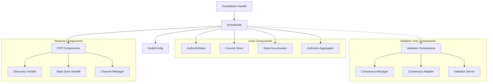

# Node Module

## Purpose and Scope

This document provides a comprehensive overview of the Node Module in the Soma blockchain. The Node Module is the central component responsible for initializing, coordinating, and managing the lifecycle of all other blockchain components. It serves as the main entry point for the system, orchestrating interactions between Authority, Consensus, and P2P modules to form a complete validator or fullnode.

This documentation explains the node's architecture, initialization process, key workflows, and how it facilitates epoch transitions and reconfiguration.

## Key Components

### SomaNode

The core implementation that:
- Initializes and manages all blockchain components
- Coordinates transaction processing across modules
- Handles state synchronization and persistence
- Manages epoch transitions and reconfiguration
- Orchestrates startup and shutdown sequences

```rust
pub struct SomaNode {
    config: NodeConfig,
    validator_components: Mutex<Option<ValidatorComponents>>,
    end_of_epoch_channel: broadcast::Sender<SystemState>,
    state: Arc<AuthorityState>,
    transaction_orchestrator: Option<Arc<TransactiondOrchestrator<NetworkAuthorityClient>>>,
    state_sync_handle: StateSyncHandle,
    commit_store: Arc<CommitStore>,
    accumulator: Mutex<Option<Arc<StateAccumulator>>>,
    consensus_store: Arc<dyn ConsensusStore>,
    auth_agg: Arc<ArcSwap<AuthorityAggregator<NetworkAuthorityClient>>>,
    // Additional fields...
}
```

### ValidatorComponents

A container for validator-specific components that:
- Manages components needed only for validator nodes
- Facilitates clean starts and stops during reconfiguration
- Contains consensus-related components and services

```rust
pub struct ValidatorComponents {
    validator_server_handle: JoinHandle<Result<()>>,
    consensus_manager: ConsensusManager,
    consensus_adapter: Arc<ConsensusAdapter>,
}
```

### P2pComponents

A container for network-related components that:
- Manages peer discovery and connection handling
- Facilitates state synchronization across the network
- Coordinates channel management for communication

```rust
pub struct P2pComponents {
    channel_manager_tx: Sender<ChannelManagerRequest>,
    discovery_handle: DiscoveryHandle,
    state_sync_handle: StateSyncHandle,
}
```

### SomaNodeHandle

An external interface to node functionality that:
- Provides controlled access to node operations
- Manages cross-context calls (especially in simulation environments)
- Implements context-aware execution wrappers

```rust
pub struct SomaNodeHandle {
    node: Option<Arc<SomaNode>>,
    shutdown_on_drop: bool,
}
```

## Component Relationships



## Node Types

The Node Module supports two primary node types with different components and responsibilities:

### Validator Node
- Participates in consensus protocol
- Validates and signs transactions
- Creates and processes certificates
- Manages validator-specific components
- Participates in committee operations
- Handles epoch transitions and reconfiguration

### Fullnode
- Does not participate in consensus
- Verifies but doesn't sign transactions
- Maintains state for query serving
- Provides API access to clients
- Synchronizes state from validators

## Documentation Structure

The Node Module documentation is split into the following sections:

1. **[Module Structure](./module_structure.md)** - Detailed architecture and component design
   - Component hierarchy and responsibilities
   - Configuration and initialization
   - Component interactions and interfaces
   - Node handle and external API

2. **[Lifecycle Management](./lifecycle_management.md)** - Node startup, operation, and shutdown
   - Initialization sequence
   - Component startup ordering
   - Graceful shutdown process
   - Resource management

3. **[Service Orchestration](./service_orchestration.md)** - Integration of core services
   - Authority state integration
   - Consensus service management
   - P2P networking coordination
   - Transaction orchestration

4. **[Reconfiguration](./reconfiguration.md)** - Epoch transitions and reconfiguration
   - Reconfiguration triggers and workflow
   - Epoch transition process
   - Component reconfiguration
   - State migration between epochs

5. **[Thread Safety](./thread_safety.md)** - Concurrency considerations
   - Locking mechanisms and hierarchy
   - Async task management
   - Thread safety patterns
   - Resource contention handling

## Verification Status

This documentation has been verified through multiple approaches:

1. **Direct Code Inspection**: Analysis of the node implementation in `node/src/lib.rs` and `node/src/handle.rs`
2. **Interface Analysis**: Examination of interfaces between node and other modules
3. **Thread Safety Analysis**: Review of locking patterns and concurrency mechanisms
4. **Workflow Tracing**: Following execution paths for key operations

Most claims in this document are verified through direct code inspection (Verified-Code), with some inferences about design patterns and intentions (Inferred).

## Confidence: 8/10

This document provides a comprehensive overview of the Node Module with high confidence in the component architecture and responsibilities. Some aspects of the internal implementation details and error handling patterns might benefit from further verification.

## Last Updated: 2025-03-08 by Cline
