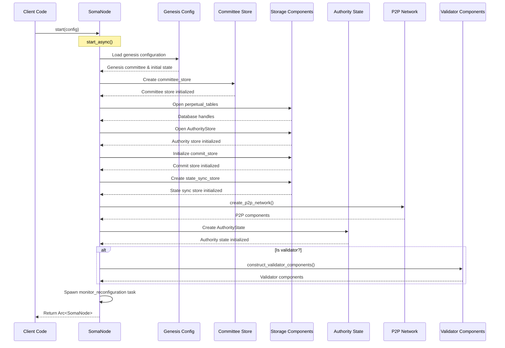
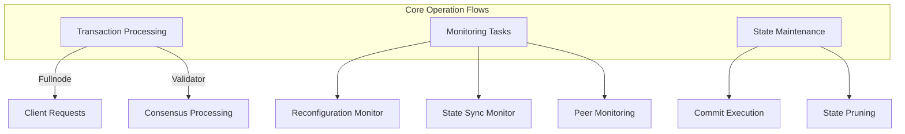
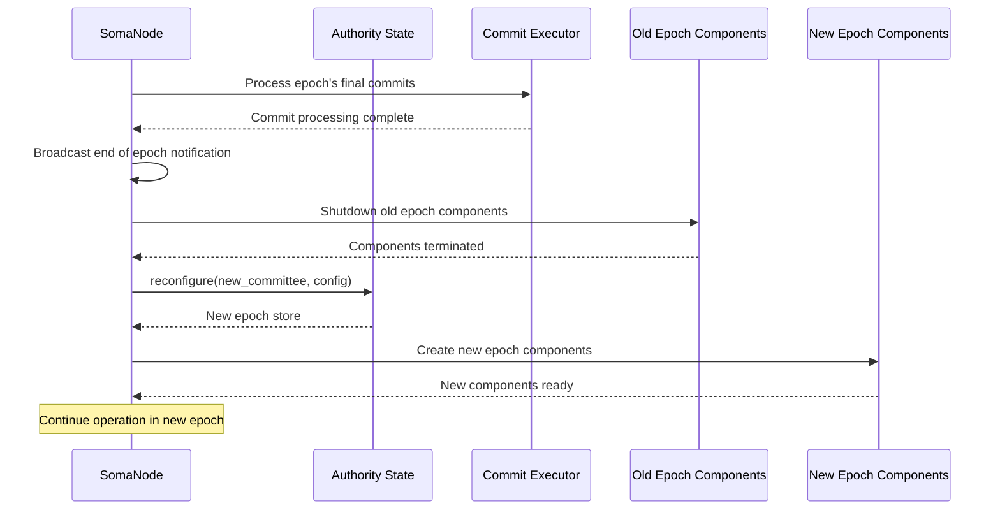

# Node Lifecycle Management

## Purpose and Scope

This document provides a detailed explanation of the Node module's lifecycle management, including initialization, operational workflows, and shutdown processes. It covers how the SomaNode bootstraps components, manages their operation during the node's lifetime, and ensures clean shutdown.

## Initialization Flow

The node initialization process is a critical sequence that establishes all components and their dependencies in the correct order.

### Initialization Sequence Diagram



### Key Steps in Initialization

#### 1. Configuration Loading

```rust
pub async fn start(config: NodeConfig) -> Result<Arc<SomaNode>> {
    Self::start_async(config).await
}
```

The initialization begins with the `start` method, which takes a `NodeConfig` containing all necessary parameters for node setup.

#### 2. Genesis and Committee Initialization

```rust
let genesis = config.genesis().clone();
let genesis_committee = genesis.committee()?;
let committee_store = Arc::new(CommitteeStore::new(
    config.db_path().join("epochs"),
    &genesis_committee,
));
```

The node loads the genesis configuration and initializes the committee store, which tracks validator sets across epochs.

#### 3. Storage Initialization

```rust
let perpetual_tables = Arc::new(AuthorityPerpetualTables::open(
    &config.db_path().join("store"),
));
let store = AuthorityStore::open(perpetual_tables, &genesis, &config).await?;

// Initialize additional storage components
let commit_store = CommitStore::new();
let consensus_store = Arc::new(MemStore::new());
let state_sync_store = StateSyncStore::new(
    cache_traits.clone(),
    committee_store.clone(),
    commit_store.clone(),
    consensus_store.clone(),
);
```

Multiple storage components are initialized, including perpetual tables, authority store, commit store, and consensus store.

#### 4. P2P Network Setup

```rust
let P2pComponents {
    channel_manager_tx,
    discovery_handle,
    state_sync_handle,
} = Self::create_p2p_network(
    &config,
    state_sync_store.clone(),
);
```

The P2P network components are created, including discovery, state sync, and channel management services.

#### 5. Authority State Initialization

```rust
let authority_name = config.protocol_public_key();
let state = AuthorityState::new(
    authority_name,
    secret,
    epoch_store.clone(),
    committee_store.clone(),
    config.clone(),
    cache_traits.clone(),
    accumulator.clone(),
).await;
```

The authority state is created with the necessary dependencies, including secrets, committee information, and storage access.

#### 6. Validator Components (Conditional)

```rust
let validator_components = if state.is_validator(&epoch_store) {
    let components = Self::construct_validator_components(
        config.clone(),
        state.clone(),
        committee,
        epoch_store.clone(),
        state_sync_handle.clone(),
        Arc::downgrade(&accumulator),
        consensus_store.clone(),
    ).await?;
    Some(components)
} else {
    None
};
```

For validator nodes, additional components are created including consensus adapter and manager.

#### 7. Reconfiguration Monitor Startup

```rust
let node = Arc::new(node);
let node_copy = node.clone();

tokio::spawn(async move {
    let result = Self::monitor_reconfiguration(node_copy).await;
    if let Err(error) = result {
        warn!("Reconfiguration finished with error {:?}", error);
    }
});
```

A background task is spawned to monitor and handle epoch transitions and reconfiguration.

## Operational Phases

The node operates through several distinct phases during its lifetime:

### Startup Phase

1. **Component Initialization**: As detailed in the initialization sequence
2. **State Recovery**: Loading previous state from storage if not starting from genesis
3. **Network Connection**: Establishing connections to peers
4. **Service Registration**: Making services available for external requests

### Steady-State Operation

During normal operation, the node processes transactions and participates in consensus:



#### Key Operational Activities

1. **Transaction Processing**
   - Receiving transactions from clients or network
   - Validating and executing transactions
   - Committing effects to storage

2. **Consensus Participation** (Validators only)
   - Processing consensus messages
   - Participating in block creation and voting
   - Executing consensus-ordered transactions

3. **State Synchronization**
   - Synchronizing state with other nodes
   - Handling missing object requests
   - Propagating committed state

4. **Monitoring for Reconfiguration**
   - Watching for epoch changes
   - Preparing for validator set transitions
   - Handling reconfiguration tasks

### Reconfiguration Phase

During epoch transitions, the node undergoes reconfiguration:



### Shutdown Phase

When the node is shutting down, it goes through a sequence to ensure clean termination:

1. **Service Termination**
   - Stop accepting new requests
   - Complete in-flight operations where possible

2. **Component Shutdown**
   - Shutdown validator components if present
   - Close network connections
   - Terminate background tasks

3. **State Persistence**
   - Ensure all state is persisted to storage
   - Close database connections

4. **Resource Release**
   - Release memory and other resources
   - Log shutdown completion

```rust
async fn shutdown(&self) {
    if let Some(validator_components) = &*self.validator_components.lock().await {
        validator_components.consensus_manager.shutdown().await;
    }
    // Additional shutdown steps...
}
```

## Component Lifecycle Management

The node manages different component types with varying lifecycles:

### Perpetual Components

Components that exist for the entire node lifetime:
- **SomaNode**: The main container
- **AuthorityState**: Core state management
- **CommitStore**: Transaction commitment tracking
- **P2P Network**: Network communication

### Epoch-Bound Components

Components that are recreated on epoch transitions:
- **ValidatorComponents**: Validator-specific functionality
- **AuthorityPerEpochStore**: Epoch-specific state
- **ConsensusAdapter**: Consensus interface

### Task-Based Components

Components with task-specific lifecycles:
- **CommitExecutor**: Processes committed transactions
- **Reconfiguration Monitor**: Handles epoch transitions
- **Transaction Tasks**: Process individual transactions

## Resource Management

### Memory Management

The node employs several patterns for efficient memory management:

1. **Arc-Based Sharing**: Components are shared using Arc to avoid copying
   ```rust
   state: Arc<AuthorityState>,
   commit_store: Arc<CommitStore>,
   consensus_store: Arc<dyn ConsensusStore>,
   ```

2. **Bounded Channels**: Communication channels have capacity limits
   ```rust
   let (end_of_epoch_channel, end_of_epoch_receiver) =
       broadcast::channel(config.end_of_epoch_broadcast_channel_capacity);
   ```

3. **Component Replacement**: Old components are replaced rather than modified
   ```rust
   self.auth_agg.store(Arc::new(
       self.auth_agg
           .load()
           .recreate_with_new_epoch_start_state(&new_epoch_start_state),
   ));
   ```

### Task Management

Asynchronous tasks are managed through several mechanisms:

1. **Spawned Tasks**: Long-running operations run as tokio tasks
   ```rust
   tokio::spawn(async move {
       let result = Self::monitor_reconfiguration(node_copy).await;
       // Error handling...
   });
   ```

2. **JoinHandles**: Handles are stored for management
   ```rust
   validator_server_handle: JoinHandle<Result<()>>,
   ```

3. **Graceful Cancellation**: Tasks support clean cancellation
   ```rust
   async fn shutdown(&self) {
       if let Some(validator_components) = &*self.validator_components.lock().await {
           validator_components.consensus_manager.shutdown().await;
       }
   }
   ```

### Database Connection Management

Storage connections are managed carefully:

1. **Initialization**: Databases are opened during node startup
   ```rust
   let perpetual_tables = Arc::new(AuthorityPerpetualTables::open(
       &config.db_path().join("store"),
   ));
   ```

2. **Handle Release**: Handles are explicitly released when no longer needed
   ```rust
   cur_epoch_store.release_db_handles();
   ```

3. **Connection Pooling**: Connection handles are reused where appropriate

## Error Handling During Lifecycle Events

The node implements error handling strategies for different lifecycle phases:

### Initialization Errors

Errors during initialization are propagated to the caller:

```rust
pub async fn start_async(config: NodeConfig) -> Result<Arc<SomaNode>> {
    // Initialization code...
    
    // Error is propagated using ? operator
    let genesis_committee = genesis.committee()?;
    
    // Error handling with custom messages
    let committee = committee_store
        .get_committee(&cur_epoch)
        .map_err(|e| anyhow!("Failed to get committee: {}", e))?
        .ok_or_else(|| anyhow!("Committee not found for epoch {}", cur_epoch))?;
    
    // Result is returned to caller
    Ok(node)
}
```

### Operational Errors

During operation, errors are logged and often trigger recovery actions:

```rust
// Background task with error handling
tokio::spawn(async move {
    let result = Self::monitor_reconfiguration(node_copy).await;
    if let Err(error) = result {
        warn!("Reconfiguration finished with error {:?}", error);
    }
});
```

### Reconfiguration Errors

Errors during reconfiguration are particularly critical:

```rust
// Reconfiguration with careful error handling
let new_epoch_store = self
    .state
    .reconfigure(
        cur_epoch_store,
        next_epoch_committee,
        epoch_start_configuration,
        last_commit.commit_ref.index,
    )
    .await
    .expect("Reconfigure authority state cannot fail");
```

The comment indicates that reconfiguration is designed not to fail, but in practice, errors would be handled to prevent system instability.

## Verification Status

Each section of this document has been verified through direct code inspection of the Soma node implementation:

- Initialization flow: **Verified-Code** (Confidence: 9/10)
- Operational phases: **Verified-Code** (Confidence: 8/10)
- Component lifecycle: **Verified-Code** (Confidence: 8/10)
- Resource management: **Verified-Code** (Confidence: 7/10)
- Error handling: **Verified-Code** (Confidence: 7/10)

## Confidence: 8/10

This document provides a detailed and accurate description of the Node module's lifecycle management based on direct code inspection. The initialization process and major operational phases are well-documented with high confidence. Some aspects of error handling during edge cases might benefit from further verification.

## Last Updated: 2025-03-08 by Cline
