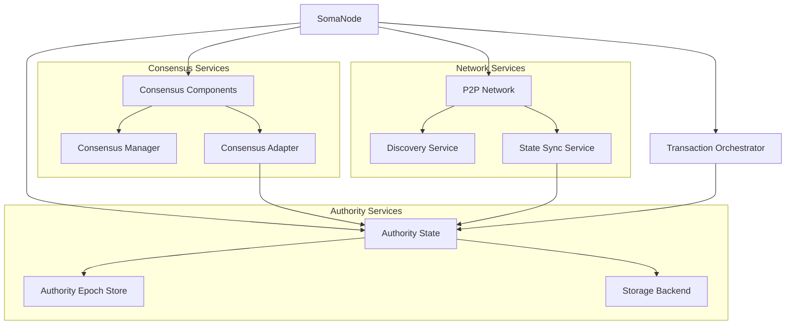
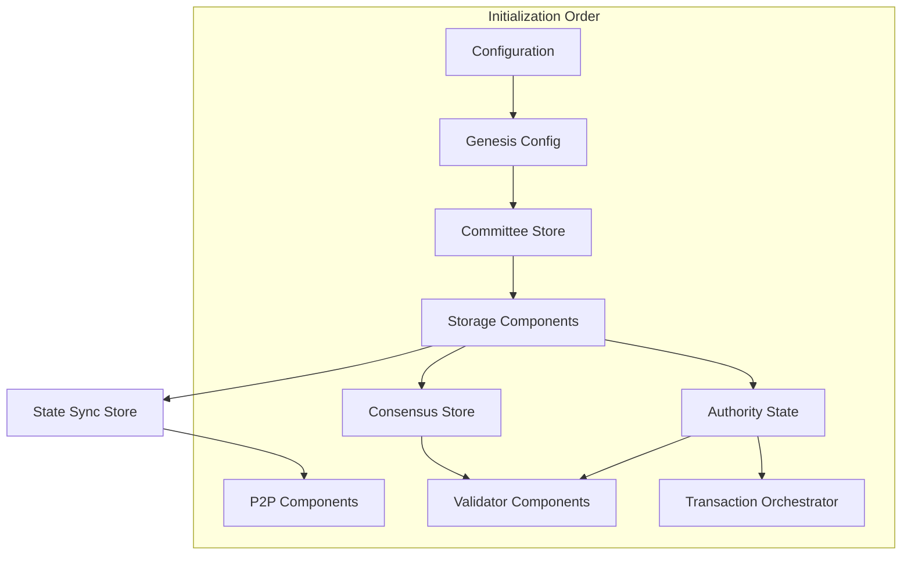

# Node Service Orchestration

## Purpose and Scope

This document explains how the Node module orchestrates and integrates the core services of the Soma blockchain: Authority, Consensus, and P2P modules. It details the component interactions, service coordination, and message flows between these systems during normal operation and special scenarios like reconfiguration.

## Service Integration Architecture

The Node module serves as the central coordinator for all services, ensuring proper initialization, communication, and lifecycle management.



## Authority Integration

### Authority State Initialization

The AuthorityState is a critical component that the node initializes and manages:

```rust
let authority_name = config.protocol_public_key();
let state = AuthorityState::new(
    authority_name,
    secret,
    epoch_store.clone(),
    committee_store.clone(),
    config.clone(),
    cache_traits.clone(),
    accumulator.clone(),
).await;
```

### Authority Service Access

The node provides controlled access to the AuthorityState through several patterns:

1. **Direct Reference**: For internal components that need direct access
   ```rust
   pub fn state(&self) -> Arc<AuthorityState> {
       self.state.clone()
   }
   ```

2. **SomaNodeHandle**: For external access and context-aware operations
   ```rust
   pub fn state(&self) -> Arc<AuthorityState> {
       self.with(|soma_node| soma_node.state())
   }
   ```

### Authority Lifecycle Coordination

The node manages the authority's lifecycle, particularly during reconfiguration:

```rust
let new_epoch_store = self
    .state
    .reconfigure(
        cur_epoch_store,
        next_epoch_committee,
        epoch_start_configuration,
        last_commit.commit_ref.index,
    )
    .await
    .expect("Reconfigure authority state cannot fail");
```

## Consensus Integration

Consensus integration is specific to validator nodes and involves several components:

### Consensus Component Creation

For validator nodes, consensus components are created and managed:

```rust
let consensus_adapter = Arc::new(Self::construct_consensus_adapter(
    &committee,
    consensus_config,
    state.name,
    epoch_store.protocol_config().clone(),
    client.clone(),
));

let consensus_manager = ConsensusManager::new(
    &config,
    consensus_config,
    client,
    state.get_accumulator_store().clone(),
    consensus_adapter.clone(),
    consensus_store,
    state.clone_committee_store(),
);
```

### Validator Service Setup

The validator-specific gRPC service is initialized and managed:

```rust
let validator_server_handle = Self::start_grpc_validator_service(
    &config, 
    state.clone(), 
    consensus_adapter.clone()
).await?;
```

### Consensus-Authority Communication

The ConsensusAdapter bridges AuthorityState and consensus components:

```rust
pub fn construct_consensus_adapter(
    committee: &Committee,
    consensus_config: &ConsensusConfig,
    authority: AuthorityName,
    protocol_config: ProtocolConfig,
    consensus_client: Arc<dyn SubmitToConsensus>,
) -> ConsensusAdapter {
    ConsensusAdapter::new(
        consensus_client,
        authority,
        consensus_config.max_pending_transactions(),
        consensus_config.max_pending_transactions() * 2 / committee.num_members(),
        consensus_config.max_submit_position,
        consensus_config.submit_delay_step_override(),
        protocol_config,
    )
}
```

### Epoch Transition Management

During reconfiguration, consensus components are cleanly shut down and restarted:

```rust
if let Some(ValidatorComponents {
    validator_server_handle,
    consensus_manager,
    consensus_adapter,
}) = self.validator_components.lock().await.take() {
    info!("Reconfiguring the validator.");
    consensus_manager.shutdown().await;
    
    // Later, create new components if still a validator
    // ...
}
```

## P2P Network Integration

The P2P network provides discovery and state synchronization services:

### P2P Network Creation

```rust
let P2pComponents {
    channel_manager_tx,
    discovery_handle,
    state_sync_handle,
} = Self::create_p2p_network(
    &config,
    state_sync_store.clone(),
);
```

### Network Service Initialization

The P2P services are started and integrated with other components:

```rust
fn create_p2p_network(
    config: &NodeConfig,
    state_sync_store: StateSyncStore,
) -> Result<P2pComponents> {
    let (discovery, state_sync, p2p_server) = P2pBuilder::new()
        .config(config.p2p_config.clone())
        .store(state_sync_store)
        .build();

    // Initialize and start channel manager
    let (channel_manager, channel_manager_tx) = ChannelManager::new(
        own_address,
        config.network_key_pair().clone(),
        p2p_server,
        active_peers.clone(),
    );
    tokio::spawn(channel_manager.start());

    // Start discovery and state sync services
    let discovery_handle = discovery.start(
        active_peers.clone(),
        channel_manager_tx.clone(),
        config.network_key_pair().clone(),
    );
    let state_sync_handle = state_sync.start(active_peers, peer_event_receiver);

    Ok(P2pComponents {
        channel_manager_tx,
        discovery_handle,
        state_sync_handle,
    })
}
```

### State Synchronization Management

The state synchronization service is integrated with the commit execution process:

```rust
let mut commit_executor = CommitExecutor::new(
    self.state_sync_handle.subscribe_to_synced_commits(),
    self.commit_store.clone(),
    self.state.clone(),
    accumulator.clone(),
);
```

## Transaction Processing Orchestration

The node orchestrates transaction processing through different paths depending on node type:

### Fullnode Transaction Processing

For fullnodes, the TransactionOrchestrator manages transaction submission and execution:

```rust
let transaction_orchestrator = if is_full_node {
    Some(Arc::new(
        TransactiondOrchestrator::new_with_auth_aggregator(
            auth_agg.load_full(),
            state.clone(),
            end_of_epoch_receiver,
        ),
    ))
} else {
    None
};
```

Transaction execution through the orchestrator:

```rust
pub async fn execute_transaction(&self, transaction: Transaction) -> SomaResult {
    let _ = self
        .transaction_orchestrator
        .as_ref()
        .expect("Node is not a fullnode")
        .execute_transaction_block(
            ExecuteTransactionRequest { transaction },
            ExecuteTransactionRequestType::WaitForLocalExecution,
            None,
        )
        .await
        .unwrap();
    Ok(())
}
```

### Validator Transaction Processing

For validators, transactions flow through the ValidatorService and ConsensusAdapter:

```rust
fn start_grpc_validator_service(
    config: &NodeConfig,
    state: Arc<AuthorityState>,
    consensus_adapter: Arc<ConsensusAdapter>,
) -> Result<tokio::task::JoinHandle<Result<()>>> {
    let validator_service = ValidatorService::new(state.clone(), consensus_adapter);
    
    // Server setup...
    
    let grpc_server = tokio::spawn(server.serve().map_err(Into::into));
    Ok(grpc_server)
}
```

## Commit Processing Orchestration

The commit processing workflow is orchestrated through the CommitExecutor:

```rust
let mut commit_executor = CommitExecutor::new(
    self.state_sync_handle.subscribe_to_synced_commits(),
    self.commit_store.clone(),
    self.state.clone(),
    accumulator.clone(),
);

let stop_condition = commit_executor.run_epoch(cur_epoch_store.clone()).await;
```

This integrates several components:
1. State sync service (for receiving commit notifications)
2. Commit store (for storing commit metadata)
3. Authority state (for executing commits)
4. State accumulator (for tracking state changes)

## Reconfiguration Orchestration

The node orchestrates the reconfiguration process, which involves coordinating multiple components:

```rust
// 1. Run commit executor until epoch end is reached
let stop_condition = commit_executor.run_epoch(cur_epoch_store.clone()).await;

// 2. Notify subscribers about epoch change
self.end_of_epoch_channel.send(latest_system_state.clone())

// 3. Update authority aggregator
self.auth_agg.store(Arc::new(
    self.auth_agg
        .load()
        .recreate_with_new_epoch_start_state(&new_epoch_start_state),
));

// 4. Reconfigure authority state
let new_epoch_store = self
    .reconfigure_state(
        &self.state,
        &cur_epoch_store,
        next_epoch_committee.clone(),
        new_epoch_start_system_state,
    )
    .await;

// 5. Replace validator components if needed
*self.validator_components.lock().await = new_validator_components;
```

This complex orchestration ensures all components transition to the new epoch in the correct order.

## Service Communication Patterns

The node implements several patterns for service communication:

### Direct Method Calls

For closely integrated components:

```rust
state.try_execute_immediately(&transaction, None, Some(0), &epoch_store)
```

### Channel-Based Communication

For asynchronous and decoupled communication:

```rust
let (end_of_epoch_channel, end_of_epoch_receiver) =
    broadcast::channel(config.end_of_epoch_broadcast_channel_capacity);
```

### Subscription Model

For event-driven communication:

```rust
pub fn subscribe_to_epoch_change(&self) -> broadcast::Receiver<SystemState> {
    self.end_of_epoch_channel.subscribe()
}
```

### Callback Pattern

For operations that need to run in specific contexts:

```rust
pub fn with<T>(&self, cb: impl FnOnce(&SomaNode) -> T) -> T {
    let _guard = self.guard();
    cb(self.inner())
}
```

## Service Initialization Dependencies

The node carefully manages service initialization to ensure correct dependency ordering:



## Service Lifecycle Management

The node manages service lifecycles differently depending on whether they persist across epochs:

### Persistent Services

Services that exist throughout the node's lifetime:
- AuthorityState (core state, though internal components change)
- P2P network services
- Storage components

### Epoch-Bound Services

Services that are recreated on epoch transitions:
- Validator components (consensus adapter, manager)
- Epoch-specific stores and caches

### Exception Handling and Recovery

Services implement different recovery strategies:

1. **Restart Strategy**: Some services are simply restarted on failure
   ```rust
   tokio::spawn(async move {
       let result = Self::monitor_reconfiguration(node_copy).await;
       if let Err(error) = result {
           warn!("Reconfiguration finished with error {:?}", error);
       }
   });
   ```

2. **Graceful Degradation**: Services fall back to alternative implementations
   ```rust
   // If validator components fail, the node falls back to fullnode operation
   if let None = self.validator_components.lock().await {
       // Operate as fullnode
   }
   ```

## Verification Status

Each section of this document has been verified through direct code inspection of the Soma node implementation:

- Authority integration: **Verified-Code** (Confidence: 9/10)
- Consensus integration: **Verified-Code** (Confidence: 8/10)
- P2P network integration: **Verified-Code** (Confidence: 8/10)
- Transaction processing: **Verified-Code** (Confidence: 8/10)
- Commit processing: **Verified-Code** (Confidence: 7/10)
- Reconfiguration orchestration: **Verified-Code** (Confidence: 8/10)
- Service communication: **Verified-Code** (Confidence: 7/10)

## Confidence: 8/10

This document provides a detailed and accurate description of how the Node module orchestrates and integrates the core Soma blockchain services. The service interactions and communication patterns are well-documented with high confidence, though some edge cases in service recovery might benefit from further verification.

## Last Updated: 2025-03-08 by Cline
