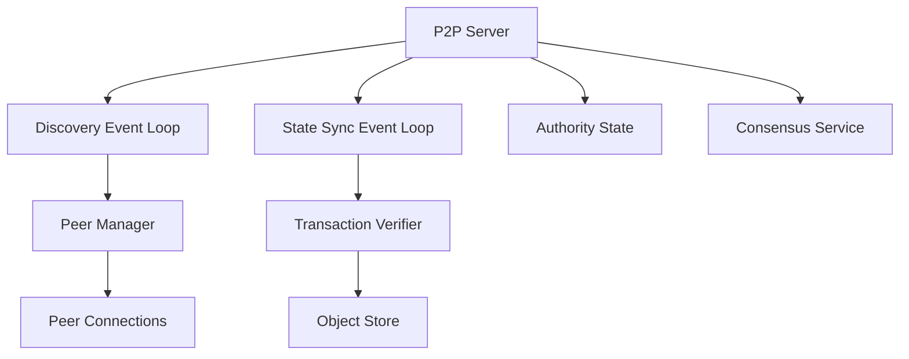

# P2P Module

## Purpose and Scope
This document describes the P2P (Peer-to-Peer) module, which is responsible for network discovery, state synchronization, and message propagation in the Soma blockchain. It explains the module's core components, their interactions, and how they enable validators and fullnodes to communicate and share state.

## Key Components

### P2P Server
- Main network service implementation
- Manages network interfaces and bindings
- Handles connection establishment
- Processes incoming and outgoing messages

### Discovery Event Loop
- Implements peer discovery protocol
- Manages node information exchange
- Maintains peer metadata and capabilities
- Handles peer ranking and selection

### State Sync Event Loop
- Implements state synchronization protocol
- Manages object and transaction synchronization
- Handles checkpoint-based recovery
- Coordinates incremental state updates

### P2P Builder
- Constructs P2P network components
- Configures protocol parameters
- Initializes discovery and sync subsystems
- Sets up connection management

### Transaction Verifier
- Verifies transactions during sync
- Validates certificates against committee
- Checks transaction integrity
- Ensures proper execution ordering

## Module Architecture

## Primary Workflows

### Peer Discovery
1. Node broadcasts discovery announcements
2. Peers respond with their node information
3. Discovery loop processes and validates responses
4. Valid peers added to connection candidates
5. Peer manager establishes connections based on criteria
6. Peer information periodically refreshed

### State Synchronization
1. Node detects state inconsistency or lag
2. State sync requests specific objects or transactions
3. Peers respond with requested data or checkpoint
4. Transaction verifier validates received data
5. Verified state integrated into local storage
6. Process continues until sync complete

### Message Propagation
1. Local component generates network message
2. Message forwarded to P2P server
3. P2P server selects target peers based on message type
4. Message serialized and sent to selected peers
5. Receiving peers process and potentially forward message
6. Delivery confirmation tracked for critical messages

### Checkpoint Synchronization
1. Node creates or receives checkpoint notification
2. Checkpoint metadata verified
3. Checkpoint data requested from peers
4. Data validated against cryptographic proofs
5. Local state rebuilt from checkpoint
6. Remaining state synchronized incrementally

## Network Protocols

### Discovery Protocol
- Advertisement of node capabilities
- Node capability and accessibility verification
- Peer metadata exchange
- Connection negotiation
- Protocol version verification

### State Sync Protocol
- Object synchronization requests and responses
- Transaction certificate exchange
- Checkpoint metadata exchange
- Incremental state updates
- Proof verification for state integrity

### Consensus Message Protocol
- Block proposal propagation
- Vote collection and distribution
- Certificate broadcast
- View change coordination
- Committee information sharing

## Key Interfaces

### With Authority Module
- Provides object and transaction synchronization
- Requests missing objects
- Verifies incoming transaction certificates
- Submits synchronized transactions to authority

### With Consensus Module
- Propagates consensus messages
- Distributes block proposals
- Collects votes from peers
- Shares certificates
- Coordinates view changes

### With Node Module
- Lifecycle management
- Configuration coordination
- Peer connection management
- Network service registration

## Network Optimizations

### Bandwidth Management
- Message prioritization based on type
- Throttling for high-volume peers
- Batching of small messages
- Compression for large data transfers

### Peer Selection
- Geographic diversity
- Network latency considerations
- Capability-based selection
- Reliability history
- Connection quality monitoring

### Data Synchronization
- Differential updates where possible
- Merkle-tree based verification
- Parallelized downloads
- Chunked large state transfers
- Prioritization of critical state

## Confidence: 5/10
This document provides a high-level overview of the P2P module's structure and responsibilities but requires more detailed explanations of network protocols and state synchronization mechanisms.

## Last Updated: 2025-03-08 by Cline
