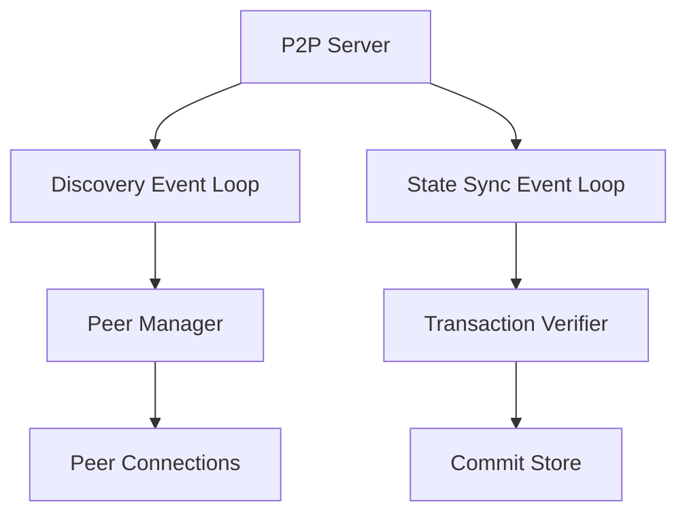

# P2P Module

## Purpose and Scope
This document describes the P2P (Peer-to-Peer) module, which is responsible for network discovery, state synchronization, and message propagation in the Soma blockchain. It explains the module's core components, their interactions, and how they enable validators and fullnodes to communicate and share state.

## Key Components

### P2P Server
- Main network service implementation
- Manages network interfaces and bindings
- Handles connection establishment
- Processes incoming and outgoing messages

### Discovery Event Loop
- Implements peer discovery protocol
- Manages node information exchange
- Maintains peer metadata and capabilities
- Handles peer ranking and selection

### State Sync Event Loop
- Implements state synchronization protocol
- Manages object and transaction synchronization
- Handles checkpoint-based recovery
- Coordinates incremental state updates

### P2P Builder
- Constructs P2P network components
- Configures protocol parameters
- Initializes discovery and sync subsystems
- Sets up connection management

### Transaction Verifier
- Verifies transactions during sync
- Validates certificates against committee
- Checks transaction integrity
- Ensures proper execution ordering

## Module Architecture

## Primary Workflows

### Peer Discovery
1. Node broadcasts discovery announcements
2. Peers respond with their node information and known peers
3. Discovery loop processes and validates responses
4. Valid peers added to connection candidates
5. Peer manager establishes connections based on criteria
6. Peer information periodically refreshed

### State Synchronization
1. Node detects state inconsistency or lag from peers
2. State sync requests a specific range of commits
3. Peers respond with requested commits and referenced blocks
4. Transaction verifier validates received data from blocks
5. Verified state integrated into local storage via CommitExecutor
6. Process continues until sync complete

## Key Interfaces

### With Authority Module
- Provides commit synchronization for state execution
- Validators broadcast new commits from consensus to state sync peers

### With Node Module
- Lifecycle management
- Configuration coordination

## Confidence: 7/10
This document provides a high-level overview of the P2P module's structure and responsibilities but requires more detailed explanations of state synchronization mechanisms.

## Last Updated: 2025-03-08 by Cline
