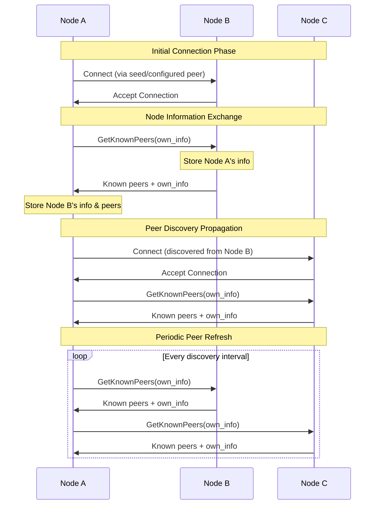

# P2P Discovery

## Purpose and Scope
This document details the peer discovery mechanism in the Soma blockchain's P2P module. It explains how nodes announce themselves, discover other nodes, and establish connections in the network. The document covers the implementation of the discovery protocol, including node information exchange, peer selection, and connection management.

## Key Components

### DiscoveryEventLoop
- Main event loop for discovery operations
- Manages local node information
- Handles peer discovery and connection establishment
- Processes peer events (connections/disconnections)

### DiscoveryState
- Shared state for discovery operations
- Stores local node information
- Maintains list of known peers
- Thread-safe access via RwLock

### NodeInfo and SignedNodeInfo
- Contains peer identification and network addresses
- Signed with node's key for authentication
- Includes timestamp for freshness verification
- Verified before acceptance into peer list

## Discovery Protocol



## Discovery Workflow

### Node Startup and Initial Discovery
1. Node initializes with seed peers configured
2. Node constructs its own node information (NodeInfo)
3. Node signs its information with its private key
4. Node attempts to connect to seed peers
5. Upon successful connection, node exchanges information with connected peers
6. Node adds verified peers to its known peers list

### Continuous Discovery Process
1. Periodic timer triggers discovery operations
2. Node selects a subset of connected peers to query
3. Node sends GetKnownPeers requests to selected peers
4. Node processes peer responses with new peer information
5. Node verifies signatures of discovered peers
6. Node updates its known peers list with verified information
7. Node establishes new connections based on discovered peers

### Connection Management
1. Node maintains target number of concurrent connections
2. Selection algorithm balances between:
   - Network diversity (different regions/networks)
   - Connection stability (preferring long-lived connections)
   - Peer capabilities (supporting required protocols)
3. Node periodically prunes stale peers (inactive or unresponsive)

## Implementation Details

### Node Information Structure
```rust
// Node information data structure
pub struct NodeInfo {
    // Peer identifier derived from public key
    pub peer_id: PeerId,
    // Network address for connecting to this peer
    pub address: Multiaddr,
    // Timestamp for freshness verification
    pub timestamp_ms: u64,
}

// Signed node information
pub struct SignedNodeInfo {
    // The actual node information
    data: NodeInfo,
    // Signature using node's private key
    auth_sig: Signature,
    // Derived peer_id for convenience
    peer_id: PeerId,
}
```

### Peer Verification
Peer information is verified through the following process:
1. **Signature Verification**: Verify the signature of the node information against the peer's public key
2. **Timestamp Validation**: Ensure the timestamp is:
   - Not too far in the future (max 30 seconds ahead)
   - Not too old (less than 24 hours old)
3. **Peer ID Validation**: Verify the peer ID matches the public key

### Peer Selection Mechanism
When selecting peers to connect to:
1. Filter out peers that are:
   - Already connected
   - Already in pending connection state
   - Known to be unreachable
2. Prioritize allowlisted peers (trusted/known)
3. Randomly select from eligible peers up to target connection count
4. If no eligible peers and no connections, fall back to seed peers

### Connection Backoff
To prevent connection storms:
1. Failed connection attempts tracked
2. Exponential backoff for subsequent retries
3. Peers marked as unavailable after multiple failures
4. Periodic reset of failure counters

## Network Address Discovery

The P2P module discovers peer addresses through several mechanisms:

1. **Configuration-based**:
   - Seed peers from configuration
   - Allowlisted peers from configuration

2. **Peer Exchange**:
   - Peers share known addresses
   - Verified for authenticity

3. **Direct Observation**:
   - Actual connection IP and port
   - Used for NAT traversal scenarios

## Security Considerations

### Sybil Attack Protection
- Signature verification ensures peer identities
- Peer ID derived from public key
- Random peer selection limits targeted attacks

### Eclipse Attack Protection
- Network diversity in peer selection
- Allowlisted peer preferences
- Continuous peer discovery

### Denial of Service Mitigation
- Rate limiting discovery requests
- Validation before processing
- Connection attempt throttling

## Configuration Parameters

The discovery system is configured with the following parameters:

| Parameter | Default | Description |
|-----------|---------|-------------|
| `target_concurrent_connections` | 20 | Target number of concurrent connections |
| `peers_to_query` | 5 | Number of peers to query in each discovery cycle |
| `discovery_interval_ms` | 5000 | Interval between discovery operations (ms) |
| `peer_timeout_secs` | 10 | Timeout for peer queries (seconds) |
| `max_peers_to_send` | 1000 | Maximum number of peers to send in a response |
| `max_address_length` | 1024 | Maximum length of peer addresses |

## Thread Safety

The discovery system ensures thread safety through several mechanisms:

1. **State Protection**:
   - `DiscoveryState` protected by `RwLock`
   - Read-heavy operations use read lock
   - Write operations use write lock

2. **Task Management**:
   - Asynchronous tasks spawned for network operations
   - Task results handled by main event loop
   - Task cancellation handled gracefully

3. **Channel Communication**:
   - Thread-safe channel communication
   - Handles backpressure with bounded channels
   - Graceful handling of closed channels

## Verification Status

| Component | Verification Status | Confidence | Evidence |
|-----------|---------------------|------------|----------|
| Protocol Implementation | Verified-Code | 9/10 | Direct inspection of p2p/src/discovery/mod.rs |
| Peer Verification | Verified-Code | 9/10 | Verified through implementation in update_known_peers() |
| Signature Validation | Verified-Code | 9/10 | Cryptographic verification in p2p/src/discovery/mod.rs |
| Connection Management | Verified-Code | 8/10 | Implementation in try_to_connect_to_peer() and related functions |
| Peer Selection | Verified-Code | 8/10 | Random selection logic in handle_tick() and related functions |

## Confidence: 9/10
This document provides a comprehensive explanation of the peer discovery mechanism based on direct code inspection. The implementation details, workflow, and security considerations are accurately represented, with clear evidence from the codebase.

## Last Updated: 2025-03-08 by Cline
